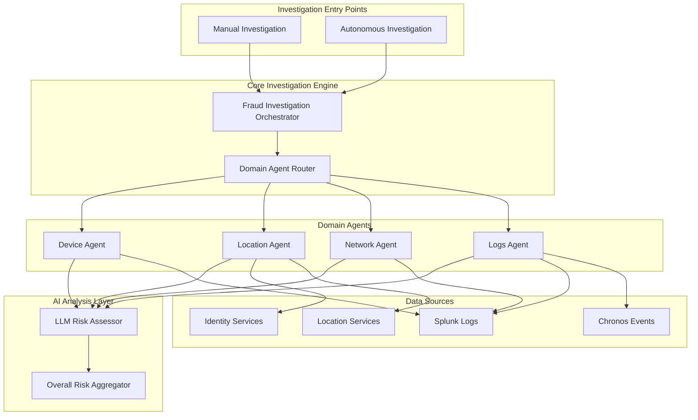
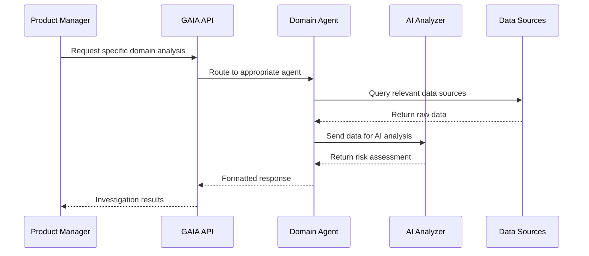
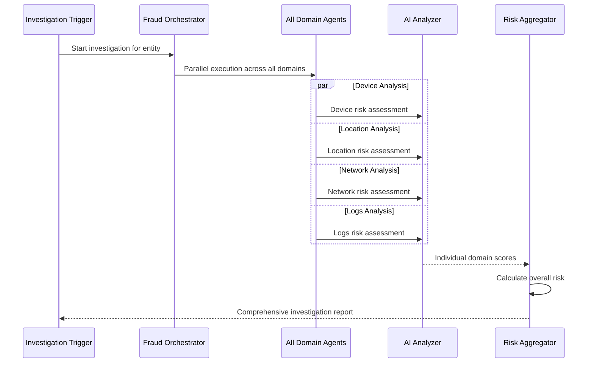
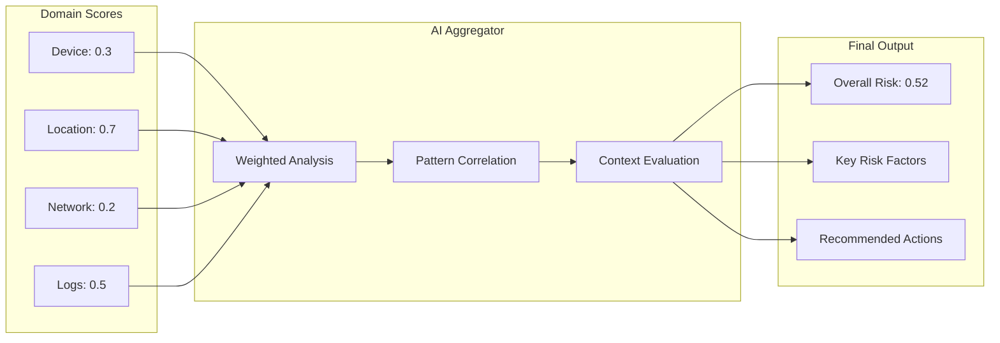

# GAIA Investigation System - Product Overview

**Created by GIL KLAINERT, Fraud Prevention NYC - June 2025**

## Executive Summary

The GAIA (Generative AI Investigation Agents) system is an intelligent fraud investigation platform that automates risk assessment across multiple data domains. It combines specialized domain agents with AI-powered analysis to provide comprehensive security insights for user accounts and devices.

## System Architecture Overview

## Domain Agents Overview

### 1. Device Agent
**Purpose**: Analyzes device fingerprinting and behavioral patterns

**Focus Areas**:
- Device identification and consistency
- Browser and OS fingerprinting
- Device reputation scoring
- Cross-device correlation

**Key Tools**:
- Splunk query engine for device telemetry
- Vector search for behavioral pattern matching
- Device fingerprinting algorithms

**Data Sources**:
- RSS (Risk Scoring Service) logs
- ThreatMetrix device data
- Browser fingerprinting data

**Independent Usage**: ✅ Yes - Can be called standalone via `/api/device/{entity_id}`

**Migration Potential**: High - Self-contained with well-defined APIs

### 2. Location Agent
**Purpose**: Detects geographic anomalies and impossible travel patterns

**Focus Areas**:
- Geographic risk assessment
- Impossible travel detection
- Location consistency analysis
- VPN/proxy detection

**Key Tools**:
- Online Identity Information (OII) services
- Splunk geographic data analysis
- Vector search for location patterns

**Data Sources**:
- Business location data
- Phone location services
- IP geolocation data
- Historical location patterns

**Independent Usage**: ✅ Yes - Can be called standalone via `/api/location/{entity_id}`

**Migration Potential**: High - Modular design with external service integrations

### 3. Network Agent
**Purpose**: Analyzes network-based risk indicators and ISP patterns

**Focus Areas**:
- ISP reputation analysis
- Network volatility detection
- Proxy/VPN identification
- IP address risk scoring

**Key Tools**:
- Splunk network data queries
- ISP analysis algorithms
- Geographic network mapping

**Data Sources**:
- Network telemetry logs
- ISP databases
- IP reputation services
- Proxy detection services

**Independent Usage**: ✅ Yes - Can be called standalone via `/api/network/{entity_id}`

**Migration Potential**: High - Standard network analysis patterns

### 4. Logs Agent
**Purpose**: Examines authentication patterns and user behavior

**Focus Areas**:
- Authentication failure analysis
- Login pattern detection
- Session behavior analysis
- Account takeover indicators

**Key Tools**:
- Splunk log analysis
- Chronos event processing
- Pattern recognition algorithms

**Data Sources**:
- Authentication logs
- Session management data
- User activity logs
- Security event streams

**Independent Usage**: ✅ Yes - Can be called standalone via `/api/logs/{entity_id}`

**Migration Potential**: Medium - Depends on log format standardization

## Investigation Modes

### Manual Investigation Mode

**Use Cases**:
- Targeted investigation of specific risk domains
- Deep-dive analysis for escalated cases
- Integration with existing security workflows
- Custom investigation scenarios

**Benefits**:
- Precise control over investigation scope
- Faster response times for specific queries
- Easy integration with existing tools
- Granular risk assessment

### Autonomous Investigation Mode

**Use Cases**:
- Automated fraud detection workflows
- Real-time risk scoring
- Bulk account analysis
- Proactive threat hunting

**Benefits**:
- Comprehensive 360-degree view
- Automated decision making
- Consistent investigation methodology
- Scalable fraud detection

## AI Integration Strategy

### LLM Risk Assessment Layer

The system leverages Large Language Models (LLMs) to:

1. **Pattern Recognition**: Identify subtle fraud indicators across complex data sets
2. **Contextual Analysis**: Understand relationships between different risk factors
3. **Natural Language Insights**: Generate human-readable explanations for risk decisions
4. **Adaptive Learning**: Improve detection accuracy based on new fraud patterns

### Risk Aggregation Intelligence

## Business Value Proposition

### For Security Teams
- **Reduced Investigation Time**: Automated analysis across multiple domains
- **Improved Accuracy**: AI-powered pattern recognition reduces false positives
- **Comprehensive Coverage**: No blind spots in fraud detection
- **Scalable Operations**: Handle high-volume investigations efficiently

### For Product Teams
- **Modular Architecture**: Easy to extend with new domain agents
- **API-First Design**: Simple integration with existing products
- **Real-time Capabilities**: Support for both batch and streaming analysis
- **Flexible Deployment**: Can be deployed as microservices or monolith

### For Business Operations
- **Cost Reduction**: Automated fraud detection reduces manual review costs
- **Risk Mitigation**: Proactive identification of account takeover attempts
- **Compliance Support**: Detailed audit trails and risk documentation
- **Customer Protection**: Faster response to potential security threats

## Technical Capabilities

### Data Processing
- **Multi-source Integration**: Connects to Splunk, Chronos, and identity services
- **Real-time Analysis**: Sub-second response times for individual domain queries
- **Batch Processing**: Support for bulk investigation workflows
- **Data Privacy**: Secure handling of sensitive user information

### Scalability Features
- **Horizontal Scaling**: Each domain agent can scale independently
- **Load Balancing**: Intelligent routing of investigation requests
- **Caching Strategy**: Optimized data retrieval and response times
- **Fault Tolerance**: Graceful degradation when services are unavailable

### Integration Options
- **REST APIs**: Standard HTTP endpoints for all functionality
- **Webhook Support**: Real-time notifications for investigation results
- **SDK Availability**: Client libraries for common programming languages
- **Documentation**: Comprehensive API documentation and examples

## Migration and Deployment Considerations

### System Requirements
- **Infrastructure**: Kubernetes-ready containerized deployment
- **Dependencies**: Splunk, LLM services, identity providers
- **Security**: OAuth 2.0, API key management, encrypted communications
- **Monitoring**: Health checks, metrics, and alerting capabilities

### Migration Strategy
1. **Phase 1**: Deploy individual domain agents for manual investigations
2. **Phase 2**: Implement autonomous investigation workflows
3. **Phase 3**: Integrate with existing fraud detection systems
4. **Phase 4**: Enable real-time streaming analysis

### Success Metrics
- **Investigation Speed**: Time from trigger to final risk assessment
- **Accuracy Rates**: False positive and false negative percentages
- **System Utilization**: API call volumes and response times
- **Business Impact**: Fraud detection rates and cost savings

## Future Roadmap

### Additional Tool Integrations
- **ATHENA DB Integration**: Direct connectivity to Amazon Athena for advanced data lake queries and analytics
- **NELI Integration**: Enhanced natural language processing capabilities for log analysis and pattern recognition

### CRM and Case Management Integration
- **PEGA CRM Integration**: Seamless case management workflow integration for fraud investigation tracking

### Enhanced Data Source Connectivity
- **Real-time Streaming Data**: Integration with Kafka and other streaming platforms for live data analysis
- **Third-party Intelligence Feeds**: Connection to external threat intelligence and fraud databases
- **Cloud Storage Integration**: Direct access to AWS S3, Azure Blob, and Google Cloud Storage for historical data analysis
- **API Gateway Expansion**: Additional REST and GraphQL API integrations for extended data access

 