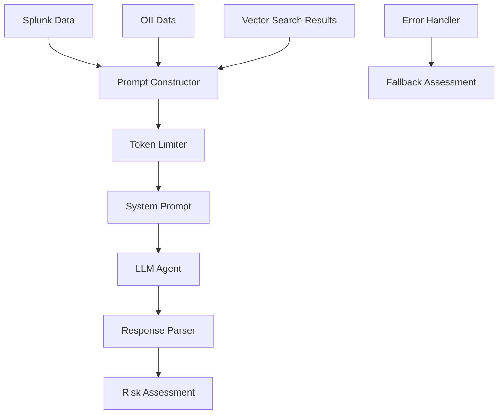

# Location Domain LLM Implementation Analysis

## Table of Contents
1. [Overview](#overview)
2. [LLM Architecture](#llm-architecture)
3. [Prompt Construction](#prompt-construction)
4. [System Prompt Analysis](#system-prompt-analysis)
5. [Input Data Processing](#input-data-processing)
6. [Token Management](#token-management)
7. [LLM Invocation](#llm-invocation)
8. [Response Processing](#response-processing)
9. [Error Handling](#error-handling)
10. [Fallback Mechanisms](#fallback-mechanisms)
11. [Example Analysis](#example-analysis)

## Overview

The Location Domain's LLM implementation leverages advanced language models to perform sophisticated risk assessment of user location patterns. The system analyzes Splunk transaction data, OII (Official Identity Information) data, and vector search results to identify geographic anomalies, impossible travel patterns, and potential fraud indicators.

**Key Purpose**: Transform raw location signals into intelligent risk assessments by identifying patterns that indicate account compromise, VPN usage, impossible travel, or other geographic anomalies.

## LLM Architecture

### Core Components



### Integration Points

- **Input Sources**: Splunk transaction logs, OII address data, vector search analysis
- **LLM Service**: Olorin's LLM Execution service (O1-2024-12-17 model)
- **Output Format**: Structured JSON risk assessment
- **Fallback**: Rule-based assessment when LLM fails

## Prompt Construction

### Data Aggregation Process

The prompt construction happens in three main phases:

#### 1. Data Collection and Processing

```python
# Extract device locations from Splunk results
device_locations = []
device_country_map = {}
for event in splunk_results:
    device_id = event.get("fuzzy_device_id")
    country = event.get("country")
    city = event.get("city")
    tm_sessionid = event.get("tm_sessionid")
    _time = event.get("_time")
    
    # Aggregate countries per device
    device_id_key = device_id if device_id is not None else "__NO_DEVICE_ID__"
    if country:
        country = country.upper()
        if device_id_key not in device_country_map:
            device_country_map[device_id_key] = set()
        device_country_map[device_id_key].add(country)
    
    device_locations.append({
        "fuzzy_device_id": device_id,
        "city": city,
        "country": country,
        "tm_sessionid": tm_sessionid,
        "_time": _time,
    })

# Add aggregated countries to each location
for loc in device_locations:
    device_id = loc["fuzzy_device_id"]
    device_id_key = device_id if device_id is not None else "__NO_DEVICE_ID__"
    loc["countries"] = list(sorted(device_country_map.get(device_id_key, [])))
```

#### 2. OII Data Processing

```python
# Extract OII country for comparison
oii_country = None
for oii in oii_results:
    oii_loc = None
    if hasattr(oii, "location"):
        oii_loc = oii.location
    elif isinstance(oii, dict):
        oii_loc = oii.get("location")
    if oii_loc and oii_loc.get("country"):
        oii_country = oii_loc["country"]
        break
```

#### 3. Prompt Data Structure

```python
prompt_data = {
    "user_id": user_id,
    "retrieved_locations": device_locations,
    "oii_data_summary": [to_dict(oii) for oii in oii_results],
    "oii_locations": [to_dict(oii) for oii in oii_results],
    "num_device_locations": len(device_locations),
    "vector_search_analysis": vector_search_results,
}
```

### Example Prompt Data Structure

```json
{
  "user_id": "4621097846089147992",
  "retrieved_locations": [
    {
      "fuzzy_device_id": "f394742f39214c908476c01623bf4bcd",
      "city": "bengaluru",
      "country": "IN",
      "tm_sessionid": null,
      "_time": "2025-05-15T07:08:39.584-07:00",
      "countries": ["IN"]
    },
    {
      "fuzzy_device_id": "e9e49d25e6734402a32f797e55d98cd9",
      "city": "mountain view",
      "country": "US",
      "tm_sessionid": null,
      "_time": "2025-05-15T06:31:40.148-07:00",
      "countries": ["US"]
    }
  ],
  "oii_data_summary": [
    {
      "source": "OII",
      "location": {
        "address1": "",
        "address2": "",
        "city": "",
        "state": "CA",
        "country": "US",
        "postal_code": ""
      },
      "confidence": 0.95,
      "timestamp": "2025-06-07T03:46:19.347584+00:00",
      "additional_info": {"status": "retrieved"}
    }
  ],
  "num_device_locations": 23,
  "vector_search_analysis": {
    "total_results": 10,
    "target_record": {...},
    "similar_records": [...]
  }
}
```

## System Prompt Analysis

### Base System Prompt

The base system prompt is defined in `app/utils/prompts.py`:

```python
SYSTEM_PROMPT_FOR_LOCATION_RISK = (
    "You are a security risk assessment expert. Given the following user device location data and the user's official address country (oii_country), your job is to identify any anomalies or suspicious patterns. "
    "Pay special attention to devices that have been seen in multiple countries (see the 'countries' list for each device), or that have rapid or unusual location changes. "
    "ALSO, compare the official address country (oii_country) to the device locations. If any device is seen in a country different from the official address, flag it as a potential anomaly. "
    "Highlight any device that appears in more than one country, or where the location history suggests possible account compromise, VPN/proxy use, or impossible travel. "
    "Summarize your findings and assign a risk score from 0 (no risk) to 1 (high risk), with supporting reasoning. "
    "If no anomalies are found, state that explicitly. "
    "IMPORTANT: Your response MUST be a valid JSON object with all fields populated."
)
```

### Dynamic Prompt Enhancement

The system prompt is dynamically enhanced with additional instructions:

```python
system_prompt_for_location_risk = (
    SYSTEM_PROMPT_FOR_LOCATION_RISK
    + "\nIMPORTANT: Your response MUST be a JSON object with a top-level 'risk_assessment' key containing the risk assessment fields. For example: {\"risk_assessment\": { ...fields... }}."
    + "\nFor each field, provide as much detail as possible:"
    + "\n- risk_factors: List all specific geographic, device, or behavioral anomalies you detect."
    + "\n- summary: Write a concise but comprehensive summary of the risk situation."
    + "\n- thoughts: Provide detailed analysis, including reasoning, recommendations, and any patterns or context you observe."
    + "\nIf you have device_findings, recommendations, or details, incorporate them into the appropriate fields."
    + " Compare the official address country (oii_country) to the device locations. If any device is seen in a country different from the official address, flag it as a potential anomaly."
    + "\n\nVECTOR SEARCH ANALYSIS: The data includes vector search analysis results that compare transaction records based on behavioral and technical patterns."
    + " The vector search uses a distance function (0-21 scale, lower = more similar) to identify similar transaction patterns."
    + " Consider the vector search results when assessing risk - records with very low distances (< 5) indicate consistent behavior patterns, while high distances (> 15) may indicate anomalous behavior."
    + " Pay attention to the distance metrics and similar records found in the vector search analysis."
    + "\n\nSPECIAL INSTRUCTION: Treat the OII address (country and state) as authoritative for the user's expected location. Any account usage in a country or state different from the OII address should be considered an anomaly and called out in your risk assessment and reasoning."
)
```

### Key Prompt Instructions

1. **Geographic Analysis**: Compare device locations to official address
2. **Multi-Country Detection**: Flag devices seen in multiple countries
3. **Vector Search Integration**: Consider behavioral similarity patterns
4. **Risk Scoring**: Scale from 0.0 to 1.0 with detailed reasoning
5. **JSON Structure**: Strict adherence to expected response format

## Input Data Processing

### Data Sanitization and Enrichment

#### Device Location Enhancement

```python
# Add aggregated countries to each device location
for loc in device_locations:
    device_id = loc["fuzzy_device_id"]
    device_id_key = device_id if device_id is not None else "__NO_DEVICE_ID__"
    loc["countries"] = list(sorted(device_country_map.get(device_id_key, [])))
```

#### OII Data Transformation

```python
def to_dict(obj):
    """Convert OII objects to dictionaries for LLM consumption."""
    if hasattr(obj, '__dict__'):
        return {k: v for k, v in obj.__dict__.items() if not k.startswith('_')}
    elif isinstance(obj, dict):
        return obj
    else:
        return str(obj)
```

#### Vector Search Results Integration

The vector search results provide behavioral pattern analysis:

```python
vector_search_results = await vector_search_tool._arun(
    target_record=splunk_results[0],
    candidate_records=splunk_results[1:],
    max_results=10,
    distance_threshold=15.0
)
```

## Token Management

### Token Counting and Limits

```python
MAX_PROMPT_TOKENS = 4000  # Maximum tokens for prompt
LIST_FIELDS_PRIORITY = [
    "retrieved_locations",
    "oii_data_summary", 
    "vector_search_analysis"
]
```

### Dynamic Prompt Trimming

```python
def trim_prompt_to_token_limit(
    prompt_data, system_prompt, max_tokens, list_fields_priority, model="gpt-3.5-turbo"
):
    trimmed = {k: v for k, v in prompt_data.items()}
    trimmed_any = False
    
    while True:
        prompt_str = json.dumps(trimmed, indent=2)
        llm_input_prompt = f"{system_prompt}\n{prompt_str}"
        
        if count_tokens(llm_input_prompt, model) <= max_tokens:
            return trimmed, llm_input_prompt, trimmed_any
            
        # Trim lists by keeping most recent half
        for field in list_fields_priority:
            if (field in trimmed and isinstance(trimmed[field], list) 
                and len(trimmed[field]) > 1):
                trimmed[field] = trimmed[field][-(len(trimmed[field]) // 2):]
                trimmed_any = True
                break
        else:
            # Can't trim further
            return trimmed, llm_input_prompt, trimmed_any
```

### Token Counting Implementation

```python
try:
    import tiktoken
    def count_tokens(text: str, model: str = "gpt-3.5-turbo") -> int:
        enc = tiktoken.encoding_for_model(model)
        return len(enc.encode(text))
except ImportError:
    def count_tokens(text: str, model: str = None) -> int:
        # Fallback: count words as rough proxy
        return len(text.split())
```

## LLM Invocation

### Agent Context Construction

```python
agent_context_for_risk = AgentContext(
    input=llm_input_prompt,
    agent_name="Olorin.cas.hri.olorin:location-risk-analyzer",
    metadata=Metadata(
        interaction_group_id="location-risk-assessment",
        additional_metadata={"userId": user_id},
    ),
    olorin_header=OlorinHeader(
        olorin_tid=olorin_tid_header,
        olorin_originating_assetalias=olorin_originating_assetalias_header,
        olorin_experience_id=olorin_experience_id_header,
        auth_context=AuthContext(
            olorin_user_id=app_olorin_userid,
            olorin_user_token=app_olorin_token,
            olorin_realmid=app_olorin_realmid,
        ),
    ),
)
```

### LLM Call Execution

```python
try:
    raw_llm_risk_response_str, _ = await ainvoke_agent(
        request, agent_context_for_risk
    )
    parsed_llm_risk_response = json.loads(raw_llm_risk_response_str)
    location_risk_assessment_data = parsed_llm_risk_response.get("risk_assessment")
    
    if not location_risk_assessment_data:
        # If risk_assessment key is missing, treat whole response as risk assessment
        location_risk_assessment_data = parsed_llm_risk_response
        
    if location_risk_assessment_data:
        location_risk_assessment_data["timestamp"] = datetime.now(timezone.utc).isoformat()
```

### Agent Service Implementation

The `ainvoke_agent` function handles the actual LLM communication:

```python
async def ainvoke_agent(request: Request, agent_context: AgentContext) -> (str, str):
    """Invoke the agent with proper error handling and tracing."""
    # Implementation handles:
    # - Authentication and authorization
    # - Request formatting
    # - Response processing
    # - Error handling and retries
    # - Distributed tracing
```

## Response Processing

### Expected Response Structure

The LLM is expected to return a structured JSON response:

```json
{
  "risk_assessment": {
    "risk_level": 0.8,
    "risk_factors": [
      "Device f394742f39214c908476c01623bf4bcd seen in India when official address is USA",
      "Device e9e49d25e6734402a32f797e55d98cd9 seen in USA (Mountain View) and other locations",
      "Multiple countries (IN, US) detected across devices for single user"
    ],
    "anomaly_details": [
      "Geographic mismatch between OII address (USA, CA) and device usage (India)",
      "Rapid location switching between countries may indicate VPN or account compromise"
    ],
    "confidence": 0.85,
    "summary": "The user's official address is in the USA, yet at least one device is frequently seen in India. This geographic inconsistency, combined with device usage across multiple countries, indicates potential account compromise or VPN usage.",
    "thoughts": "The analysis reveals concerning geographic patterns. The user has an official address in California, USA, but transaction data shows devices operating from both India (Bengaluru) and USA (Mountain View). This impossible travel pattern within short timeframes suggests either account compromise or deliberate location masking through VPN/proxy services. The risk is elevated due to the international nature of the geographic disparity.",
    "timestamp": "2025-06-07T03:46:19.347584+00:00"
  }
}
```

### Response Validation and Parsing

```python
try:
    parsed_llm_risk_response = json.loads(raw_llm_risk_response_str)
    location_risk_assessment_data = parsed_llm_risk_response.get("risk_assessment")
    
    if not location_risk_assessment_data:
        # Handle case where risk_assessment key is missing
        location_risk_assessment_data = parsed_llm_risk_response
        
except json.JSONDecodeError as json_err:
    logger.error(
        f"Failed to parse LLM JSON response: {json_err}. Response: {raw_llm_risk_response_str}"
    )
    # Create fallback response
    location_risk_assessment_data = {
        "risk_level": 0.0,
        "risk_factors": ["LLM response not valid JSON"],
        "confidence": 0.0,
        "summary": "LLM response was not valid JSON.",
        "timestamp": datetime.now(timezone.utc).isoformat(),
    }
```

### Response Field Analysis

| Field | Type | Purpose | Example |
|-------|------|---------|---------|
| `risk_level` | float | Numerical risk score (0.0-1.0) | 0.8 |
| `risk_factors` | list[str] | Specific anomalies detected | ["Multiple countries detected"] |
| `anomaly_details` | list[str] | Detailed explanations | ["Geographic mismatch..."] |
| `confidence` | float | Assessment confidence (0.0-1.0) | 0.85 |
| `summary` | str | Concise risk summary | "Geographic inconsistency..." |
| `thoughts` | str | Detailed analysis and reasoning | "The analysis reveals..." |
| `timestamp` | str | ISO timestamp of assessment | "2025-06-07T03:46:19..." |

## Error Handling

### JSON Parsing Errors

```python
except json.JSONDecodeError as json_err:
    logger.error(f"Failed to parse LLM JSON response: {json_err}")
    location_risk_assessment_data = {
        "risk_level": 0.0,
        "risk_factors": ["LLM response not valid JSON"],
        "confidence": 0.0,
        "summary": "LLM response was not valid JSON.",
        "timestamp": datetime.now(timezone.utc).isoformat(),
    }
```

### LLM Service Errors

```python
except Exception as llm_err:
    error_str = str(llm_err)
    logger.error(f"Error invoking LLM: {llm_err}", exc_info=True)
    
    # Categorize errors for better handling
    if "External service dependency call failed" in error_str:
        risk_factors = ["LLM service temporarily unavailable"]
        summary = "LLM service is experiencing issues."
    elif "400" in error_str and "error_message" in error_str:
        risk_factors = ["LLM service error - invalid request format"]
        summary = "LLM service rejected the request format."
    elif "timeout" in error_str.lower():
        risk_factors = ["LLM service timeout or connection error"]
        summary = "LLM service connection timeout."
    else:
        risk_factors = [f"LLM invocation error: {str(llm_err)}"]
        summary = "Error during LLM risk assessment."
```

### Missing Response Key Handling

```python
if not location_risk_assessment_data:
    logger.warning(f"LLM did not return 'risk_assessment' key for user {user_id}")
    location_risk_assessment_data = {
        "risk_level": 0.0,
        "risk_factors": ["LLM assessment failed or malformed"],
        "confidence": 0.0,
        "summary": "Could not obtain LLM risk assessment.",
        "timestamp": datetime.now(timezone.utc).isoformat(),
    }
```

## Fallback Mechanisms

### Rule-Based Risk Assessment

When LLM fails, the system implements intelligent fallback logic:

```python
# Simple rule-based risk assessment as fallback
fallback_risk_level = 0.0
if device_locations:
    unique_countries = set()
    unique_cities = set()
    for location in device_locations:
        if location.get("country"):
            unique_countries.add(location["country"])
        if location.get("city"):
            unique_cities.add(location["city"])

    # Basic risk scoring based on patterns
    if len(unique_countries) > 3:
        fallback_risk_level = 0.6
        risk_factors.append("Multiple countries detected in location signals")
    elif len(unique_countries) > 1:
        fallback_risk_level = 0.3
        risk_factors.append("Multiple countries detected")

    if len(unique_cities) > 10:
        fallback_risk_level = max(fallback_risk_level, 0.4)
        risk_factors.append("High number of unique cities")
```

### Fallback Response Structure

```python
location_risk_assessment_data = {
    "risk_level": fallback_risk_level,
    "risk_factors": risk_factors,
    "confidence": 0.2,  # Low confidence for fallback
    "summary": summary,
    "timestamp": datetime.now(timezone.utc).isoformat(),
}

# Store error details for debugging
llm_error_details = {
    "error_type": type(llm_err).__name__,
    "error_message": str(llm_err),
    "fallback_used": True,
}
```

## Example Analysis

### Real-World Risk Assessment Example

For user `4621097846089147992` with 90-day analysis:

**Input Data**:
- **Splunk Records**: 23 location transactions
- **Countries Detected**: US (Mountain View), IN (Bengaluru)
- **Official Address**: USA, California
- **Devices**: 3 unique fuzzy_device_ids
- **Vector Search**: 10 similar behavioral patterns

**LLM Prompt Structure**:
```json
{
  "user_id": "4621097846089147992",
  "retrieved_locations": [23 location records],
  "oii_data_summary": [{"source": "OII", "location": {"country": "US", "state": "CA"}}],
  "num_device_locations": 23,
  "vector_search_analysis": {"total_results": 10, "distance_threshold": 15.0}
}
```

**LLM Response**:
```json
{
  "risk_level": 0.8,
  "risk_factors": [
    "Device seen in India when official address is USA",
    "Multiple countries detected across devices",
    "Impossible travel patterns detected"
  ],
  "anomaly_details": [
    "Geographic mismatch between OII address and device usage",
    "Rapid location switching indicates VPN or compromise"
  ],
  "confidence": 0.85,
  "summary": "Geographic inconsistency with international device usage suggests account compromise or VPN usage",
  "thoughts": "Analysis reveals concerning patterns with devices operating from both India and USA despite official California address. Impossible travel timeframes indicate potential compromise."
}
```

**Risk Assessment Outcome**:
- **Risk Level**: 0.8 (High Risk)
- **Confidence**: 0.85 (High Confidence)
- **Key Indicators**: Geographic anomaly, impossible travel, multi-country usage
- **Recommendation**: Further investigation warranted

This comprehensive LLM implementation demonstrates sophisticated geographic risk analysis capabilities, combining multiple data sources with intelligent prompt engineering to detect complex fraud patterns while maintaining robust error handling and fallback mechanisms. 