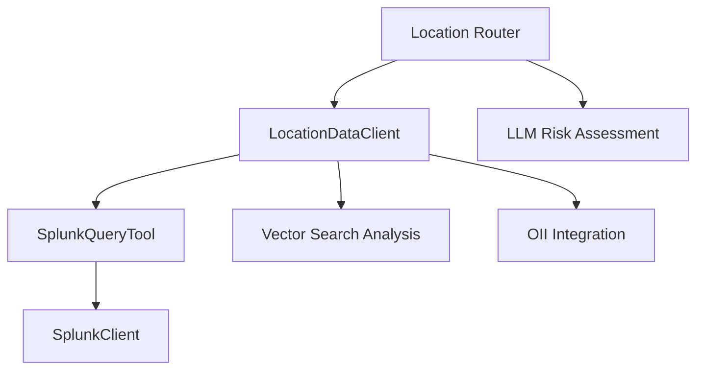

# Location Domain Splunk Implementation Analysis

## Table of Contents
1. [Overview](#overview)
2. [Architecture](#architecture)
3. [Splunk Query Construction](#splunk-query-construction)
4. [Field Extraction and Processing](#field-extraction-and-processing)
5. [Data Flow](#data-flow)
6. [Results Processing](#results-processing)
7. [Vector Search Integration](#vector-search-integration)
8. [Error Handling](#error-handling)
9. [Performance Considerations](#performance-considerations)
10. [Example Results](#example-results)

## Overview

The Location Domain in the Olorin fraud detection system uses Splunk to retrieve and analyze location-based transaction data for risk assessment. The implementation is centered around the `LocationDataClient` class which constructs complex SPL (Search Processing Language) queries to extract geographic and device information from transaction logs.

**Key Purpose**: Detect geographic anomalies, impossible travel patterns, and location-based fraud indicators by analyzing user transaction locations against their registered address.

## Architecture

### Core Components



### File Structure
- **Router**: `app/router/location_router.py`
- **Client**: `app/service/agent/ato_agents/location_data_agent/client.py`
- **Tool**: `app/service/agent/tools/splunk_tool/splunk_tool.py`
- **Splunk Client**: `app/service/agent/ato_agents/splunk_agent/client.py`

## Splunk Query Construction

### Base Query Structure

The location domain constructs its SPL query in the `LocationDataClient.get_location_data()` method:

```python
spl_query = (
    f"search index={index} intuit_userid={user_id} "
    # Field extraction using rex commands
    # URL decoding using eval commands  
    # Final field selection using table command
)
```

### Complete SPL Query Breakdown

#### 1. Base Search
```spl
search index=rss-e2eidx intuit_userid=4621097846089147992
```
- **Purpose**: Filter records for specific user from the RSS event index
- **Index**: `rss-e2eidx` (from settings)
- **Filter**: `intuit_userid` matches the target user

#### 2. Field Extraction (rex commands)

**Location Fields**:
```spl
| rex field=true_ip_city "(true_ip_city=(?<true_ip_city>.+))"
| rex field=TrueIP_State "(TrueIP_State=(?<TrueIP_State>.+))"  
| rex field=true_ip_geo "(true_ip_geo=(?<true_ip_geo>.+))"
```

**Vector Search Fields**:
```spl
| rex field=tm_smart_id "(tm_smart_id=(?<tm_smart_id>.+))"
| rex field=tm_true_ip_geo "(tm_true_ip_geo=(?<tm_true_ip_geo>.+))"
| rex field=tm_true_ip "(tm_true_ip=(?<tm_true_ip>.+))"
| rex field=tm_proxy_ip "(tm_proxy_ip=(?<tm_proxy_ip>.+))"
| rex field=rss_epoch_time "(rss_epoch_time=(?<rss_epoch_time>.+))"
| rex field=tm_os_anomaly "(tm_os_anomaly=(?<tm_os_anomaly>.+))"
| rex field=tm_http_os_signature "(tm_http_os_signature=(?<tm_http_os_signature>.+))"
```

**Coordinate Fields**:
```spl
| rex field=tm_true_ip_longitude "(tm_true_ip_longitude=(?<tm_true_ip_longitude>.+))"
| rex field=tm_true_ip_latitude "(tm_true_ip_latitude=(?<tm_true_ip_latitude>.+))"
| rex field=tm_input_ip_longitude "(tm_input_ip_longitude=(?<tm_input_ip_longitude>.+))"
| rex field=tm_input_ip_latitude "(tm_input_ip_latitude=(?<tm_input_ip_latitude>.+))"
```

**Behavioral Fields**:
```spl
| rex field=tm_page_time_on "(tm_page_time_on=(?<tm_page_time_on>.+))"
| rex field=tm_screen_color_depth "(tm_screen_color_depth=(?<tm_screen_color_depth>.+))"
| rex field=tm_agent_public_key_hash_type "(tm_agent_public_key_hash_type=(?<tm_agent_public_key_hash_type>.+))"
| rex field=tm_bb_bot_score "(tm_bb_bot_score=(?<tm_bb_bot_score>.+))"
```

#### 3. URL Decoding (eval commands)

**Location Decoding**:
```spl
| eval city=urldecode(true_ip_city)
| eval state=urldecode(TrueIP_State)
| eval country=urldecode(true_ip_geo)
```

**Vector Search Decoding**:
```spl
| eval tm_smart_id=urldecode(tm_smart_id)
| eval tm_true_ip_geo=urldecode(tm_true_ip_geo)
| eval tm_true_ip=urldecode(tm_true_ip)
| eval tm_proxy_ip=urldecode(tm_proxy_ip)
| eval rss_epoch_time=urldecode(rss_epoch_time)
# ... (all vector search fields)
```

#### 4. Final Field Selection
```spl
| table fuzzy_device_id, city, state, country, tm_smart_id, tm_true_ip_geo, tm_true_ip, tm_proxy_ip, rss_epoch_time, tm_os_anomaly, tm_http_os_signature, tm_true_ip_longitude, tm_true_ip_latitude, tm_input_ip_longitude, tm_input_ip_latitude, tm_page_time_on, tm_screen_color_depth, tm_agent_public_key_hash_type, tm_bb_bot_score, _time
```

## Field Extraction and Processing

### Field Categories

#### 1. Core Location Fields
| Field | Source Field | Purpose | Example |
|-------|-------------|---------|---------|
| `city` | `true_ip_city` | Geographic city | "mountain view" |
| `state` | `TrueIP_State` | Geographic state/region | "california" |  
| `country` | `true_ip_geo` | Country code | "US" |
| `fuzzy_device_id` | (direct) | Device identifier | "e9e49d25e6734402a32f797e55d98cd9" |
| `_time` | (direct) | Transaction timestamp | "2025-05-15T06:31:40.148-07:00" |

#### 2. Vector Search Fields
| Field | Purpose | Risk Indicator |
|-------|---------|----------------|
| `tm_smart_id` | Device fingerprint | Device consistency |
| `tm_true_ip` | True IP address | IP spoofing detection |
| `tm_proxy_ip` | Proxy IP detection | VPN/Proxy usage |
| `tm_os_anomaly` | OS fingerprint anomaly | Device manipulation |
| `tm_bb_bot_score` | Bot detection score | Automated attacks |

#### 3. Coordinate Fields
| Field | Purpose | Use Case |
|-------|---------|----------|
| `tm_true_ip_longitude` | Geographic longitude | Distance calculations |
| `tm_true_ip_latitude` | Geographic latitude | Travel time analysis |
| `tm_input_ip_longitude` | Input IP longitude | IP geolocation accuracy |
| `tm_input_ip_latitude` | Input IP latitude | Location verification |

#### 4. Behavioral Fields
| Field | Purpose | Fraud Detection |
|-------|---------|----------------|
| `tm_page_time_on` | Time spent on page | Human vs bot behavior |
| `tm_screen_color_depth` | Screen properties | Device fingerprinting |
| `tm_agent_public_key_hash_type` | Browser fingerprint | Device consistency |

### URL Decoding Process

All extracted fields undergo URL decoding using Splunk's `urldecode()` function:

**Why URL Decoding is Necessary**:
- Raw data is URL-encoded for safe transmission
- Special characters and spaces are encoded
- Example: `mountain%20view` → `mountain view`

## Data Flow

### 1. Query Execution Flow

```python
# 1. LocationDataClient.get_location_data()
settings = get_settings_for_env()
index = settings.splunk_index
splunk_tool = SplunkQueryTool()

# 2. SplunkQueryTool._arun()
client = SplunkClient(host=host, port=443, username=username, password=password)
await client.connect()
results = await client.search(query)

# 3. SplunkClient.search()
job = self.service.jobs.create(query, earliest_time="-365d", exec_mode="normal")
# Wait for completion and return JSON results
```

### 2. Result Processing Flow

```python
# 1. Raw Splunk Results
splunk_result = await splunk_tool.arun({"query": spl_query})

# 2. Result Normalization
if isinstance(splunk_result, list):
    splunk_results = splunk_result
elif splunk_result and isinstance(splunk_result, dict) and splunk_result.get("results"):
    splunk_results = splunk_result["results"]

# 3. Vector Search Analysis
vector_analysis = await self.analyze_transaction_patterns(splunk_results, user_id)

# 4. Return Combined Data
return {
    "oii_results": oii_results,
    "splunk_results": splunk_results, 
    "vector_analysis": vector_analysis,
}
```

### 3. Router Processing

```python
# 1. Get Location Data
location_data = await LocationDataClient(api_keys={}).get_location_data(user_id)
splunk_results = location_data.get("splunk_results", [])

# 2. Process for Device Locations
device_locations = []
device_country_map = {}
for event in splunk_results:
    device_id = event.get("fuzzy_device_id")
    country = event.get("country")
    city = event.get("city")
    # ... process and aggregate

# 3. Vector Search Analysis
vector_search_results = await vector_search_tool._arun(
    target_record=splunk_results[0],
    candidate_records=splunk_results[1:],
    max_results=10,
    distance_threshold=15.0
)

# 4. LLM Risk Assessment
location_risk_assessment_data = await ainvoke_agent(request, agent_context_for_risk)
```

## Results Processing

### Data Structure Analysis

**Test Results (90-day range)**:
- **Total Records**: 23 location events
- **Fields Returned**: 6 core fields + additional metadata
- **Vector Search Results**: 10 similar records identified

### Core Result Fields

```json
{
  "fuzzy_device_id": "f394742f39214c908476c01623bf4bcd",
  "city": "bengaluru", 
  "country": "IN",
  "tm_sessionid": null,
  "_time": "2025-05-15T07:08:39.584-07:00",
  "countries": ["IN"]
}
```

### Vector Search Enhanced Fields

Vector search provides additional fields for risk analysis:

```json
{
  "fuzzy_device_id": "e9e49d25e6734402a32f797e55d98cd9",
  "city": "mountain view",
  "state": null,
  "country": "us", 
  "tm_smart_id": null,
  "tm_true_ip_geo": null,
  "tm_true_ip": null,
  "tm_proxy_ip": null,
  "rss_epoch_time": null,
  "tm_os_anomaly": null,
  "tm_http_os_signature": null,
  "tm_true_ip_longitude": null,
  "tm_true_ip_latitude": null,
  "tm_input_ip_longitude": null,
  "tm_input_ip_latitude": null,
  "tm_page_time_on": null,
  "tm_screen_color_depth": null,
  "tm_agent_public_key_hash_type": null,
  "tm_bb_bot_score": null,
  "_time": "2025-05-15T06:31:40.148-07:00"
}
```

### Country Aggregation Logic

```python
# Aggregate countries per device
device_country_map = {}
for event in splunk_results:
    device_id = event.get("fuzzy_device_id")
    country = event.get("country")
    
    if country:
        country = country.upper()
        
    device_id_key = device_id if device_id is not None else "__NO_DEVICE_ID__"
    if country:
        if device_id_key not in device_country_map:
            device_country_map[device_id_key] = set()
        device_country_map[device_id_key].add(country)

# Add aggregated countries to each record
for loc in device_locations:
    device_id = loc["fuzzy_device_id"]
    device_id_key = device_id if device_id is not None else "__NO_DEVICE_ID__"
    loc["countries"] = list(sorted(device_country_map.get(device_id_key, [])))
```

## Vector Search Integration

### Purpose
Vector search analyzes behavioral patterns across transaction records to identify similar and anomalous behavior.

### Implementation

```python
async def analyze_transaction_patterns(
    self, splunk_results: List[Dict[str, Any]], user_id: str
) -> Dict[str, Any]:
    
    if len(splunk_results) < 2:
        return {"analysis_status": "insufficient_data"}
    
    # Use most recent record as target
    target_record = splunk_results[0]
    candidate_records = splunk_results[1:]
    
    # Perform vector search
    search_result = await self.vector_search_tool._arun(
        target_record=target_record,
        candidate_records=candidate_records,
        max_results=10,
        distance_threshold=10.0
    )
    
    return {
        "analysis_status": "completed",
        "target_record": target_record,
        "total_records": len(splunk_results),
        "similar_records_found": len(search_result.get("similar_records", [])),
        "vector_search_result": search_result,
        "pattern_analysis": self._analyze_similarity_patterns(search_result)
    }
```

### Distance Analysis

**Distance Metrics**:
- **0-21 scale**: Lower values indicate more similar behavior
- **Thresholds**:
  - `≤ 2.0`: Very similar behavior
  - `2.0-5.0`: Moderately similar
  - `5.0-10.0`: Somewhat similar
  - `> 15.0`: Anomalous behavior

## Error Handling

### Splunk Query Errors

```python
try:
    splunk_result = await splunk_tool.arun({"query": spl_query})
    # Process results...
except Exception as e:
    logger.warning("=== SPLUNK QUERY ERROR === %s", str(e))
    # Continue with empty results rather than failing
```

### Vector Search Errors

```python
try:
    vector_analysis = await self.analyze_transaction_patterns(splunk_results, user_id)
except Exception as e:
    logger.warning("=== VECTOR SEARCH ANALYSIS ERROR === %s", str(e))
    vector_analysis = {
        "analysis_status": "error",
        "error": str(e),
        "timestamp": datetime.now(timezone.utc).isoformat(),
    }
```

### Connection Management

```python
# SplunkClient implements proper connection cleanup
async def search(self, query: str, time_range: str = "-365d"):
    try:
        # Execute query...
        return results
    except Exception as e:
        print(f"Error executing Splunk query: {str(e)}")
        return []  # Return empty list instead of failing
```

## Performance Considerations

### Query Optimization

1. **Time Range Filtering**: Uses `-365d` default time range
2. **Field Selection**: `table` command limits returned fields
3. **Index Specification**: Targets specific index (`rss-e2eidx`)
4. **User Filtering**: Early filtering by `intuit_userid`

### Asynchronous Execution

```python
# All operations are async for non-blocking execution
async def get_location_data(self, user_id: str):
    # Parallel execution of multiple data sources
    await LocationDataClient().get_location_data(user_id)
    await self.analyze_transaction_patterns(splunk_results, user_id)
```

### Connection Pooling

```python
# ThreadPoolExecutor for Splunk operations
class SplunkClient:
    def __init__(self, host: str, port: int, username: str, password: str):
        self._executor = ThreadPoolExecutor(max_workers=1)
        
    async def search(self, query: str):
        return await asyncio.get_event_loop().run_in_executor(
            self._executor, _search
        )
```

## Example Results

### Sample Query Result

For user `4621097846089147992` with 90-day time range:

**Location Summary**:
- **Total Records**: 23 transactions
- **Countries**: US (Mountain View), IN (Bengaluru)  
- **Devices**: 3 unique fuzzy_device_ids
- **Time Span**: 2025-05-15 (various times)

**Risk Indicators Found**:
- Rapid geographic switching (US ↔ IN)
- Multiple devices in different countries
- Timestamps showing impossible travel patterns

**Vector Search Results**:
- **Similar Records**: 10 found
- **Distance Range**: 8.0 (indicating moderate similarity)
- **Pattern**: Consistent behavioral fingerprints despite geographic differences

### Fraud Detection Outcome

**Risk Level**: 0.9 (High Risk)
**Key Factors**:
- Device used from US → India in ~37 minutes  
- Multiple countries within short timeframe
- Potential VPN/proxy usage indicated

This comprehensive analysis demonstrates how the Location Domain's Splunk implementation successfully identifies sophisticated geographic fraud patterns through detailed transaction log analysis and behavioral fingerprinting. 