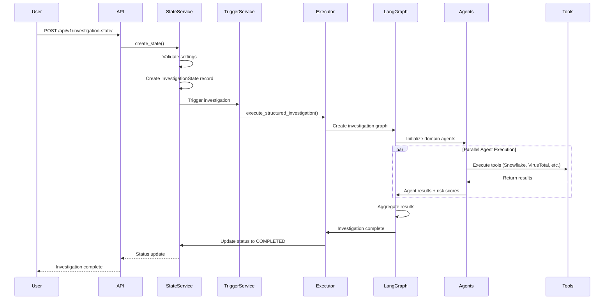
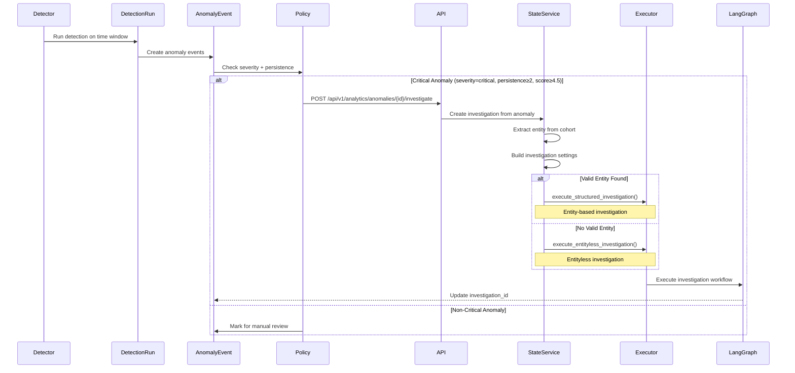

# Olorin Investigation System - Comprehensive Documentation

**Version**: 1.0  
**Last Updated**: 2025-01-11  
**Status**: Production

## Table of Contents

1. [System Overview](#system-overview)
2. [Architecture](#architecture)
3. [Entity-Based Investigations](#entity-based-investigations)
4. [Anomaly-Based Investigations](#anomaly-based-investigations)
5. [Data Flow](#data-flow)
6. [Investigation Processes](#investigation-processes)
7. [Storage and Artifacts](#storage-and-artifacts)
8. [Integration Points](#integration-points)
9. [API Reference](#api-reference)

---

## System Overview

The Olorin Investigation System is a comprehensive fraud detection and analysis platform that combines AI-powered agents, statistical anomaly detection, and automated investigation workflows. The system supports two primary investigation paradigms:

1. **Entity-Based Investigations**: User-initiated investigations targeting specific entities (IP addresses, user IDs, emails, devices, etc.)
2. **Anomaly-Based Investigations**: System-initiated investigations triggered by statistical anomalies detected in transaction data

### Key Features

- **Multi-Agent Architecture**: Parallel execution of specialized domain agents (Device, Location, Network, Logs, Risk)
- **LangGraph Orchestration**: State machine-based workflow orchestration using LangGraph
- **Real-Time Progress Tracking**: Live progress updates via polling mechanism
- **Persistent State Management**: Database-backed investigation state with optimistic locking
- **Comprehensive Logging**: Structured logging with journey tracking and chain-of-thought reasoning
- **Report Generation**: Automated HTML report generation with LLM-based or template-based options
- **Anomaly Integration**: Seamless integration between anomaly detection and investigation workflows

---

## Architecture

### High-Level Architecture

```
┌─────────────────────────────────────────────────────────────────┐
│                        Frontend Layer                            │
│  ┌──────────────┐  ┌──────────────┐  ┌──────────────┐         │
│  │ Investigation│  │   Analytics  │  │   Reports    │         │
│  │  Management  │  │   Dashboard  │  │   Viewer     │         │
│  └──────┬───────┘  └──────┬───────┘  └──────┬───────┘         │
└─────────┼──────────────────┼──────────────────┼─────────────────┘
          │                  │                  │
          ▼                  ▼                  ▼
┌─────────────────────────────────────────────────────────────────┐
│                        API Layer                                 │
│  ┌──────────────────┐  ┌──────────────────┐                   │
│  │ Investigation    │  │ Analytics        │                   │
│  │ State API        │  │ API              │                   │
│  │ /api/v1/         │  │ /api/v1/         │                   │
│  │ investigation-   │  │ analytics/       │                   │
│  │ state/           │  │                  │                   │
│  └────────┬─────────┘  └────────┬─────────┘                   │
└───────────┼──────────────────────┼─────────────────────────────┘
            │                      │
            ▼                      ▼
┌─────────────────────────────────────────────────────────────────┐
│                    Service Layer                                 │
│  ┌──────────────────┐  ┌──────────────────┐                   │
│  │ Investigation    │  │ Anomaly          │                   │
│  │ State Service    │  │ Detection        │                   │
│  │                  │  │ Service          │                   │
│  └────────┬─────────┘  └────────┬─────────┘                   │
│           │                      │                              │
│           ▼                      ▼                              │
│  ┌──────────────────────────────────────────┐                  │
│  │     Investigation Trigger Service         │                  │
│  └──────────────┬───────────────────────────┘                  │
└─────────────────┼───────────────────────────────────────────────┘
                  │
                  ▼
┌─────────────────────────────────────────────────────────────────┐
│                  Orchestration Layer                             │
│  ┌──────────────────────────────────────────────────────────┐  │
│  │              LangGraph Orchestrator                       │  │
│  │  ┌──────────┐  ┌──────────┐  ┌──────────┐  ┌──────────┐ │  │
│  │  │ Entity   │  │ Anomaly  │  │ Entityless│ │ Risk     │ │  │
│  │  │ Graph    │  │ Graph    │  │ Graph    │ │ Analyzer │ │  │
│  │  └──────────┘  └──────────┘  └──────────┘  └──────────┘ │  │
│  └──────────────────────────────────────────────────────────┘  │
└─────────────────────────────────────────────────────────────────┘
                  │
                  ▼
┌─────────────────────────────────────────────────────────────────┐
│                    Agent Layer                                   │
│  ┌──────────┐  ┌──────────┐  ┌──────────┐  ┌──────────┐        │
│  │ Device   │  │ Location │  │ Network  │  │  Logs    │        │
│  │ Agent    │  │ Agent    │  │ Agent    │  │ Agent    │        │
│  └────┬─────┘  └────┬─────┘  └────┬─────┘  └────┬─────┘        │
│       │             │              │             │              │
│       └─────────────┴──────────────┴─────────────┘              │
│                          │                                      │
│                          ▼                                      │
│                  ┌──────────────┐                                │
│                  │  Risk Agent  │                                │
│                  └──────────────┘                                │
└─────────────────────────────────────────────────────────────────┘
                  │
                  ▼
┌─────────────────────────────────────────────────────────────────┐
│                    Tool Layer                                    │
│  ┌──────────┐  ┌──────────┐  ┌──────────┐  ┌──────────┐        │
│  │ Snowflake│  │ VirusTotal│ │  Shodan  │  │  OSINT   │        │
│  │  Query   │  │   API     │ │   API    │  │  Tools   │        │
│  └──────────┘  └──────────┘  └──────────┘  └──────────┘        │
│  ┌──────────┐  ┌──────────┐  ┌──────────┐  ┌──────────┐        │
│  │  SIEM    │  │  EDR     │  │  Threat  │  │  Custom  │        │
│  │  Logs    │  │  Tools   │  │  Intel   │  │  Tools   │        │
│  └──────────┘  └──────────┘  └──────────┘  └──────────┘        │
└─────────────────────────────────────────────────────────────────┘
```

### Core Components

#### 1. Investigation State Service
**Location**: `app/service/investigation_state_service.py`

Manages investigation lifecycle and persistence:
- **CRUD Operations**: Create, read, update, delete investigation states
- **Optimistic Locking**: Version-based concurrency control
- **Audit Logging**: Complete audit trail of all state changes
- **Auto-Trigger**: Automatically triggers investigation execution on creation

**Key Methods**:
- `create_state()`: Create new investigation with auto-trigger
- `get_state()`: Retrieve investigation state by ID
- `update_state()`: Update investigation state with version checking
- `delete_state()`: Delete investigation (soft delete via status)

#### 2. Investigation Trigger Service
**Location**: `app/service/investigation_trigger_service.py`

Orchestrates investigation execution:
- **Request Extraction**: Converts investigation settings to execution requests
- **Context Building**: Builds investigation context from settings
- **Status Management**: Manages status transitions (CREATED → IN_PROGRESS → COMPLETED)
- **Progress Updates**: Updates investigation progress in real-time

#### 3. LangGraph Orchestrator
**Location**: `app/service/agent/orchestration/`

State machine-based workflow execution:
- **Graph Construction**: Builds investigation workflow graphs
- **Node Routing**: Routes execution between agents and tools
- **State Management**: Maintains investigation state throughout execution
- **Parallel Execution**: Coordinates parallel agent execution

#### 4. Domain Agents
**Location**: `app/service/agent/orchestration/domain_agents_clean.py`

Specialized analysis agents:
- **Device Agent**: Device fingerprinting and analysis
- **Location Agent**: Geographic and location-based analysis
- **Network Agent**: Network security and connectivity analysis
- **Logs Agent**: SIEM and log analysis
- **Risk Agent**: ML-based risk assessment

---

## Entity-Based Investigations

### Overview

Entity-based investigations are user-initiated investigations targeting specific entities (IP addresses, user IDs, emails, device IDs, etc.). These investigations follow a structured workflow with user-selected or AI-selected tools.

### Investigation Types

#### 1. Structured Investigations
**Type**: `InvestigationType.STRUCTURED`

- **Tool Selection**: User explicitly selects tools to use
- **Control**: Full user control over investigation scope
- **Use Case**: Targeted investigations with specific analysis goals

**Configuration**:
```json
{
  "investigation_type": "structured",
  "investigation_mode": "entity",
  "entities": [
    {
      "entity_type": "ip",
      "entity_value": "192.168.1.100"
    }
  ],
  "tools": [
    { "tool_name": "snowflake_query", "enabled": true },
    { "tool_name": "virustotal", "enabled": true }
  ]
}
```

#### 2. Hybrid Investigations
**Type**: `InvestigationType.HYBRID`

- **Tool Selection**: AI/LLM automatically selects tools based on context
- **Control**: User provides entity and time range, AI decides tools
- **Use Case**: Exploratory investigations or when tool selection is complex

**Configuration**:
```json
{
  "investigation_type": "hybrid",
  "investigation_mode": "entity",
  "entities": [
    {
      "entity_type": "user_id",
      "entity_value": "user_12345"
    }
  ],
  "tools": []  // Empty - LLM will select tools
}
```

### Investigation Modes

#### 1. Entity Mode
**Mode**: `InvestigationMode.ENTITY`

- **Entity Selection**: User specifies entities to investigate
- **Use Case**: Known entity investigation
- **Configuration**: Entities provided in `settings.entities`

#### 2. Risk Mode
**Mode**: `InvestigationMode.RISK`

- **Entity Selection**: System auto-selects high-risk entities
- **Use Case**: Proactive investigation of high-risk entities
- **Configuration**: `auto_select_entities: true`, empty entities array

**Risk Analyzer Integration**:
- Queries Snowflake for highest risk-weighted value entities
- Falls back to 14-day window if 7-day window has insufficient data
- Selects top 3 entities and chooses final investigation target

### Entity-Based Investigation Flow



### Execution Phases

#### Phase 1: Initialization
- **Duration**: ~5% of total time
- **Activities**:
  - Create LangGraph agent system
  - Initialize investigation context
  - Set up logging and tracking
  - Prepare agent configurations

#### Phase 2: Context Preparation
- **Duration**: ~15% of total time
- **Activities**:
  - Build investigation query with entity details
  - Prepare time range filters
  - Load historical context
  - Set up tool configurations

#### Phase 3: Agent Investigation
- **Duration**: ~70% of total time
- **Activities**:
  - **Snowflake Analysis** (Mandatory): 30-day transaction data analysis
  - **Tool Execution**: Additional tools based on findings
  - **Domain Analysis**: Parallel execution of domain agents
    - Device Agent: Device fingerprinting
    - Location Agent: Geographic analysis
    - Network Agent: Network security analysis
    - Logs Agent: SIEM log analysis
  - **Risk Assessment**: ML-based risk scoring

#### Phase 4: Results Processing
- **Duration**: ~10% of total time
- **Activities**:
  - Aggregate agent results
  - Calculate overall risk score
  - Generate findings and recommendations
  - Create investigation summary

#### Phase 5: Completion
- **Duration**: ~1% of total time
- **Activities**:
  - Update investigation status to COMPLETED
  - Generate investigation report
  - Store final results
  - Clean up resources

---

## Anomaly-Based Investigations

### Overview

Anomaly-based investigations are automatically triggered when statistical anomalies are detected in transaction data. These investigations start with anomaly context (cohort, metric, time window, score) and work backwards to identify root causes and entities.

### Anomaly Detection System

#### Detectors
**Location**: `app/models/anomaly.py` - `Detector` model

Detectors monitor transaction metrics for anomalies:
- **Types**: STL+MAD, CUSUM, Isolation Forest, Random Cut Forest, Matrix Profile
- **Metrics**: `tx_count`, `decline_rate`, `amount_mean`, `unique_devices`, etc.
- **Cohorts**: Grouped by `geo`, `merchant_id`, `channel`
- **Parameters**: Sensitivity (`k`), persistence, minimum support

#### Anomaly Events
**Location**: `app/models/anomaly.py` - `AnomalyEvent` model

When an anomaly is detected:
- **Cohort**: `{"geo": "US-CA", "merchant_id": "m_001", "channel": "web"}`
- **Metric**: `decline_rate`, `tx_count`, etc.
- **Time Window**: 15-minute window (e.g., 10:15-10:30)
- **Score**: Anomaly severity score (0-10+)
- **Severity**: `info`, `warn`, `critical`
- **Evidence**: Detector-specific evidence (residuals, changepoints, etc.)

### Anomaly-to-Investigation Flow



### Investigation Creation from Anomaly

**Endpoint**: `POST /api/v1/analytics/anomalies/{anomaly_id}/investigate`

**Process**:

1. **Anomaly Retrieval**: Fetch anomaly event from database
2. **Entity Extraction**: Extract entity from anomaly cohort
   - Mapping: `merchant_id` → `user_id`, `ip` → `ip`, etc.
   - Fallback: If no valid entity, use entityless investigation
3. **Metadata Building**: Create investigation metadata with anomaly context:
   ```json
   {
     "anomaly_id": "uuid",
     "detector_id": "uuid",
     "cohort": {"geo": "US-CA", "merchant_id": "m_001"},
     "metric": "decline_rate",
     "score": 5.1,
     "severity": "critical",
     "window_start": "2025-01-11T10:15:00Z",
     "window_end": "2025-01-11T10:30:00Z",
     "evidence": {...}
   }
   ```
4. **Investigation Settings**: Build investigation settings:
   - **Type**: Always `HYBRID` for anomaly investigations
   - **Mode**: `ENTITY` if valid entity found, `RISK` if no entity
   - **Time Range**: Set from anomaly window
   - **Entities**: Populated from cohort if available
5. **Investigation Creation**: Create investigation via `InvestigationStateService`
6. **Anomaly Linking**: Update anomaly with `investigation_id` for bidirectional linking

### Entityless Investigations

**Location**: `app/router/controllers/entityless_investigation_executor.py`

When an anomaly has no valid entity (e.g., only cohort dimensions like `geo`), the system uses an entityless investigation workflow:

**Workflow**:
1. **Segment Hunter**: Identifies anomalous segments within the cohort
2. **Entity Extractor**: Extracts candidate entities from segments
3. **Correlator**: Correlates entities across segments
4. **Narrator**: Generates investigation narrative

**Graph**: `app/service/agent/orchestration/entityless_investigation_graph.py`

---

## Data Flow

### Investigation State Lifecycle

```
CREATED → SETTINGS → IN_PROGRESS → COMPLETED
                              ↓
                           ERROR/CANCELLED
```

#### State Transitions

1. **CREATED**: Investigation record created in database
2. **SETTINGS**: Investigation settings configured (optional phase)
3. **IN_PROGRESS**: Investigation execution started
4. **COMPLETED**: Investigation finished successfully
5. **ERROR**: Investigation failed with error
6. **CANCELLED**: Investigation cancelled by user

### Data Storage

#### Database Tables

**investigation_states**:
- `investigation_id` (PK): Unique investigation identifier
- `user_id`: Owner of investigation
- `lifecycle_stage`: Current lifecycle stage
- `status`: Current operational status
- `settings_json`: Investigation settings (JSON)
- `progress_json`: Real-time progress data (JSON)
- `version`: Optimistic locking version
- `created_at`, `updated_at`: Timestamps

**investigation_audit_logs**:
- Complete audit trail of all state changes
- Tracks: user, action, from_version, to_version, timestamp

**anomaly_events**:
- `investigation_id`: Links anomaly to investigation (nullable)
- Bidirectional relationship: anomaly → investigation

#### File System Storage

**Investigation Folders**: `logs/investigations/{MODE}_{ID}_{TIMESTAMP}/`

**Contents**:
```
investigation_folder/
├── metadata.json                    # Investigation metadata
├── investigation.log                # Main investigation log (JSONL)
├── structured_activities.jsonl      # Agent activities log
├── journey_tracking.json            # Journey tracking data
├── thought_process_*.json           # Agent thought processes
├── server_logs                      # Server logs during execution
├── comprehensive_investigation_report.html  # Generated report
└── results/                         # Investigation results
    ├── investigation_result.json
    ├── agent_results.json
    ├── validation_results.json
    ├── performance_metrics.json
    └── journey_data.json
```

### Progress Tracking

**Progress JSON Structure**:
```json
{
  "current_phase": "agent_investigation",
  "progress_percentage": 65.5,
  "phases": [
    {
      "id": "initialization",
      "status": "completed",
      "completion_percent": 100
    },
    {
      "id": "agent_investigation",
      "status": "in_progress",
      "completion_percent": 65
    }
  ],
  "tool_executions": [
    {
      "tool_name": "snowflake_query",
      "status": "completed",
      "duration_ms": 1234,
      "result": {...}
    }
  ],
  "agent_statuses": [
    {
      "agent_name": "device",
      "status": "completed",
      "risk_score": 0.75
    }
  ],
  "risk_metrics": {
    "overall_risk_score": 0.68,
    "confidence_score": 0.85
  }
}
```

**Polling Mechanism**:
- Frontend polls `/api/v1/investigation-state/{id}/progress` every 2-5 seconds
- Backend returns current `progress_json` from database
- No WebSocket - uses HTTP polling for simplicity and reliability

---

## Investigation Processes

### Process 1: Entity-Based Investigation Execution

**Entry Point**: `app/router/controllers/investigation_executor.py`

**Steps**:

1. **Status Update**: Set investigation status to `IN_PROGRESS`
2. **Recursion Guard**: Set up recursion guard for thread safety
3. **Phase Execution**:
   - **Agent Initialization**: Create LangGraph agent system
   - **Context Preparation**: Build investigation query and context
   - **Agent Investigation**: Execute domain agents in parallel
   - **Results Processing**: Aggregate and process results
   - **Completion**: Update status and generate report

4. **Agent Execution**:
   - **Snowflake Analysis** (Mandatory): Query 30-day transaction data
   - **Tool Selection**: Based on investigation type (structured vs hybrid)
   - **Domain Agents**: Parallel execution of 5 domain agents
   - **Risk Assessment**: Calculate risk scores and confidence

5. **Progress Updates**: Update `progress_json` throughout execution

### Process 2: Anomaly-Based Investigation Execution

**Entry Point**: `app/api/routes/analytics.py` - `investigate_anomaly()`

**Steps**:

1. **Anomaly Retrieval**: Fetch anomaly from database
2. **Entity Extraction**: Extract entity from cohort or use entityless mode
3. **Investigation Creation**: Create investigation via `InvestigationStateService`
4. **Investigation Execution**:
   - **If Entity Found**: Execute entity-based investigation
   - **If No Entity**: Execute entityless investigation workflow
5. **Anomaly Linking**: Update anomaly with `investigation_id`

### Process 3: Risk-Based Investigation (Auto-Select Entities)

**Entry Point**: `app/router/controllers/investigation_executor.py`

**Steps**:

1. **Risk Analyzer Query**: Query Snowflake for highest risk entities
   - **Time Window**: 7 days (fallback to 14 days if insufficient data)
   - **Ranking**: Risk-weighted value calculation
   - **Selection**: Top 3 entities identified
2. **Entity Selection**: Choose final investigation target from top 3
3. **Investigation Execution**: Execute entity-based investigation with selected entity

### Process 4: Report Generation

**Entry Point**: `app/service/report_service.py` - `generate_investigation_report()`

**Steps**:

1. **Investigation Folder Resolution**: Locate investigation folder
   - Try `InvestigationFolderManager` (new structure)
   - Fallback to legacy structure
   - Search for investigation ID in folder names
2. **Data Collection**: Collect all investigation artifacts
   - Investigation state from database
   - Progress data
   - Folder data (logs, thought processes, journey tracking)
3. **Report Generation**:
   - **LLM-Based** (if `LLM_BASED_REPORTING=true`): Use LLM to generate HTML report
   - **Template-Based** (default): Use template generator
4. **Report Storage**: Save HTML report to investigation folder
5. **Report Access**: Available via `/api/v1/reports/investigation/{id}/html`

---

## Storage and Artifacts

### Investigation Folder Structure

**New Structure** (via `InvestigationFolderManager`):
- **Base**: `logs/investigations/`
- **Format**: `{MODE}_{INVESTIGATION_ID}_{TIMESTAMP}/`
- **Example**: `LIVE_c99e12a1-0acd-420e-b9bd-c9a4fab02f35_20251111_120139/`

**Legacy Structure**:
- **Base**: `investigation_logs/` (configurable via `INVESTIGATION_LOGS_DIR`)
- **Format**: `{investigation_id}/`
- **Example**: `c99e12a1-0acd-420e-b9bd-c9a4fab02f35/`

### Artifacts Generated

#### 1. Metadata (`metadata.json`)
```json
{
  "investigation_id": "uuid",
  "entity_id": "192.168.1.100",
  "entity_type": "ip",
  "created_at": "2025-01-11T12:01:39Z",
  "investigation_type": "hybrid",
  "investigation_mode": "entity"
}
```

#### 2. Investigation Log (`investigation.log`)
- **Format**: JSONL (JSON Lines)
- **Content**: Structured log entries for investigation events
- **Lines**: One JSON object per line

#### 3. Structured Activities (`structured_activities.jsonl`)
- **Format**: JSONL
- **Content**: Agent activities and tool executions
- **Purpose**: Detailed activity tracking

#### 4. Journey Tracking (`journey_tracking.json`)
- **Format**: JSON
- **Content**: Investigation journey with node executions
- **Structure**: Graph-based journey representation

#### 5. Thought Processes (`thought_process_*.json`)
- **Format**: JSON
- **Content**: Agent reasoning and chain-of-thought
- **Naming**: `thought_process_{investigation_id}_{agent_name}_{timestamp}.json`

#### 6. Investigation Results (`results/`)
- **investigation_result.json**: Final investigation results
- **agent_results.json**: Individual agent results
- **validation_results.json**: Validation and verification results
- **performance_metrics.json**: Performance and timing metrics
- **journey_data.json**: Complete journey data

#### 7. Comprehensive Report (`comprehensive_investigation_report.html`)
- **Format**: HTML
- **Content**: Complete investigation report with:
  - Executive summary
  - Risk assessment
  - Agent analysis results
  - Performance metrics
  - Tool execution details
  - Recommendations
  - Technical details
  - Charts and visualizations

---

## Integration Points

### 1. Anomaly Detection Integration

**Bidirectional Linking**:
- **Anomaly → Investigation**: `anomaly_events.investigation_id` links to investigation
- **Investigation → Anomaly**: Investigation metadata contains `anomaly_id`

**API Endpoints**:
- `POST /api/v1/analytics/anomalies/{anomaly_id}/investigate`: Create investigation from anomaly
- `GET /api/v1/analytics/anomalies?investigation_id={id}`: Get anomalies for investigation

### 2. Detector Creation from Investigations

**Endpoint**: `POST /api/v1/analytics/investigations/{investigation_id}/create-detector`

**Process**:
1. Analyze investigation findings
2. Extract metrics and cohorts
3. Create detector configuration
4. Store `derived_from_investigation_id` in detector params

**Use Case**: Create detectors to catch similar patterns found in investigations

### 3. Risk Analyzer Integration

**Location**: `app/service/analytics/risk_analyzer.py`

**Integration Points**:
- **Risk-Based Investigations**: Auto-selects high-risk entities
- **Entity Ranking**: Risk-weighted value calculation
- **Time Window Fallback**: 7-day → 14-day fallback logic

### 4. Report Service Integration

**Endpoints**:
- `POST /api/v1/reports/investigation/generate`: Generate investigation report
- `GET /api/v1/reports/investigation/{id}/html`: Retrieve HTML report
- `GET /api/v1/reports/investigation`: List all investigation reports

**Report Types**:
- **LLM-Based**: Uses LLM to generate comprehensive HTML report
- **Template-Based**: Uses template generator (default)

---

## API Reference

### Investigation State API

#### Create Investigation
```
POST /api/v1/investigation-state/
Content-Type: application/json

{
  "investigation_id": "uuid",
  "lifecycle_stage": "IN_PROGRESS",
  "status": "IN_PROGRESS",
  "settings": {
    "name": "Investigation Name",
    "entities": [
      {
        "entity_type": "ip",
        "entity_value": "192.168.1.100"
      }
    ],
    "time_range": {
      "start_time": "2025-01-01T00:00:00Z",
      "end_time": "2025-01-07T23:59:59Z"
    },
    "investigation_type": "hybrid",
    "investigation_mode": "entity",
    "tools": [],
    "correlation_mode": "OR"
  }
}
```

#### Get Investigation
```
GET /api/v1/investigation-state/{investigation_id}
```

#### Get Progress
```
GET /api/v1/investigation-state/{investigation_id}/progress
```

#### Update Investigation
```
PUT /api/v1/investigation-state/{investigation_id}
Content-Type: application/json

{
  "status": "CANCELLED",
  "version": 2
}
```

### Anomaly Investigation API

#### Create Investigation from Anomaly
```
POST /api/v1/analytics/anomalies/{anomaly_id}/investigate
```

**Response**:
```json
{
  "investigation_id": "uuid",
  "anomaly_id": "uuid",
  "entity_id": "user_12345",
  "entity_type": "user_id"
}
```

### Report API

#### Generate Report
```
POST /api/v1/reports/investigation/generate
Content-Type: application/json

{
  "investigation_id": "uuid",
  "title": "Investigation Report"
}
```

#### Get Report
```
GET /api/v1/reports/investigation/{investigation_id}/html
```

### Detector Creation API

#### Create Detector from Investigation
```
POST /api/v1/analytics/investigations/{investigation_id}/create-detector
```

**Response**:
```json
{
  "detector": {
    "id": "uuid",
    "name": "Detector: Investigation Name",
    "type": "stl_mad",
    "cohort_by": ["geo"],
    "metrics": ["tx_count", "decline_rate"],
    "params": {
      "derived_from_investigation_id": "investigation_uuid"
    }
  },
  "investigation_id": "uuid",
  "message": "Detector created successfully"
}
```

---

## Summary

The Olorin Investigation System provides a comprehensive, AI-powered fraud investigation platform that seamlessly integrates entity-based and anomaly-based investigation workflows. Key highlights:

- **Dual Paradigms**: Supports both user-initiated (entity-based) and system-initiated (anomaly-based) investigations
- **Multi-Agent Architecture**: Parallel execution of specialized domain agents
- **LangGraph Orchestration**: State machine-based workflow management
- **Real-Time Tracking**: Live progress updates via polling
- **Persistent State**: Database-backed investigation state with audit logging
- **Comprehensive Logging**: Structured logging with journey tracking
- **Report Generation**: Automated HTML report generation
- **Anomaly Integration**: Seamless integration between anomaly detection and investigations
- **Detector Creation**: Ability to create detectors from investigation findings

The system is designed for scalability, reliability, and comprehensive fraud analysis capabilities.

