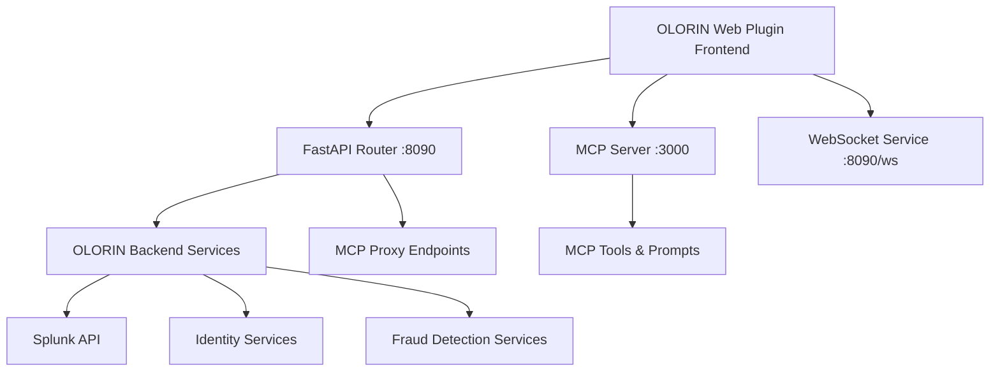
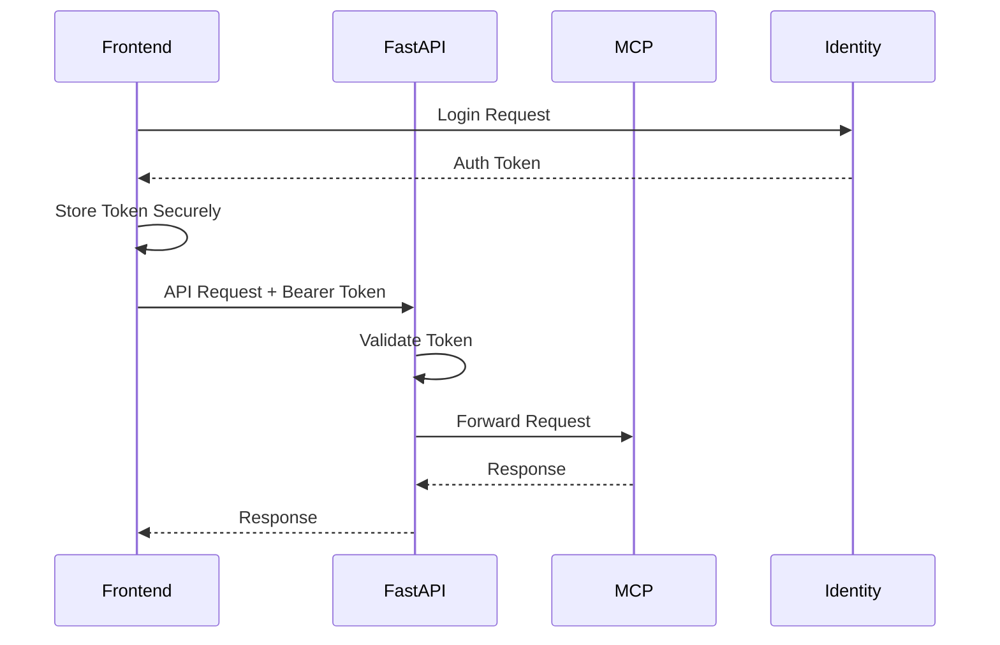

# OLORIN API Integration Guide

## Overview

This guide provides comprehensive information for integrating with the OLORIN API ecosystem, including the FastAPI backend server, MCP (Model Context Protocol) server, and WebSocket services.

## 1. Architecture Overview

### 1.1 Service Architecture



### 1.2 Port Configuration by Environment

| Environment | FastAPI Server | MCP Server | WebSocket |
|-------------|----------------|------------|-----------|
| Local       | localhost:8090 | localhost:3000 | ws://localhost:8090/ws |
| QAL         | olorin-qal.api.olorin.com | olorin-qal.api.olorin.com:3000 | wss://olorin-qal.api.olorin.com/ws |
| E2E         | olorin-e2e.api.olorin.com | olorin-e2e.api.olorin.com:3000 | wss://olorin-e2e.api.olorin.com/ws |
| PRF         | olorin-prf.api.olorin.com | olorin-prf.api.olorin.com:3000 | wss://olorin-prf.api.olorin.com/ws |
| STG         | olorin-stg.api.olorin.com | olorin-stg.api.olorin.com:3000 | wss://olorin-stg.api.olorin.com/ws |
| PRD         | olorin.api.olorin.com | olorin.api.olorin.com:3000 | wss://olorin.api.olorin.com/ws |

## 2. Security Requirements

**Non-Local Environments:**
- ✅ **HTTPS/WSS**: Required for testing and production environments (E2E, PRF, STG, PROD)
- ✅ **Authentication**: Bearer token required for all requests
- ✅ **CSRF**: Required for state-changing operations

## 3. Critical Security Fixes Needed

### 3.1 Fix Insecure HTTP Connections

**Current Issue (CRITICAL):**
```typescript
// VULNERABLE - Non-local environments using HTTP
mcp: {
  baseUrl: 'http://olorin-e2e.api.olorin.com:3000',  // E2E Testing Environment
  wsUrl: 'ws://olorin-e2e.api.olorin.com:3000/ws',
}
```

**Required Fix:**
```typescript
// SECURE - Use HTTPS/WSS for all non-local environments
mcp: {
  baseUrl: 'https://olorin-e2e.api.olorin.com:3000',  // E2E Testing Environment
  wsUrl: 'wss://olorin-e2e.api.olorin.com:3000/ws',
}
```

### 3.2 Fix API Endpoint Mismatches

**Backend FastAPI Router** (`app/router/mcp_router.py`):
```python
# Backend endpoints with /mcp prefix
GET /mcp/status
GET /mcp/tools
POST /mcp/tools/{name}/execute
```

**Frontend Client Fix Needed:**
```typescript
// Current (INCORRECT)
fetch(`${this.httpBaseUrl}/status`)

// Fixed (CORRECT)
fetch(`${this.httpBaseUrl}/mcp/status`)
```

## 4. Implementation Priority

### Priority 1 (CRITICAL - 24 hours)
1. Update all non-local environments to use HTTPS/WSS (E2E testing + PRF/STG/PROD production)
2. Fix API endpoint paths with /mcp prefix
3. Implement secure token storage

### Priority 2 (HIGH - 1 week)
1. Add CSRF protection
2. Implement proper error handling
3. Add API response validation

## 5. Contact Information

**For Security Issues:**
- Report immediately to security team
- Do not deploy insecure HTTP connections to non-local environments

**For API Questions:**
- Refer to backend team for endpoint specifications
- Validate all changes against backend implementation

---

This is a summary guide. Refer to the full VAN Security Analysis Report for complete implementation details.

## 6. MCP Server Integration

### 6.1 Base URL Configuration

**Correct Frontend Configuration:**
```typescript
// src/js/services/envConstants.ts
const ENVIRONMENTS: Record<string, Record<Service, ServiceConfig>> = {
  e2e: {
    mcp: {
      baseUrl: 'https://olorin-e2e.api.olorin.com:3000',
      httpUrl: 'https://olorin-e2e.api.olorin.com:3000', 
      wsUrl: 'wss://olorin-e2e.api.olorin.com:3000/ws',
    },
  },
  // ... other environments
};
```

### 6.2 MCP Endpoint Structure

#### FastAPI Router Endpoints (Port 8090)
Base URL: `https://olorin-{env}.api.olorin.com/mcp`

| Method | Endpoint | Description |
|--------|----------|-------------|
| GET | `/mcp/status` | MCP server status |
| GET | `/mcp/health` | Health check |
| GET | `/mcp/tools` | List available tools |
| GET | `/mcp/tools/categories` | Categorized tools |
| POST | `/mcp/tools/{name}/execute` | Execute specific tool |
| GET | `/mcp/prompts` | List available prompts |
| POST | `/mcp/prompts/{name}/execute` | Execute specific prompt |

#### Direct MCP Server Endpoints (Port 3000)
Base URL: `https://olorin-{env}.api.olorin.com:3000`

| Method | Endpoint | Description |
|--------|----------|-------------|
| GET | `/health` | Server health |
| GET | `/resources/olorin/status` | Resource status |
| GET | `/resources/olorin/tools` | Tool resources |
| GET | `/prompts` | Available prompts |
| POST | `/tools/call` | Direct tool execution |
| POST | `/prompts/custom` | Custom prompt execution |

### 6.3 Frontend Client Implementation

**Corrected MCPWebClient:**
```typescript
// src/js/services/mcpClient.ts
export class MCPWebClient {
  private httpBaseUrl: string;

  constructor(httpBaseUrl: string) {
    // Ensure correct path structure for FastAPI router
    this.httpBaseUrl = httpBaseUrl.endsWith('/')
      ? `${httpBaseUrl}mcp`
      : `${httpBaseUrl}/mcp`;
  }

  async getStatus(): Promise<MCPServerStatus> {
    // Correct endpoint with /mcp prefix
    const response = await fetch(`${this.httpBaseUrl}/status`, {
      headers: this.getSecureHeaders(),
    });
    return await this.handleResponse<MCPServerStatus>(response);
  }

  async getTools(): Promise<OlorinTool[]> {
    const response = await fetch(`${this.httpBaseUrl}/tools`, {
      headers: this.getSecureHeaders(),
    });
    return await this.handleResponse<OlorinTool[]>(response);
  }

  private getSecureHeaders(): Record<string, string> {
    const headers: Record<string, string> = {
      'Content-Type': 'application/json',
    };

    // Use secure token storage
    const token = SecureTokenStorage.getToken();
    if (token) {
      headers.Authorization = `Bearer ${token}`;
    }

    return headers;
  }
}
```

## 7. API Response Formats

### 7.1 Tool Execution Response

**Backend Response Format:**
```json
{
  "success": boolean,
  "result": any,
  "error": string | null,
  "execution_time": number,
  "tool_name": string
}
```

**Frontend Type Definition:**
```typescript
interface ToolExecutionResult {
  content: MCPContent[];
  isError: boolean;
  metadata?: {
    tool_name: string;
    execution_time: number;
    success: boolean;
  };
}
```

**Response Transformation:**
```typescript
// src/js/services/apiValidation.ts
export function transformToolResponse(backendResponse: any): ToolExecutionResult {
  return {
    content: [{
      type: 'text',
      text: typeof backendResponse.result === 'string' 
        ? backendResponse.result 
        : JSON.stringify(backendResponse.result, null, 2)
    }],
    isError: !backendResponse.success,
    metadata: {
      tool_name: backendResponse.tool_name,
      execution_time: backendResponse.execution_time,
      success: backendResponse.success,
    },
  };
}
```

### 7.2 Error Response Format

**Standard Error Response:**
```json
{
  "error": {
    "code": number,
    "message": string,
    "details": any
  },
  "success": false,
  "timestamp": string
}
```

## 8. Authentication & Security

### 8.1 Authentication Flow



### 8.2 Token Management

**Secure Token Storage:**
```typescript
// src/js/services/secureStorage.ts
export class SecureTokenStorage {
  private static readonly TOKEN_KEY = 'olorin_auth_token';
  private static readonly EXPIRY_KEY = 'olorin_token_expiry';

  static setToken(token: string, expiryHours: number = 24): void {
    const expiry = Date.now() + (expiryHours * 60 * 60 * 1000);
    const encryptedToken = this.encrypt(token);
    
    sessionStorage.setItem(this.TOKEN_KEY, encryptedToken);
    sessionStorage.setItem(this.EXPIRY_KEY, expiry.toString());
  }

  static getToken(): string | null {
    const encryptedToken = sessionStorage.getItem(this.TOKEN_KEY);
    const expiry = sessionStorage.getItem(this.EXPIRY_KEY);

    if (!encryptedToken || !expiry) return null;

    if (Date.now() > parseInt(expiry)) {
      this.clearToken();
      return null;
    }

    return this.decrypt(encryptedToken);
  }

  static clearToken(): void {
    sessionStorage.removeItem(this.TOKEN_KEY);
    sessionStorage.removeItem(this.EXPIRY_KEY);
  }

  private static encrypt(data: string): string {
    // Implement proper client-side encryption
    return btoa(data); // Placeholder
  }

  private static decrypt(data: string): string {
    // Implement proper client-side decryption
    return atob(data); // Placeholder
  }
}
```

### 8.3 CSRF Protection

```typescript
// src/js/services/csrfProtection.ts
export class CSRFProtection {
  private static token: string | null = null;

  static async getCSRFToken(): Promise<string> {
    if (!this.token) {
      const response = await fetch('/api/csrf-token');
      const data = await response.json();
      this.token = data.csrf_token;
    }
    return this.token;
  }

  static async getHeaders(): Promise<Record<string, string>> {
    const csrfToken = await this.getCSRFToken();
    return {
      'X-CSRF-Token': csrfToken,
      'Content-Type': 'application/json',
    };
  }
}
```

## 9. WebSocket Integration

### 9.1 Secure WebSocket Client

```typescript
// src/js/services/secureWebSocket.ts
export class SecureWebSocketClient {
  private ws: WebSocket | null = null;
  private reconnectAttempts = 0;
  private maxReconnectAttempts = 5;

  constructor(private url: string, private authToken: string) {}

  connect(): Promise<void> {
    return new Promise((resolve, reject) => {
      // Use WSS in production
      const secureUrl = this.url.replace('ws://', 'wss://');
      
      this.ws = new WebSocket(secureUrl, ['bearer', this.authToken]);
      
      this.ws.onopen = () => {
        this.reconnectAttempts = 0;
        console.log('WebSocket connected');
        resolve();
      };

      this.ws.onerror = (error) => {
        console.error('WebSocket error:', error);
        reject(error);
      };

      this.ws.onclose = () => {
        console.log('WebSocket disconnected');
        this.handleReconnection();
      };

      this.ws.onmessage = (event) => {
        this.handleMessage(event.data);
      };
    });
  }

  private handleReconnection(): void {
    if (this.reconnectAttempts < this.maxReconnectAttempts) {
      this.reconnectAttempts++;
      const delay = 1000 * Math.pow(2, this.reconnectAttempts - 1); // Exponential backoff
      console.log(`Reconnecting in ${delay}ms (attempt ${this.reconnectAttempts})`);
      setTimeout(() => this.connect(), delay);
    }
  }

  private handleMessage(data: string): void {
    try {
      const message = JSON.parse(data);
      this.validateMessage(message);
      // Process validated message
    } catch (error) {
      console.error('Invalid WebSocket message:', error);
    }
  }

  private validateMessage(message: any): void {
    // Implement message validation
    if (!message.type || !message.data) {
      throw new Error('Invalid message format');
    }
  }

  send(data: any): void {
    if (this.ws && this.ws.readyState === WebSocket.OPEN) {
      this.ws.send(JSON.stringify(data));
    } else {
      console.error('WebSocket not connected');
    }
  }

  disconnect(): void {
    if (this.ws) {
      this.ws.close();
      this.ws = null;
    }
  }
}
```

## 10. Error Handling

### 10.1 Standardized Error Handling

```typescript
// src/js/services/errorHandler.ts
export class APIErrorHandler {
  static handleResponse<T>(response: Response): Promise<T> {
    if (!response.ok) {
      return this.handleHTTPError(response);
    }
    return response.json();
  }

  private static async handleHTTPError(response: Response): Promise<never> {
    const errorData = await response.json().catch(() => ({}));
    
    switch (response.status) {
      case 401:
        // Clear token and redirect to login
        SecureTokenStorage.clearToken();
        throw new Error('Authentication required. Please login again.');
      
      case 403:
        throw new Error('Access denied. Insufficient permissions.');
      
      case 429:
        throw new Error('Rate limit exceeded. Please try again later.');
      
      case 500:
        throw new Error('Server error. Please try again later.');
      
      default:
        throw new Error(
          errorData.message || 
          `HTTP ${response.status}: ${response.statusText}`
        );
    }
  }
}
```

## 11. Environment-Specific Configuration

### 11.1 Configuration Management

```typescript
// src/js/services/configManager.ts
interface EnvironmentConfig {
  apiBaseUrl: string;
  mcpBaseUrl: string;
  wsUrl: string;
  useHTTPS: boolean;
  enableCSRF: boolean;
}

export class ConfigManager {
  private static configs: Record<string, EnvironmentConfig> = {
    local: {
      apiBaseUrl: 'http://localhost:8090',
      mcpBaseUrl: 'http://localhost:3000',
      wsUrl: 'ws://localhost:8090/ws',
      useHTTPS: false,
      enableCSRF: false,
    },
    e2e: {
      apiBaseUrl: 'https://olorin-e2e.api.olorin.com',
      mcpBaseUrl: 'https://olorin-e2e.api.olorin.com:3000',
      wsUrl: 'wss://olorin-e2e.api.olorin.com/ws',
      useHTTPS: true,
      enableCSRF: true,
    },
    // ... other environments
  };

  static getConfig(environment: string): EnvironmentConfig {
    return this.configs[environment] || this.configs['e2e'];
  }

  static validateConfig(config: EnvironmentConfig): void {
    if (config.useHTTPS) {
      if (!config.apiBaseUrl.startsWith('https://')) {
        throw new Error('HTTPS required for production environments');
      }
      if (!config.wsUrl.startsWith('wss://')) {
        throw new Error('WSS required for production environments');
      }
    }
  }
}
```

## 12. Testing Integration

### 12.1 API Testing

```typescript
// src/js/services/__tests__/mcpClient.test.ts
describe('MCPWebClient', () => {
  let client: MCPWebClient;

  beforeEach(() => {
    client = new MCPWebClient('https://test-api.com');
  });

  it('should construct correct endpoint URLs', () => {
    expect(client['httpBaseUrl']).toBe('https://test-api.com/mcp');
  });

  it('should handle authentication token', async () => {
    SecureTokenStorage.setToken('test-token');
    
    const headers = client['getSecureHeaders']();
    expect(headers.Authorization).toBe('Bearer test-token');
  });

  it('should handle API errors gracefully', async () => {
    // Mock failed response
    global.fetch = jest.fn().mockResolvedValue({
      ok: false,
      status: 401,
      json: () => Promise.resolve({ message: 'Unauthorized' })
    });

    await expect(client.getStatus()).rejects.toThrow('Authentication required');
  });
});
```

## 13. Performance Optimization

### 13.1 Request Caching

```typescript
// src/js/services/cacheManager.ts
export class APICache {
  private static cache = new Map<string, { data: any; expires: number }>();

  static get<T>(key: string): T | null {
    const cached = this.cache.get(key);
    if (!cached) return null;

    if (Date.now() > cached.expires) {
      this.cache.delete(key);
      return null;
    }

    return cached.data;
  }

  static set(key: string, data: any, ttl: number = 300000): void { // 5 minutes default
    this.cache.set(key, {
      data,
      expires: Date.now() + ttl
    });
  }

  static clear(): void {
    this.cache.clear();
  }
}
```

### 13.2 Request Debouncing

```typescript
// src/js/services/requestDebouncer.ts
export class RequestDebouncer {
  private static timers = new Map<string, NodeJS.Timeout>();

  static debounce<T>(
    key: string, 
    fn: () => Promise<T>, 
    delay: number = 300
  ): Promise<T> {
    return new Promise((resolve, reject) => {
      // Clear existing timer
      const existingTimer = this.timers.get(key);
      if (existingTimer) {
        clearTimeout(existingTimer);
      }

      // Set new timer
      const timer = setTimeout(async () => {
        try {
          const result = await fn();
          resolve(result);
        } catch (error) {
          reject(error);
        } finally {
          this.timers.delete(key);
        }
      }, delay);

      this.timers.set(key, timer);
    });
  }
}
```

## 14. Migration Guide

### 14.1 Updating Existing Code

**Before (Insecure):**
```typescript
// Old insecure implementation
const client = new MCPWebClient('http://olorin-e2e.api.olorin.com:3000');
localStorage.setItem('token', authToken);
```

**After (Secure):**
```typescript
// New secure implementation
const config = ConfigManager.getConfig('e2e');
ConfigManager.validateConfig(config);
const client = new MCPWebClient(config.mcpBaseUrl);
SecureTokenStorage.setToken(authToken, 24);
```

### 14.2 Breaking Changes

1. **Protocol Changes**: HTTP → HTTPS in production
2. **Token Storage**: localStorage → encrypted sessionStorage
3. **Endpoint Structure**: Direct calls → /mcp prefixed calls
4. **Error Handling**: Generic errors → structured error responses

## 15. Troubleshooting

### 15.1 Common Issues

**Issue**: CORS errors in production
```
Solution: Ensure HTTPS is used and CORS headers are properly configured
```

**Issue**: Authentication failures
```
Solution: Check token expiration and storage encryption
```

**Issue**: WebSocket connection failures
```
Solution: Verify WSS protocol is used in production environments
```

### 15.2 Debug Tools

```typescript
// src/js/services/debugTools.ts
export class APIDebugger {
  static logRequest(url: string, options: RequestInit): void {
    if (process.env.NODE_ENV === 'development') {
      console.group(`API Request: ${options.method || 'GET'} ${url}`);
      console.log('Headers:', options.headers);
      console.log('Body:', options.body);
      console.groupEnd();
    }
  }

  static logResponse(url: string, response: Response): void {
    if (process.env.NODE_ENV === 'development') {
      console.group(`API Response: ${response.status} ${url}`);
      console.log('Status:', response.status, response.statusText);
      console.log('Headers:', Object.fromEntries(response.headers.entries()));
      console.groupEnd();
    }
  }
}
```

## 16. Monitoring & Analytics

### 16.1 Performance Monitoring

```typescript
// src/js/services/performanceMonitor.ts
export class PerformanceMonitor {
  static trackAPICall(endpoint: string, startTime: number): void {
    const duration = Date.now() - startTime;
    
    // Send metrics to monitoring service
    this.sendMetric('api_call_duration', {
      endpoint,
      duration,
      timestamp: Date.now()
    });
  }

  private static sendMetric(name: string, data: any): void {
    // Implement metric collection
    console.log(`Metric: ${name}`, data);
  }
}
```

---

## Conclusion

This integration guide provides a comprehensive foundation for secure and reliable API integration with the OLORIN ecosystem. Follow the security guidelines, use the provided code examples, and implement proper error handling to ensure robust frontend-backend communication.

For additional support, refer to the security guidelines and architecture documentation, or contact the OLORIN development team. 