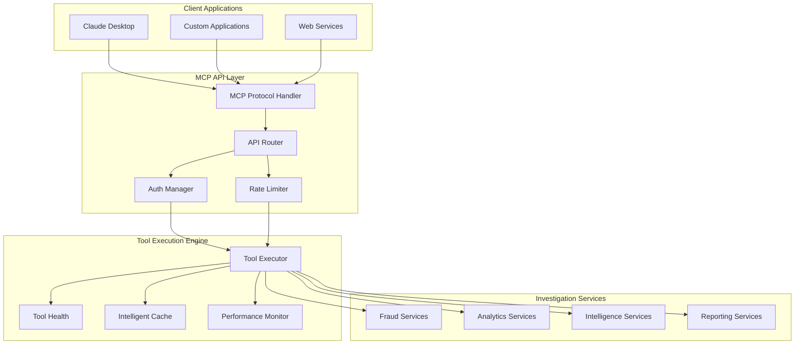

# MCP API Documentation
## Model Context Protocol API Reference for Developers

**Author**: Gil Klainert  
**Date**: 2025-08-31  
**Version**: 1.0  
**Audience**: Developers, Integration Engineers, System Architects

---

## 🏗️ API Architecture Overview

The Olorin MCP API provides a comprehensive interface for integrating fraud investigation capabilities into external systems and applications. Built on the Model Context Protocol standard, it offers 200+ specialized tools through a consistent, secure, and scalable API framework.

### Core API Components



### Technology Stack

- **Protocol**: Model Context Protocol (MCP) over stdio/HTTP
- **Transport**: Stdio (primary), HTTP/WebSocket (secondary)
- **Authentication**: JWT with role-based access control
- **Serialization**: JSON with schema validation
- **Rate Limiting**: Token bucket algorithm with user-based quotas
- **Caching**: Multi-level with Redis backend
- **Monitoring**: Comprehensive metrics and tracing

---

## 🚀 Quick Start Guide

### Installation and Setup

#### Prerequisites
```bash
# Python 3.11+ required
python --version  # Should show 3.11+

# Install Olorin MCP package
pip install olorin-mcp-client

# Or for development
git clone https://github.com/your-org/olorin.git
cd olorin/olorin-server
poetry install
```

#### Basic Configuration
```python
# config/mcp_client_config.py
from olorin_mcp import MCPClient, MCPConfig

config = MCPConfig(
    server_command=["python", "-m", "app.mcp_server.cli"],
    server_args=[],
    server_env={
        "OLORIN_API_KEY": "your-api-key",
        "LOG_LEVEL": "INFO"
    },
    timeout=30,
    max_retries=3
)

client = MCPClient(config)
```

#### First API Call
```python
import asyncio
from olorin_mcp import MCPClient

async def first_investigation():
    async with MCPClient() as client:
        # Get available tools
        tools = await client.list_tools()
        print(f"Available tools: {len(tools)}")
        
        # Execute basic user lookup
        result = await client.call_tool(
            name="oii_tool",
            arguments={"user_id": "12345", "include_history": True}
        )
        
        print(f"Investigation result: {result}")

# Run the investigation
asyncio.run(first_investigation())
```

---

## 🔧 Core API Reference

### MCP Protocol Methods

#### 1. Tool Discovery and Management

##### List Available Tools
```python
# Method: list_tools
async def list_tools(
    category: Optional[str] = None,
    security_level: Optional[str] = None
) -> List[ToolDefinition]:
    """
    Retrieve list of available investigation tools.
    
    Args:
        category: Filter by tool category ('fraud', 'analytics', 'intelligence')
        security_level: Filter by required security level ('low', 'medium', 'high')
        
    Returns:
        List of tool definitions with schemas and descriptions
        
    Example:
        tools = await client.list_tools(category="fraud", security_level="high")
        for tool in tools:
            print(f"{tool.name}: {tool.description}")
    """
```

**Response Format**:
```json
{
    "tools": [
        {
            "name": "splunk_query_tool",
            "description": "Execute SPL queries against Splunk infrastructure",
            "category": "intelligence",
            "security_level": "high",
            "input_schema": {
                "type": "object",
                "properties": {
                    "query": {"type": "string", "description": "SPL query to execute"},
                    "earliest_time": {"type": "string", "description": "Search start time"},
                    "latest_time": {"type": "string", "description": "Search end time"},
                    "max_results": {"type": "integer", "default": 1000}
                },
                "required": ["query"]
            },
            "output_schema": {
                "type": "object",
                "properties": {
                    "results": {"type": "array"},
                    "result_count": {"type": "integer"},
                    "execution_time": {"type": "number"},
                    "query_id": {"type": "string"}
                }
            }
        }
    ]
}
```

##### Get Tool Details
```python
# Method: get_tool
async def get_tool(name: str) -> ToolDefinition:
    """
    Get detailed information about a specific tool.
    
    Args:
        name: Tool name to retrieve
        
    Returns:
        Complete tool definition with schema, examples, and usage notes
        
    Example:
        tool = await client.get_tool("risk_assessment_tool")
        print(f"Input schema: {tool.input_schema}")
        print(f"Usage examples: {tool.examples}")
    """
```

#### 2. Tool Execution

##### Execute Single Tool
```python
# Method: call_tool
async def call_tool(
    name: str,
    arguments: Dict[str, Any],
    config: Optional[ToolConfig] = None
) -> ToolResult:
    """
    Execute a single investigation tool.
    
    Args:
        name: Tool name to execute
        arguments: Tool-specific parameters
        config: Optional execution configuration
        
    Returns:
        Tool execution result with data and metadata
        
    Example:
        result = await client.call_tool(
            name="behavior_profiling_tool",
            arguments={
                "user_id": "12345",
                "analysis_period": "30d",
                "include_devices": True,
                "risk_threshold": 0.7
            },
            config=ToolConfig(timeout=60, cache_results=True)
        )
    """
```

**Request Format**:
```json
{
    "method": "tools/call",
    "params": {
        "name": "behavior_profiling_tool",
        "arguments": {
            "user_id": "12345",
            "analysis_period": "30d",
            "include_devices": true,
            "risk_threshold": 0.7
        },
        "config": {
            "timeout": 60,
            "cache_results": true,
            "trace_execution": true
        }
    }
}
```

**Response Format**:
```json
{
    "result": {
        "success": true,
        "data": {
            "user_profile": {
                "user_id": "12345",
                "risk_score": 2.3,
                "confidence": 0.89,
                "behavioral_patterns": {
                    "login_frequency": "regular",
                    "transaction_patterns": "consistent",
                    "location_consistency": 0.95,
                    "device_consistency": 0.87
                }
            },
            "anomalies": [],
            "recommendations": [
                {
                    "type": "monitoring",
                    "priority": "low",
                    "description": "Continue standard monitoring"
                }
            ]
        },
        "metadata": {
            "execution_time": 1.23,
            "tools_used": ["oii_tool", "device_fingerprint_tool"],
            "cache_hit": false,
            "query_id": "qry_67890abcdef",
            "timestamp": "2025-08-31T14:30:22Z"
        }
    }
}
```

##### Batch Tool Execution
```python
# Method: call_tools_batch
async def call_tools_batch(
    requests: List[ToolRequest],
    config: Optional[BatchConfig] = None
) -> List[ToolResult]:
    """
    Execute multiple tools in a single batch request.
    
    Args:
        requests: List of tool execution requests
        config: Batch execution configuration
        
    Returns:
        List of tool results in request order
        
    Example:
        requests = [
            ToolRequest("oii_tool", {"user_id": "12345"}),
            ToolRequest("device_fingerprint_tool", {"user_id": "12345"}),
            ToolRequest("risk_assessment_tool", {"user_id": "12345"})
        ]
        
        results = await client.call_tools_batch(
            requests,
            BatchConfig(parallel=True, fail_fast=False)
        )
    """
```

#### 3. Advanced Investigation Workflows

##### Orchestrated Investigation
```python
# Method: execute_investigation
async def execute_investigation(
    investigation_type: str,
    parameters: Dict[str, Any],
    config: Optional[InvestigationConfig] = None
) -> InvestigationResult:
    """
    Execute a complete orchestrated investigation workflow.
    
    Args:
        investigation_type: Type of investigation to perform
        parameters: Investigation-specific parameters
        config: Investigation execution configuration
        
    Returns:
        Complete investigation results with analysis and recommendations
        
    Example:
        result = await client.execute_investigation(
            investigation_type="user_fraud_analysis",
            parameters={
                "user_id": "12345",
                "analysis_depth": "comprehensive",
                "include_network_analysis": True,
                "time_range": "90d"
            },
            config=InvestigationConfig(
                enable_streaming=True,
                human_review_threshold=0.8,
                generate_report=True
            )
        )
    """
```

##### Streaming Investigation
```python
# Method: stream_investigation
async def stream_investigation(
    investigation_type: str,
    parameters: Dict[str, Any]
) -> AsyncIterator[InvestigationUpdate]:
    """
    Stream real-time updates during investigation execution.
    
    Args:
        investigation_type: Type of investigation to perform
        parameters: Investigation parameters
        
    Yields:
        Real-time investigation progress updates
        
    Example:
        async for update in client.stream_investigation(
            "comprehensive_fraud_analysis",
            {"user_ids": ["12345", "67890", "54321"]}
        ):
            print(f"Progress: {update.progress}% - {update.status}")
            if update.partial_results:
                process_partial_results(update.partial_results)
    """
```

---

## 🛠️ Investigation Tools Reference

### Core Fraud Investigation Tools

#### 1. Splunk Query Tool

```python
# Tool: splunk_query_tool
{
    "name": "splunk_query_tool",
    "description": "Execute SPL (Search Processing Language) queries against Splunk infrastructure",
    "category": "intelligence",
    "security_level": "high",
    "input_schema": {
        "type": "object",
        "properties": {
            "query": {
                "type": "string",
                "description": "SPL query to execute",
                "examples": [
                    "search index=security sourcetype=authentication user_id=12345",
                    "search index=transactions | stats count by user_id | sort -count"
                ]
            },
            "earliest_time": {
                "type": "string",
                "description": "Search start time (e.g., '-7d', '2025-08-24:00:00:00')",
                "default": "-24h"
            },
            "latest_time": {
                "type": "string", 
                "description": "Search end time (e.g., 'now', '2025-08-31:23:59:59')",
                "default": "now"
            },
            "max_results": {
                "type": "integer",
                "description": "Maximum number of results to return",
                "default": 1000,
                "minimum": 1,
                "maximum": 10000
            },
            "output_format": {
                "type": "string",
                "enum": ["json", "csv", "xml"],
                "default": "json"
            }
        },
        "required": ["query"]
    }
}
```

**Usage Example**:
```python
result = await client.call_tool(
    "splunk_query_tool",
    {
        "query": "search index=authentication user_id=12345 | stats count by src_ip",
        "earliest_time": "-30d",
        "max_results": 500
    }
)

print(f"Found {result.data['result_count']} authentication events")
for event in result.data['results']:
    print(f"IP: {event['src_ip']}, Count: {event['count']}")
```

#### 2. OII (Olorin Identity Intelligence) Tool

```python
# Tool: oii_tool
{
    "name": "oii_tool", 
    "description": "Query Olorin Identity Intelligence for comprehensive user information",
    "category": "fraud",
    "security_level": "high",
    "input_schema": {
        "type": "object",
        "properties": {
            "user_id": {
                "type": "string",
                "description": "User ID to investigate"
            },
            "include_history": {
                "type": "boolean",
                "description": "Include historical user activity",
                "default": true
            },
            "include_relationships": {
                "type": "boolean", 
                "description": "Include related user accounts and entities",
                "default": false
            },
            "risk_assessment": {
                "type": "boolean",
                "description": "Perform AI-powered risk assessment",
                "default": true
            },
            "data_freshness": {
                "type": "string",
                "enum": ["realtime", "cached", "any"],
                "default": "any",
                "description": "Data freshness requirement"
            }
        },
        "required": ["user_id"]
    }
}
```

**Usage Example**:
```python
result = await client.call_tool(
    "oii_tool",
    {
        "user_id": "12345",
        "include_history": True,
        "include_relationships": True,
        "risk_assessment": True
    }
)

user_data = result.data
print(f"User: {user_data['profile']['name']}")
print(f"Risk Score: {user_data['risk_score']}/10")
print(f"Account Status: {user_data['status']}")
```

#### 3. Behavior Profiling Tool

```python
# Tool: behavior_profiling_tool
{
    "name": "behavior_profiling_tool",
    "description": "Analyze user behavior patterns and detect anomalies using ML algorithms",
    "category": "analytics",
    "security_level": "medium",
    "input_schema": {
        "type": "object", 
        "properties": {
            "user_id": {
                "type": "string",
                "description": "User ID to analyze"
            },
            "analysis_period": {
                "type": "string",
                "description": "Time period for analysis (e.g., '30d', '90d', '1y')",
                "default": "30d"
            },
            "behavioral_dimensions": {
                "type": "array",
                "items": {
                    "type": "string",
                    "enum": ["login_patterns", "transaction_timing", "location_consistency", 
                            "device_usage", "navigation_behavior", "communication_patterns"]
                },
                "default": ["login_patterns", "transaction_timing", "location_consistency", "device_usage"]
            },
            "anomaly_sensitivity": {
                "type": "number",
                "minimum": 0.1,
                "maximum": 1.0,
                "default": 0.7,
                "description": "Sensitivity threshold for anomaly detection"
            },
            "baseline_period": {
                "type": "string", 
                "description": "Baseline period for comparison (e.g., '90d', '6m')",
                "default": "90d"
            }
        },
        "required": ["user_id"]
    }
}
```

**Usage Example**:
```python
result = await client.call_tool(
    "behavior_profiling_tool",
    {
        "user_id": "12345",
        "analysis_period": "60d",
        "behavioral_dimensions": ["login_patterns", "transaction_timing", "location_consistency"],
        "anomaly_sensitivity": 0.8
    }
)

profile = result.data['behavioral_profile']
anomalies = result.data['anomalies']

print(f"Behavior consistency score: {profile['consistency_score']}")
print(f"Anomalies detected: {len(anomalies)}")
for anomaly in anomalies:
    print(f"- {anomaly['type']}: {anomaly['description']} (confidence: {anomaly['confidence']})")
```

#### 4. Risk Assessment Tool

```python
# Tool: risk_assessment_tool
{
    "name": "risk_assessment_tool",
    "description": "AI-powered comprehensive risk assessment with explainable results",
    "category": "fraud", 
    "security_level": "high",
    "input_schema": {
        "type": "object",
        "properties": {
            "user_id": {
                "type": "string",
                "description": "User ID for risk assessment"
            },
            "assessment_type": {
                "type": "string",
                "enum": ["comprehensive", "transaction_focused", "behavioral_focused", "network_focused"],
                "default": "comprehensive",
                "description": "Type of risk assessment to perform"
            },
            "risk_factors": {
                "type": "array",
                "items": {
                    "type": "string",
                    "enum": ["device_anomalies", "location_anomalies", "behavioral_changes",
                            "transaction_patterns", "network_indicators", "external_threats"]
                },
                "default": ["device_anomalies", "location_anomalies", "behavioral_changes", "transaction_patterns"]
            },
            "explanation_detail": {
                "type": "string",
                "enum": ["minimal", "standard", "detailed", "comprehensive"],
                "default": "standard",
                "description": "Level of detail for risk explanation"
            },
            "include_recommendations": {
                "type": "boolean",
                "default": True,
                "description": "Include actionable recommendations"
            }
        },
        "required": ["user_id"]
    }
}
```

**Usage Example**:
```python
result = await client.call_tool(
    "risk_assessment_tool", 
    {
        "user_id": "12345",
        "assessment_type": "comprehensive",
        "explanation_detail": "detailed",
        "include_recommendations": True
    }
)

assessment = result.data
print(f"Overall Risk Score: {assessment['risk_score']}/10")
print(f"Confidence Level: {assessment['confidence']}%")
print(f"Risk Category: {assessment['risk_category']}")

print("\nRisk Factors:")
for factor in assessment['risk_factors']:
    print(f"- {factor['name']}: {factor['score']}/10 ({factor['weight']}% weight)")

print(f"\nExplanation: {assessment['explanation']}")

print("\nRecommendations:")
for rec in assessment['recommendations']:
    print(f"- {rec['action']}: {rec['description']} (Priority: {rec['priority']})")
```

### Advanced Analytics Tools

#### 5. Pattern Recognition Tool

```python
# Tool: pattern_recognition_tool
{
    "name": "pattern_recognition_tool",
    "description": "Machine learning-powered pattern identification across datasets",
    "category": "analytics",
    "security_level": "medium",
    "input_schema": {
        "type": "object",
        "properties": {
            "data_sources": {
                "type": "array",
                "items": {"type": "string"},
                "description": "Data sources to analyze (user_transactions, login_events, device_data, etc.)"
            },
            "pattern_types": {
                "type": "array", 
                "items": {
                    "type": "string",
                    "enum": ["temporal", "behavioral", "transactional", "network", "device", "location"]
                },
                "default": ["temporal", "behavioral", "transactional"]
            },
            "user_id": {
                "type": "string",
                "description": "Specific user ID to analyze (optional for global patterns)"
            },
            "time_range": {
                "type": "string", 
                "default": "30d",
                "description": "Time range for pattern analysis"
            },
            "confidence_threshold": {
                "type": "number",
                "minimum": 0.1,
                "maximum": 1.0,
                "default": 0.7,
                "description": "Minimum confidence for pattern identification"
            },
            "max_patterns": {
                "type": "integer",
                "default": 10,
                "description": "Maximum number of patterns to return"
            }
        },
        "required": ["data_sources"]
    }
}
```

#### 6. Entity Linking Tool

```python  
# Tool: entity_linking_tool
{
    "name": "entity_linking_tool",
    "description": "Advanced entity relationship mapping and network analysis",
    "category": "intelligence",
    "security_level": "high", 
    "input_schema": {
        "type": "object",
        "properties": {
            "primary_entity": {
                "type": "string",
                "description": "Primary entity to analyze (user_id, account_id, device_id, etc.)"
            },
            "entity_type": {
                "type": "string",
                "enum": ["user", "account", "device", "ip_address", "payment_method", "email"],
                "description": "Type of primary entity"
            },
            "relationship_types": {
                "type": "array",
                "items": {
                    "type": "string", 
                    "enum": ["shared_device", "shared_payment", "shared_location", "shared_network", 
                            "transaction_link", "communication_link", "behavioral_similarity"]
                },
                "default": ["shared_device", "shared_payment", "shared_location"]
            },
            "max_depth": {
                "type": "integer",
                "minimum": 1,
                "maximum": 5,
                "default": 2,
                "description": "Maximum relationship depth to explore"
            },
            "relationship_strength": {
                "type": "number",
                "minimum": 0.1, 
                "maximum": 1.0,
                "default": 0.5,
                "description": "Minimum relationship strength threshold"
            },
            "include_risk_scoring": {
                "type": "boolean",
                "default": True,
                "description": "Include risk scoring for identified relationships"
            }
        },
        "required": ["primary_entity", "entity_type"]
    }
}
```

---

## 🔐 Security and Authentication

### Authentication Methods

#### JWT Token Authentication
```python
# JWT Authentication Setup
from olorin_mcp.auth import JWTAuthenticator

# Initialize with credentials
authenticator = JWTAuthenticator(
    api_key="your-api-key",
    secret_key="your-secret-key",
    token_expiry=3600  # 1 hour
)

# Authenticate and get token
token = await authenticator.authenticate(
    username="investigator@company.com",
    permissions=["fraud_investigation", "analytics_access"]
)

# Use token in client
client = MCPClient(auth_token=token)
```

#### Role-Based Access Control
```python
# RBAC Configuration
roles_config = {
    "fraud_investigator": {
        "tools": ["oii_tool", "behavior_profiling_tool", "risk_assessment_tool"],
        "data_access": ["user_profiles", "transaction_data", "device_data"],
        "rate_limits": {"requests_per_hour": 1000, "concurrent_requests": 10}
    },
    "senior_analyst": {
        "tools": ["*"],  # All tools
        "data_access": ["*"],  # All data
        "rate_limits": {"requests_per_hour": 5000, "concurrent_requests": 25}
    },
    "compliance_officer": {
        "tools": ["audit_tool", "compliance_report_tool", "data_export_tool"],
        "data_access": ["audit_logs", "compliance_reports"],
        "rate_limits": {"requests_per_hour": 500, "concurrent_requests": 5}
    }
}

# Apply role to client
client = MCPClient(user_role="fraud_investigator")
```

### Security Features

#### Data Encryption and Protection
```python
# Encryption Configuration
security_config = {
    "encryption": {
        "at_rest": "AES-256",
        "in_transit": "TLS-1.3",
        "key_rotation": "weekly"
    },
    "data_protection": {
        "pii_masking": True,
        "field_level_encryption": ["ssn", "credit_card", "phone_number"],
        "data_retention": "7_years",
        "cross_border_restrictions": True
    },
    "audit_logging": {
        "enabled": True,
        "retention_period": "10_years",
        "compliance_standards": ["SOX", "PCI-DSS", "GDPR"]
    }
}
```

#### Rate Limiting and Quotas
```python
# Rate Limiting Configuration
rate_limits = {
    "per_user": {
        "requests_per_minute": 100,
        "requests_per_hour": 1000,
        "requests_per_day": 10000
    },
    "per_tool": {
        "high_security_tools": {"requests_per_hour": 100},
        "analytics_tools": {"requests_per_hour": 500},
        "general_tools": {"requests_per_hour": 1000}
    },
    "concurrent_limits": {
        "max_concurrent_investigations": 5,
        "max_concurrent_tool_executions": 10
    }
}

# Handle rate limiting
try:
    result = await client.call_tool("splunk_query_tool", arguments)
except RateLimitExceeded as e:
    print(f"Rate limit exceeded. Retry after: {e.retry_after} seconds")
    await asyncio.sleep(e.retry_after)
    result = await client.call_tool("splunk_query_tool", arguments)
```

---

## 📊 Error Handling and Response Codes

### Standard Error Responses

#### Error Response Format
```json
{
    "error": {
        "code": "TOOL_EXECUTION_FAILED", 
        "message": "Tool execution failed due to invalid parameters",
        "details": {
            "tool_name": "behavior_profiling_tool",
            "parameter_errors": [
                {
                    "field": "user_id",
                    "error": "User ID not found in system",
                    "provided_value": "invalid_user_123"
                }
            ]
        },
        "request_id": "req_abc123def456",
        "timestamp": "2025-08-31T14:30:22Z",
        "retry_info": {
            "retryable": false,
            "max_retries": 3,
            "current_attempt": 1
        }
    }
}
```

#### Common Error Codes

| Code | Description | HTTP Status | Retryable |
|------|-------------|-------------|-----------|
| `INVALID_TOOL_NAME` | Requested tool does not exist | 404 | No |
| `INVALID_PARAMETERS` | Tool parameters are invalid or missing | 400 | No |
| `AUTHENTICATION_FAILED` | Invalid or expired authentication token | 401 | No |
| `PERMISSION_DENIED` | Insufficient permissions for requested operation | 403 | No |
| `RATE_LIMIT_EXCEEDED` | API rate limit exceeded | 429 | Yes |
| `TOOL_EXECUTION_FAILED` | Tool execution failed due to internal error | 500 | Yes |
| `TOOL_TIMEOUT` | Tool execution exceeded timeout limit | 504 | Yes |
| `SERVICE_UNAVAILABLE` | MCP server temporarily unavailable | 503 | Yes |
| `INVALID_CONFIGURATION` | Invalid client or server configuration | 400 | No |
| `DATA_NOT_FOUND` | Requested data not found in system | 404 | No |

### Error Handling Best Practices

#### Comprehensive Error Handling
```python
from olorin_mcp.exceptions import (
    MCPError, ToolExecutionError, AuthenticationError,
    RateLimitExceeded, ServiceUnavailable
)

async def robust_investigation(user_id: str):
    """Example of comprehensive error handling for investigations."""
    
    max_retries = 3
    retry_count = 0
    
    while retry_count < max_retries:
        try:
            # Execute investigation
            result = await client.call_tool(
                "risk_assessment_tool",
                {"user_id": user_id}
            )
            return result
            
        except AuthenticationError as e:
            # Authentication failed - not retryable
            logger.error(f"Authentication failed: {e.message}")
            raise
            
        except RateLimitExceeded as e:
            # Rate limit exceeded - wait and retry
            logger.warning(f"Rate limit exceeded, waiting {e.retry_after} seconds")
            await asyncio.sleep(e.retry_after)
            retry_count += 1
            continue
            
        except ServiceUnavailable as e:
            # Service temporarily unavailable - exponential backoff
            wait_time = (2 ** retry_count) * 1  # 1, 2, 4 seconds
            logger.warning(f"Service unavailable, retrying in {wait_time} seconds")
            await asyncio.sleep(wait_time)
            retry_count += 1
            continue
            
        except ToolExecutionError as e:
            # Tool-specific error - check if retryable
            if e.retryable and retry_count < max_retries:
                logger.warning(f"Tool execution failed (retryable): {e.message}")
                retry_count += 1
                continue
            else:
                logger.error(f"Tool execution failed (not retryable): {e.message}")
                raise
                
        except MCPError as e:
            # Generic MCP error - log and re-raise
            logger.error(f"MCP error occurred: {e.message}")
            raise
            
    # All retries exhausted
    raise RuntimeError(f"Investigation failed after {max_retries} retries")
```

#### Circuit Breaker Pattern
```python
from olorin_mcp.resilience import CircuitBreaker

class InvestigationService:
    def __init__(self):
        self.client = MCPClient()
        self.circuit_breaker = CircuitBreaker(
            failure_threshold=5,
            recovery_timeout=30,
            expected_exception=ToolExecutionError
        )
    
    @circuit_breaker
    async def execute_investigation(self, user_id: str):
        """Execute investigation with circuit breaker protection."""
        return await self.client.call_tool(
            "comprehensive_investigation",
            {"user_id": user_id}
        )
```

---

## 📈 Performance Optimization

### Caching Strategies

#### Intelligent Caching Configuration
```python
from olorin_mcp.caching import CacheManager, CacheStrategy

# Configure multi-level caching
cache_config = {
    "l1_cache": {
        "type": "memory",
        "max_size": "512MB",
        "ttl": 300  # 5 minutes
    },
    "l2_cache": {
        "type": "redis", 
        "url": "redis://localhost:6379",
        "ttl": 3600  # 1 hour
    },
    "cache_strategies": {
        "user_profiles": CacheStrategy.CONTENT_HASH,
        "investigation_results": CacheStrategy.TIME_BASED,
        "tool_schemas": CacheStrategy.PERSISTENT
    }
}

client = MCPClient(cache_config=cache_config)
```

#### Cache Usage Examples
```python
# Explicit cache control
result = await client.call_tool(
    "oii_tool",
    {"user_id": "12345"},
    config=ToolConfig(
        cache_policy="prefer_cache",  # Use cache if available
        cache_ttl=1800,  # 30 minutes
        cache_key="user_profile_12345"  # Custom cache key
    )
)

# Force cache refresh
result = await client.call_tool(
    "behavior_profiling_tool",
    {"user_id": "12345", "analysis_period": "30d"},
    config=ToolConfig(
        cache_policy="refresh_cache",  # Force refresh
        cache_results=True  # Cache new results
    )
)

# Bypass cache completely
result = await client.call_tool(
    "real_time_risk_tool", 
    {"user_id": "12345"},
    config=ToolConfig(cache_policy="no_cache")
)
```

### Performance Monitoring

#### Built-in Performance Metrics
```python
# Enable performance monitoring
client = MCPClient(
    performance_config={
        "enable_tracing": True,
        "enable_metrics": True,
        "metrics_export": {
            "type": "prometheus",
            "endpoint": "http://localhost:9090"
        }
    }
)

# Get performance statistics
stats = await client.get_performance_stats()
print(f"Average response time: {stats.avg_response_time}ms")
print(f"Cache hit rate: {stats.cache_hit_rate}%")
print(f"Error rate: {stats.error_rate}%")
```

#### Custom Performance Tracking
```python
import time
from olorin_mcp.monitoring import PerformanceTracker

async def tracked_investigation(user_id: str):
    """Example with custom performance tracking."""
    
    with PerformanceTracker("user_investigation") as tracker:
        # Track individual tool executions
        with tracker.track_operation("user_profile_lookup"):
            profile = await client.call_tool("oii_tool", {"user_id": user_id})
        
        with tracker.track_operation("risk_assessment"):
            risk = await client.call_tool("risk_assessment_tool", {"user_id": user_id})
            
        with tracker.track_operation("behavior_analysis"):
            behavior = await client.call_tool("behavior_profiling_tool", {"user_id": user_id})
    
    # Performance metrics automatically collected
    print(f"Total investigation time: {tracker.total_time}ms")
    print(f"Breakdown: {tracker.operation_times}")
```

---

## 🔧 Advanced Integration Patterns

### Asynchronous Processing

#### Background Investigation Processing
```python
import asyncio
from olorin_mcp.async_processing import InvestigationQueue

class AsyncInvestigationProcessor:
    def __init__(self):
        self.queue = InvestigationQueue()
        self.client = MCPClient()
        
    async def submit_investigation(self, user_id: str, priority: str = "normal") -> str:
        """Submit investigation for background processing."""
        investigation_id = await self.queue.enqueue(
            investigation_type="comprehensive_fraud_analysis",
            parameters={"user_id": user_id},
            priority=priority
        )
        return investigation_id
    
    async def get_investigation_status(self, investigation_id: str) -> Dict[str, Any]:
        """Get status of background investigation."""
        return await self.queue.get_status(investigation_id)
    
    async def get_investigation_result(self, investigation_id: str) -> Dict[str, Any]:
        """Get completed investigation results."""
        return await self.queue.get_result(investigation_id)
    
    async def process_investigation_queue(self):
        """Background worker to process investigation queue."""
        while True:
            investigation = await self.queue.dequeue()
            if investigation:
                try:
                    result = await self.client.execute_investigation(
                        investigation.type,
                        investigation.parameters
                    )
                    await self.queue.mark_completed(investigation.id, result)
                except Exception as e:
                    await self.queue.mark_failed(investigation.id, str(e))
            else:
                await asyncio.sleep(1)  # No work available
```

#### WebSocket Real-Time Updates
```python
import websockets
import json

class RealTimeInvestigationClient:
    def __init__(self, websocket_url: str):
        self.websocket_url = websocket_url
        self.client = MCPClient()
    
    async def stream_investigation_updates(self, investigation_id: str):
        """Stream real-time investigation updates via WebSocket."""
        uri = f"{self.websocket_url}/investigation/{investigation_id}"
        
        async with websockets.connect(uri) as websocket:
            # Start investigation
            await self.client.execute_investigation(
                "streaming_fraud_analysis",
                {"investigation_id": investigation_id},
                config=InvestigationConfig(enable_streaming=True)
            )
            
            # Listen for updates
            async for message in websocket:
                update = json.loads(message)
                yield update
    
    async def handle_investigation_updates(self, user_id: str):
        """Example usage of streaming investigation."""
        investigation_id = f"inv_{user_id}_{int(time.time())}"
        
        async for update in self.stream_investigation_updates(investigation_id):
            print(f"Progress: {update['progress']}%")
            print(f"Status: {update['status']}")
            
            if update['type'] == 'partial_result':
                # Process partial results
                self.process_partial_result(update['data'])
            elif update['type'] == 'completed':
                # Investigation completed
                final_result = update['data']
                return final_result
```

### Batch Processing Integration

#### High-Volume Batch Investigation
```python
from olorin_mcp.batch import BatchProcessor

class BatchInvestigationProcessor:
    def __init__(self):
        self.processor = BatchProcessor(
            max_batch_size=100,
            max_concurrent_batches=5,
            retry_failed=True
        )
        self.client = MCPClient()
    
    async def process_user_batch(self, user_ids: List[str]) -> Dict[str, Any]:
        """Process a batch of user investigations."""
        
        # Create batch requests
        requests = []
        for user_id in user_ids:
            requests.append({
                "tool": "risk_assessment_tool",
                "arguments": {"user_id": user_id},
                "metadata": {"user_id": user_id}
            })
        
        # Execute batch
        results = await self.processor.execute_batch(requests)
        
        # Process results
        processed_results = {}
        for result in results:
            user_id = result.metadata["user_id"]
            if result.success:
                processed_results[user_id] = {
                    "risk_score": result.data["risk_score"],
                    "status": "completed"
                }
            else:
                processed_results[user_id] = {
                    "error": result.error,
                    "status": "failed"
                }
        
        return processed_results
    
    async def daily_risk_assessment_job(self):
        """Example daily batch job for risk assessment."""
        
        # Get list of users to assess
        user_ids = await self.get_daily_assessment_users()
        
        # Process in batches of 100
        all_results = {}
        for i in range(0, len(user_ids), 100):
            batch = user_ids[i:i+100]
            batch_results = await self.process_user_batch(batch)
            all_results.update(batch_results)
            
            # Rate limiting
            await asyncio.sleep(1)
        
        # Generate summary report
        high_risk_users = [
            user_id for user_id, result in all_results.items()
            if result.get("risk_score", 0) > 7.0
        ]
        
        return {
            "total_processed": len(all_results),
            "successful": len([r for r in all_results.values() if r["status"] == "completed"]),
            "failed": len([r for r in all_results.values() if r["status"] == "failed"]),
            "high_risk_users": high_risk_users
        }
```

---

## 📚 SDK and Client Libraries

### Python SDK

#### Installation and Setup
```bash
# Install the official Python SDK
pip install olorin-mcp-sdk

# Or for development
pip install -e git+https://github.com/your-org/olorin-mcp-sdk.git#egg=olorin-mcp-sdk
```

#### SDK Usage Examples
```python
from olorin_mcp_sdk import OlorinMCPClient, InvestigationConfig

# Initialize client
client = OlorinMCPClient(
    api_key="your-api-key",
    server_url="http://localhost:8000",
    timeout=30
)

# High-level investigation methods
async def investigate_user_fraud(user_id: str):
    # Comprehensive investigation
    investigation = await client.investigations.create(
        type="fraud_analysis",
        target_user=user_id,
        config=InvestigationConfig(
            depth="comprehensive",
            include_network_analysis=True,
            generate_report=True
        )
    )
    
    # Wait for completion or stream updates
    async for update in investigation.stream_updates():
        print(f"Progress: {update.progress}% - {update.current_step}")
    
    # Get final results
    results = await investigation.get_results()
    return results

# Direct tool access
async def check_user_risk(user_id: str):
    risk_result = await client.tools.risk_assessment(
        user_id=user_id,
        assessment_type="comprehensive"
    )
    return risk_result.risk_score

# Batch operations
async def batch_user_analysis(user_ids: List[str]):
    batch_results = await client.batch.risk_assessment(
        user_ids=user_ids,
        parallel=True,
        max_concurrent=10
    )
    return batch_results
```

### JavaScript/TypeScript SDK

#### Installation and Setup
```bash
# Install the JavaScript SDK
npm install olorin-mcp-client

# Or with Yarn
yarn add olorin-mcp-client
```

#### TypeScript Usage Examples
```typescript
import { OlorinMCPClient, InvestigationType, ToolConfig } from 'olorin-mcp-client';

// Initialize client
const client = new OlorinMCPClient({
  apiKey: 'your-api-key',
  serverUrl: 'http://localhost:8000',
  timeout: 30000
});

// Type-safe investigation
interface UserRiskResult {
  riskScore: number;
  confidence: number;
  riskFactors: string[];
  recommendations: string[];
}

async function assessUserRisk(userId: string): Promise<UserRiskResult> {
  const result = await client.tools.callTool<UserRiskResult>('risk_assessment_tool', {
    user_id: userId,
    assessment_type: 'comprehensive',
    include_recommendations: true
  });
  
  return result.data;
}

// Streaming investigation
async function streamInvestigation(userId: string): Promise<void> {
  const investigation = await client.investigations.create({
    type: InvestigationType.FRAUD_ANALYSIS,
    parameters: { user_id: userId },
    enableStreaming: true
  });

  investigation.onUpdate((update) => {
    console.log(`Progress: ${update.progress}% - ${update.status}`);
  });

  investigation.onComplete((results) => {
    console.log('Investigation completed:', results);
  });

  investigation.onError((error) => {
    console.error('Investigation failed:', error);
  });

  await investigation.start();
}

// Error handling with types
import { MCPError, ToolExecutionError, RateLimitError } from 'olorin-mcp-client';

async function robustInvestigation(userId: string): Promise<UserRiskResult | null> {
  try {
    return await assessUserRisk(userId);
  } catch (error) {
    if (error instanceof RateLimitError) {
      // Wait and retry
      await new Promise(resolve => setTimeout(resolve, error.retryAfter * 1000));
      return await assessUserRisk(userId);
    } else if (error instanceof ToolExecutionError) {
      console.error(`Tool execution failed: ${error.message}`);
      return null;
    } else if (error instanceof MCPError) {
      console.error(`MCP error: ${error.code} - ${error.message}`);
      return null;
    } else {
      throw error; // Unexpected error
    }
  }
}
```

### REST API Client

#### HTTP API Endpoints
```bash
# Base URL: http://localhost:8000/api/v1/mcp

# List available tools
GET /tools
Authorization: Bearer {jwt_token}

# Get tool details
GET /tools/{tool_name}
Authorization: Bearer {jwt_token}

# Execute single tool
POST /tools/{tool_name}/execute
Authorization: Bearer {jwt_token}
Content-Type: application/json

{
  "arguments": {
    "user_id": "12345",
    "analysis_period": "30d"
  },
  "config": {
    "timeout": 60,
    "cache_results": true
  }
}

# Batch tool execution
POST /tools/batch
Authorization: Bearer {jwt_token}
Content-Type: application/json

{
  "requests": [
    {
      "tool": "oii_tool",
      "arguments": {"user_id": "12345"}
    },
    {
      "tool": "risk_assessment_tool", 
      "arguments": {"user_id": "12345"}
    }
  ],
  "config": {
    "parallel": true,
    "fail_fast": false
  }
}

# Start investigation
POST /investigations
Authorization: Bearer {jwt_token}
Content-Type: application/json

{
  "type": "comprehensive_fraud_analysis",
  "parameters": {
    "user_id": "12345",
    "analysis_depth": "deep"
  },
  "config": {
    "enable_streaming": true,
    "generate_report": true
  }
}

# Get investigation status
GET /investigations/{investigation_id}
Authorization: Bearer {jwt_token}

# Stream investigation updates (WebSocket)
WS /investigations/{investigation_id}/stream
Authorization: Bearer {jwt_token}
```

---

## 📋 Conclusion

The Olorin MCP API provides a comprehensive, secure, and scalable interface for integrating advanced fraud investigation capabilities into your applications and workflows. With over 200 specialized tools, advanced orchestration patterns, and enterprise-grade security, the API enables developers to build sophisticated fraud detection and prevention systems.

### Key API Benefits

- **Comprehensive Tool Ecosystem**: 200+ specialized fraud investigation tools
- **Natural Language Integration**: Claude Desktop compatibility for intuitive investigation
- **Advanced Analytics**: Machine learning-powered pattern recognition and anomaly detection  
- **Enterprise Security**: JWT authentication, RBAC, and comprehensive audit logging
- **High Performance**: Multi-level caching, batch processing, and performance optimization
- **Scalable Architecture**: Async processing, streaming updates, and circuit breaker protection

### Getting Started Checklist

- [ ] Install appropriate SDK for your platform (Python, JavaScript, or REST)
- [ ] Configure authentication and obtain API credentials
- [ ] Review available tools and their schemas
- [ ] Implement error handling and retry logic
- [ ] Set up performance monitoring and caching
- [ ] Test with sample investigations and validate results
- [ ] Implement security best practices and rate limiting
- [ ] Plan for production deployment and scaling

### Next Steps

1. **Explore the SDK Examples**: Start with the provided code samples
2. **Review Tool Documentation**: Understand available investigation tools and their capabilities
3. **Test Integration**: Validate API integration with your existing systems
4. **Performance Optimization**: Implement caching and batch processing patterns
5. **Security Review**: Ensure proper authentication and authorization
6. **Production Deployment**: Plan for scalable production deployment

For additional support and advanced integration patterns, refer to the comprehensive documentation library and community resources.

---

**Document Version**: 1.0  
**Last Updated**: 2025-08-31  
**Next Review**: 2025-11-30  
**Maintained By**: Olorin API Team