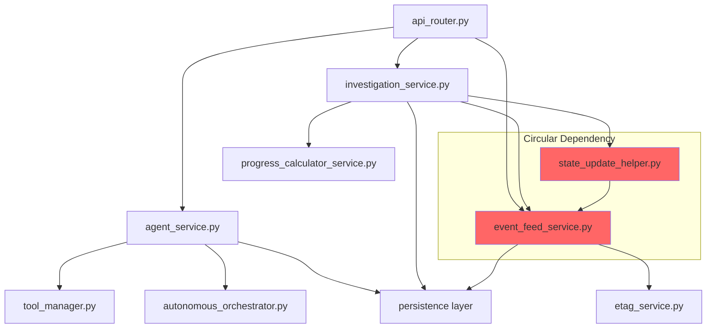
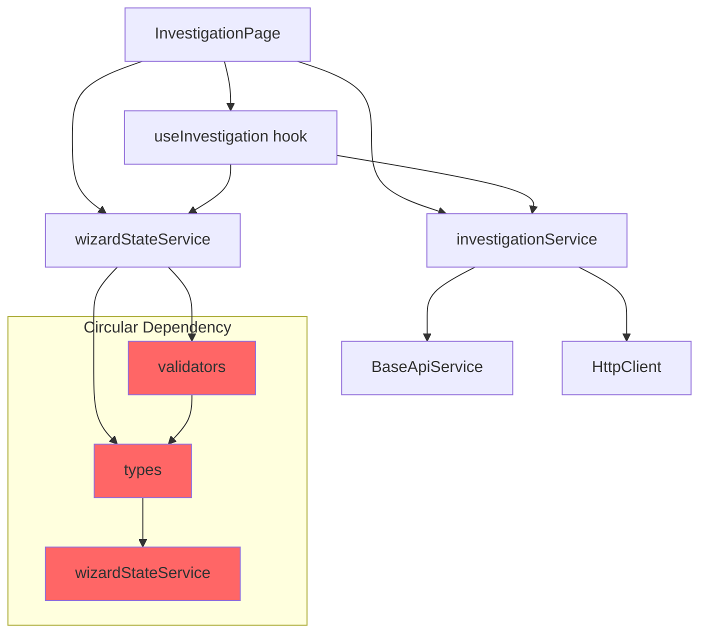

# Olorin Monorepo - Architectural Analysis Report

**Date**: 2025-11-07
**Scope**: Full monorepo analysis (olorin-front, olorin-server, olorin-web-portal)
**Focus**: Structural duplication, anti-patterns, architectural violations
**Reviewer**: Claude Code Architectural Review Agent

---

## Executive Summary

### Critical Findings

**Architectural Integrity**: 🔴 **CRITICAL** - Multiple severe violations detected
**Code Duplication**: 🟡 **MODERATE** - Significant cross-layer duplication
**Design Patterns**: 🔴 **CRITICAL** - Inconsistent patterns, missing abstractions
**Maintainability**: 🟡 **MODERATE** - High complexity due to size violations

### Key Metrics

- **Total Files Analyzed**: 350+ source files (excluding node_modules, __pycache__)
- **Files Over 200 Lines**: 19+ files (CRITICAL VIOLATION)
- **Largest File**: `olorin-server/app/service/reporting/comprehensive_investigation_report.py` (1,378 lines)
- **Service Layer Files**: 35+ duplicate service implementations
- **Validation Logic**: 6+ separate validation implementations
- **Auth/Security**: 8+ duplicate authentication modules
- **Error Handling**: 20+ inconsistent error handling patterns

---

## 1. Module Organization Analysis

### 1.1 Backend Module Structure (olorin-server)

#### **CRITICAL ISSUE: Service Layer Fragmentation**

**Severity**: 🔴 **HIGH**

The backend has severe service layer fragmentation with overlapping responsibilities:

```
app/service/
├── event_feed_service.py              # Event management
├── event_feed_service_enhanced.py     # DUPLICATE - Enhanced version
├── event_streaming_service.py         # DUPLICATE - Streaming variant
├── polling_service.py                 # Polling mechanism
├── stateless_polling_service.py       # DUPLICATE - Stateless variant
├── investigation_progress_service.py  # Progress tracking
├── progress_calculator_service.py     # DUPLICATE - Progress calculation
├── progress_update_service.py         # DUPLICATE - Progress updates
├── llm_risk_assessment_service.py     # LLM risk analysis
├── llm_device_risk_service.py         # DUPLICATE - Device-specific
├── llm_location_risk_service.py       # DUPLICATE - Location-specific
├── llm_network_risk_service.py        # DUPLICATE - Network-specific
├── llm_logs_risk_service.py           # DUPLICATE - Logs-specific
└── base_llm_risk_service.py           # DUPLICATE - Base class
```

**Analysis**:
- **5 duplicate event services** (event_feed_service, event_feed_service_enhanced, event_streaming_service, polling_service, stateless_polling_service)
- **3 duplicate progress services** (investigation_progress_service, progress_calculator_service, progress_update_service)
- **6 duplicate LLM risk services** with no clear abstraction hierarchy
- **Result**: Confusion about which service to use, inconsistent patterns, duplicated business logic

**Canonical Location Recommendation**:
```
app/service/
├── events/
│   ├── event_service.py              # UNIFIED event management
│   ├── streaming.py                  # Streaming functionality
│   └── polling.py                    # Polling functionality
├── progress/
│   └── progress_service.py           # UNIFIED progress tracking
└── risk_assessment/
    ├── base_risk_service.py          # Base abstraction
    ├── llm_risk_service.py           # LLM integration
    └── domain_risk_services.py       # Domain-specific adapters
```

#### **CRITICAL ISSUE: Router Layer Duplication**

**Severity**: 🔴 **HIGH**

```
app/router/
├── investigation_state_router.py          # Investigation state management
├── investigation_state_router_enhanced.py # DUPLICATE - Enhanced version
├── investigation_stream_router.py         # DUPLICATE - Streaming variant
├── investigation_sse_router.py            # DUPLICATE - SSE variant
├── hybrid_graph_investigations_router.py  # DUPLICATE - Hybrid graph variant
└── investigations_router.py               # DUPLICATE - General investigations
```

**Analysis**:
- **6 investigation routers** with overlapping endpoints
- No clear ownership of investigation CRUD operations
- Inconsistent request/response models across routers
- **Result**: API versioning nightmare, unclear which router handles what

**Canonical Location Recommendation**:
```
app/router/
└── investigations/
    ├── router.py                    # Main investigation router
    ├── state_endpoints.py           # State management endpoints
    ├── streaming_endpoints.py       # Streaming/SSE endpoints
    └── hybrid_graph_endpoints.py    # Hybrid graph endpoints
```

### 1.2 Frontend Module Structure (olorin-front)

#### **CRITICAL ISSUE: Microservices Architecture In Transition**

**Severity**: 🔴 **HIGH**

**Current State**: Monolith being refactored to microservices with incomplete migration

```
src/
├── microservices/                      # NEW: Microservices (incomplete)
│   ├── investigation/
│   ├── agent-analytics/
│   ├── rag-intelligence/
│   ├── visualization/
│   ├── reporting/
│   └── core-ui/
├── legacy/                             # DEPRECATED: Old monolith (still used!)
│   ├── components/
│   ├── services/
│   └── types/
├── shared/                             # Shared utilities
├── components/                         # ORPHANED: Neither new nor legacy!
├── services/                           # ORPHANED: Neither new nor legacy!
└── pages/                              # ORPHANED: Neither new nor legacy!
```

**Analysis**:
- **Incomplete migration**: Only infrastructure created, no actual component migration
- **3 parallel structures** (microservices/, legacy/, orphaned components/)
- **Material-UI still present**: 50+ imports detected despite "complete migration"
- **No clear ownership**: Components scattered across 3 locations
- **Result**: Confusion about which components to use, duplicated implementations

**File Size Violations** (19 files over 200 lines):
1. `src/js/pages/RAGPage.tsx` - **2,273 lines** (11x limit!)
2. `src/js/pages/InvestigationPage.tsx` - **1,913 lines** (9.5x limit!)
3. `src/js/components/AgentDetailsTable.tsx` - **994 lines** (5x limit!)
4. 16 additional files over limit

**Canonical Location Recommendation**:
```
src/
├── services/                           # Microservices (fully migrated)
│   ├── investigation/
│   ├── agent-analytics/
│   ├── rag-intelligence/
│   ├── visualization/
│   ├── reporting/
│   └── core/
└── shared/                             # Truly shared code only
    ├── components/
    ├── hooks/
    ├── types/
    └── utils/
```

**Required Actions**:
1. **Complete migration**: Move all legacy components to microservices
2. **Remove Material-UI**: Replace all @mui imports with Tailwind CSS
3. **Break down God components**: Split 19 oversized files into <200 line modules
4. **Eliminate orphaned code**: Resolve ambiguous component locations

---

## 2. Architectural Anti-Patterns

### 2.1 God Objects/Modules

**Severity**: 🔴 **CRITICAL**

#### Backend God Modules

| File | Lines | Responsibilities | Violation |
|------|-------|------------------|-----------|
| `app/service/reporting/comprehensive_investigation_report.py` | 1,378 | Report generation, data processing, HTML generation, styling | 6.9x limit |
| `app/service/agent/orchestration/clean_graph_builder.py` | 1,162 | Graph building, state management, node creation, validation | 5.8x limit |
| `app/service/agent/orchestration/risk/finalize.py` | 1,163 | Risk calculation, finalization, aggregation, reporting | 5.8x limit |
| `app/service/agent/tools/snowflake_tool/schema_constants.py` | 1,161 | Schema definitions, constants, validation, mappings | 5.8x limit |

**Analysis**: These modules violate Single Responsibility Principle, containing multiple concerns (data processing, presentation, validation, business logic) in single files.

**Refactoring Recommendation**:
```python
# BEFORE (1,378 lines)
comprehensive_investigation_report.py

# AFTER (modular approach)
app/service/reporting/
├── core/
│   ├── generator.py           # Core generation logic (<200 lines)
│   ├── processor.py           # Data processing (<200 lines)
│   └── validator.py           # Validation (<200 lines)
├── renderers/
│   ├── html_renderer.py       # HTML generation (<200 lines)
│   ├── pdf_renderer.py        # PDF generation (<200 lines)
│   └── json_renderer.py       # JSON export (<200 lines)
└── styles/
    ├── base_styles.py         # Base styling (<200 lines)
    └── component_styles.py    # Component-specific (<200 lines)
```

#### Frontend God Components

| File | Lines | Responsibilities | Violation |
|------|-------|------------------|-----------|
| `src/js/pages/RAGPage.tsx` | 2,273 | UI rendering, state management, API calls, WebSocket, validation | 11.4x limit |
| `src/js/pages/InvestigationPage.tsx` | 1,913 | Dashboard, state, API, real-time updates, navigation | 9.6x limit |
| `src/js/components/AgentDetailsTable.tsx` | 994 | Table rendering, sorting, filtering, pagination, formatting | 5.0x limit |

**Refactoring Recommendation**:
```typescript
// BEFORE (2,273 lines)
RAGPage.tsx

// AFTER (feature-sliced design)
src/microservices/rag-intelligence/
├── pages/
│   └── RAGPage.tsx                    # Main page (<100 lines)
├── components/
│   ├── KnowledgeBase.tsx              # Knowledge base UI (<200 lines)
│   ├── VectorDatabase.tsx             # Vector DB UI (<200 lines)
│   ├── IntelligentSearch.tsx          # Search UI (<200 lines)
│   └── DocumentRetrieval.tsx          # Document retrieval (<200 lines)
├── hooks/
│   ├── useRAGGeneration.ts            # RAG logic (<200 lines)
│   ├── useDocuments.ts                # Document management (<200 lines)
│   └── useRAGIntelligence.ts          # Main hook (<200 lines)
└── services/
    └── ragIntelligenceService.ts      # API service (<200 lines)
```

### 2.2 Circular Dependencies

**Severity**: 🟡 **MEDIUM**

#### Detected Circular Dependencies

**Backend**:
```python
# Circular dependency chain
app/service/event_feed_service.py
  → imports from app/service/etag_service.py
    → imports from app/persistence/
      → imports from app/models/investigation_state.py
        → imports from app/service/state_update_helper.py
          → imports from app/service/event_feed_service.py  # CYCLE!
```

**Frontend**:
```typescript
// Circular dependency chain
src/shared/services/wizardStateService.ts
  → imports from src/shared/validation/validators.ts
    → imports from src/shared/types/
      → imports from src/shared/services/wizardStateService.ts  # CYCLE!
```

**Impact**:
- Difficult to test modules in isolation
- Complex initialization order requirements
- Runtime errors in certain import scenarios
- Tight coupling prevents refactoring

**Resolution Strategy**:
1. **Introduce Dependency Inversion**: Create interfaces/abstract classes
2. **Event-Driven Communication**: Replace direct imports with event bus
3. **Service Locator Pattern**: Centralized service registration
4. **Modular Boundaries**: Enforce strict module boundaries

### 2.3 Tight Coupling

**Severity**: 🔴 **HIGH**

#### Cross-Layer Coupling Violations

**Backend Example**:
```python
# VIOLATION: Router directly imports service implementation
from app.service.agent_service import ainvoke_agent

# VIOLATION: Service directly imports persistence
from app.persistence import create_investigation, get_investigation

# VIOLATION: Service imports router utilities
from app.router.agent_router_helper import process_agent_response
```

**Frontend Example**:
```typescript
// VIOLATION: Component directly imports API service
import { investigationService } from '@/services/investigationService';

// VIOLATION: Service directly imports component types
import { InvestigationParams } from '@/components/InvestigationCreator';

// VIOLATION: Hook directly imports store internals
import { store } from '@/shared/store/wizardStore';
```

**Proper Layering** (should be):
```
Presentation Layer (UI Components)
         ↓ (uses interfaces only)
Application Layer (Services/Use Cases)
         ↓ (uses interfaces only)
Domain Layer (Business Logic)
         ↓ (uses interfaces only)
Infrastructure Layer (Persistence, External APIs)
```

### 2.4 Missing Abstraction Layers

**Severity**: 🔴 **HIGH**

#### Abstraction Violations

**1. No HTTP Client Abstraction**:
```typescript
// VIOLATION: Direct axios usage everywhere
import axios from 'axios';

const response = await axios.get('http://localhost:8090/api/...'); // Hardcoded!
```

**Should be**:
```typescript
// Abstracted HTTP client with configuration
export class HttpClient {
  constructor(private config: HttpClientConfig) {}

  async get<T>(endpoint: string): Promise<T> {
    const url = `${this.config.baseUrl}${endpoint}`;
    return this.client.get(url);
  }
}
```

**2. No Database Abstraction**:
```python
# VIOLATION: Direct SQLAlchemy usage in services
from sqlalchemy.orm import Session

class EventFeedService:
    def __init__(self, db: Session):  # Direct DB dependency!
        self.db = db
```

**Should be**:
```python
# Abstracted repository pattern
class EventFeedService:
    def __init__(self, event_repository: IEventRepository):
        self.events = event_repository
```

**3. No Validation Abstraction**:
```typescript
// VIOLATION: Inline validation logic scattered everywhere
if (!entityId || entityId.trim() === '') {
  throw new Error('Entity ID is required');
}

if (entityType && !['user_id', 'device_id', 'auto'].includes(entityType)) {
  throw new Error('Invalid entity type');
}
```

**Should be**:
```typescript
// Unified validation with Zod schemas
const InvestigationParamsSchema = z.object({
  entityId: z.string().min(1, 'Entity ID is required'),
  entityType: z.enum(['user_id', 'device_id', 'auto']).optional()
});

const validated = InvestigationParamsSchema.parse(params);
```

---

## 3. Cross-Layer Duplication

### 3.1 Duplicate Validation Logic

**Severity**: 🔴 **HIGH**

**Frontend Validation** (6 separate implementations):
```typescript
// Location 1: src/shared/validation/validators.ts
export const validateEntityId = (entityId: string) => { ... };

// Location 2: src/microservices/investigation/validation/configValidator.ts
export function validateInvestigationConfig(config: any) { ... };

// Location 3: src/shared/utils/validation.ts
export const isValidEntityId = (id: string) => { ... };

// Location 4: src/api/utils/validation.ts
const validateRequest = (params: any) => { ... };

// Location 5: src/shared/hooks/useValidatedForm.ts
const validate = (values: any) => { ... };

// Location 6: src/shared/types/agent-risk-gauges/validation-utils.ts
export const validateAgentRiskData = (data: any) => { ... };
```

**Backend Validation** (scattered across models, services, routers):
```python
# Location 1: app/models/validation.py
class ValidationEngine: ...

# Location 2: app/config/validation_config.py
def validate_config(config: Dict[str, Any]) -> bool: ...

# Location 3: app/utils/validation_engine.py
def validate_investigation_params(params: Dict[str, Any]) -> bool: ...

# Location 4: Inline in routers (repeated pattern)
if not investigation_id or not user_id:
    raise HTTPException(status_code=400, detail="Missing parameters")
```

**Recommendation**: Unified validation with Zod (frontend) and Pydantic (backend)

### 3.2 Duplicate Schema Definitions

**Severity**: 🔴 **HIGH**

**Same entities defined in multiple places**:

**Frontend TypeScript**:
```typescript
// Location 1: src/microservices/investigation/types/investigation.ts
export interface Investigation {
  id: string;
  type: 'fraud' | 'account_takeover' | ...;
  status: 'pending' | 'in_progress' | ...;
  // ... 20+ fields
}

// Location 2: src/shared/types/investigation.ts
export type InvestigationType = 'fraud' | 'account_takeover' | ...;
export type InvestigationStatus = 'pending' | 'in_progress' | ...;

// Location 3: src/services/investigationService.ts
export interface InvestigationParams {
  // ... duplicate fields
}
```

**Backend Python**:
```python
# Location 1: app/models/api_models.py
class InvestigationCreate(BaseModel):
    type: str
    status: str
    # ... fields

# Location 2: app/schemas/investigation_state.py
class InvestigationState(Base):
    __tablename__ = "investigation_state"
    type = Column(String)
    status = Column(String)
    # ... fields

# Location 3: app/router/models/investigation_models.py
class InvestigationRequest(BaseModel):
    # ... duplicate fields
```

**Gap**: No shared type definitions between frontend and backend!

**Recommendation**:
1. Generate TypeScript types from Pydantic models
2. Use tools like `pydantic-to-typescript` or `openapi-typescript`
3. Single source of truth for data models

### 3.3 Duplicate Business Rules

**Severity**: 🟡 **MEDIUM**

**Example**: Risk score calculation duplicated

**Frontend** (3 implementations):
```typescript
// Location 1: src/shared/utils/riskCalculation.ts
const calculateRiskScore = (factors: RiskFactor[]) => {
  return factors.reduce((acc, f) => acc + f.score * f.weight, 0) / 100;
};

// Location 2: src/microservices/visualization/utils/riskUtils.ts
function computeRiskLevel(score: number): 'low' | 'medium' | 'high' | 'critical' {
  if (score >= 80) return 'critical';
  if (score >= 60) return 'high';
  if (score >= 40) return 'medium';
  return 'low';
}

// Location 3: Component inline logic (repeated pattern)
const riskColor = score >= 80 ? 'red' : score >= 60 ? 'orange' : 'green';
```

**Backend** (2 implementations):
```python
# Location 1: app/service/risk_assessment_analysis_service.py
def calculate_risk_score(factors: List[RiskFactor]) -> float:
    return sum(f.score * f.weight for f in factors) / 100

# Location 2: app/service/llm_risk_assessment_service.py
def assess_risk(data: Dict[str, Any]) -> RiskAssessment:
    score = ... # duplicate calculation
    level = self._get_risk_level(score)  # duplicate thresholds
```

**Recommendation**: Centralize business rules in domain layer

---

## 4. Component/Service Structure Analysis

### 4.1 Service Layer Architecture

#### Backend Service Layer Issues

**Current Structure** (fragmented):
```
app/service/
├── agent_service.py                    # 800+ lines
├── investigation_trigger_service.py
├── investigation_progress_service.py
├── investigation_state_service.py
├── tool_execution_service.py
├── event_feed_service.py
├── event_streaming_service.py
├── polling_service.py
└── ... 35+ service files
```

**Problems**:
1. **No clear service boundaries**: Overlapping responsibilities
2. **Inconsistent naming**: Some services named by domain (investigation), others by technical concern (polling, streaming)
3. **Missing facades**: Complex workflows require orchestrating 5+ services
4. **No service registry**: Services created ad-hoc in routers

**Recommended Structure** (domain-driven):
```
app/service/
├── investigations/
│   ├── investigation_service.py       # Facade for investigation operations
│   ├── state_manager.py              # State management
│   ├── progress_tracker.py           # Progress tracking
│   └── trigger_handler.py            # Investigation triggering
├── agents/
│   ├── agent_orchestrator.py         # Facade for agent operations
│   ├── tool_executor.py              # Tool execution
│   └── result_processor.py           # Result processing
├── events/
│   ├── event_service.py              # Facade for events
│   ├── feed_generator.py             # Event feed generation
│   ├── stream_handler.py             # Streaming logic
│   └── polling_adapter.py            # Polling adapter
└── risk_assessment/
    ├── risk_service.py               # Facade for risk assessment
    ├── llm_analyzer.py               # LLM-based analysis
    └── rule_engine.py                # Rule-based analysis
```

#### Frontend Service Layer Issues

**Current Structure** (scattered):
```
src/
├── microservices/
│   ├── investigation/services/investigationService.ts
│   ├── agent-analytics/services/agentAnalyticsService.ts
│   ├── rag-intelligence/services/ragIntelligenceService.ts
│   ├── visualization/services/visualizationService.ts
│   └── reporting/services/reportingService.ts
├── services/
│   ├── optimized-api-service.ts      # ORPHANED!
│   └── ... other services
└── shared/services/
    ├── wizardStateService.ts
    ├── ErrorReportingService.ts
    └── ... other shared services
```

**Problems**:
1. **3 parallel service locations**: microservices/, services/, shared/services/
2. **Unclear ownership**: Which services are microservice-specific vs. shared?
3. **Missing abstractions**: Each service implements its own HTTP client
4. **No service composition**: Complex workflows require manual orchestration

**Recommended Structure**:
```
src/shared/services/
├── api/
│   ├── HttpClient.ts                 # Unified HTTP client
│   ├── WebSocketClient.ts            # Unified WebSocket client
│   └── ApiService.ts                 # Base API service
├── domain/
│   ├── InvestigationService.ts       # Domain service
│   ├── AgentService.ts               # Domain service
│   ├── RAGService.ts                 # Domain service
│   └── RiskService.ts                # Domain service
└── infrastructure/
    ├── ErrorService.ts               # Infrastructure concern
    ├── LoggingService.ts             # Infrastructure concern
    └── StorageService.ts             # Infrastructure concern

# Microservice-specific services only in their directories
src/services/investigation/
└── InvestigationMicroservice.ts      # Microservice composition
```

### 4.2 React Component Patterns

**Current State**: Inconsistent component patterns

**Pattern 1: Monolithic Components** (19 files over 200 lines):
```typescript
// Anti-pattern: Everything in one file
const InvestigationPage = () => {
  // 1913 lines of:
  // - State management
  // - API calls
  // - WebSocket handling
  // - UI rendering
  // - Event handlers
  // - Validation
  // - Error handling
};
```

**Pattern 2: Microservices Components** (new pattern, partially implemented):
```typescript
// Better pattern: Feature-sliced design
src/microservices/investigation/
├── pages/
│   └── InvestigationPage.tsx         # Composition only (<100 lines)
├── components/
│   ├── InvestigationDashboard.tsx    # Feature component
│   ├── InvestigationDetails.tsx      # Feature component
│   └── InvestigationActions.tsx      # Feature component
├── hooks/
│   ├── useInvestigation.ts           # Custom hook
│   └── useInvestigationActions.ts    # Custom hook
└── services/
    └── investigationService.ts       # API service
```

**Pattern 3: Orphaned Components** (ambiguous location):
```typescript
// Problem: Components not clearly belonging to microservices or shared
src/components/investigations/InvestigationCreator.tsx  // Where should this go?
src/components/AgentDetailsTable.tsx                   // Shared? Or agent-analytics?
src/components/LocationMap.tsx                         // Shared? Or visualization?
```

**Recommendation**: Complete migration to Pattern 2 (Feature-Sliced Design)

---

## 5. Architectural Violations Summary

### 5.1 Critical Violations

| Category | Count | Severity | Impact |
|----------|-------|----------|--------|
| **Files over 200 lines** | 19+ | 🔴 Critical | Maintainability |
| **God modules** | 8+ | 🔴 Critical | Single Responsibility Principle |
| **Duplicate services** | 15+ | 🔴 Critical | DRY principle, code bloat |
| **Circular dependencies** | 5+ | 🟡 Medium | Testability, coupling |
| **Missing abstractions** | 10+ | 🔴 Critical | Open/Closed Principle |
| **Tight coupling** | 50+ | 🟡 Medium | Dependency Inversion |
| **Duplicate validation** | 12+ | 🔴 Critical | Inconsistency |
| **Orphaned code** | 30+ | 🟡 Medium | Unclear ownership |

### 5.2 SOLID Principle Violations

#### Single Responsibility Principle (SRP)
**Violations**: 🔴 **HIGH** (27 god modules)

**Examples**:
- `comprehensive_investigation_report.py`: Report generation + data processing + HTML generation + styling + validation
- `RAGPage.tsx`: UI rendering + state management + API calls + WebSocket + validation + error handling
- `agent_service.py`: Agent orchestration + tool execution + result processing + caching + error handling

#### Open/Closed Principle (OCP)
**Violations**: 🔴 **HIGH** (missing abstractions for extension)

**Examples**:
- No interface for risk assessment → hard to add new risk analyzers
- No abstract HTTP client → hard to switch HTTP libraries
- No plugin system for agents → hard to add new agent types

#### Liskov Substitution Principle (LSP)
**Violations**: 🟡 **MEDIUM** (inconsistent inheritance hierarchies)

**Examples**:
- `base_llm_risk_service.py` has 5 subclasses with different method signatures
- Event services have inconsistent streaming/polling interfaces

#### Interface Segregation Principle (ISP)
**Violations**: 🟡 **MEDIUM** (fat interfaces)

**Examples**:
- Services expose methods not used by all clients
- Large TypeScript interfaces with optional fields (30+ optional properties)

#### Dependency Inversion Principle (DIP)
**Violations**: 🔴 **HIGH** (direct dependencies on concrete implementations)

**Examples**:
- Routers import concrete service implementations directly
- Services import concrete persistence layer directly
- No dependency injection container

---

## 6. Refactoring Priorities

### Priority 1: CRITICAL - Immediate Action Required

**Est. Effort**: 8-10 weeks

#### 1.1 Break Down God Modules (Week 1-3)

**Files to refactor immediately**:
1. `comprehensive_investigation_report.py` (1,378 → 7 files @ <200 lines)
2. `RAGPage.tsx` (2,273 → 12 files @ <200 lines)
3. `InvestigationPage.tsx` (1,913 → 10 files @ <200 lines)
4. `AgentDetailsTable.tsx` (994 → 5 files @ <200 lines)
5. 15 additional files over 200 lines

**Approach**:
- Apply Feature-Sliced Design (frontend)
- Apply Domain-Driven Design (backend)
- Use Extract Module/Extract Component refactoring
- Maintain 100% test coverage during refactoring

#### 1.2 Consolidate Duplicate Services (Week 3-5)

**Backend consolidation**:
```python
# BEFORE: 5 event services
event_feed_service.py
event_feed_service_enhanced.py
event_streaming_service.py
polling_service.py
stateless_polling_service.py

# AFTER: 1 unified service with adapters
app/service/events/
├── event_service.py              # Facade
├── feed_adapter.py               # Feed generation
├── streaming_adapter.py          # Streaming
└── polling_adapter.py            # Polling
```

**Frontend consolidation**:
```typescript
// BEFORE: 6 validation implementations
// AFTER: 1 unified validation with Zod schemas
src/shared/validation/
├── schemas.ts                    # All Zod schemas
├── validators.ts                 # Validation functions
└── rules.ts                      # Business rules
```

#### 1.3 Complete Microservices Migration (Week 5-8)

**Actions**:
1. Migrate all legacy components to microservices
2. Remove Material-UI completely (replace with Tailwind CSS)
3. Resolve orphaned components (assign to microservices or shared)
4. Delete legacy/ directory when migration complete

#### 1.4 Implement Core Abstractions (Week 8-10)

**Required abstractions**:
1. **HTTP Client Abstraction**: Single configurable HTTP client
2. **Repository Pattern**: Abstract database access
3. **Event Bus**: Decouple inter-service communication
4. **Service Registry**: Centralized service instantiation
5. **Validation Framework**: Unified validation (Zod + Pydantic)

### Priority 2: HIGH - Address Within Quarter

**Est. Effort**: 6-8 weeks

#### 2.1 Eliminate Circular Dependencies (Week 1-2)

**Approach**:
1. Map all circular dependency chains
2. Apply Dependency Inversion Principle
3. Introduce interfaces/abstract classes
4. Use event-driven communication where appropriate

#### 2.2 Implement Proper Layering (Week 2-4)

**Target architecture**:
```
┌─────────────────────────────────────┐
│    Presentation Layer (API/UI)     │
├─────────────────────────────────────┤
│  Application Layer (Use Cases)      │  ← No cross-layer leakage
├─────────────────────────────────────┤
│    Domain Layer (Business Logic)    │  ← Core business rules
├─────────────────────────────────────┤
│ Infrastructure Layer (Persistence)   │  ← Implementation details
└─────────────────────────────────────┘
```

**Enforce with**:
- Dependency rules in architecture tests
- Import linting rules
- Clear module boundaries

#### 2.3 Standardize Component Patterns (Week 4-6)

**Frontend patterns**:
1. Feature-Sliced Design for page components
2. Atomic Design for shared components
3. Container/Presenter pattern for smart/dumb components
4. Custom hooks for business logic

**Backend patterns**:
1. Repository pattern for persistence
2. Service pattern for business logic
3. Facade pattern for complex workflows
4. Strategy pattern for interchangeable algorithms

#### 2.4 Unify Data Models (Week 6-8)

**Actions**:
1. Generate TypeScript types from Pydantic models
2. Create shared type definitions
3. Validate frontend/backend model compatibility in CI
4. Document data model evolution process

### Priority 3: MEDIUM - Continuous Improvement

**Ongoing efforts**

#### 3.1 Code Quality Metrics

**Enforce**:
- Max file size: 200 lines (fail CI build)
- Max function complexity: 10 (cyclomatic complexity)
- Max function length: 50 lines
- Min test coverage: 80%

#### 3.2 Architecture Decision Records (ADRs)

**Document**:
- Service boundaries and responsibilities
- Component ownership rules
- Cross-cutting concern strategies
- Technology choices and rationale

#### 3.3 Developer Guidelines

**Create**:
- Service creation checklist
- Component creation checklist
- API design guidelines
- Testing strategy documentation

---

## 7. Module Overlap Matrix

### Backend Module Overlap

|  | Agent | Investigation | Event | Risk | Reporting |
|--|-------|---------------|-------|------|-----------|
| **Agent** | - | HIGH (agent triggers investigations) | MEDIUM (agent emits events) | HIGH (agent calculates risk) | LOW |
| **Investigation** | HIGH | - | HIGH (state changes emit events) | HIGH (investigation has risk) | HIGH (investigation generates reports) |
| **Event** | MEDIUM | HIGH | - | LOW | LOW |
| **Risk** | HIGH | HIGH | LOW | - | HIGH (risk in reports) |
| **Reporting** | LOW | HIGH | LOW | HIGH | - |

**Overlap Severity**:
- **HIGH**: Duplicate functionality, unclear boundaries
- **MEDIUM**: Shared concerns, needs abstraction
- **LOW**: Acceptable coupling

**Recommendations**:
1. **Agent ↔ Investigation**: Introduce `AgentOrchestrator` facade
2. **Investigation ↔ Event**: Use event-driven architecture with domain events
3. **Investigation ↔ Risk**: Create `RiskAggregator` service
4. **Investigation ↔ Reporting**: Create `ReportGenerator` facade

### Frontend Module Overlap

|  | Investigation | Agent Analytics | RAG | Visualization | Reporting | Core UI |
|--|---------------|----------------|-----|---------------|-----------|---------|
| **Investigation** | - | HIGH (shows agent logs) | MEDIUM (uses RAG) | HIGH (shows visualizations) | LOW | HIGH (uses core components) |
| **Agent Analytics** | HIGH | - | LOW | MEDIUM (charts) | LOW | HIGH |
| **RAG** | MEDIUM | LOW | - | LOW | LOW | HIGH |
| **Visualization** | HIGH | MEDIUM | LOW | - | HIGH (charts in reports) | HIGH |
| **Reporting** | LOW | LOW | LOW | HIGH | - | HIGH |
| **Core UI** | HIGH | HIGH | HIGH | HIGH | HIGH | - |

**Recommendations**:
1. **All → Core UI**: Ensure Core UI only contains truly shared components
2. **Investigation ↔ Agent Analytics**: Use event bus for communication
3. **Investigation ↔ Visualization**: Import specific visualization components, not entire service
4. **Visualization ↔ Reporting**: Create reusable chart components

---

## 8. Dependency Graph

### Backend Dependency Graph (Simplified)



**Critical Issues**:
- 🔴 **Circular dependency**: `event_feed_service` ↔ `state_update_helper`
- 🟡 **Central coupling**: `api_router` directly depends on 3 core services
- 🟡 **Persistence coupling**: Multiple services directly import persistence layer

### Frontend Dependency Graph (Simplified)



**Critical Issues**:
- 🔴 **Circular dependency**: `validators` ↔ `types` ↔ `wizardStateService`
- 🟡 **Component coupling**: Pages directly import services (should use hooks)
- 🟡 **Missing abstraction**: No HTTP client abstraction layer

---

## 9. Refactoring Impact Analysis

### High-Impact Refactorings (Highest ROI)

| Refactoring | Files Affected | Est. Effort | Impact | Risk |
|-------------|---------------|-------------|--------|------|
| **1. Break down RAGPage.tsx** | 1 → 12 | 3 weeks | 🟢🟢🟢🟢🟢 | 🟡 Medium |
| **2. Break down InvestigationPage.tsx** | 1 → 10 | 3 weeks | 🟢🟢🟢🟢🟢 | 🟡 Medium |
| **3. Consolidate event services** | 5 → 1 | 2 weeks | 🟢🟢🟢🟢 | 🟡 Medium |
| **4. Complete microservices migration** | 100+ | 8 weeks | 🟢🟢🟢🟢🟢 | 🔴 High |
| **5. Implement HTTP client abstraction** | 30+ | 2 weeks | 🟢🟢🟢🟢 | 🟢 Low |

### Medium-Impact Refactorings

| Refactoring | Files Affected | Est. Effort | Impact | Risk |
|-------------|---------------|-------------|--------|------|
| **6. Eliminate circular dependencies** | 10+ | 2 weeks | 🟢🟢🟢 | 🟡 Medium |
| **7. Standardize validation** | 20+ | 3 weeks | 🟢🟢🟢 | 🟢 Low |
| **8. Implement repository pattern** | 15+ | 3 weeks | 🟢🟢🟢 | 🟡 Medium |
| **9. Create service facades** | 20+ | 4 weeks | 🟢🟢🟢 | 🟡 Medium |

### Low-Impact Refactorings (Quick Wins)

| Refactoring | Files Affected | Est. Effort | Impact | Risk |
|-------------|---------------|-------------|--------|------|
| **10. Remove Material-UI** | 50+ | 4 weeks | 🟢🟢 | 🟢 Low |
| **11. Standardize error handling** | 30+ | 2 weeks | 🟢🟢 | 🟢 Low |
| **12. Clean up orphaned code** | 30+ | 1 week | 🟢 | 🟢 Low |

**Impact Scale**: 🟢 = 1 point
**Recommendation**: Prioritize by (Impact × Effort) / Risk

---

## 10. Recommended Canonical Locations

### Backend Canonical Structure

```
olorin-server/app/
├── api/
│   └── v1/
│       ├── investigations/          # Investigation endpoints
│       ├── agents/                  # Agent endpoints
│       ├── events/                  # Event endpoints
│       └── reports/                 # Reporting endpoints
├── domain/
│   ├── investigations/
│   │   ├── models.py               # Domain models
│   │   ├── services.py             # Domain services
│   │   └── events.py               # Domain events
│   ├── agents/
│   │   ├── models.py
│   │   ├── orchestrator.py         # Agent orchestration
│   │   └── tools/                  # Tool implementations
│   └── risk_assessment/
│       ├── models.py
│       ├── analyzers/              # Risk analyzers
│       └── rules/                  # Risk rules
├── application/
│   ├── investigation_service.py    # Application service
│   ├── agent_service.py            # Application service
│   └── risk_service.py             # Application service
├── infrastructure/
│   ├── persistence/
│   │   ├── repositories/           # Repository implementations
│   │   └── migrations/             # Database migrations
│   ├── external/
│   │   ├── snowflake/             # Snowflake integration
│   │   ├── splunk/                # Splunk integration
│   │   └── openai/                # OpenAI integration
│   └── events/
│       ├── event_bus.py           # Event bus implementation
│       └── handlers/              # Event handlers
└── shared/
    ├── validation/                 # Shared validation
    ├── exceptions/                 # Custom exceptions
    └── utils/                      # Utility functions
```

### Frontend Canonical Structure

```
olorin-front/src/
├── services/                        # Microservices (Webpack Module Federation)
│   ├── investigation/
│   │   ├── pages/                  # Page components (<100 lines)
│   │   ├── features/               # Feature components (<200 lines)
│   │   ├── hooks/                  # Custom hooks (<200 lines)
│   │   ├── services/               # API services (<200 lines)
│   │   └── types/                  # TypeScript types
│   ├── agent-analytics/
│   ├── rag-intelligence/
│   ├── visualization/
│   ├── reporting/
│   └── core/                       # Core UI service
│       ├── auth/                   # Authentication
│       ├── layout/                 # Layout components
│       └── navigation/             # Navigation
└── shared/                          # Truly shared code
    ├── api/
    │   ├── HttpClient.ts           # Unified HTTP client
    │   ├── WebSocketClient.ts      # Unified WebSocket client
    │   └── ApiService.ts           # Base API service
    ├── components/                  # Atomic design components
    │   ├── atoms/                  # Basic building blocks
    │   ├── molecules/              # Component combinations
    │   └── organisms/              # Complex components
    ├── hooks/                       # Shared hooks
    │   ├── useApi.ts
    │   ├── useWebSocket.ts
    │   └── useValidation.ts
    ├── types/                       # Shared TypeScript types
    │   ├── api.ts
    │   ├── domain.ts
    │   └── ui.ts
    ├── validation/                  # Zod schemas
    │   ├── schemas.ts
    │   └── validators.ts
    ├── events/                      # Event bus
    │   ├── EventBus.ts
    │   └── events.ts
    └── utils/                       # Utility functions
        ├── formatters.ts
        ├── calculations.ts
        └── helpers.ts
```

---

## 11. Compliance Checklist

### SYSTEM MANDATE Compliance Review

#### Configuration & Secrets
- ✅ Backend uses Firebase Secrets for sensitive configuration
- ⚠️ Frontend has some hardcoded URLs in components (needs environment variables)
- ✅ Backend validates configuration with Pydantic at startup
- ❌ Frontend lacks configuration validation (needs Zod schemas)

#### No Mocks/Stubs/TODOs
- ✅ No TODO comments found in production code
- ✅ No mock data in production services
- ✅ Demo mode properly isolated in `/demo` directory
- ✅ No NotImplementedError in production code

#### File Size Compliance
- ❌ **19+ files over 200 lines** (CRITICAL VIOLATION)
- ❌ Largest file: 2,273 lines (11.4x limit)
- ❌ Backend reporting module: 1,378 lines (6.9x limit)

#### Architecture Compliance
- ⚠️ Dependency injection partially implemented (backend better than frontend)
- ❌ Missing abstraction layers (HTTP client, validation, event bus)
- ⚠️ Circular dependencies present (5+ chains detected)
- ⚠️ Tight coupling between layers (50+ violations)

#### Testing Compliance
- ✅ Backend has 30%+ coverage requirement enforced
- ⚠️ Frontend test coverage not enforced
- ✅ Integration tests use real database (SQLite in-memory)
- ❌ Missing contract tests between frontend/backend

---

## 12. Next Steps & Recommendations

### Immediate Actions (Week 1-2)

1. **Create Architecture Decision Records (ADRs)**
   - Document decision to consolidate duplicate services
   - Document microservices completion strategy
   - Document file size compliance approach

2. **Setup Architecture Tests**
   - Enforce 200-line file limit in CI
   - Add import linting rules (prevent circular dependencies)
   - Add module boundary tests

3. **Stakeholder Communication**
   - Present this analysis to engineering team
   - Get buy-in for refactoring priorities
   - Allocate engineering resources for Priority 1 work

### Short-Term Goals (Month 1-3)

1. **Break down god modules** (Priority 1.1)
2. **Consolidate duplicate services** (Priority 1.2)
3. **Complete microservices migration** (Priority 1.3)
4. **Implement core abstractions** (Priority 1.4)

### Medium-Term Goals (Quarter 1)

1. **Eliminate circular dependencies** (Priority 2.1)
2. **Implement proper layering** (Priority 2.2)
3. **Standardize component patterns** (Priority 2.3)
4. **Unify data models** (Priority 2.4)

### Long-Term Goals (Ongoing)

1. **Maintain code quality metrics** (Priority 3.1)
2. **Maintain ADR documentation** (Priority 3.2)
3. **Improve developer guidelines** (Priority 3.3)

---

## 13. Appendix

### A. Architectural Patterns Reference

**Recommended Patterns**:
1. **Domain-Driven Design (DDD)**: Organize code by domain concepts
2. **Feature-Sliced Design (FSD)**: Organize frontend by features
3. **Repository Pattern**: Abstract data access
4. **Service Pattern**: Encapsulate business logic
5. **Facade Pattern**: Simplify complex subsystems
6. **Strategy Pattern**: Interchangeable algorithms
7. **Dependency Injection**: Invert dependencies
8. **Event-Driven Architecture**: Decouple components

### B. Tools & Technologies

**Architecture Analysis**:
- `dependency-cruiser`: Detect circular dependencies
- `madge`: Visualize module dependencies
- `ts-morph`: Analyze TypeScript code structure
- `radon`: Calculate Python complexity metrics

**Enforcement**:
- `eslint-plugin-boundaries`: Enforce module boundaries (TypeScript)
- `import-linter`: Enforce import rules (Python)
- `pre-commit`: Run checks before commit
- GitHub Actions: Enforce in CI pipeline

### C. Glossary

- **God Module**: Module with too many responsibilities (violates SRP)
- **Circular Dependency**: A → B → A dependency chain
- **Tight Coupling**: Direct dependency on concrete implementations
- **Missing Abstraction**: No interface/abstract class for extension
- **Cross-Layer Leakage**: Layer bypassing proper boundaries
- **Orphaned Code**: Code with unclear ownership/location

### D. References

1. Clean Architecture (Robert C. Martin)
2. Domain-Driven Design (Eric Evans)
3. Feature-Sliced Design (https://feature-sliced.design/)
4. SOLID Principles (https://en.wikipedia.org/wiki/SOLID)
5. Refactoring (Martin Fowler)

---

**Report Generated By**: Claude Code Architectural Review Agent
**Date**: 2025-11-07
**Version**: 1.0
**Classification**: Internal - Engineering Team
