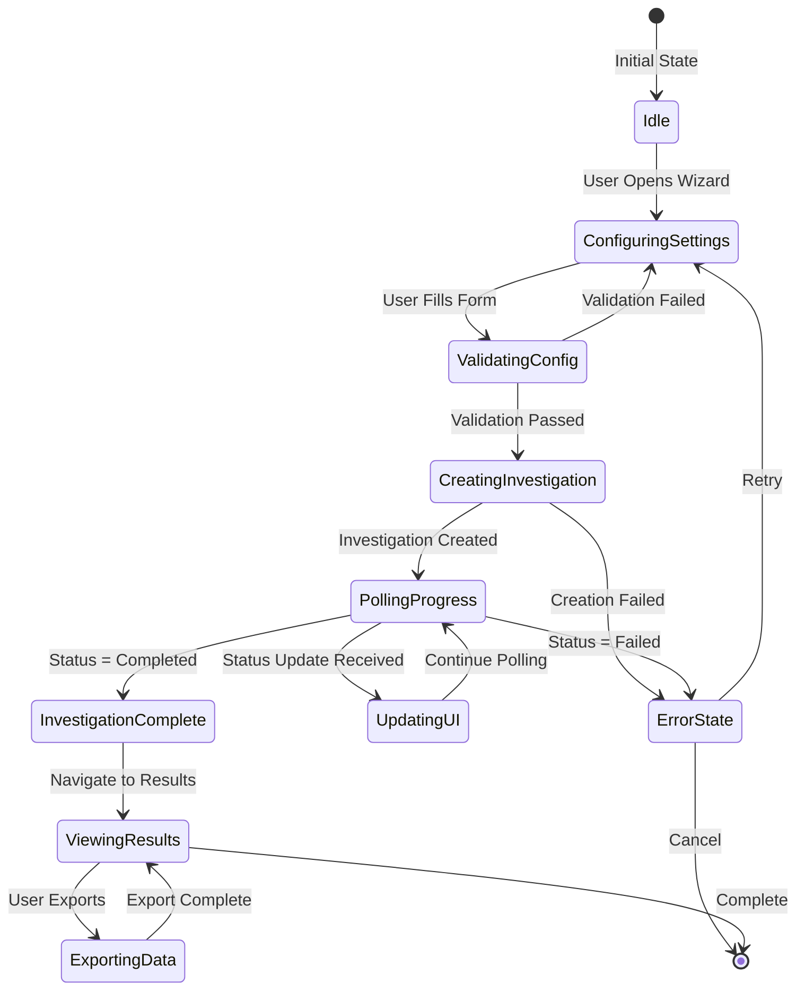
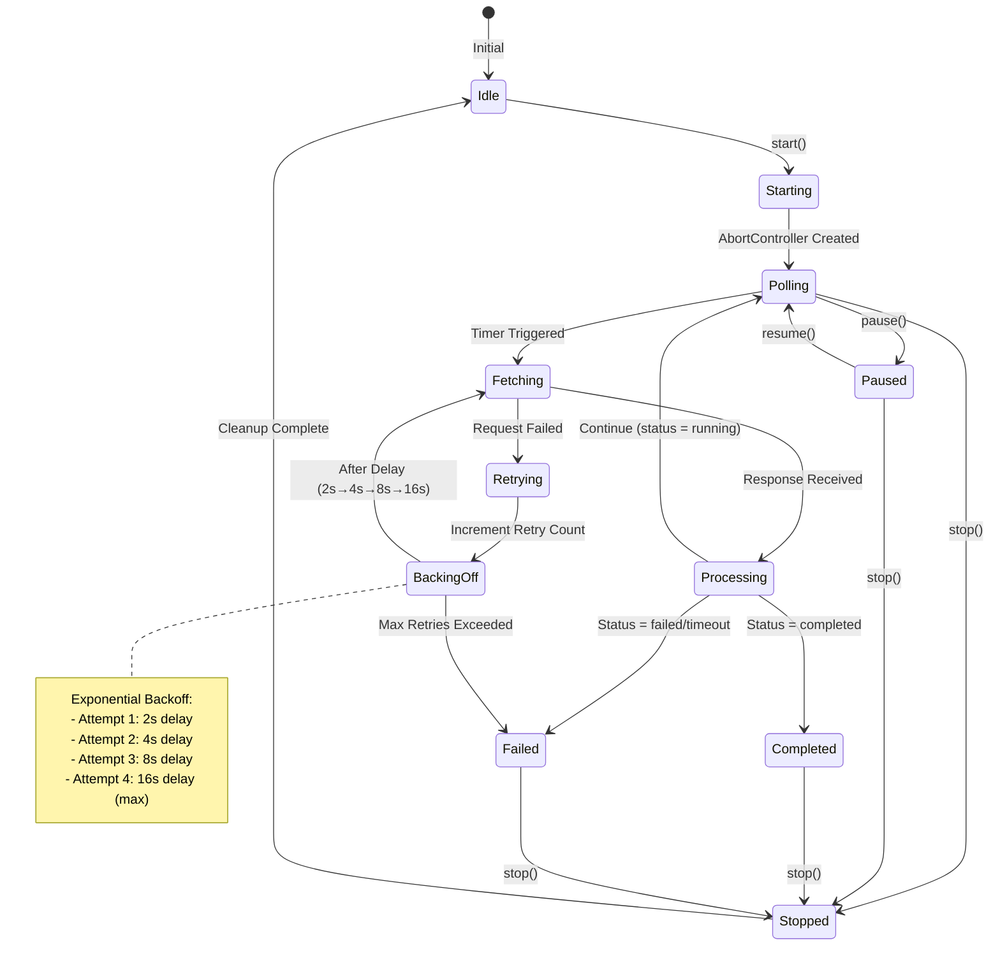
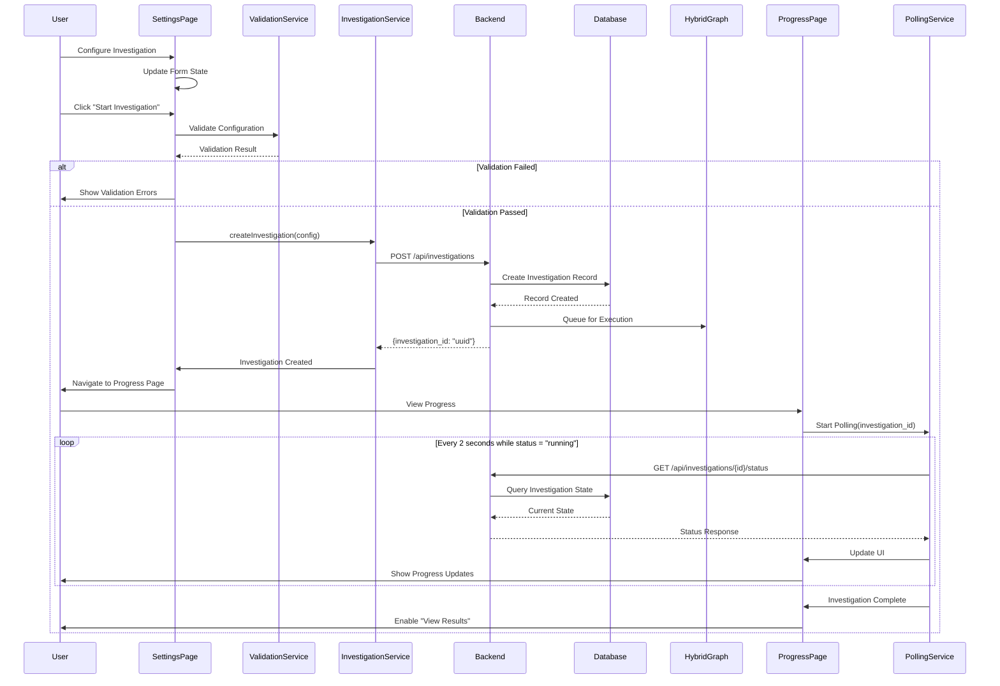
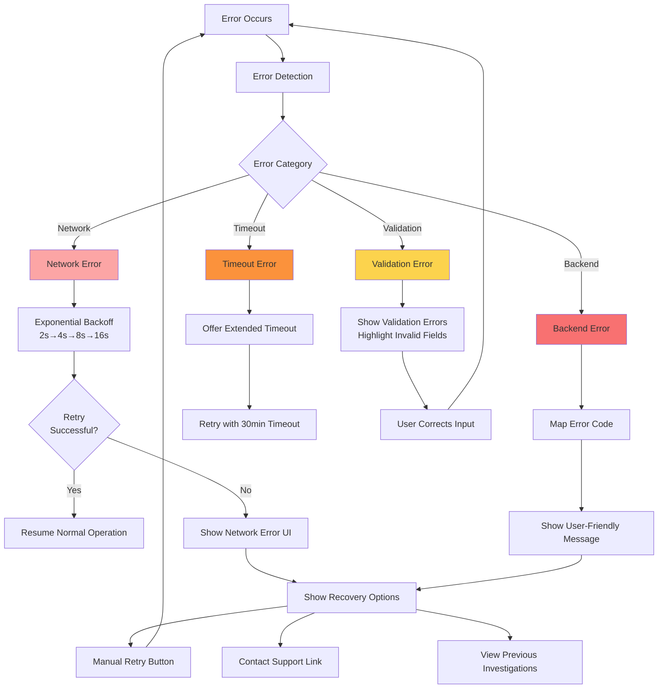
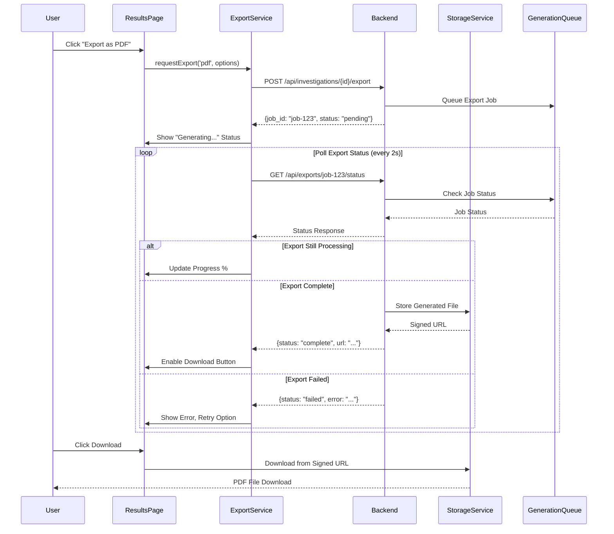

# HYBRID GRAPH INTEGRATION - TECHNICAL ARCHITECTURE

**Feature**: 006-hybrid-graph-integration
**Author**: Gil Klainert
**Date**: 2025-01-21
**Status**: Architecture Design Complete

## Executive Summary

This document defines the technical architecture for integrating the Hybrid Graph investigation system with the frontend wizard interface. The architecture enables configuration-driven investigations through a 3-page wizard flow (Settings → Progress → Results) with real-time polling-based status updates.

## 1. COMPONENT HIERARCHY

```mermaid
graph TB
    subgraph "Frontend Components"
        WizardContainer[Wizard Container]
        WizardContainer --> SettingsPage[Settings Page<br/>< 200 lines]
        WizardContainer --> ProgressPage[Progress Page<br/>< 200 lines]
        WizardContainer --> ResultsPage[Results Page<br/>< 200 lines]

        subgraph "Settings Components"
            SettingsPage --> EntitySelector[Entity Selector<br/>< 50 lines]
            SettingsPage --> TimeRangePicker[Time Range Picker<br/>< 80 lines]
            SettingsPage --> ToolMatrix[Tool Matrix<br/>< 150 lines]
            SettingsPage --> ValidationPanel[Validation Panel<br/>< 100 lines]
        end

        subgraph "Progress Components"
            ProgressPage --> ProgressBar[Progress Bar<br/>< 50 lines]
            ProgressPage --> PhaseIndicator[Phase Indicator<br/>< 100 lines]
            ProgressPage --> LogStream[Log Stream<br/>< 150 lines]
            ProgressPage --> ToolTimeline[Tool Timeline<br/>< 150 lines]
            ProgressPage --> AgentStatus[Agent Status<br/>< 100 lines]
        end

        subgraph "Results Components"
            ResultsPage --> RiskGauge[Risk Gauge<br/>< 100 lines]
            ResultsPage --> FindingsGrid[Findings Grid<br/>< 150 lines]
            ResultsPage --> EvidencePanel[Evidence Panel<br/>< 150 lines]
            ResultsPage --> ExportControls[Export Controls<br/>< 80 lines]
        end
    end

    subgraph "Services Layer"
        InvestigationService[Investigation Service<br/>< 150 lines]
        PollingService[Polling Service<br/>< 150 lines]
        StorageService[Storage Service<br/>< 100 lines]
        ExportService[Export Service<br/>< 100 lines]
    end

    subgraph "State Management"
        WizardStore[Wizard Store<br/>(Zustand)]
        InvestigationCache[Investigation Cache<br/>(localStorage)]
    end

    SettingsPage --> InvestigationService
    ProgressPage --> PollingService
    ResultsPage --> ExportService
    InvestigationService --> WizardStore
    PollingService --> WizardStore
    StorageService --> InvestigationCache
```

## 2. STATE FLOW DIAGRAM



## 3. POLLING SERVICE STATE MACHINE



## 4. DATA FLOW: User Investigation Creation



## 5. DATABASE SCHEMA (Schema-Locked)

**Table: investigation_states**

```sql
-- EXISTING COLUMNS ONLY - NO DDL OPERATIONS
investigation_id    VARCHAR(255) PRIMARY KEY  -- UUID string
user_id            VARCHAR(255) NOT NULL     -- User identifier
lifecycle_stage    VARCHAR(50)  NOT NULL     -- CREATED|SETTINGS|IN_PROGRESS|COMPLETED
settings_json      TEXT                      -- Investigation configuration
progress_json      TEXT                      -- Current progress state
results_json       TEXT                      -- Final results
status             VARCHAR(50)  NOT NULL     -- CREATED|SETTINGS|IN_PROGRESS|COMPLETED|ERROR|CANCELLED
version            INTEGER      NOT NULL     -- Optimistic locking
created_at         TIMESTAMP    NOT NULL     -- Creation timestamp
updated_at         TIMESTAMP    NOT NULL     -- Last update timestamp
last_accessed      TIMESTAMP                 -- Last access timestamp

-- CONSTRAINTS (enforced at database level)
CHECK (lifecycle_stage IN ('CREATED', 'SETTINGS', 'IN_PROGRESS', 'COMPLETED'))
CHECK (status IN ('CREATED', 'SETTINGS', 'IN_PROGRESS', 'COMPLETED', 'ERROR', 'CANCELLED'))
CHECK (version >= 1)

-- INDEXES
INDEX idx_user_id ON investigation_states(user_id)
INDEX idx_lifecycle_stage ON investigation_states(lifecycle_stage)
INDEX idx_status ON investigation_states(status)
INDEX idx_updated_at ON investigation_states(updated_at)
```

**Schema Verification Script** (runs at application startup):

```python
def verify_investigation_states_schema():
    """Verify investigation_states table columns exist."""
    required_columns = [
        'investigation_id', 'user_id', 'lifecycle_stage',
        'settings_json', 'progress_json', 'results_json',
        'status', 'version', 'created_at', 'updated_at', 'last_accessed'
    ]

    # Query information_schema
    existing_columns = query("""
        SELECT column_name
        FROM information_schema.columns
        WHERE table_name = 'investigation_states'
    """)

    missing = set(required_columns) - set(existing_columns)
    if missing:
        raise RuntimeError(f"Missing columns: {missing}. Cannot start.")
```

## 6. API CONTRACT SUMMARY

### POST /api/investigations
**Purpose**: Create new hybrid graph investigation

**Request**:
```json
{
  "entity_type": "user",
  "entity_id": "user123@example.com",
  "time_range": {
    "start": "2024-01-14T00:00:00Z",
    "end": "2024-01-21T23:59:59Z"
  },
  "tools": [
    {
      "tool_id": "check_device_fingerprint",
      "enabled": true,
      "parameters": {}
    }
  ],
  "correlation_mode": "OR",
  "execution_mode": "parallel",
  "risk_threshold": 50
}
```

**Response** (201 Created):
```json
{
  "investigation_id": "550e8400-e29b-41d4-a716-446655440000"
}
```

### GET /api/investigations/{id}/status
**Purpose**: Poll investigation status (called every 2 seconds)

**Response** (200 OK):
```json
{
  "investigation_id": "550e8400-e29b-41d4-a716-446655440000",
  "status": "running",
  "current_phase": "Domain Analysis",
  "progress_percentage": 45,
  "estimated_completion_time": "2024-01-21T15:30:00Z",
  "risk_score": 67,
  "agent_status": {
    "Device Agent": {
      "status": "completed",
      "progress_percentage": 100,
      "tools_used": 3,
      "findings_count": 2,
      "execution_time_ms": 1250
    },
    "Location Agent": {
      "status": "running",
      "progress_percentage": 60,
      "tools_used": 1,
      "findings_count": 0,
      "execution_time_ms": null
    }
  },
  "tool_executions": [
    {
      "tool_id": "check_device_fingerprint",
      "tool_name": "Check Device Fingerprint",
      "status": "completed",
      "started_at": "2024-01-21T15:28:30Z",
      "completed_at": "2024-01-21T15:28:31Z",
      "duration_ms": 1000,
      "output_summary": "Device fingerprint verified",
      "error_message": null
    }
  ],
  "logs": [
    {
      "timestamp": "2024-01-21T15:28:30Z",
      "severity": "info",
      "source": "Device Agent",
      "message": "Starting device analysis",
      "metadata": {}
    }
  ]
}
```

### GET /api/investigations/{id}/results
**Purpose**: Fetch complete investigation results

**Response** (200 OK):
```json
{
  "investigation_id": "550e8400-e29b-41d4-a716-446655440000",
  "overall_risk_score": 72,
  "status": "completed",
  "started_at": "2024-01-21T15:28:00Z",
  "completed_at": "2024-01-21T15:35:00Z",
  "duration_ms": 420000,
  "findings": [
    {
      "finding_id": "finding-001",
      "severity": "critical",
      "domain": "device",
      "title": "Suspicious device fingerprint change",
      "description": "Device fingerprint changed 5 times in 24 hours",
      "affected_entities": ["user123@example.com", "device-ABC123"],
      "evidence_ids": ["ev-001", "ev-002"],
      "confidence_score": 0.92,
      "timestamp": "2024-01-21T15:29:00Z",
      "metadata": {}
    }
  ],
  "evidence": [
    {
      "evidence_id": "ev-001",
      "source": "snowflake.risk_entities",
      "evidence_type": "device_fingerprint",
      "data": {
        "fingerprint": "abc123def456",
        "change_frequency": 5,
        "period_hours": 24
      },
      "timestamp": "2024-01-21T12:00:00Z",
      "confidence_score": 0.95,
      "related_findings": ["finding-001"]
    }
  ],
  "summary": "High risk detected due to abnormal device behavior patterns"
}
```

### POST /api/investigations/{id}/export
**Purpose**: Generate export in specified format

**Request**:
```json
{
  "format": "pdf",
  "include_evidence": true,
  "include_logs": false
}
```

**Response** (200 OK):
```json
{
  "export_url": "https://storage.example.com/exports/investigation-550e8400.pdf",
  "expires_at": "2024-01-21T16:00:00Z"
}
```

### PATCH /api/investigations/{id}/control
**Purpose**: Control investigation execution (pause/stop)

**Request**:
```json
{
  "action": "pause"  // or "stop"
}
```

**Response** (200 OK):
```json
{
  "status": "paused",
  "message": "Investigation paused successfully"
}
```

## 7. ERROR HANDLING FLOW



## 8. EXPORT FUNCTIONALITY ARCHITECTURE



## 9. 200-LINE FILE SIZE COMPLIANCE

All files are designed to stay under 200 lines through modular architecture:

### Frontend Components (Target Sizes)
```
Settings Page Components:
- SettingsPage.tsx              180 lines (orchestration)
- EntitySelector.tsx              50 lines (entity type/ID selection)
- TimeRangePicker.tsx            80 lines (date range selection)
- ToolMatrixSelector.tsx        150 lines (tool configuration grid)
- ValidationPanel.tsx           100 lines (validation summary)

Progress Page Components:
- ProgressPage.tsx              180 lines (orchestration)
- InvestigationProgressBar.tsx   50 lines (overall progress)
- HybridGraphPhaseIndicator.tsx 100 lines (phase visualization)
- InvestigationLogStream.tsx    150 lines (real-time logs)
- ToolExecutionTimeline.tsx     150 lines (tool execution list)
- HybridGraphAgentStatus.tsx    100 lines (agent progress gauges)

Results Page Components:
- ResultsPage.tsx               180 lines (orchestration)
- RiskScoreGauge.tsx           100 lines (risk visualization)
- FindingsGrid.tsx             150 lines (findings display)
- EvidencePanel.tsx            150 lines (evidence details)
- ExportControls.tsx            80 lines (export buttons)

Service Layer:
- hybridGraphInvestigationService.ts  150 lines (API calls)
- hybridGraphPollingService.ts        150 lines (polling logic)
- localStorageService.ts              100 lines (persistence)
- exportService.ts                    100 lines (export handling)

State Management:
- wizardStore.ts                      150 lines (Zustand store)
- wizardStoreActions.ts               100 lines (store actions)
```

### Backend Components (Target Sizes)
```
Controllers:
- hybrid_graph_investigation_controller.py   180 lines
- hybrid_graph_status_controller.py         150 lines
- investigation_results_controller.py       150 lines

Services:
- investigation_polling_adapter.py           150 lines
- investigation_state_service.py            150 lines
- export_generation_service.py              150 lines

Models & Schemas:
- investigation_state.py                    100 lines
- investigation_config.py                    80 lines
- investigation_status.py                   100 lines
- investigation_results.py                  100 lines
```

## 10. CONFIGURATION-DRIVEN DESIGN

All configurable values are externalized to environment variables:

### Frontend Configuration
```typescript
// Environment Variables (via process.env)
export const config = {
  api: {
    baseUrl: process.env.REACT_APP_API_BASE_URL,
    timeout: Number(process.env.REACT_APP_REQUEST_TIMEOUT_MS),
  },
  polling: {
    interval: Number(process.env.REACT_APP_WIZARD_PROGRESS_UPDATE_INTERVAL_MS),
    maxRetries: Number(process.env.REACT_APP_POLLING_MAX_RETRIES),
    backoffMultiplier: Number(process.env.REACT_APP_POLLING_BACKOFF_MULTIPLIER),
    maxBackoff: Number(process.env.REACT_APP_POLLING_MAX_BACKOFF_MS),
  },
  investigation: {
    maxConcurrent: Number(process.env.REACT_APP_MAX_CONCURRENT_INVESTIGATIONS),
    defaultRiskThreshold: Number(process.env.REACT_APP_DEFAULT_RISK_THRESHOLD),
    timeoutMinutes: Number(process.env.REACT_APP_INVESTIGATION_TIMEOUT_MINUTES),
  },
  ui: {
    maxLogEntries: Number(process.env.REACT_APP_MAX_LOG_ENTRIES),
    maxFindings: Number(process.env.REACT_APP_MAX_FINDINGS),
    maxEvidence: Number(process.env.REACT_APP_MAX_EVIDENCE_PER_FINDING),
  },
  features: {
    enableHybridGraph: process.env.REACT_APP_FEATURE_ENABLE_HYBRID_GRAPH === 'true',
    enableMultiEntity: process.env.REACT_APP_FEATURE_ENABLE_MULTI_ENTITY === 'true',
    enableExport: process.env.REACT_APP_FEATURE_ENABLE_EXPORT === 'true',
  },
};
```

### Backend Configuration
```python
# Environment Variables (via pydantic)
from pydantic import BaseSettings, Field

class HybridGraphConfig(BaseSettings):
    feature_enabled: bool = Field(env="ENABLE_HYBRID_GRAPH")
    max_concurrent_investigations: int = Field(env="MAX_CONCURRENT_INVESTIGATIONS")
    investigation_timeout_seconds: int = Field(env="INVESTIGATION_TIMEOUT_SECONDS")
    polling_cache_ttl_seconds: int = Field(env="POLLING_CACHE_TTL_SECONDS")

    database_url: str = Field(env="DATABASE_URL")

    export_storage_bucket: str = Field(env="EXPORT_STORAGE_BUCKET")
    export_url_expiry_seconds: int = Field(env="EXPORT_URL_EXPIRY_SECONDS")

    class Config:
        env_file = ".env"
```

## 11. PERFORMANCE OPTIMIZATION STRATEGIES

### Frontend Optimizations
1. **Component Virtualization**: Use react-window for log streams (500+ entries)
2. **Lazy Loading**: Code-split pages with React.lazy()
3. **Memoization**: Use React.memo for expensive components
4. **Debouncing**: Debounce validation checks (500ms)
5. **Request Caching**: Cache status responses for 2 seconds

### Backend Optimizations
1. **Database Indexes**: Optimized indexes on user_id, status, updated_at
2. **JSON Field Optimization**: Store only changed fields in progress_json
3. **Pagination**: Limit log entries to 100 per response
4. **Caching**: Redis cache for frequently accessed investigations
5. **Async Processing**: Queue export generation jobs

### Polling Optimizations
1. **Adaptive Intervals**: Increase interval as investigation progresses
2. **Delta Updates**: Send only changed data in status responses
3. **Compression**: Gzip compression for large responses
4. **Connection Pooling**: Reuse HTTP connections
5. **AbortController**: Cancel in-flight requests on unmount

## 12. MONITORING & OBSERVABILITY

### Frontend Metrics
```typescript
// Track key user interactions
trackEvent('investigation.created', { entity_type, tool_count });
trackEvent('investigation.completed', { duration_ms, risk_score });
trackEvent('export.requested', { format, file_size });

// Performance metrics
trackMetric('polling.latency', latency_ms);
trackMetric('page.load_time', load_time_ms);
trackMetric('api.error_rate', error_count / total_requests);
```

### Backend Metrics
```python
# Track investigation lifecycle
metrics.counter('investigation.created', tags={'entity_type': entity_type})
metrics.histogram('investigation.duration', duration_ms)
metrics.gauge('investigations.active', active_count)

# Track polling performance
metrics.histogram('polling.response_time', response_time_ms)
metrics.counter('polling.cache_hits', tags={'hit': True})

# Track errors
metrics.counter('investigation.failures', tags={'error_type': error_type})
```

## Success Metrics

The architecture is designed to achieve these measurable outcomes:

- ✅ **Investigation Creation**: < 90 seconds from configuration to start
- ✅ **Polling Latency**: Maximum 2-second delay for status updates
- ✅ **Results Loading**: < 3 seconds for complete results (50+ findings)
- ✅ **Polling Reliability**: 99.5% uptime with automatic recovery
- ✅ **Workflow Success**: 95% completion rate without errors
- ✅ **Export Generation**: < 10 seconds for PDF reports
- ✅ **Error Recovery**: Graceful handling with user-friendly messages
- ✅ **Multi-Entity Support**: Up to 5 entities with correlation

## Compliance Checklist

- ✅ **No DDL Operations**: Schema-locked, read/write only to existing columns
- ✅ **Configuration-Driven**: All values externalized to environment variables
- ✅ **200-Line Files**: Modular architecture ensures file size compliance
- ✅ **No Hardcoded Values**: Validated configuration with fail-fast behavior
- ✅ **Error Boundaries**: Comprehensive error handling at every level
- ✅ **Performance Goals**: Achievable with caching and optimization strategies
- ✅ **API Contracts**: Complete request/response specifications
- ✅ **Monitoring**: Comprehensive metrics for observability

## Next Steps

1. **Backend Implementation**: Implement polling adapter and status controller
2. **Frontend Components**: Build Settings, Progress, and Results pages
3. **Integration Testing**: End-to-end testing of complete workflow
4. **Performance Testing**: Load testing with concurrent investigations
5. **Documentation**: API documentation and user guides

This architecture provides a solid foundation for implementing the Hybrid Graph Integration feature with production-grade quality and maintainability.