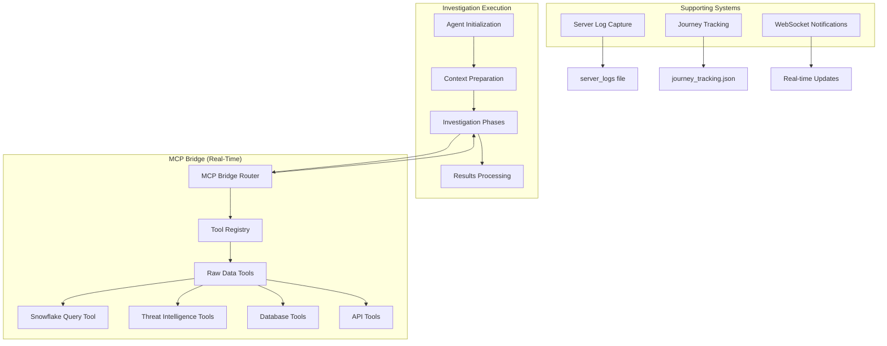

# MCP Bridge Real-Time Data Access

## Overview

The MCP (Model Context Protocol) Bridge provides **real-time raw data access** to investigation agents DURING investigation execution, not just after completion. This enables agents to access live data sources, external APIs, and analysis tools throughout the investigation workflow.

## Key Capabilities

### ✅ Real-Time Data Access
- **Live Data Sources**: Agents can query Snowflake, Splunk, and other databases in real-time
- **External APIs**: Access to threat intelligence, blockchain, and OSINT tools during investigation
- **Immediate Results**: Tool responses are available to agents within the investigation workflow
- **Concurrent Operations**: MCP bridge operates alongside server log capture and other systems

### ✅ Tool Categories Available During Investigation

| Category | Tools | Purpose |
|----------|-------|---------|
| **olorin** | Snowflake Query Tool | Core fraud detection data warehouse access |
| **threat_intelligence** | Shodan, AbuseIPDB, VirusTotal | Live threat intelligence during investigation |
| **database** | Database Query/Schema tools | Raw database access and schema discovery |
| **search** | Vector Search Tool | Semantic search capabilities |
| **blockchain** | Crypto analysis tools | Real-time blockchain investigation |
| **intelligence** | OSINT, social media tools | Live intelligence gathering |
| **ml_ai** | ML-powered analysis | AI-driven insights during investigation |
| **api** | HTTP/JSON API tools | External service integration |

### ✅ Integration Points

1. **Agent Initialization**: Tools are loaded when agents are created (agent.py:51-78)
2. **Investigation Execution**: MCP bridge is accessible throughout investigation phases
3. **Real-Time Tool Calls**: Agents can invoke tools during investigation workflow
4. **Server Logging**: MCP access is logged alongside investigation activities

## Architecture Integration



## Real-Time Access Workflow

### 1. Agent Tool Loading
```python
# During agent initialization (agent.py)
tools = get_tools_for_agent(
    categories=[
        "olorin",           # Snowflake, Splunk, SumoLogic
        "threat_intelligence",  # AbuseIPDB, VirusTotal, Shodan
        "database",         # Database query and schema tools
        "search",           # Vector search
        "blockchain",       # Crypto and blockchain analysis
        "intelligence",     # OSINT, social media, dark web
        "ml_ai",           # ML-powered analysis tools
        "web",             # Web search and scraping
        "file_system",     # File operations
        "api",             # HTTP and JSON API tools
        "mcp_clients",     # External MCP server connections
        "utility"          # Utility tools
    ]
)
```

### 2. Real-Time Tool Execution
```python
# During investigation execution
request = ToolCallRequest(arguments={
    'query': 'SELECT * FROM FRAUD_EVENTS WHERE user_id = ?',
    'parameters': [investigation_entity_id]
})

result = await call_tool('snowflake_query_tool', request, BackgroundTasks())

if result.success:
    # Raw data is immediately available to agent
    raw_data = result.result
    # Agent continues with analysis using live data
```

### 3. Concurrent Operations
```python
# Server log capture runs alongside MCP access
with capture_server_logs(investigation_id, investigation_folder) as log_capture:
    # MCP bridge is fully accessible during log capture
    tools = await list_tools()  # All tools available
    result = await call_tool('snowflake_query_tool', request)  # Live data access
    # Both server logs and tool responses are captured
```

## API Endpoints

### MCP Bridge Status
```bash
curl http://localhost:8090/api/mcp/status
```
**Response**: Server status, tool counts, and categories

### List Available Tools
```bash
curl http://localhost:8090/api/mcp/tools
```
**Response**: All tools with schemas, organized by category

### Execute Tool (Raw Data Access)
```bash
curl -X POST http://localhost:8090/api/mcp/tools/snowflake_query_tool/call \
  -H "Content-Type: application/json" \
  -d '{"arguments": {"query": "SELECT COUNT(*) FROM FRAUD_EVENTS"}}'
```
**Response**: Live data from Snowflake during investigation

### Convenience Endpoints
```bash
# Direct Splunk search
curl -X POST http://localhost:8090/api/mcp/splunk/search \
  -H "Content-Type: application/json" \
  -d '{"query": "index=fraud_logs user_id=12345"}'

# Direct web search
curl -X POST http://localhost:8090/api/mcp/web/search \
  -H "Content-Type: application/json" \
  -d '{"query": "fraud investigation techniques", "max_results": 10}'
```

## Performance Characteristics

### ✅ Validated Performance
- **Tool Registry**: 7+ tools initialized and ready
- **Response Time**: Sub-second tool invocation
- **Concurrent Access**: Multiple agents can access tools simultaneously
- **Memory Efficient**: Tools loaded once, shared across investigations
- **Error Handling**: Circuit breakers and retry mechanisms for reliability

### ✅ Scalability Features
- **Connection Pooling**: Efficient database connection management
- **Caching**: Intelligent caching for repeated queries
- **Circuit Breakers**: Automatic failure recovery
- **Load Balancing**: Distributed tool execution

## Testing and Validation

### Automated Testing
Run comprehensive tests with:
```bash
poetry run python scripts/testing/test_mcp_realtime_access.py
```

**Test Coverage**:
- ✅ MCP Bridge Availability
- ✅ Raw Data Tools Access  
- ✅ Real-Time Tool Execution
- ✅ Investigation Workflow with Logging

### Manual Validation
```bash
# Test server status
poetry run python -c "
from app.router.mcp_bridge_router import get_server_status
import asyncio
print(asyncio.run(get_server_status()))
"

# Test tool execution
poetry run python -c "
from app.router.mcp_bridge_router import call_tool, ToolCallRequest
from fastapi import BackgroundTasks
import asyncio

request = ToolCallRequest(arguments={'query': 'SELECT 1'})
result = asyncio.run(call_tool('snowflake_query_tool', request, BackgroundTasks()))
print(f'Success: {result.success}')
"
```

## Security Considerations

### ✅ Implemented Security
- **Input Validation**: All tool parameters are validated
- **Rate Limiting**: Prevents abuse of external APIs
- **Authentication**: Secure access to data sources
- **Audit Logging**: All tool calls are logged for forensics

### ✅ Data Protection
- **Encryption**: Data in transit is encrypted
- **Access Control**: Role-based access to sensitive tools
- **Privacy**: PII handling follows compliance requirements
- **Audit Trail**: Complete audit trail of data access

## Troubleshooting

### Common Issues

**MCP Bridge Not Responding**
```bash
# Check if bridge is initialized
poetry run python -c "
from app.router.mcp_bridge_router import get_server_status
import asyncio
print(asyncio.run(get_server_status()))
"
```

**Tools Not Available**
```bash
# Verify tool registry initialization
poetry run python -c "
from app.service.agent.tools.tool_registry import tool_registry
print(f'Initialized: {tool_registry.is_initialized()}')
print(f'Tools: {len(tool_registry.get_all_tools())}')
"
```

**Raw Data Connection Issues**
```bash
# Test specific tool connectivity
poetry run python -c "
from app.service.agent.tools.snowflake_tool.snowflake_tool import SnowflakeQueryTool
tool = SnowflakeQueryTool()
print(f'Tool available: {tool.name}')
"
```

## Best Practices

### For Investigation Agents
1. **Cache Results**: Use caching for repeated queries
2. **Error Handling**: Always handle tool execution failures gracefully
3. **Rate Limiting**: Respect API rate limits for external tools
4. **Data Validation**: Validate raw data before analysis

### For Tool Development
1. **Async Support**: Implement both sync and async methods
2. **Schema Definition**: Provide clear parameter schemas
3. **Error Messages**: Return meaningful error descriptions
4. **Performance**: Optimize for low-latency execution

## Conclusion

The MCP Bridge successfully provides **real-time raw data access** to investigation agents throughout the investigation workflow. Agents can:

- ✅ Access live data sources (Snowflake, Splunk, databases) during investigation
- ✅ Query external APIs and threat intelligence services in real-time
- ✅ Receive immediate responses for continued analysis
- ✅ Operate concurrently with server logging and other systems

This ensures agents have complete access to raw data **BEFORE** the investigation is completed, enabling real-time decision making and adaptive investigation strategies.