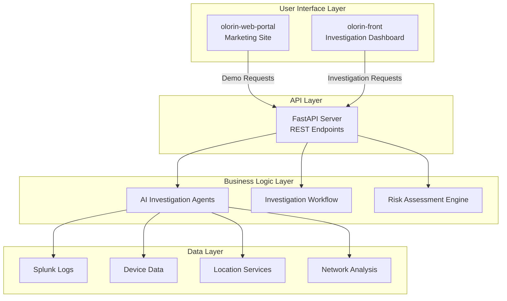

# Olorin System Overview

**Last Updated**: January 30, 2025  
**Version**: 2.0  
**Status**: Production Ready

## 🎯 Executive Summary

Olorin is a comprehensive fraud investigation platform that leverages artificial intelligence and machine learning to automate and enhance fraud detection workflows. The system provides real-time risk assessment, automated investigation tools, and comprehensive reporting capabilities for financial fraud prevention.

## 🏗️ System Architecture

The Olorin platform consists of three primary components working together to deliver a complete fraud investigation solution:

### 1. **olorin-server** (Backend Service)
**Technology Stack**: Python 3.11, FastAPI, Poetry  
**Primary Functions**:
- AI-powered investigation agents and risk assessment
- RESTful API endpoints for fraud analysis
- Investigation workflow management and coordination
- Real-time data processing and analysis
- Integration with external data sources (Splunk, device fingerprinting, location services)

**Key Features**:
- Multi-domain risk analysis (device, location, network, logs)
- LLM-powered risk assessment with natural language explanations
- Investigation state management and persistence
- Comprehensive logging and audit trails
- Production-ready with comprehensive test coverage

### 2. **olorin-front** (Frontend Application)
**Technology Stack**: React 18, TypeScript, Tailwind CSS  
**Primary Functions**:
- Interactive investigation dashboard and user interface
- Real-time risk visualization and reporting
- Investigation workflow management tools
- Agent communication and result display

**Key Features**:
- Modern, responsive UI design
- Real-time investigation status updates
- Risk assessment visualization with charts and graphs
- Investigation history and case management
- Configurable investigation parameters
- Export capabilities for reports and findings

### 3. **olorin-web-portal** (Marketing & Information Site)
**Technology Stack**: React 18, TypeScript, Next.js, Tailwind CSS  
**Primary Functions**:
- Product marketing and information portal
- Documentation access and developer resources
- Contact forms and lead generation
- Demo request functionality

**Key Features**:
- Modern, professional marketing design
- Responsive layout for all devices
- Contact form integration with email services
- Multi-language support (English, Spanish, French, German, Japanese)
- SEO optimization and fast loading times

## 🔄 System Integration Flow

## 📊 Data Flow Architecture

### Investigation Process Flow
1. **Initiation**: Investigation request received via olorin-front
2. **Data Collection**: Agents gather data from multiple sources
3. **Analysis**: AI-powered risk assessment across domains
4. **Aggregation**: Results combined into comprehensive risk profile
5. **Reporting**: Findings presented via dashboard with PDF export

### Risk Assessment Domains

| Domain | Data Sources | Analysis Type | Output |
|--------|-------------|---------------|---------|
| **Device** | Chronos, Device Intelligence | Behavioral patterns, anomaly detection | Device risk score + insights |
| **Location** | Vector search, location services | Geographic analysis, travel patterns | Location risk assessment |
| **Network** | Splunk logs, network data | Connection analysis, IP reputation | Network security assessment |
| **Logs** | Splunk SIEM, audit logs | Activity patterns, suspicious behavior | Log-based risk indicators |

## 🚀 Deployment Architecture

### Production Environment
- **Backend**: Containerized FastAPI service with gunicorn
- **Frontend**: Static build served via CDN
- **Portal**: SSG deployment for optimal performance
- **Database**: PostgreSQL for investigation persistence
- **Caching**: Redis for session and data caching
- **Monitoring**: Comprehensive logging and metrics collection

### Development Environment
- **Backend**: Local development with Poetry virtual environment
- **Frontend**: React development server with hot reload
- **Portal**: Next.js development server
- **Testing**: Comprehensive test suites with coverage reporting

## 🔐 Security & Compliance

### Authentication & Authorization
- Enterprise-grade authentication system
- Role-based access control (RBAC)
- Session management and secure token handling
- API key authentication for service-to-service communication

### Data Security
- Encryption at rest and in transit
- Secure configuration management
- Audit logging for all investigation activities
- Compliance with data privacy regulations

## 📈 Performance & Scalability

### Current Capabilities
- **Backend**: Handles concurrent investigations with sub-second response times
- **Frontend**: Optimized React application with lazy loading
- **Portal**: Static generation for maximum performance
- **Database**: Optimized queries with proper indexing

### Scalability Features
- Horizontal scaling support for backend services
- CDN-ready frontend deployments
- Efficient caching strategies
- Database optimization for large datasets

## 🛠️ Development & Maintenance

### Code Quality
- **Backend**: 1,050+ tests with comprehensive coverage
- **Frontend**: Component testing with Jest and React Testing Library
- **Portal**: End-to-end testing with Cypress
- **Code Standards**: TypeScript strict mode, ESLint, Prettier

### Documentation
- Comprehensive API documentation with OpenAPI specs
- Component documentation and style guides
- Deployment and operations guides
- Developer onboarding resources

## 🎯 Key Differentiators

1. **AI-Powered Analysis**: Advanced LLM integration for intelligent risk assessment
2. **Multi-Domain Approach**: Comprehensive analysis across device, location, network, and logs
3. **Real-Time Processing**: Immediate investigation results with detailed explanations  
4. **User-Friendly Interface**: olorinive dashboard design for both technical and non-technical users
5. **Production Ready**: Comprehensive testing, monitoring, and deployment capabilities

## 📋 System Requirements

### Minimum Requirements
- **Backend**: Python 3.11+, 8GB RAM, 4 CPU cores
- **Frontend**: Modern web browser with JavaScript enabled
- **Portal**: Static hosting with HTTPS support
- **Database**: PostgreSQL 12+, Redis 6+

### Recommended Requirements
- **Backend**: 16GB+ RAM, 8+ CPU cores for production workloads
- **Storage**: SSD storage for optimal database performance
- **Network**: High-bandwidth connection for real-time data processing
- **Monitoring**: Comprehensive logging and metrics collection setup

## 🔄 Maintenance & Updates

### Regular Updates
- Monthly security patches and dependency updates
- Quarterly feature releases with new investigation capabilities
- Annual major version releases with architectural improvements

### Monitoring & Support
- 24/7 system monitoring and alerting
- Comprehensive logging for troubleshooting
- Performance metrics and usage analytics
- User support and documentation maintenance

---

**For detailed component documentation, see:**
- [Olorin Server Architecture](olorin-architecture.md)
- [Olorin Frontend Architecture](olorin-front-architecture.md)  
- [Olorin Web Portal Architecture](olorin-web-portal-architecture.md)
