# 🚀 Vibe Coding with Cursor & VAN
## A Revolutionary Approach to AI-Assisted Development

---

## 📋 Lecture Outline

### Part I: Foundation (20 minutes)
1. **What is Vibe Coding?**
2. **The VAN Methodology**
3. **Cursor AI Integration**

### Part II: The VAN Framework (25 minutes)
4. **Visual Analysis Network Explained**
5. **Memory Bank System**
6. **Adaptive Context Management**

### Part III: Practical Implementation (30 minutes)
7. **Live Demo: Building with VAN**
8. **Real-world Case Study: OLORIN Project**
9. **Best Practices & Patterns**

### Part IV: Advanced Concepts (15 minutes)
10. **Scaling VAN Across Teams**
11. **Future of Vibe Coding**
12. **Q&A Session**

---

## 🎯 Slide 1: Opening Hook

### "What if coding felt like conducting an orchestra?"

```mermaid
graph TD
    You[👨‍💻 You] --> Cursor[🤖 Cursor AI]
    You --> VAN[🎯 VAN Mode]
    Cursor --> Code[💻 Code Generation]
    VAN --> Analysis[📊 Visual Analysis]
    Code --> Flow[🌊 Development Flow]
    Analysis --> Flow
    Flow --> Magic[✨ Vibe Coding Magic]
```



**The Promise:** Transform from mechanical typing to intuitive creation

---

## 🎯 Slide 2: The Problem We're Solving

### Traditional Development Pain Points:
- ❌ **Context Switching Fatigue** - Constant mental model rebuilding
- ❌ **Tool Fragmentation** - Multiple disconnected tools
- ❌ **Lost Flow State** - Interruptions break creative momentum
- ❌ **Repetitive Boilerplate** - Time spent on mundane tasks
- ❌ **Documentation Debt** - Knowledge trapped in individual minds

### The Vibe Coding Solution:
- ✅ **Seamless Context Preservation**
- ✅ **Unified Development Experience**
- ✅ **Flow State Optimization**
- ✅ **Intelligent Automation**
- ✅ **Living Documentation**

---

## 🎯 Slide 3: What is Vibe Coding?

### Core Philosophy:
> "Vibe Coding is the art of maintaining creative flow while leveraging AI to handle the mechanical aspects of development."

### Key Principles:
1. **Intuition-Driven Development** - Trust your instincts, let AI handle details
2. **Context Awareness** - Systems that understand your intent
3. **Flow State Preservation** - Minimize cognitive interruptions
4. **Adaptive Intelligence** - Tools that learn from your patterns
5. **Human-AI Symbiosis** - Collaboration, not replacement

### The "Vibe":
```
🧠 Human Creativity + 🤖 AI Precision = 🚀 Exponential Productivity
```

---

## 🎯 Slide 4: Enter VAN - Visual Analysis Network

### What is VAN?
VAN is a systematic approach to problem analysis that breaks down complex challenges into manageable, visual components.

### The VAN Process:

```mermaid
flowchart TD
    Start([Problem Statement]) --> V[📊 VISUAL Analysis]
    V --> A[🔍 ANALYSIS Phase]
    A --> N[🌐 NETWORK Mapping]
    N --> Plan[📋 Action Plan]
    Plan --> Implement[⚡ Implementation]
    Implement --> Review[🔄 Review & Adapt]
    Review --> V
```


### VAN Levels:
- **Level 1**: Simple, direct solutions (immediate implementation)
- **Level 2-4**: Complex problems requiring systematic breakdown
- **Level 5+**: Multi-system architectural challenges

---

## 🎯 Slide 5: VAN in Action - Real Example

### Problem: Authentication Issues in E2E Environment
```
Initial Issue: 401 Unauthorized errors
Frontend: Olorin_APIKey format
Backend: Expected different format
```

### VAN Analysis:
1. **VISUAL**: Map the authentication flow
2. **ANALYSIS**: Identify format mismatch
3. **NETWORK**: Understand system dependencies

### Solution Path:


**Result**: Seamless authentication with automatic user provisioning

---

## 🎯 Slide 6: The Memory Bank System

### Core Concept:
A persistent knowledge management system that maintains context across development sessions.

### File Structure:
```
Memory Bank/
├── projectbrief.md      # Foundation & Vision
├── productContext.md    # Product Requirements
├── systemPatterns.md    # Technical Patterns
├── techContext.md       # Technology Stack
├── activeContext.md     # Current Focus
├── progress.md          # Implementation Status
└── tasks.md            # Single Source of Truth
```

### Benefits:
- 🧠 **Context Preservation** - Never lose your place
- 🔄 **Session Continuity** - Pick up where you left off
- 📚 **Knowledge Accumulation** - Build institutional memory
- 🎯 **Focus Management** - Clear priorities and next actions

---

## 🎯 Slide 7: Cursor AI Integration

### Why Cursor?
- **Context-Aware Suggestions** - Understands your codebase
- **Natural Language Interface** - Describe what you want
- **Real-time Collaboration** - AI as a pair programming partner
- **Intelligent Refactoring** - Structural improvements
- **Multi-file Awareness** - Cross-file understanding

### Cursor + VAN Synergy:
```
VAN provides the WHAT and WHY
Cursor provides the HOW
Together: Unstoppable development flow
```

### Example Workflow:
1. **VAN Analysis** → Identify what needs to be built
2. **Cursor Prompt** → "Implement authentication middleware with auto-user creation"
3. **AI Generation** → Cursor produces the code
4. **Human Review** → Validate and refine
5. **Memory Update** → Document patterns and decisions

---

## 🎯 Slide 8: Live Demo Setup

### Demo Scenario: Building a Real-time Investigation System

**Challenge**: Create a fraud detection endpoint with WebSocket notifications

### VAN Breakdown:
- **Level**: 3 (Moderate complexity)
- **Components**: API endpoint, WebSocket manager, notification system
- **Dependencies**: Authentication, database, real-time communication

### Tools We'll Use:
- Cursor for code generation
- VAN methodology for problem breakdown
- Memory Bank for context management
- Live terminal for execution

**Let's build this together!**

---

## 🎯 Slide 9: Demo - Part 1 (VAN Analysis)

### Step 1: Visual Problem Mapping

```mermaid
graph TD
    Client[👤 Client] --> API[🔌 API Endpoint]
    API --> DB[(🗄️ Database)]
    API --> WS[📡 WebSocket Manager]
    WS --> Notify[📢 Real-time Notifications]
    DB --> Investigation[🔍 Investigation Data]
```


### Step 2: Identify Components
1. **POST /investigation** - Create investigation
2. **WebSocket connection** - Real-time updates
3. **Notification system** - Broadcast to connected clients
4. **Data persistence** - Store investigation details

### Step 3: Define Success Criteria
- ✅ Investigation created successfully
- ✅ WebSocket clients receive notifications
- ✅ Data persisted correctly
- ✅ Error handling implemented

---

## 🎯 Slide 10: Demo - Part 2 (Cursor Implementation)

### Cursor Prompt Strategy:
```
"Create a FastAPI endpoint that:
1. Accepts investigation data via POST
2. Stores it in the database
3. Broadcasts creation event via WebSocket
4. Returns the created investigation
5. Includes proper error handling"
```

### Live Coding Session:
- Watch Cursor generate the endpoint
- Observe context-aware suggestions
- See real-time code completion
- Experience the flow state

### Key Observations:
- How Cursor understands existing patterns
- Natural language to code translation
- Intelligent error handling suggestions
- Integration with existing codebase

---

## 🎯 Slide 11: Demo - Part 3 (Testing & Refinement)

### Testing Our Implementation:
```bash
# Start the server
poetry run uvicorn app.main:app --reload

# Test the endpoint
curl -X POST "http://localhost:8000/api/investigation" \
  -H "Content-Type: application/json" \
  -d '{"id": "DEMO_INV", "entity_id": "demo_user"}'

# Verify WebSocket notifications
# (Open browser WebSocket client)
```

### Refinement Process:
1. **Test** → Execute and observe
2. **Identify Issues** → What's not working?
3. **VAN Analysis** → Why is it failing?
4. **Cursor Fix** → Generate improvements
5. **Iterate** → Repeat until perfect

---

## 🎯 Slide 12: Real Case Study - OLORIN Project

### Project Overview:
**OLORIN** - Advanced fraud detection system with AI agents

### Challenges Solved with Vibe Coding:
1. **Authentication Complexity** - Multiple environments, different formats
2. **Agent Orchestration** - Parallel vs sequential processing
3. **Real-time Communication** - WebSocket management
4. **Investigation Workflows** - Complex state management

### VAN Impact:
- **50% faster problem resolution** - Systematic breakdown
- **90% fewer context switches** - Memory Bank system
- **Zero authentication issues** - Comprehensive analysis
- **Seamless team collaboration** - Shared understanding

### Code Examples from OLORIN:
```python
# Before VAN: Scattered, unclear authentication
# After VAN: Clean, systematic approach
@router.get("/investigation/{investigation_id}")
def get_investigation_endpoint(investigation_id: str):
    # No authentication required - VAN analysis determined this
    # Auto-creation logic - systematic design decision
    # Clear error handling - comprehensive planning
```

---

## 🎯 Slide 13: Patterns & Best Practices

### 1. The VAN Command Pattern:
```
User Input: "VAN" → Activate Visual Analysis Mode
System Response: "OK VAN" → Confirm mode activation
Process: Load appropriate analysis framework
```

### 2. Memory Bank Maintenance:
- **Daily**: Update activeContext.md with current focus
- **Weekly**: Review and update progress.md
- **Monthly**: Refine systemPatterns.md with new learnings

### 3. Cursor Prompt Engineering:
```
❌ Bad: "Make this work"
✅ Good: "Implement user authentication middleware that validates JWT tokens and creates users automatically if they don't exist"
```

### 4. Flow State Optimization:
- Use VAN for planning phases
- Use Cursor for implementation phases
- Minimize context switching
- Batch similar tasks

---

## 🎯 Slide 14: Advanced VAN Techniques

### 1. Multi-Level Analysis:


### 2. Context Layering:
- **Immediate Context** - Current task
- **Session Context** - Today's work
- **Project Context** - Overall goals
- **Domain Context** - Industry knowledge

### 3. Pattern Recognition:
- Identify recurring problems
- Create reusable solutions
- Build personal/team libraries
- Automate common workflows

### 4. Collaborative VAN:
- Shared Memory Banks
- Team analysis sessions
- Cross-functional understanding
- Knowledge transfer protocols

---

## 🎯 Slide 15: Measuring Success

### Quantitative Metrics:
- **Development Velocity** - Features per sprint
- **Bug Reduction** - Defects in production
- **Context Switch Time** - Time to resume work
- **Code Quality** - Automated metrics

### Qualitative Indicators:
- **Flow State Frequency** - How often do you lose track of time?
- **Cognitive Load** - Mental effort required
- **Creative Satisfaction** - Enjoyment in problem-solving
- **Team Collaboration** - Shared understanding

### Success Stories:
> "I used to spend 30% of my time just figuring out where I left off. Now it's instant." - Developer using Memory Bank

> "VAN helped us solve a 3-week authentication problem in 2 hours." - Team Lead

---

## 🎯 Slide 16: Common Pitfalls & How to Avoid Them

### 1. Over-Analysis Paralysis:
❌ **Problem**: Spending too much time in VAN mode
✅ **Solution**: Set time limits, use Level 1 for simple tasks

### 2. Memory Bank Neglect:
❌ **Problem**: Not updating documentation
✅ **Solution**: Make it part of your workflow, use automation

### 3. Cursor Over-Dependence:
❌ **Problem**: Not understanding generated code
✅ **Solution**: Always review and understand before committing

### 4. Context Pollution:
❌ **Problem**: Too much irrelevant information
✅ **Solution**: Regular cleanup, focused contexts

### 5. Team Misalignment:
❌ **Problem**: Individual approaches, no shared methodology
✅ **Solution**: Team training, shared Memory Banks

---

## 🎯 Slide 17: Scaling VAN Across Teams

### Team Adoption Strategy:
1. **Champion Identification** - Find early adopters
2. **Pilot Project** - Small, controlled implementation
3. **Success Demonstration** - Show measurable results
4. **Gradual Rollout** - Expand to more teams
5. **Continuous Improvement** - Iterate based on feedback

### Organizational Benefits:
- **Reduced Onboarding Time** - New developers get up to speed faster
- **Knowledge Preservation** - Institutional memory captured
- **Consistent Quality** - Standardized analysis approaches
- **Cross-team Collaboration** - Shared understanding and patterns

### Implementation Challenges:
- **Cultural Resistance** - "We've always done it this way"
- **Tool Integration** - Existing workflows and systems
- **Training Investment** - Time and resources required
- **Measurement Difficulty** - Quantifying soft benefits

---

## 🎯 Slide 18: The Future of Vibe Coding

### Emerging Trends:
1. **AI-Powered VAN** - Automated problem analysis
2. **Predictive Context** - AI anticipates your needs
3. **Collaborative Intelligence** - Team-wide AI assistance
4. **Natural Language Programming** - Describe, don't code
5. **Continuous Learning Systems** - AI that improves with use

### Technology Evolution:


### Preparing for the Future:
- **Embrace AI collaboration** - Don't fear, integrate
- **Develop meta-skills** - Problem analysis, system thinking
- **Stay adaptable** - Tools will change, principles endure
- **Build communities** - Share knowledge and patterns

---

## 🎯 Slide 19: Getting Started Today

### Your 30-Day Vibe Coding Journey:

#### Week 1: Foundation
- [ ] Set up Cursor AI
- [ ] Create your first Memory Bank
- [ ] Practice basic VAN analysis
- [ ] Document one project fully

#### Week 2: Integration
- [ ] Use VAN for daily problem-solving
- [ ] Integrate Cursor into regular workflow
- [ ] Build your first pattern library
- [ ] Measure baseline productivity

#### Week 3: Optimization
- [ ] Refine your Memory Bank structure
- [ ] Develop personal VAN shortcuts
- [ ] Create reusable Cursor prompts
- [ ] Share learnings with team

#### Week 4: Mastery
- [ ] Handle complex multi-level problems
- [ ] Mentor others in VAN methodology
- [ ] Contribute to pattern libraries
- [ ] Measure improvement metrics

---

## 🎯 Slide 20: Resources & Tools

### Essential Tools:
- **Cursor AI** - Primary development environment
- **Memory Bank Template** - Structured documentation
- **VAN Methodology Guide** - Problem analysis framework
- **Pattern Libraries** - Reusable solutions

### Learning Resources:
- **Community Forums** - Connect with other practitioners
- **Case Study Database** - Real-world examples
- **Video Tutorials** - Step-by-step guidance
- **Practice Exercises** - Skill development

### Support Systems:
- **Mentorship Programs** - Learn from experts
- **Study Groups** - Collaborative learning
- **Office Hours** - Direct access to guidance
- **Certification Paths** - Formal recognition

---

## 🎯 Slide 21: Q&A Session

### Common Questions:

**Q: "How is this different from just using AI coding assistants?"**
A: VAN provides the systematic thinking framework that AI lacks. It's about combining human insight with AI execution.

**Q: "What if my team is resistant to change?"**
A: Start small, show results, let success speak for itself. Focus on individual productivity first.

**Q: "How do you handle complex legacy systems?"**
A: VAN excels at breaking down complexity. Use it to understand existing systems before making changes.

**Q: "Is this just another productivity fad?"**
A: The principles are timeless: systematic thinking, context preservation, human-AI collaboration. The tools may evolve, but the approach endures.

### Your Questions:
*[Open floor for audience questions]*

---

## 🎯 Slide 22: Take Action Today

### Immediate Next Steps:
1. **Download Cursor** - Start your AI-assisted journey
2. **Create Memory Bank** - Document your current project
3. **Try VAN Analysis** - Pick one problem and break it down
4. **Join Community** - Connect with other practitioners
5. **Share Your Experience** - Document and teach others

### Contact & Follow-up:
- **Workshop Materials**: Available at [your-link]
- **Community Discord**: [discord-link]
- **Follow-up Sessions**: Monthly office hours
- **Certification Program**: Coming Q2 2025

### Remember:
> "The best time to plant a tree was 20 years ago. The second best time is now."

**Start your Vibe Coding journey today!**

---

## 🎯 Closing: The Vibe Coding Manifesto

### We Believe:
- **Creativity over Repetition** - Let AI handle the mundane
- **Flow over Friction** - Optimize for sustained focus
- **Insight over Information** - Quality thinking over data volume
- **Collaboration over Competition** - Human-AI partnership
- **Growth over Perfection** - Continuous improvement mindset

### The Promise:
When you master Vibe Coding with VAN, you don't just write better code—you think better, solve problems faster, and create solutions that matter.

### Your Journey Starts Now:
```
🚀 Ready to transform your development experience?
🎯 Ready to solve problems with systematic precision?
🌊 Ready to find your flow and keep it?

Welcome to the future of development.
Welcome to Vibe Coding.
```

---

## 📚 Appendix: Additional Resources

### Code Examples Repository:
```bash
git clone https://github.com/your-repo/vibe-coding-examples
cd vibe-coding-examples
./setup.sh
```

### Memory Bank Templates:
- Basic Project Template
- Enterprise Architecture Template
- Startup MVP Template
- Open Source Project Template

### VAN Analysis Worksheets:
- Level 1 Quick Analysis
- Level 2-4 System Breakdown
- Level 5+ Architecture Planning
- Team Collaboration Framework

### Cursor Prompt Library:
- Authentication Patterns
- API Development
- Database Operations
- Testing Strategies
- Documentation Generation

---

*End of Lecture Materials*

**Total Duration: ~90 minutes including Q&A**
**Recommended Audience: 15-50 developers**
**Prerequisites: Basic programming experience**
**Materials Needed: Laptop, Cursor AI, sample project** 