# 🚀 Vibe Coding with Cursor & VAN
## A Revolutionary Approach to AI-Assisted Development

### 📋 Lecture Overview
- **Duration**: 90 minutes
- **Format**: Interactive presentation with live demos
- **Audience**: Developers, architects, technical leads
- **Goal**: Transform how you approach development with AI

---

## Part I: Foundation (20 minutes)

### 🎯 Opening Hook: "What if coding felt like conducting an orchestra?"

The traditional approach:
```
Problem → Google → Stack Overflow → Trial & Error → Maybe Success
```

The Vibe Coding approach:
```
Problem → VAN Analysis → Cursor Implementation → Flow State → Success
```

### What is Vibe Coding?

**Core Philosophy**: Maintain creative flow while leveraging AI to handle mechanical aspects of development.

**Key Principles**:
1. **olorinion-Driven Development** - Trust instincts, let AI handle details
2. **Context Awareness** - Systems that understand your intent  
3. **Flow State Preservation** - Minimize cognitive interruptions
4. **Adaptive Intelligence** - Tools that learn from patterns
5. **Human-AI Symbiosis** - Collaboration, not replacement

### The VAN Methodology

**VAN** = **Visual Analysis Network**

A systematic approach to problem breakdown:
- **VISUAL**: Map the problem space
- **ANALYSIS**: Understand components and relationships  
- **NETWORK**: Connect dependencies and flows

**VAN Levels**:
- Level 1: Direct implementation (simple fixes)
- Level 2-4: Systematic analysis (complex problems)
- Level 5+: Architectural planning (system-wide changes)

---

## Part II: The VAN Framework (25 minutes)

### Memory Bank System

**Purpose**: Persistent knowledge management across development sessions

**Structure**:
```
Memory Bank/
├── projectbrief.md      # Foundation & Vision
├── activeContext.md     # Current Focus  
├── progress.md          # Implementation Status
└── tasks.md            # Single Source of Truth
```

**Benefits**:
- 🧠 Context preservation across sessions
- 🔄 Seamless project continuity
- 📚 Institutional knowledge building
- 🎯 Clear focus and priorities

### Cursor AI Integration

**Why Cursor?**
- Context-aware code suggestions
- Natural language interface
- Real-time AI collaboration
- Multi-file understanding
- Intelligent refactoring

**Cursor + VAN Synergy**:
```
VAN provides the WHAT and WHY
Cursor provides the HOW
Together: Unstoppable development flow
```

### Real Example: OLORIN Authentication

**Problem**: 401 errors in E2E environment
```
Frontend: Olorin_APIKey format
Backend: Expected different format  
Users: Auto-creation needed
```

**VAN Analysis**:
1. **Visual**: Map authentication flow
2. **Analysis**: Identify format mismatch
3. **Network**: Understand system dependencies

**Solution**: Auth conversion endpoint with auto-user creation

---

## Part III: Live Demo (30 minutes)

### Demo Scenario: Real-time Investigation System

**Challenge**: Build fraud detection endpoint with WebSocket notifications

**VAN Breakdown**:
- **Level**: 3 (Moderate complexity)
- **Components**: API endpoint, WebSocket manager, notifications
- **Dependencies**: Auth, database, real-time communication

### Step 1: VAN Analysis

```mermaid
graph TD
    Client[👤 Client] --> API[🔌 API Endpoint]
    API --> DB[(🗄️ Database)]
    API --> WS[📡 WebSocket Manager]
    WS --> Notify[📢 Notifications]
```


### Step 2: Cursor Implementation

**Prompt Strategy**:
```
"Create a FastAPI endpoint that:
1. Accepts investigation data via POST
2. Stores it in database  
3. Broadcasts creation via WebSocket
4. Returns created investigation
5. Includes error handling"
```

### Step 3: Live Testing
```bash
# Start server
poetry run uvicorn app.main:app --reload

# Test endpoint
curl -X POST "http://localhost:8090/api/investigation" \
  -H "Content-Type: application/json" \
  -d '{"id": "DEMO_INV", "entity_id": "demo_user"}'
```

---

## Part IV: Advanced Concepts (15 minutes)

### Best Practices

**1. VAN Command Pattern**:
```
Input: "VAN" → System: "OK VAN" → Load analysis framework
```

**2. Memory Bank Maintenance**:
- Daily: Update activeContext.md
- Weekly: Review progress.md  
- Monthly: Refine patterns

**3. Cursor Prompt Engineering**:
```
❌ Bad: "Make this work"
✅ Good: "Implement JWT middleware with auto-user creation"
```

### Scaling Across Teams

**Adoption Strategy**:
1. Identify champions
2. Run pilot project
3. Demonstrate success
4. Gradual rollout
5. Continuous improvement

**Organizational Benefits**:
- Faster onboarding
- Knowledge preservation
- Consistent quality
- Better collaboration

### The Future

**Emerging Trends**:
- AI-powered VAN analysis
- Predictive context awareness
- Natural language programming
- Continuous learning systems

---

## Getting Started Today

### Your 30-Day Journey:

**Week 1: Foundation**
- Set up Cursor AI
- Create Memory Bank
- Practice VAN analysis
- Document one project

**Week 2: Integration**  
- Use VAN daily
- Integrate Cursor workflow
- Build pattern library
- Measure baseline

**Week 3: Optimization**
- Refine Memory Bank
- Develop VAN shortcuts
- Create reusable prompts
- Share with team

**Week 4: Mastery**
- Handle complex problems
- Mentor others
- Contribute patterns
- Measure improvements

### Resources

**Tools**:
- Cursor AI
- Memory Bank templates
- VAN methodology guide
- Pattern libraries

**Community**:
- Forums and Discord
- Study groups
- Mentorship programs
- Office hours

---

## Q&A Session

### Common Questions:

**Q**: "How is this different from just using AI assistants?"
**A**: VAN provides systematic thinking that AI lacks. It combines human insight with AI execution.

**Q**: "What about team resistance?"  
**A**: Start small, show results, let success speak. Focus on individual productivity first.

**Q**: "How to handle legacy systems?"
**A**: VAN excels at breaking down complexity. Use it to understand before changing.

---

## Take Action Today

### Immediate Steps:
1. **Download Cursor** - Start AI-assisted development
2. **Create Memory Bank** - Document current project  
3. **Try VAN Analysis** - Break down one problem
4. **Join Community** - Connect with practitioners
5. **Share Experience** - Document and teach

### The Vibe Coding Manifesto

**We Believe**:
- Creativity over repetition
- Flow over friction  
- Insight over information
- Collaboration over competition
- Growth over perfection

### The Promise:
Master Vibe Coding with VAN and you don't just write better code—you think better, solve problems faster, and create solutions that matter.

**Welcome to the future of development. Welcome to Vibe Coding.**

---

*Lecture prepared for developers ready to transform their coding experience through systematic analysis and AI collaboration.* 