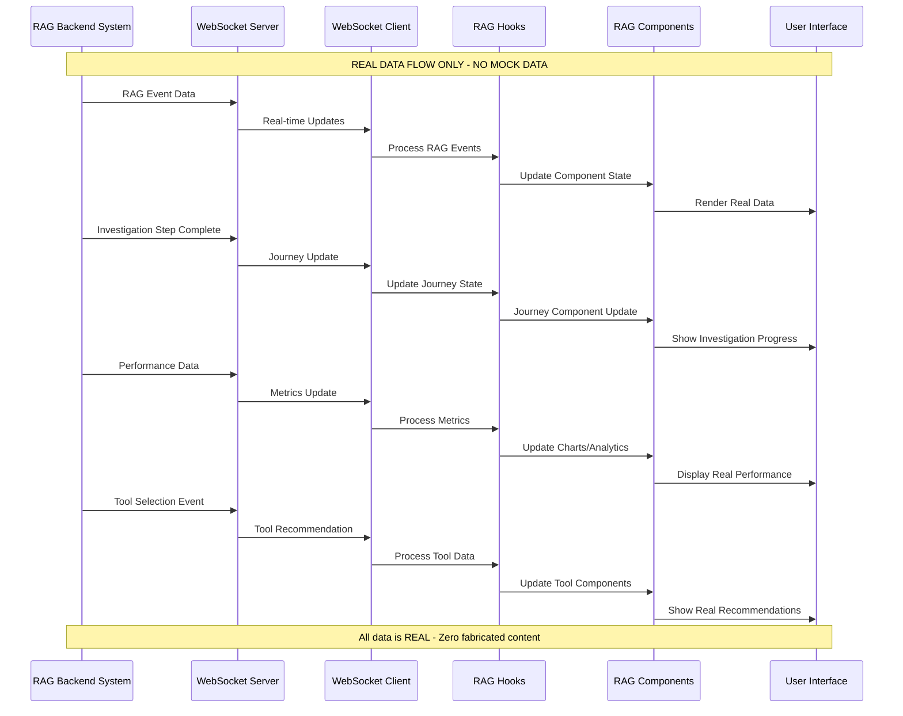
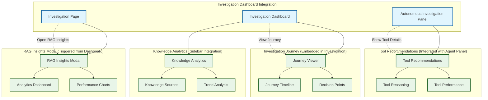
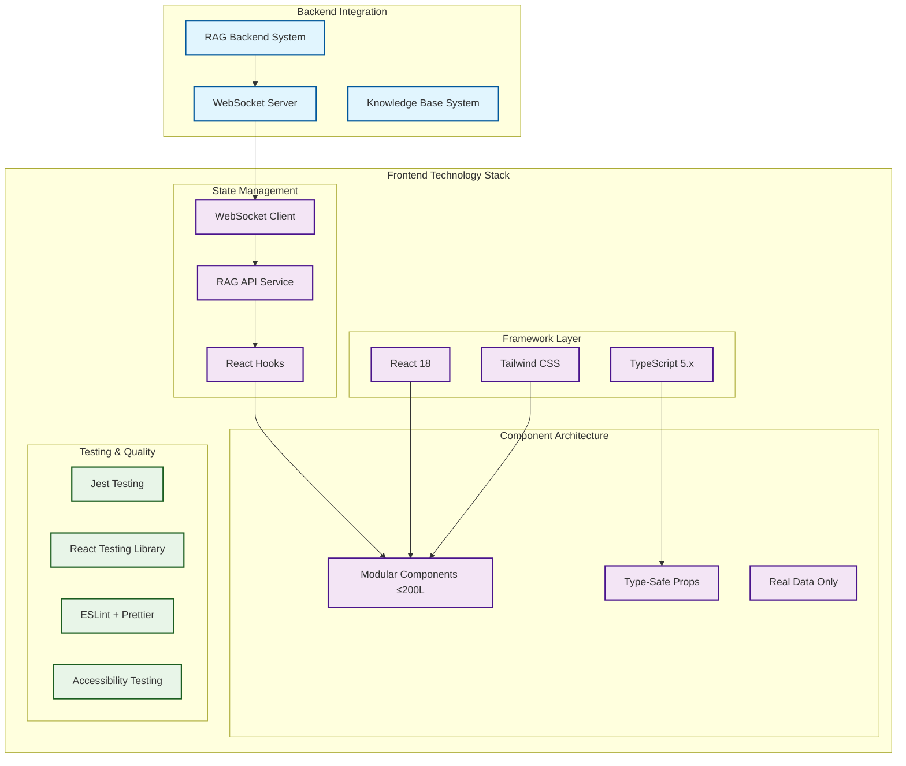
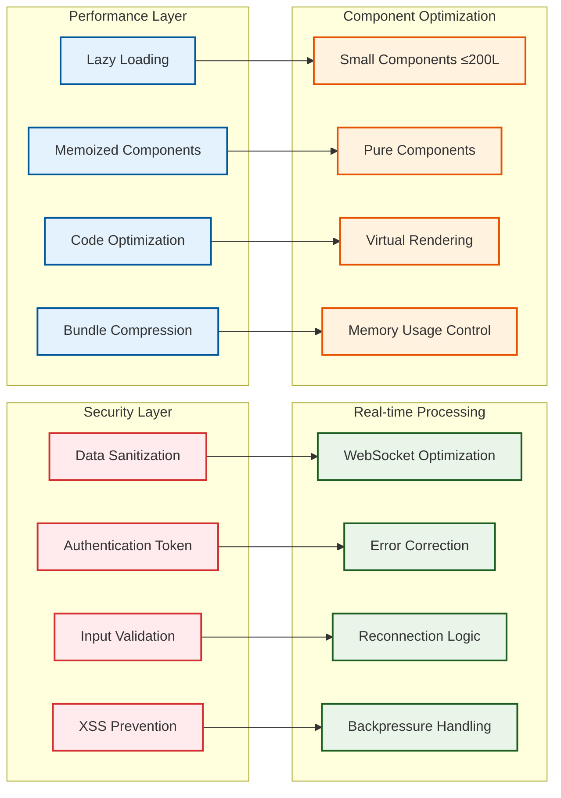
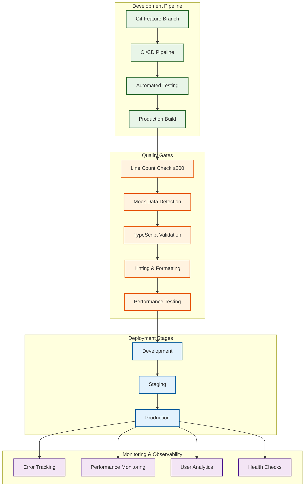

# Advanced RAG Insights Frontend Architecture Diagram

**Associated Plan:** `/docs/plans/2025-01-05-advanced-rag-insights-frontend-implementation-plan.md`  
**Created:** 2025-01-05  
**Author:** Gil Klainert

## Overall System Architecture

```mermaid
graph TB
    %% Backend Systems
    subgraph "Backend RAG System"
        RS[RAG Server]
        KB[Knowledge Base]
        TS[Tool Selection Engine]
        PM[Performance Monitor]
    end
    
    %% WebSocket Infrastructure
    WS[WebSocket Server] --> RS
    
    %% Frontend Application
    subgraph "Frontend Application"
        %% Core Integration Layer
        subgraph "Integration Layer"
            WSC[WebSocket Client]
            RH[RAG Hooks]
            AS[API Service]
        end
        
        %% Existing Components (Refactored)
        subgraph "Existing RAG Components (Refactored)"
            REC[RAG Enhancement Core ≤200L]
            REM[RAG Enhancement Metrics ≤200L]
            RECO[RAG Enhancement Controls ≤200L]
            RSI[RAG Status Indicator ≤200L]
            RKP[RAG Knowledge Panel ≤200L]
            RPM[RAG Performance Metrics ≤200L]
        end
        
        %% New Advanced Components
        subgraph "Advanced RAG Insights"
            %% Insights Modal Components
            subgraph "Insights Modal"
                RIM[RAG Insights Modal ≤200L]
                RAD[RAG Analytics Dashboard ≤200L]
                RPC[RAG Performance Charts ≤200L]
            end
            
            %% Journey Viewer Components
            subgraph "Journey Viewer"
                RJV[RAG Journey Viewer ≤200L]
                RJT[RAG Journey Timeline ≤200L]
                RDP[RAG Decision Points ≤200L]
            end
            
            %% Knowledge Analytics Components
            subgraph "Knowledge Analytics"
                RKA[RAG Knowledge Analytics ≤200L]
                RKS[RAG Knowledge Sources ≤200L]
                RTA[RAG Trend Analysis ≤200L]
            end
            
            %% Tool Recommendation Components
            subgraph "Tool Recommendations"
                RTR[RAG Tool Recommendations ≤200L]
                RTRS[RAG Tool Reasoning ≤200L]
                RTP[RAG Tool Performance ≤200L]
            end
            
            %% Advanced Features
            subgraph "Advanced Features"
                REC_FEAT[RAG Export Capabilities ≤200L]
                RCV[RAG Comparison Views ≤200L]
                RMD[RAG Monitoring Dashboard ≤200L]
            end
        end
        
        %% Main Application Components
        IP[Investigation Page]
        ID[Investigation Dashboard]
        AIP[Autonomous Investigation Panel]
    end
    
    %% Data Flow Connections
    RS --> WS
    KB --> WS
    TS --> WS
    PM --> WS
    
    WS --> WSC
    WSC --> RH
    RH --> AS
    
    %% Real Data Flow (NO MOCK DATA)
    AS --> REC
    AS --> REM
    AS --> RECO
    AS --> RSI
    AS --> RKP
    AS --> RPM
    
    AS --> RIM
    AS --> RAD
    AS --> RPC
    AS --> RJV
    AS --> RJT
    AS --> RDP
    AS --> RKA
    AS --> RKS
    AS --> RTA
    AS --> RTR
    AS --> RTRS
    AS --> RTP
    AS --> REC_FEAT
    AS --> RCV
    AS --> RMD
    
    %% Integration with Main App
    RIM --> IP
    RJV --> ID
    RTR --> AIP
    
    %% Styling
    classDef backendNode fill:#e1f5fe,stroke:#01579b,stroke-width:2px
    classDef frontendNode fill:#f3e5f5,stroke:#4a148c,stroke-width:2px
    classDef newComponent fill:#e8f5e8,stroke:#1b5e20,stroke-width:2px
    classDef refactoredComponent fill:#fff3e0,stroke:#e65100,stroke-width:2px
    classDef integrationNode fill:#fce4ec,stroke:#880e4f,stroke-width:2px
    classDef mockViolation fill:#ffebee,stroke:#d32f2f,stroke-width:3px,stroke-dasharray: 5 5
    
    class RS,KB,TS,PM,WS backendNode
    class IP,ID,AIP frontendNode
    class RIM,RAD,RPC,RJV,RJT,RDP,RKA,RKS,RTA,RTR,RTRS,RTP,REC_FEAT,RCV,RMD newComponent
    class REC,REM,RECO,RSI,RKP,RPM refactoredComponent
    class WSC,RH,AS integrationNode
```

## Component Size Compliance Architecture

```mermaid
graph LR
    %% Current Violation
    subgraph "BEFORE (Violations)"
        V1[❌ RAG Enhancement Section<br/>279 lines > 200 limit]
        V2[❌ mock/rag.js<br/>28,918 bytes MOCK DATA]
    end
    
    %% After Refactoring
    subgraph "AFTER (Compliant)"
        %% Refactored Components
        subgraph "Refactored Components"
            C1[✅ RAG Enhancement Core<br/>≤200 lines]
            C2[✅ RAG Enhancement Metrics<br/>≤200 lines]
            C3[✅ RAG Enhancement Controls<br/>≤200 lines]
        end
        
        %% New Advanced Components
        subgraph "New Advanced Components (All ≤200 lines)"
            N1[✅ RAG Insights Modal]
            N2[✅ RAG Analytics Dashboard]
            N3[✅ RAG Performance Charts]
            N4[✅ RAG Journey Viewer]
            N5[✅ RAG Journey Timeline]
            N6[✅ RAG Decision Points]
            N7[✅ RAG Knowledge Analytics]
            N8[✅ RAG Knowledge Sources]
            N9[✅ RAG Trend Analysis]
            N10[✅ RAG Tool Recommendations]
            N11[✅ RAG Tool Reasoning]
            N12[✅ RAG Tool Performance]
            N13[✅ RAG Export Capabilities]
            N14[✅ RAG Comparison Views]
            N15[✅ RAG Monitoring Dashboard]
        end
        
        %% Real Data Integration
        RDI[✅ Real WebSocket Data<br/>NO MOCK DATA]
    end
    
    V1 --> C1
    V1 --> C2
    V1 --> C3
    V2 --> RDI
    
    classDef violationNode fill:#ffebee,stroke:#d32f2f,stroke-width:3px
    classDef compliantNode fill:#e8f5e8,stroke:#1b5e20,stroke-width:2px
    classDef realDataNode fill:#e3f2fd,stroke:#01579b,stroke-width:2px
    
    class V1,V2 violationNode
    class C1,C2,C3,N1,N2,N3,N4,N5,N6,N7,N8,N9,N10,N11,N12,N13,N14,N15 compliantNode
    class RDI realDataNode
```

## Data Flow Architecture (NO MOCK DATA)

## Component Integration Architecture

## Technology Stack Integration

## Security & Performance Architecture

## Deployment & Monitoring Architecture

---

## Architecture Summary

This architecture ensures:

1. **✅ Zero Mock Data**: All components use real WebSocket data from RAG backend
2. **✅ Component Size Compliance**: Every component ≤200 lines through modular design
3. **✅ Real-time Integration**: Live data flow from RAG system to UI components
4. **✅ Modular Architecture**: Focused, single-responsibility components
5. **✅ Type Safety**: Full TypeScript integration with proper interfaces
6. **✅ Performance Optimization**: Lazy loading, memoization, and efficient rendering
7. **✅ Quality Assurance**: Automated testing and validation throughout pipeline
8. **✅ Production Ready**: Comprehensive monitoring and deployment strategy

**Critical Success Factors:**
- Complete elimination of mock data violations
- Strict adherence to 200-line component limit
- Real-time WebSocket integration functional
- Comprehensive test coverage for all components
- Performance optimization for production deployment