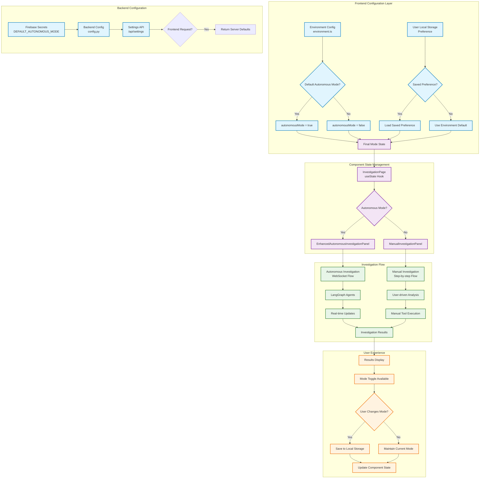
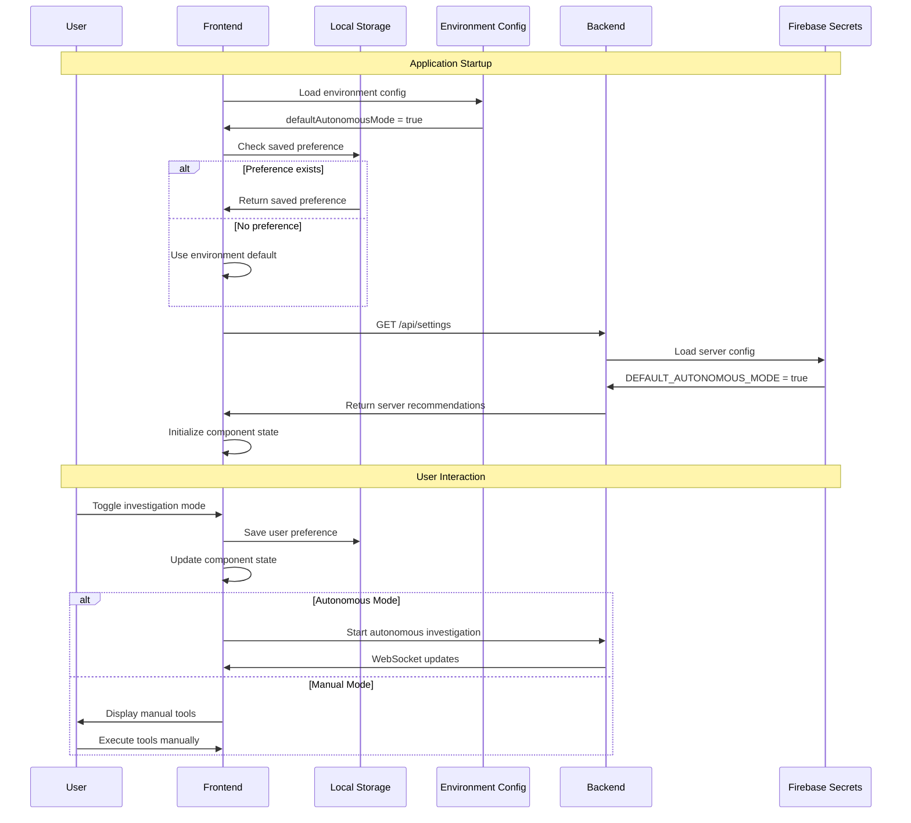
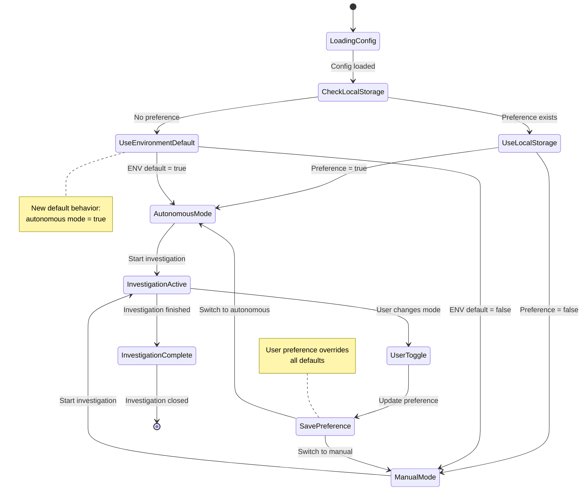
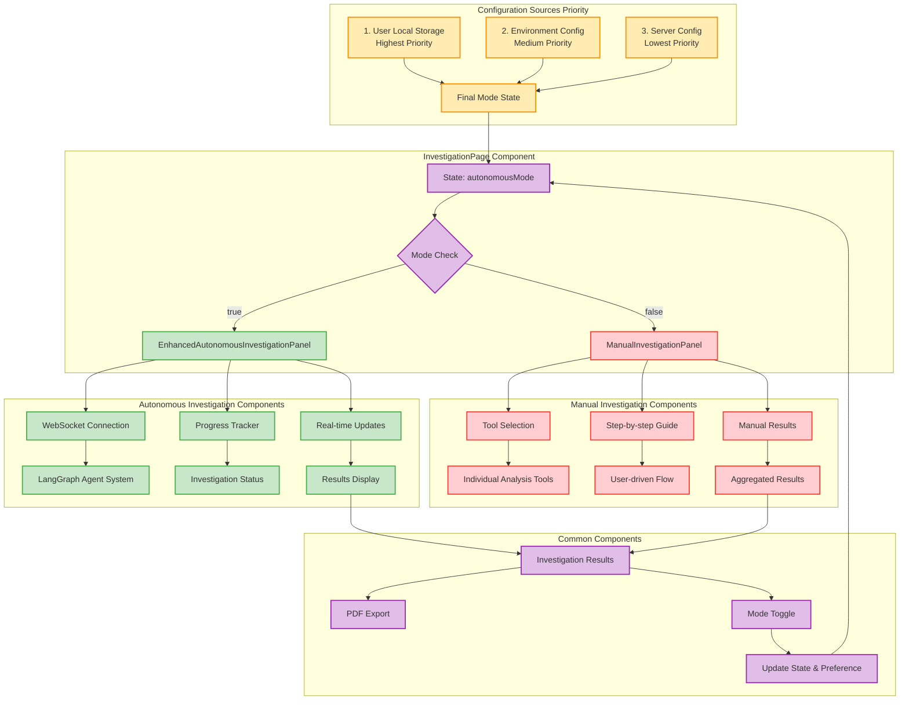
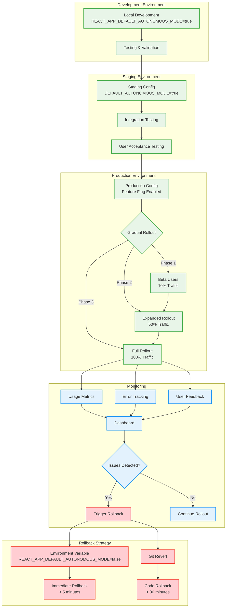

# Autonomous Mode Default Architecture Diagram

**Date:** January 4, 2025  
**Related Plan:** [2025-01-04-autonomous-mode-default-implementation-plan.md](../plans/2025-01-04-autonomous-mode-default-implementation-plan.md)

## System Architecture Overview

## Configuration Flow Diagram

## State Management Flow

## Component Architecture

## Deployment Architecture

