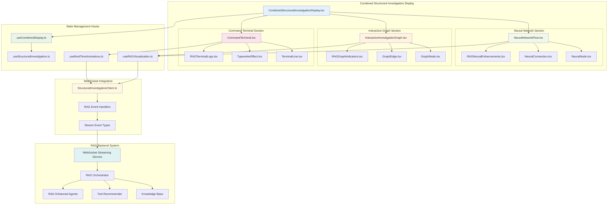
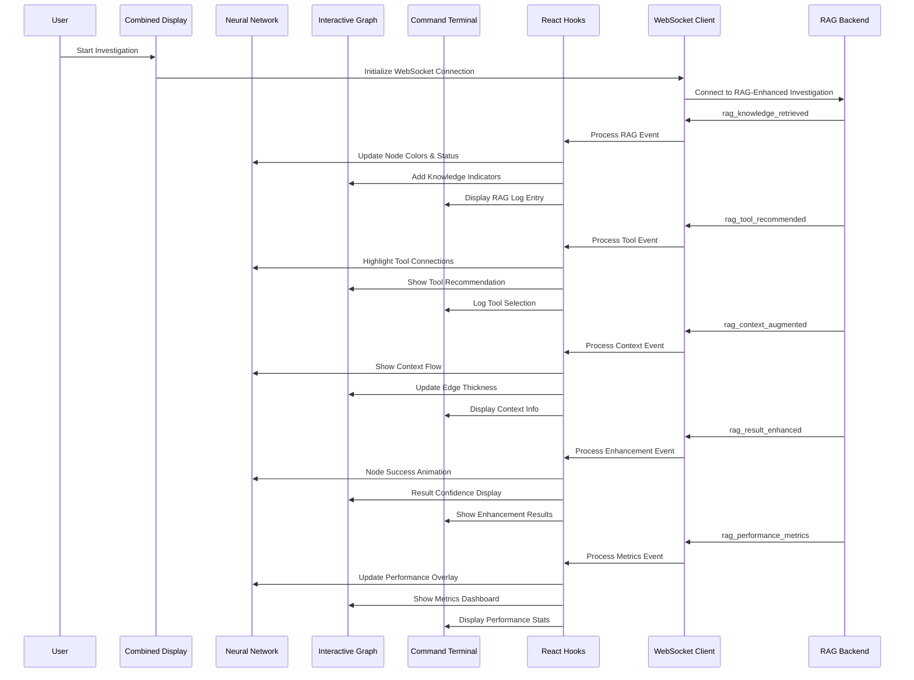
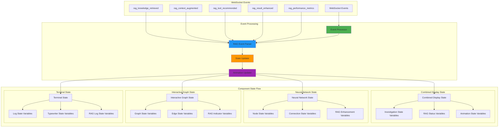
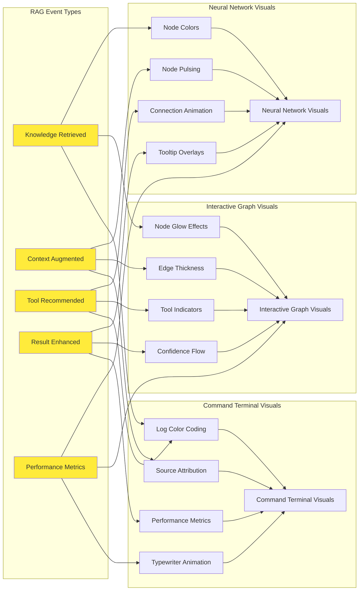
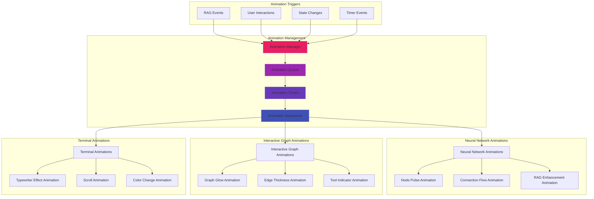
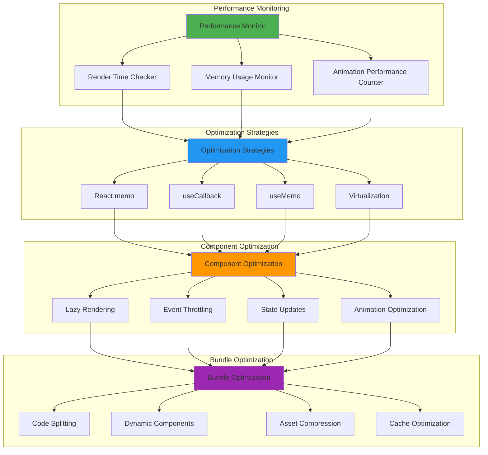

# Combined RAG-Enhanced Structured Investigation Display Architecture

**Date**: 2025-01-05  
**Author**: Gil Klainert  
**Plan Reference**: [Combined RAG-Enhanced Display Integration Plan](../plans/2025-01-05-combined-rag-enhanced-display-integration-plan.md)

## System Architecture Overview



## RAG Event Flow Architecture



## Component State Management Architecture



## RAG Enhancement Visual Integration



## Animation System Architecture



## Performance Optimization Architecture



## Mobile Responsive Architecture

```mermaid
graph LR
    subgraph "Screen Sizes"
        SS[Screen Sizes]
        M[Mobile (<768px)]
        T[Tablet (768-1024px)]
        D[Desktop (>1024px)]
    end
    
    subgraph "Layout Adaptations"
        LA[Layout Adaptations]
        SL[Stacked Layout]
        GL[Grid Layout]
        FL[Flex Layout]
    end
    
    subgraph "Component Adaptations"
        CA[Component Adaptations]
        SNV[Simplified Neural View]
        CGI[Compact Graph Interface]
        RCT[Responsive Command Terminal]
    end
    
    subgraph "Interaction Adaptations"
        IA[Interaction Adaptations]
        TG[Touch Gestures]
        SW[Swipe Navigation]
        PM[Pinch/Zoom Management]
    end
    
    %% Responsive Flow
    SS --> LA
    M --> SL
    T --> GL
    D --> FL
    
    LA --> CA
    SL --> SNV
    GL --> CGI
    FL --> RCT
    
    CA --> IA
    SNV --> TG
    CGI --> SW
    RCT --> PM
    
    style M fill:#f44336
    style T fill:#ff9800
    style D fill:#4caf50
```

This comprehensive architecture ensures optimal performance, maintainability, and user experience across all device types while providing full RAG enhancement visualization capabilities.