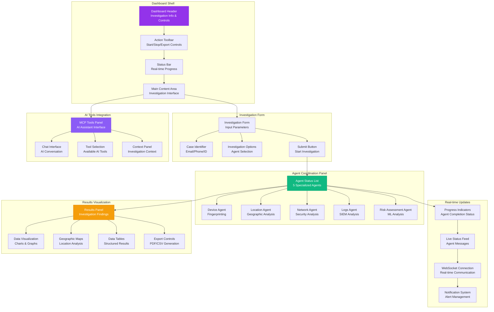
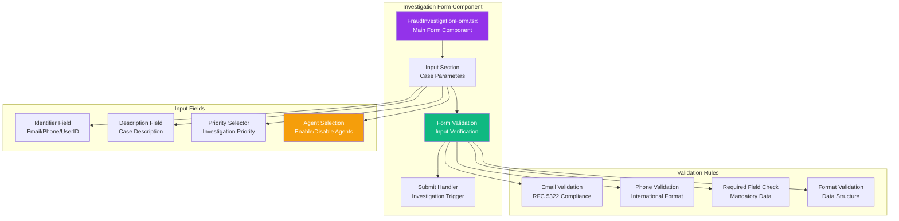
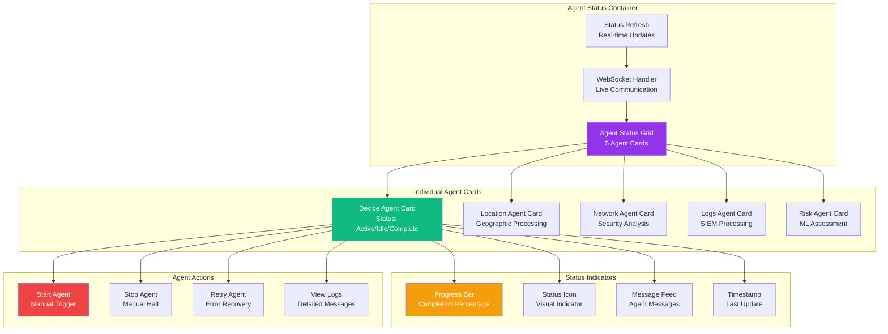
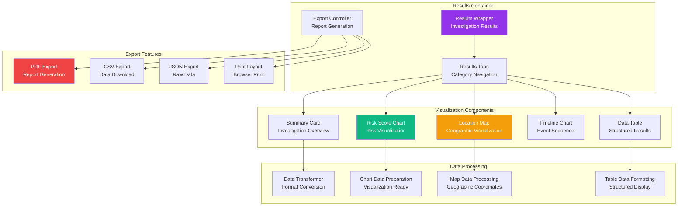
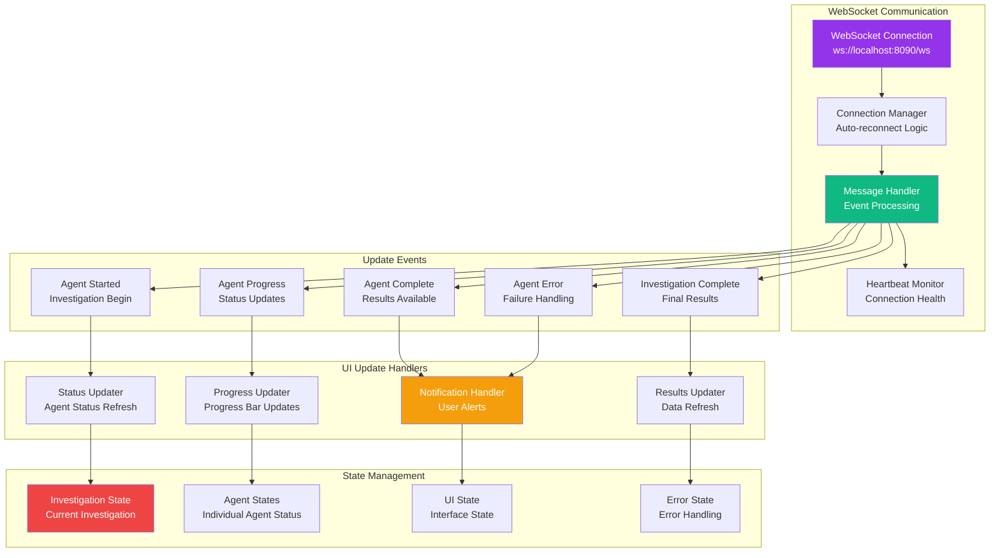
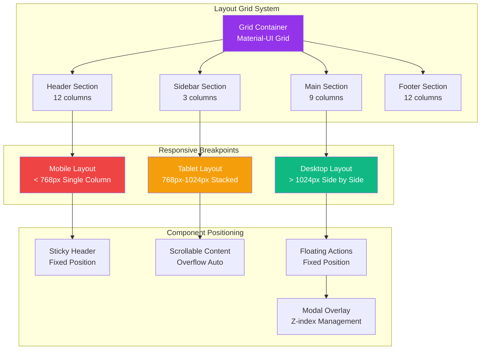
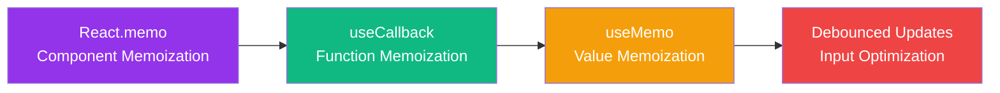
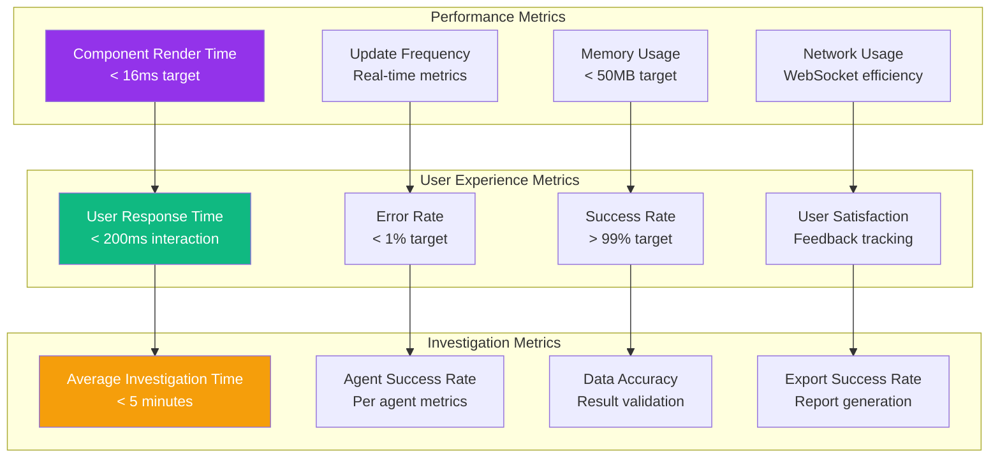

# INVESTIGATION DASHBOARD ARCHITECTURE

**Component**: olorin-front Investigation Dashboard  
**Type**: Investigation Interface Architecture  
**Created**: January 31, 2025  
**Purpose**: Detailed investigation dashboard with real-time agent coordination  

---

## 🎯 INVESTIGATION DASHBOARD OVERVIEW



---

## 🔧 DETAILED COMPONENT BREAKDOWN

### 1. **Investigation Input Interface**


### 2. **Real-time Agent Status Display**


### 3. **Results Visualization System**


---

## 🔄 REAL-TIME UPDATE ARCHITECTURE



---

## 🎨 DASHBOARD LAYOUT SYSTEM



---

## 🚀 PERFORMANCE OPTIMIZATION FEATURES

### Component Optimization


### Data Loading Strategies
- **Progressive Loading**: Load components incrementally as needed
- **Skeleton Loading**: Display loading placeholders during data fetch
- **Error Boundaries**: Graceful degradation for component failures
- **Retry Logic**: Automatic retry for failed operations

### Real-time Optimization
- **WebSocket Pooling**: Efficient connection management
- **Message Queuing**: Batch processing of frequent updates
- **Selective Updates**: Only update changed components
- **Background Sync**: Continue operations in background tabs

---

## 📊 DASHBOARD METRICS & MONITORING



---

## 🔧 INTEGRATION SPECIFICATIONS

### Backend API Integration
```typescript
// Investigation Service Integration
interface InvestigationService {
  startInvestigation(params: InvestigationParams): Promise<Investigation>
  getInvestigationStatus(id: string): Promise<InvestigationStatus>
  getInvestigationResults(id: string): Promise<InvestigationResults>
  exportInvestigation(id: string, format: ExportFormat): Promise<ExportData>
}

// Real-time WebSocket Events
interface WebSocketEvents {
  'investigation:started': InvestigationStartedEvent
  'agent:progress': AgentProgressEvent
  'agent:completed': AgentCompletedEvent
  'investigation:completed': InvestigationCompletedEvent
  'error:occurred': ErrorEvent
}
```

### Component Props Interface
```typescript
interface DashboardProps {
  investigationId?: string
  autoStart?: boolean
  defaultAgents?: AgentType[]
  onInvestigationComplete?: (results: InvestigationResults) => void
  onError?: (error: Error) => void
}

interface AgentStatusProps {
  agent: Agent
  status: AgentStatus
  onStart?: () => void
  onStop?: () => void
  onRetry?: () => void
}
```

---

## 📱 MOBILE RESPONSIVE FEATURES

### Mobile-First Approach
- **Touch-Friendly**: Large tap targets (minimum 44px)
- **Swipe Gestures**: Navigation and interaction support
- **Offline Support**: Progressive Web App capabilities
- **Push Notifications**: Investigation status updates

### Adaptive UI Elements
- **Collapsible Panels**: Space-efficient information display
- **Bottom Sheet**: Mobile-optimized action panels
- **Floating Action Button**: Quick access to primary actions
- **Pull-to-Refresh**: Native mobile interaction patterns

---

**Last Updated**: January 31, 2025  
**Component Version**: 1.0  
**Real-time Features**: WebSocket + REST API  
**Mobile Support**: Responsive + PWA Ready 