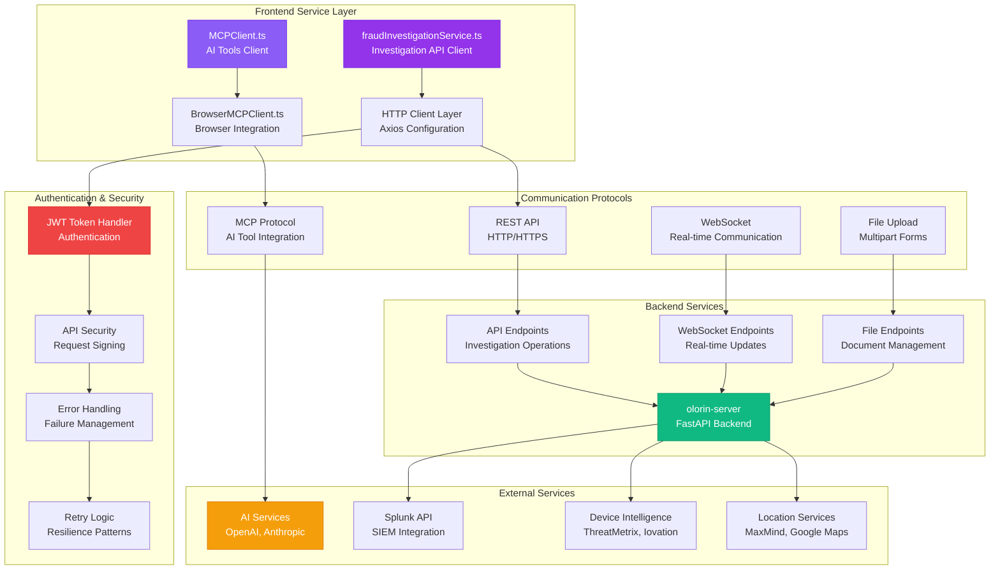
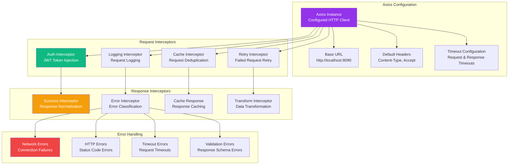
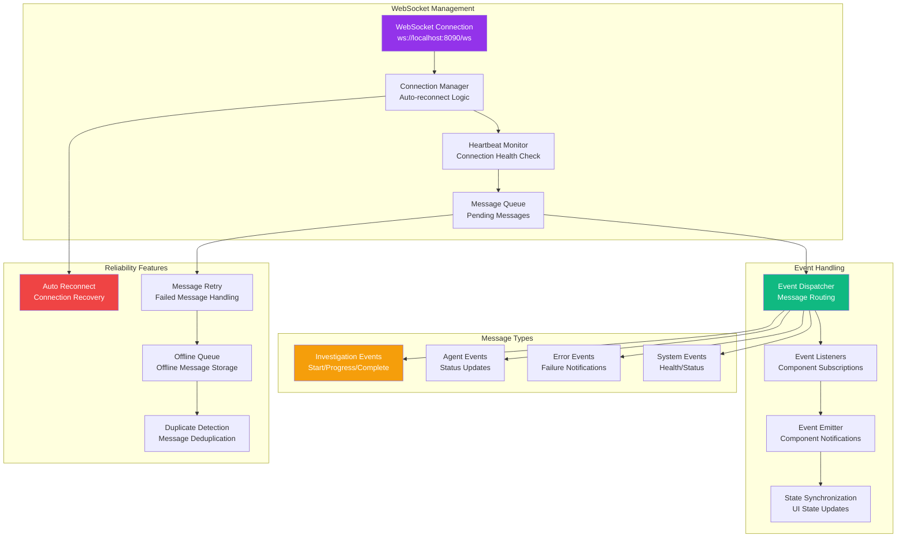

# SERVICE LAYER ARCHITECTURE

**Component**: olorin-front Service Layer  
**Type**: Backend Integration & API Communication Architecture  
**Created**: January 31, 2025  
**Purpose**: Complete service layer architecture for frontend-backend communication  

---

## 🔧 SERVICE LAYER OVERVIEW



---

## 🚀 DETAILED SERVICE IMPLEMENTATIONS

### 1. **Fraud Investigation Service**
```mermaid
graph TB
    subgraph "fraudInvestigationService.ts"
        SERVICE_CLASS[FraudInvestigationService<br/>Main Service Class]
        START_INVESTIGATION[startInvestigation()<br/>Initiate Investigation]
        GET_STATUS[getInvestigationStatus()<br/>Check Progress]
        GET_RESULTS[getInvestigationResults()<br/>Retrieve Findings]
        EXPORT_RESULTS[exportInvestigation()<br/>Generate Reports]
    end
    
    subgraph "Request Configuration"
        BASE_CONFIG[Base Configuration<br/>Default Headers & Timeout]
        AUTH_CONFIG[Authentication Config<br/>JWT Token Injection]
        RETRY_CONFIG[Retry Configuration<br/>Exponential Backoff]
        CACHE_CONFIG[Cache Configuration<br/>Response Caching]
    end
    
    subgraph "Response Handling"
        SUCCESS_HANDLER[Success Handler<br/>Data Transformation]
        ERROR_HANDLER[Error Handler<br/>Error Classification]
        VALIDATION[Response Validation<br/>Schema Verification]
        TRANSFORMATION[Data Transformation<br/>Frontend Models]
    end
    
    subgraph "State Management"
        INVESTIGATION_CACHE[Investigation Cache<br/>Local Storage]
        STATUS_CACHE[Status Cache<br/>Real-time Updates]
        RESULTS_CACHE[Results Cache<br/>Performance Optimization]
        ERROR_STATE[Error State<br/>Failure Tracking]
    end
    
    SERVICE_CLASS --> START_INVESTIGATION
    SERVICE_CLASS --> GET_STATUS
    SERVICE_CLASS --> GET_RESULTS
    SERVICE_CLASS --> EXPORT_RESULTS
    
    START_INVESTIGATION --> BASE_CONFIG
    GET_STATUS --> AUTH_CONFIG
    GET_RESULTS --> RETRY_CONFIG
    EXPORT_RESULTS --> CACHE_CONFIG
    
    BASE_CONFIG --> SUCCESS_HANDLER
    AUTH_CONFIG --> ERROR_HANDLER
    RETRY_CONFIG --> VALIDATION
    CACHE_CONFIG --> TRANSFORMATION
    
    SUCCESS_HANDLER --> INVESTIGATION_CACHE
    ERROR_HANDLER --> STATUS_CACHE
    VALIDATION --> RESULTS_CACHE
    TRANSFORMATION --> ERROR_STATE
    
    style SERVICE_CLASS fill:#9333ea,color:white
    style START_INVESTIGATION fill:#10b981,color:white
    style SUCCESS_HANDLER fill:#f59e0b,color:white
    style INVESTIGATION_CACHE fill:#ef4444,color:white
```

### 2. **MCP Client Architecture**
```mermaid
graph TB
    subgraph "MCPClient.ts Core"
        MCP_CLIENT_CLASS[MCPClient<br/>Main Client Class]
        CONNECT_SERVER[connectToServer()<br/>Establish Connection]
        LIST_TOOLS[listTools()<br/>Available Tools]
        CALL_TOOL[callTool()<br/>Execute Tool]
        DISCONNECT[disconnect()<br/>Clean Shutdown]
    end
    
    subgraph "BrowserMCPClient.ts"
        BROWSER_CLIENT[BrowserMCPClient<br/>Browser-specific Implementation]
        INITIALIZE[initializeClient()<br/>Browser Setup]
        HANDLE_REQUESTS[handleToolRequests()<br/>Request Processing]
        MANAGE_CONNECTIONS[manageConnections()<br/>Connection Pool]
        BROWSER_APIS[Browser APIs<br/>Web Integration]
    end
    
    subgraph "Protocol Handling"
        MESSAGE_SERIALIZATION[Message Serialization<br/>JSON-RPC Protocol]
        TOOL_DISCOVERY[Tool Discovery<br/>Available Tools]
        CAPABILITY_NEGOTIATION[Capability Negotiation<br/>Feature Support]
        ERROR_PROPAGATION[Error Propagation<br/>Remote Error Handling]
    end
    
    subgraph "AI Tool Integration"
        OPENAI_TOOLS[OpenAI Tools<br/>GPT Integration]
        ANTHROPIC_TOOLS[Anthropic Tools<br/>Claude Integration]
        CUSTOM_TOOLS[Custom Tools<br/>Domain-specific Tools]
        TOOL_REGISTRY[Tool Registry<br/>Available Tools Management]
    end
    
    MCP_CLIENT_CLASS --> CONNECT_SERVER
    MCP_CLIENT_CLASS --> LIST_TOOLS
    MCP_CLIENT_CLASS --> CALL_TOOL
    MCP_CLIENT_CLASS --> DISCONNECT
    
    BROWSER_CLIENT --> INITIALIZE
    BROWSER_CLIENT --> HANDLE_REQUESTS
    BROWSER_CLIENT --> MANAGE_CONNECTIONS
    BROWSER_CLIENT --> BROWSER_APIS
    
    CONNECT_SERVER --> MESSAGE_SERIALIZATION
    LIST_TOOLS --> TOOL_DISCOVERY
    CALL_TOOL --> CAPABILITY_NEGOTIATION
    DISCONNECT --> ERROR_PROPAGATION
    
    TOOL_DISCOVERY --> OPENAI_TOOLS
    TOOL_DISCOVERY --> ANTHROPIC_TOOLS
    TOOL_DISCOVERY --> CUSTOM_TOOLS
    TOOL_DISCOVERY --> TOOL_REGISTRY
    
    style MCP_CLIENT_CLASS fill:#8b5cf6,color:white
    style BROWSER_CLIENT fill:#c084fc,color:black
    style MESSAGE_SERIALIZATION fill:#10b981,color:white
    style OPENAI_TOOLS fill:#f59e0b,color:white
```

### 3. **HTTP Client Configuration**


---

## 🔄 REAL-TIME COMMUNICATION ARCHITECTURE



---

## 🔒 AUTHENTICATION & SECURITY LAYER

```mermaid
graph TB
    subgraph "Authentication Management"
        JWT_TOKEN[JWT Token<br/>Authentication Token]
        TOKEN_STORAGE[Token Storage<br/>Secure Storage]
        TOKEN_REFRESH[Token Refresh<br/>Automatic Renewal]
        TOKEN_VALIDATION[Token Validation<br/>Expiry Check]
    end
    
    subgraph "Request Security"
        REQUEST_SIGNING[Request Signing<br/>HMAC Signature]
        CSRF_PROTECTION[CSRF Protection<br/>Token Validation]
        RATE_LIMITING[Rate Limiting<br/>Request Throttling]
        INPUT_SANITIZATION[Input Sanitization<br/>XSS Prevention]
    end
    
    subgraph "API Security"
        API_KEY_MANAGEMENT[API Key Management<br/>Service Keys]
        ENDPOINT_AUTHORIZATION[Endpoint Authorization<br/>Permission Checks]
        SECURE_HEADERS[Secure Headers<br/>Security Headers]
        CONTENT_VALIDATION[Content Validation<br/>Response Validation]
    end
    
    subgraph "Error Security"
        ERROR_SANITIZATION[Error Sanitization<br/>Sensitive Data Removal]
        SECURITY_LOGGING[Security Logging<br/>Audit Trail]
        THREAT_DETECTION[Threat Detection<br/>Anomaly Detection]
        INCIDENT_RESPONSE[Incident Response<br/>Security Event Handling]
    end
    
    JWT_TOKEN --> TOKEN_STORAGE
    TOKEN_STORAGE --> TOKEN_REFRESH
    TOKEN_REFRESH --> TOKEN_VALIDATION
    
    TOKEN_VALIDATION --> REQUEST_SIGNING
    REQUEST_SIGNING --> CSRF_PROTECTION
    CSRF_PROTECTION --> RATE_LIMITING
    RATE_LIMITING --> INPUT_SANITIZATION
    
    INPUT_SANITIZATION --> API_KEY_MANAGEMENT
    API_KEY_MANAGEMENT --> ENDPOINT_AUTHORIZATION
    ENDPOINT_AUTHORIZATION --> SECURE_HEADERS
    SECURE_HEADERS --> CONTENT_VALIDATION
    
    CONTENT_VALIDATION --> ERROR_SANITIZATION
    ERROR_SANITIZATION --> SECURITY_LOGGING
    SECURITY_LOGGING --> THREAT_DETECTION
    THREAT_DETECTION --> INCIDENT_RESPONSE
    
    style JWT_TOKEN fill:#9333ea,color:white
    style REQUEST_SIGNING fill:#10b981,color:white
    style API_KEY_MANAGEMENT fill:#f59e0b,color:white
    style ERROR_SANITIZATION fill:#ef4444,color:white
```



---

## 📊 API ENDPOINT MAPPING

### Investigation API Endpoints
```typescript
// Investigation Management
POST   /api/investigations          // Start new investigation
GET    /api/investigations/:id      // Get investigation details
GET    /api/investigations/:id/status // Get investigation status
GET    /api/investigations/:id/results // Get investigation results
POST   /api/investigations/:id/export // Export investigation
DELETE /api/investigations/:id      // Delete investigation

// Agent Management
GET    /api/agents                  // List available agents
POST   /api/agents/:type/start      // Start specific agent
POST   /api/agents/:type/stop       // Stop specific agent
GET    /api/agents/:type/status     // Get agent status
GET    /api/agents/:type/logs       // Get agent logs

// File Management
POST   /api/files/upload            // Upload investigation files
GET    /api/files/:id               // Download file
DELETE /api/files/:id               // Delete file
GET    /api/files/:id/metadata      // Get file metadata
```

### WebSocket Event Types
```typescript
// WebSocket Events
interface WebSocketEvents {
  // Investigation Events
  'investigation:started': { investigationId: string, timestamp: Date }
  'investigation:progress': { investigationId: string, progress: number }
  'investigation:completed': { investigationId: string, results: Results }
  'investigation:failed': { investigationId: string, error: Error }
  
  // Agent Events
  'agent:started': { agentType: string, investigationId: string }
  'agent:progress': { agentType: string, progress: number, message: string }
  'agent:completed': { agentType: string, results: AgentResults }
  'agent:failed': { agentType: string, error: Error }
  
  // System Events
  'system:health': { status: 'healthy' | 'degraded' | 'unhealthy' }
  'system:maintenance': { message: string, duration: number }
}
```

---

## 🚀 PERFORMANCE OPTIMIZATION STRATEGIES

### Caching Strategy


### Request Optimization
- **Request Batching**: Combine multiple requests into single calls
- **Request Deduplication**: Avoid duplicate simultaneous requests
- **Connection Pooling**: Reuse HTTP connections for efficiency
- **Compression**: Gzip/Brotli compression for request/response bodies

### Error Recovery Patterns
- **Circuit Breaker**: Prevent cascading failures
- **Exponential Backoff**: Intelligent retry timing
- **Graceful Degradation**: Fallback to cached data
- **Health Checks**: Proactive service monitoring

---

## 📱 MOBILE & OFFLINE SUPPORT

```mermaid
graph TB
    subgraph "Offline Capabilities"
        SERVICE_WORKER[Service Worker<br/>Background Processing]
        OFFLINE_CACHE[Offline Cache<br/>Investigation Data]
        SYNC_QUEUE[Sync Queue<br/>Pending Operations]
        CONFLICT_RESOLUTION[Conflict Resolution<br/>Data Reconciliation]
    end
    
    subgraph "Mobile Optimization"
        NETWORK_DETECTION[Network Detection<br/>Connection Monitoring]
        BANDWIDTH_ADAPTATION[Bandwidth Adaptation<br/>Quality Adjustment]
        BATTERY_OPTIMIZATION[Battery Optimization<br/>Power Management]
        BACKGROUND_SYNC[Background Sync<br/>Offline Operations]
    end
    
    SERVICE_WORKER --> OFFLINE_CACHE
    OFFLINE_CACHE --> SYNC_QUEUE
    SYNC_QUEUE --> CONFLICT_RESOLUTION
    
    NETWORK_DETECTION --> BANDWIDTH_ADAPTATION
    BANDWIDTH_ADAPTATION --> BATTERY_OPTIMIZATION
    BATTERY_OPTIMIZATION --> BACKGROUND_SYNC
    
    style SERVICE_WORKER fill:#9333ea,color:white
    style NETWORK_DETECTION fill:#10b981,color:white
```



---

## 🔧 SERVICE CONFIGURATION

### Environment Configuration
```typescript
interface ServiceConfig {
  apiBaseUrl: string
  websocketUrl: string
  mcpServerUrl: string
  authConfig: {
    tokenStorageKey: string
    refreshTokenKey: string
    tokenExpiryBuffer: number
  }
  httpConfig: {
    timeout: number
    retryAttempts: number
    retryDelay: number
  }
  websocketConfig: {
    reconnectAttempts: number
    reconnectDelay: number
    heartbeatInterval: number
  }
}
```

### Development vs Production Settings
```typescript
const developmentConfig: ServiceConfig = {
  apiBaseUrl: 'http://localhost:8090',
  websocketUrl: 'ws://localhost:8090/ws',
  mcpServerUrl: 'ws://localhost:8001/mcp',
  // ... development settings
}

const productionConfig: ServiceConfig = {
  apiBaseUrl: 'https://api.olorin.example.com',
  websocketUrl: 'wss://api.olorin.example.com/ws',
  mcpServerUrl: 'wss://mcp.olorin.example.com/mcp',
  // ... production settings
}
```

---

## 📈 MONITORING & OBSERVABILITY

### Service Metrics
- **Request/Response Times**: API performance monitoring
- **Error Rates**: Service reliability tracking
- **WebSocket Health**: Real-time connection monitoring
- **Cache Hit Rates**: Caching effectiveness metrics

### User Experience Metrics
- **API Response Times**: User-perceived performance
- **Failed Request Recovery**: Error handling effectiveness
- **Offline Functionality**: Offline capability usage
- **Real-time Update Latency**: WebSocket performance

---

**Last Updated**: January 31, 2025  
**Service Layer Version**: 1.0  
**API Integration**: REST + WebSocket + MCP  
**Security**: JWT + HTTPS + Request Signing 