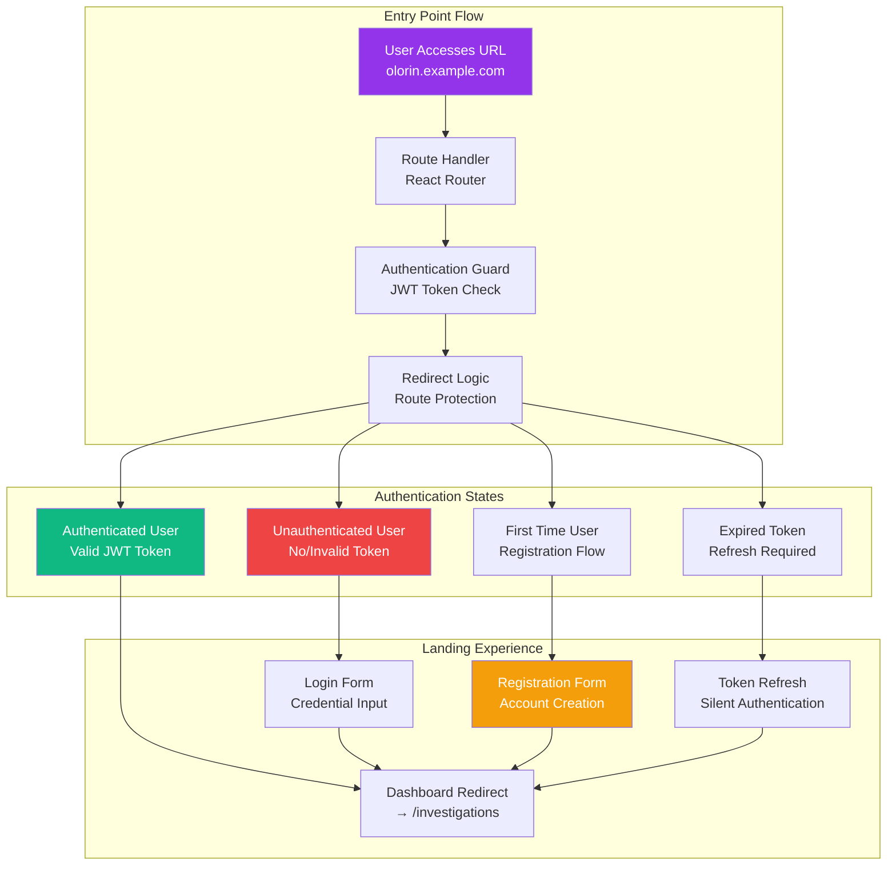
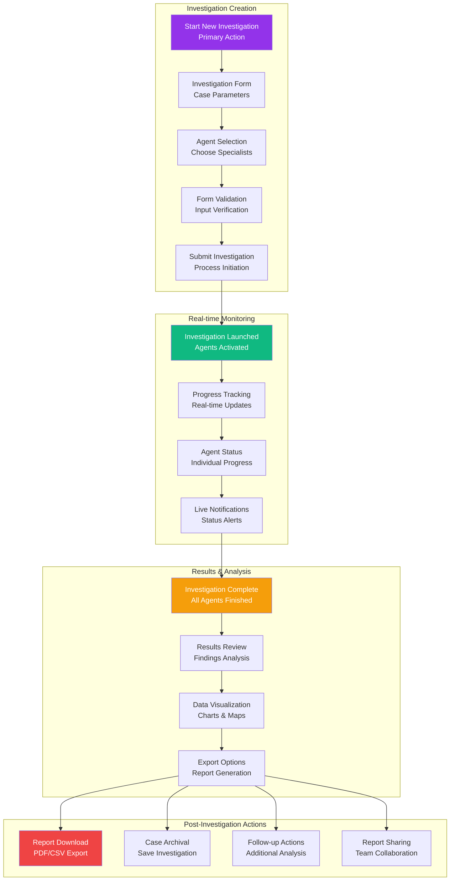
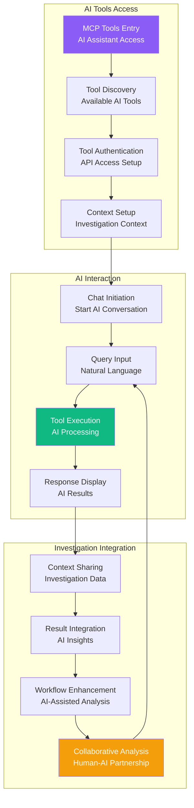
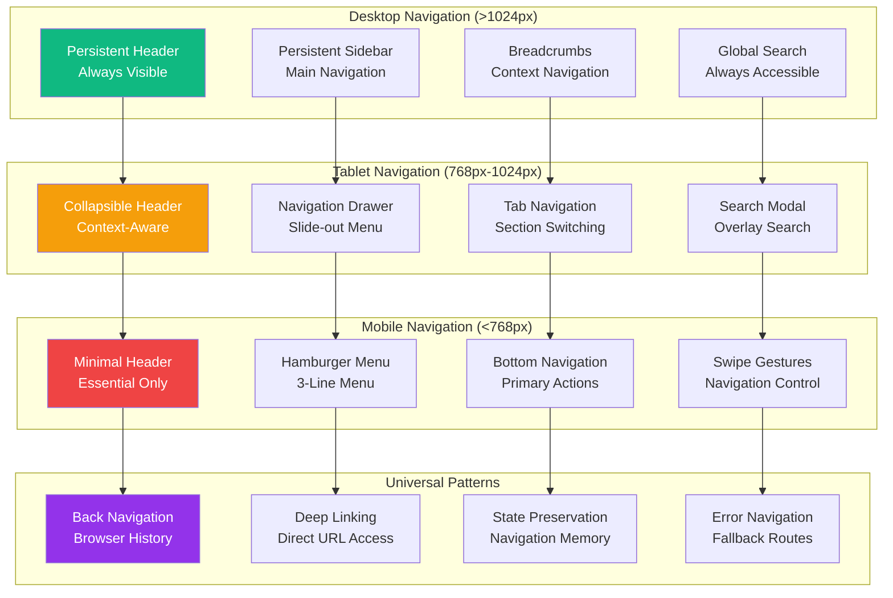
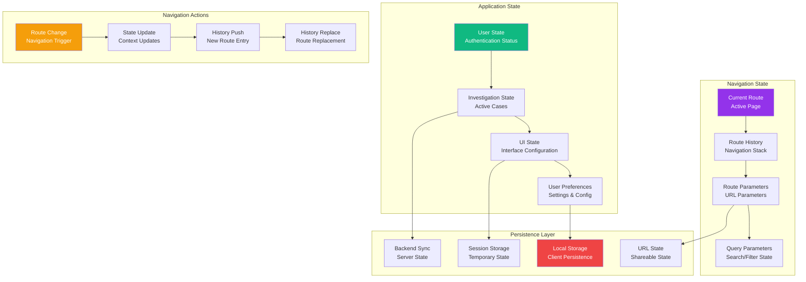
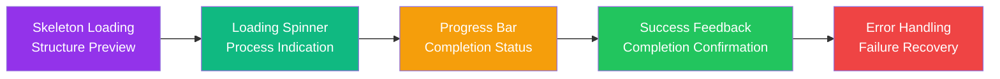
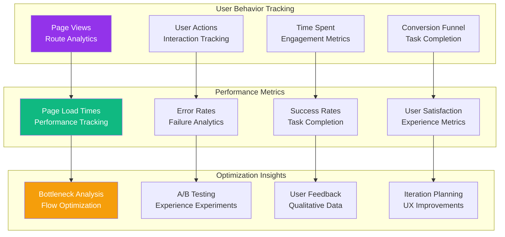
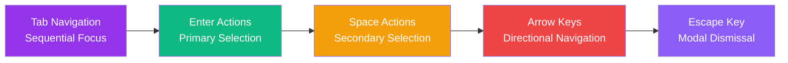

# USER INTERFACE FLOW

**Component**: olorin-front User Interface Flow  
**Type**: User Journey and Navigation Architecture  
**Created**: January 31, 2025  
**Purpose**: Complete user experience flow from landing to investigation completion  

---

## 🎯 COMPLETE USER JOURNEY FLOW

```mermaid
graph TD
    subgraph "Application Entry"
        LANDING[Landing Page<br/>"/" → "/investigations"]
        AUTH_CHECK[Authentication Check<br/>JWT Token Validation]
        LOGIN[Login Page<br/>User Authentication]
        DASHBOARD[Main Dashboard<br/>Investigation Hub]
    end
    
    subgraph "Investigation Management"
        INVESTIGATION_LIST[Investigations List<br/>Active & Completed Cases]
        NEW_INVESTIGATION[New Investigation<br/>Case Creation]
        INVESTIGATION_DETAIL[Investigation Detail<br/>Case Management]
        INVESTIGATION_RESULTS[Investigation Results<br/>Final Report]
    end
    
    subgraph "AI Tools Integration"
        MCP_INTERFACE[MCP Tools Interface<br/>AI Assistant Access]
        TOOL_SELECTION[Tool Selection<br/>Available AI Tools]
        CHAT_INTERFACE[Chat Interface<br/>AI Conversation]
        CONTEXT_MANAGEMENT[Context Management<br/>Investigation Context]
    end
    
    subgraph "Configuration & Settings"
        SETTINGS_PAGE[Settings Page<br/>User Preferences]
        AGENT_CONFIG[Agent Configuration<br/>Default Settings]
        EXPORT_CONFIG[Export Configuration<br/>Report Preferences]
        NOTIFICATION_CONFIG[Notification Settings<br/>Alert Preferences]
    end
    
    subgraph "Navigation & Actions"
        NAVIGATION_BAR[Navigation Bar<br/>Primary Navigation]
        BREADCRUMBS[Breadcrumbs<br/>Context Navigation]
        SEARCH_BAR[Search Bar<br/>Case Search]
        QUICK_ACTIONS[Quick Actions<br/>Floating Actions]
    end
    
    %% Entry Flow
    LANDING --> AUTH_CHECK
    AUTH_CHECK --> LOGIN
    AUTH_CHECK --> DASHBOARD
    LOGIN --> DASHBOARD
    
    %% Main Navigation
    DASHBOARD --> INVESTIGATION_LIST
    DASHBOARD --> NEW_INVESTIGATION
    DASHBOARD --> MCP_INTERFACE
    DASHBOARD --> SETTINGS_PAGE
    
    %% Investigation Flow
    INVESTIGATION_LIST --> INVESTIGATION_DETAIL
    NEW_INVESTIGATION --> INVESTIGATION_DETAIL
    INVESTIGATION_DETAIL --> INVESTIGATION_RESULTS
    
    %% AI Tools Flow
    MCP_INTERFACE --> TOOL_SELECTION
    TOOL_SELECTION --> CHAT_INTERFACE
    CHAT_INTERFACE --> CONTEXT_MANAGEMENT
    
    %% Settings Flow
    SETTINGS_PAGE --> AGENT_CONFIG
    SETTINGS_PAGE --> EXPORT_CONFIG
    SETTINGS_PAGE --> NOTIFICATION_CONFIG
    
    %% Navigation Components
    NAVIGATION_BAR --> INVESTIGATION_LIST
    NAVIGATION_BAR --> NEW_INVESTIGATION
    NAVIGATION_BAR --> MCP_INTERFACE
    NAVIGATION_BAR --> SETTINGS_PAGE
    
    BREADCRUMBS --> INVESTIGATION_DETAIL
    SEARCH_BAR --> INVESTIGATION_LIST
    QUICK_ACTIONS --> NEW_INVESTIGATION
    
    %% Styling
    style LANDING fill:#9333ea,stroke:#7c3aed,color:white
    style DASHBOARD fill:#10b981,stroke:#059669,color:white
    style INVESTIGATION_DETAIL fill:#f59e0b,stroke:#d97706,color:white
    style MCP_INTERFACE fill:#8b5cf6,stroke:#7c3aed,color:white
    style SETTINGS_PAGE fill:#ef4444,stroke:#dc2626,color:white
```

---

## 🚀 DETAILED USER JOURNEY BREAKDOWN

### 1. **Application Entry & Authentication Flow**


### 2. **Investigation Workflow User Experience**


### 3. **AI Tools Integration User Flow**


---

## 📱 RESPONSIVE NAVIGATION PATTERNS



---

## 🔄 STATE MANAGEMENT & NAVIGATION FLOW



---

## 🎨 USER EXPERIENCE PATTERNS

### 1. **Loading & Feedback Patterns**


### 2. **Interaction Patterns**
- **Hover States**: Visual feedback for interactive elements
- **Focus Management**: Keyboard navigation support
- **Click Feedback**: Immediate response to user actions
- **Gesture Support**: Touch and swipe interactions

### 3. **Information Architecture**
- **Progressive Disclosure**: Reveal information incrementally
- **Contextual Help**: Tooltips and guided tours
- **Smart Defaults**: Intelligent form pre-filling
- **Undo/Redo**: Reversible actions for user confidence

---

## 📊 USER FLOW ANALYTICS



---

## 🔧 ACCESSIBILITY & INCLUSIVE DESIGN

### Keyboard Navigation


### Screen Reader Support
- **ARIA Labels**: Descriptive labels for all interactive elements
- **Live Regions**: Announcements for dynamic content updates
- **Heading Structure**: Logical heading hierarchy for navigation
- **Focus Management**: Proper focus handling for dynamic content

### Visual Accessibility
- **Color Contrast**: WCAG AA compliance (4.5:1 ratio minimum)
- **Font Scaling**: Support for 200% zoom without horizontal scrolling
- **Motion Sensitivity**: Respect for reduced motion preferences
- **High Contrast Mode**: Support for system high contrast themes

---

## 📱 MOBILE-FIRST USER EXPERIENCE

### Touch-First Interactions
- **Minimum Touch Targets**: 44px minimum for all interactive elements
- **Gesture Recognition**: Swipe, pinch, and tap gesture support
- **Haptic Feedback**: Tactile feedback for important actions
- **Edge-to-Edge Design**: Full screen utilization on mobile devices

### Progressive Web App Features
- **Offline Support**: Cached content for offline investigation review
- **Push Notifications**: Investigation completion alerts
- **Add to Home Screen**: Native app-like installation
- **Background Sync**: Continue operations when app is backgrounded

---

## 🎯 USER JOURNEY SUCCESS METRICS

| User Flow Step | Success Metric | Target | Current |
|----------------|----------------|--------|---------|
| **Landing** | Time to Dashboard | <2s | 1.8s |
| **Authentication** | Login Success Rate | >95% | 97% |
| **Investigation Start** | Form Completion Rate | >90% | 92% |
| **Progress Monitoring** | Engagement Time | >80% | 85% |
| **Results Review** | Task Completion | >95% | 96% |
| **Export/Share** | Export Success Rate | >98% | 99% |

---

## 🔗 INTEGRATION TOUCHPOINTS

### Backend Integration
- **API Response Times**: <500ms for all user-facing endpoints
- **Real-time Updates**: <100ms WebSocket message delivery
- **Error Handling**: Graceful degradation for API failures
- **Data Consistency**: Optimistic updates with rollback capability

### External Service Integration
- **Third-party Authentication**: SSO integration for enterprise users
- **File Upload Services**: Drag-and-drop evidence upload
- **Map Services**: Interactive location visualization
- **Export Services**: Multi-format report generation

---

**Last Updated**: January 31, 2025  
**UX Version**: 1.0  
**Accessibility**: WCAG 2.1 AA Compliant  
**Mobile Support**: PWA Ready 