# olorin-server Component Architecture

**Category**: Component-Specific Diagrams  
**Purpose**: Detailed backend service architecture and internal structure  
**Created**: January 31, 2025  
**Status**: 🔄 **IN PROGRESS**

---

## 🎯 COMPONENT OVERVIEW

The `olorin-server` is the core backend service of the Olorin fraud investigation platform, providing:
- **FastAPI-based REST API** for frontend communication
- **AI Agent Framework** for orchestrating specialized investigation agents
- **Investigation Engine** for managing investigation workflows
- **External Integration Hub** for connecting to 35+ external services
- **Real-time Communication** via WebSocket for live updates

---

## 📊 COMPONENT DIAGRAMS COLLECTION

### 🔧 Core Architecture Diagrams
- [Backend Service Architecture](backend-service-architecture.md) - Overall backend structure
- [AI Agent Framework](ai-agent-framework.md) - Agent orchestration and management
- [API Endpoint Architecture](api-endpoint-architecture.md) - REST API design and structure

### 🔄 Process & Flow Diagrams
- [Investigation Processing Flow](investigation-processing-flow.md) - End-to-end investigation workflow
- [Agent Orchestration Flow](agent-orchestration-flow.md) - AI agent coordination patterns
- [Data Processing Pipeline](data-processing-pipeline.md) - Internal data transformation flows

### 🔗 Integration & Communication
- [External Integration Adapter](external-integration-adapter.md) - Third-party service connections
- [WebSocket Communication](websocket-communication.md) - Real-time messaging architecture
- [Database Integration](database-integration.md) - Data persistence and caching

---

## 🏗️ SYSTEM ARCHITECTURE CONTEXT

```mermaid
graph TB
    subgraph "olorin-server Internal Architecture"
        API[🔧 FastAPI Application Layer]
        SERVICE[⚙️ Service Layer]
        AGENTS[🤖 AI Agent Framework]
        ADAPTERS[🔗 External Adapters]
        DB[💾 Database Layer]
    end
    
    subgraph "External Interfaces"
        FRONTEND[📊 olorin-front]
        EXTERNAL[🌐 External Services]
        STORAGE[💾 Data Storage]
    end
    
    FRONTEND -->|REST/WebSocket| API
    API --> SERVICE
    SERVICE --> AGENTS
    SERVICE --> ADAPTERS
    AGENTS --> ADAPTERS
    ADAPTERS --> EXTERNAL
    SERVICE --> DB
    DB --> STORAGE
    
    classDef internal fill:#f3e5f5,stroke:#4a148c,stroke-width:2px
    classDef external fill:#e8f5e8,stroke:#2e7d32,stroke-width:2px
    
    class API,SERVICE,AGENTS,ADAPTERS,DB internal
    class FRONTEND,EXTERNAL,STORAGE external
```

---

## 🔧 COMPONENT STATUS TRACKING

| Diagram | Status | Complexity | Lines of Code | Dependencies |
|---------|--------|------------|---------------|--------------|
| Backend Service Architecture | ✅ Completed | High | 15,000+ | FastAPI, Pydantic |
| AI Agent Framework | ✅ Completed | Very High | 8,000+ | LangChain, OpenAI |
| API Endpoint Architecture | ✅ Completed | Medium | 5,000+ | FastAPI, SQLAlchemy |
| Investigation Processing Flow | ✅ Completed | High | 12,000+ | Celery, Redis |
| Agent Orchestration Flow | ⏳ Planned | Very High | 10,000+ | Custom Framework |
| Data Processing Pipeline | ⏳ Planned | High | 7,000+ | Pandas, NumPy |
| External Integration Adapter | ⏳ Planned | High | 6,000+ | HTTPx, Requests |
| WebSocket Communication | ⏳ Planned | Medium | 3,000+ | FastAPI WebSocket |
| Database Integration | ⏳ Planned | Medium | 4,000+ | SQLAlchemy, Alembic |

**Total Component Size**: 70,000+ lines of Python code  
**Architecture Complexity**: Enterprise-grade microservice  
**Integration Points**: 35+ external services  

---

## 🎯 KEY ARCHITECTURAL PRINCIPLES

### 🔧 Microservices Design Patterns
- **Separation of Concerns**: Clear layer separation and responsibility boundaries
- **Domain-Driven Design**: AI agents organized by investigation domains
- **Event-Driven Architecture**: Async messaging and real-time updates
- **API-First Development**: Comprehensive OpenAPI documentation

### 🤖 AI-First Investigation Engine
- **Specialized Agent Framework**: Domain-specific investigation capabilities
- **Parallel Processing**: Concurrent agent execution for performance
- **Machine Learning Integration**: Advanced analytics and pattern recognition
- **Adaptive Learning**: Continuous improvement from investigation results

### 🔐 Security & Compliance
- **Zero-Trust Architecture**: Authentication and authorization at every layer
- **Data Protection**: Encryption at rest and in transit
- **Audit Logging**: Complete investigation audit trails
- **Compliance Ready**: GDPR, SOX, HIPAA compliance capabilities

### 📊 Performance & Scalability
- **Horizontal Scaling**: Stateless service design for cloud deployment
- **Caching Strategy**: Multi-tier caching with Redis and in-memory optimization
- **Database Optimization**: Query optimization and connection pooling
- **Async Processing**: Non-blocking operations for high throughput

---

## 📈 PERFORMANCE METRICS

### 🚀 Current Performance Benchmarks
- **API Response Time**: P95 < 200ms, P99 < 500ms
- **Investigation Processing**: < 5 seconds average completion time
- **Concurrent Investigations**: 100+ simultaneous investigations
- **External API Throughput**: 10,000+ requests/minute
- **Database Performance**: < 50ms query response time

### 📊 Scaling Characteristics
- **Horizontal Scaling**: Linear performance improvement up to 50+ instances
- **Memory Usage**: 512MB - 2GB per instance depending on investigation load
- **CPU Utilization**: Efficient multi-core usage with async processing
- **Network Throughput**: 1GB/s+ with external service integrations

---

## 🔗 EXTERNAL DEPENDENCIES

### 🛡️ Security & Identity Services
- **Enterprise IAM**: Active Directory, Okta, Azure AD integration
- **API Authentication**: JWT tokens, OAuth 2.0, SAML support
- **Certificate Management**: Automatic TLS certificate rotation

### 📊 Data Sources & Analytics
- **SIEM Platforms**: Splunk, Elastic, IBM QRadar integration
- **Threat Intelligence**: VirusTotal, CrowdStrike, Mandiant feeds
- **ML Services**: OpenAI, Anthropic, Pinecone vector databases

### 🌐 Infrastructure Services
- **Monitoring**: Datadog, New Relic, Prometheus integration
- **Communication**: Slack, Teams, PagerDuty alerting
- **Storage**: AWS S3, Snowflake, Databricks analytics

---

## 📚 RELATED SYSTEM DIAGRAMS

### System Architecture
- [Olorin Ecosystem Overview](../../system/olorin-ecosystem-overview.md)
- [Data Flow Architecture](../../system/data-flow-architecture.md)
- [Integration Topology](../../system/integration-topology.md)

### Process Flows
- [Investigation Workflow](../../flows/investigation-workflow.md)
- [Risk Assessment Flow](../../flows/risk-assessment-flow.md)

### Technical Implementation
- [API Architecture](../../technical/api-architecture.md)
- [Database Schema](../../technical/database-schema.md)
- [Security Architecture](../../technical/security-architecture.md)

---

**Last Updated**: January 31, 2025  
**Component Size**: 70,000+ lines of Python code  
**Architecture Maturity**: Production-ready enterprise service  
**Status**: 🔄 **Active Development - Phase 2 Implementation** 