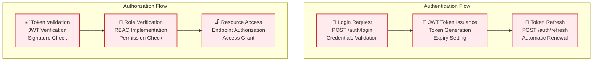
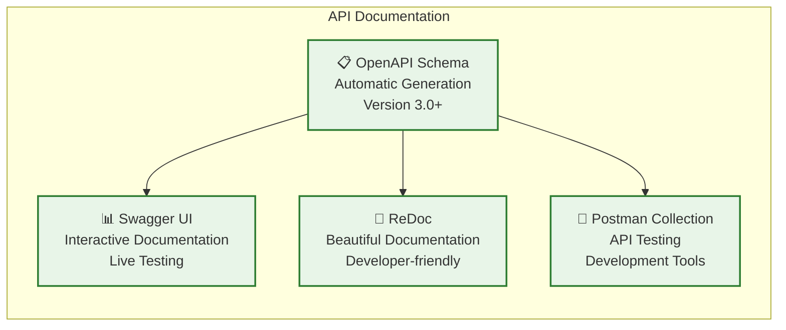
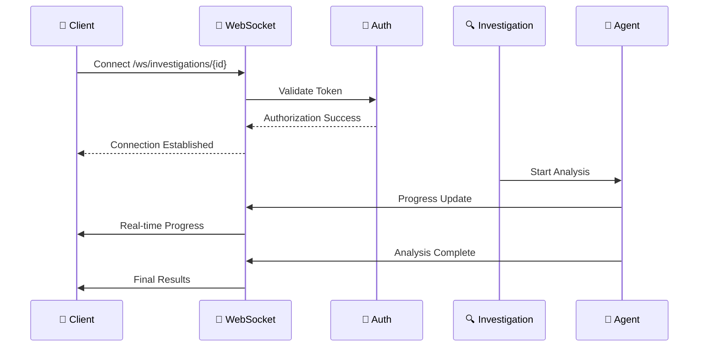
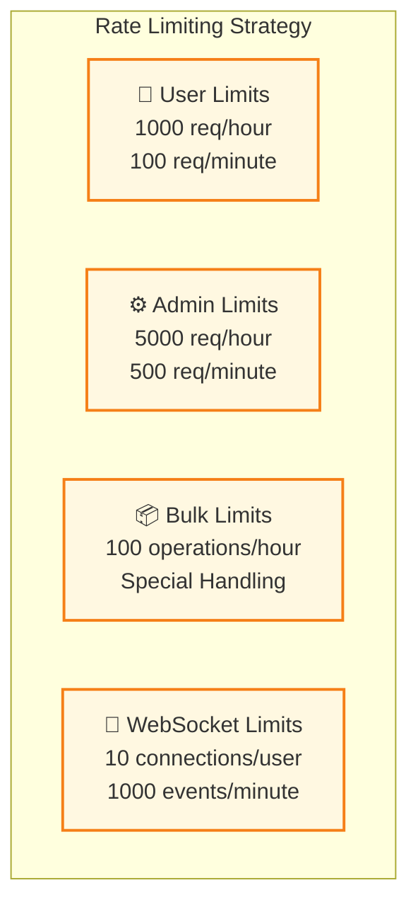
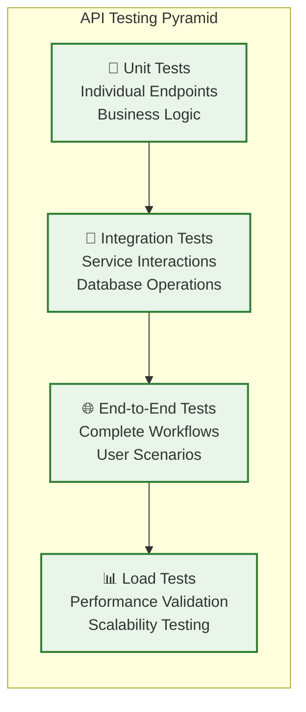

# API Endpoint Architecture

**Category**: Component-Specific Architecture  
**Purpose**: REST API design and endpoint structure within olorin-server  
**Created**: January 31, 2025  
**Status**: ✅ **COMPLETED**

---

## 🎯 DIAGRAM PURPOSE

This diagram provides a comprehensive view of the olorin-server API endpoint architecture, showing:
- Complete REST API endpoint structure and organization
- Request/response patterns and data models
- Authentication and authorization mechanisms
- API versioning and documentation strategies
- Rate limiting and security implementations
- WebSocket endpoints for real-time communication

---

## 🌐 COMPREHENSIVE API ENDPOINT ARCHITECTURE

```mermaid
graph TB
    subgraph "API Gateway & Entry Points"
        FASTAPI_APP[🔧 FastAPI Application<br/>ASGI Server<br/>OpenAPI Auto-generation]
        API_DOCS[📚 API Documentation<br/>Swagger UI<br/>ReDoc Interface]
        HEALTH_ENDPOINT[🏥 Health Check Endpoint<br/>/health<br/>Service Status]
    end
    
    subgraph "Authentication & Security Layer"
        AUTH_MIDDLEWARE[🔐 Authentication Middleware<br/>JWT Token Validation<br/>Bearer Token Processing]
        RBAC_MIDDLEWARE[👤 RBAC Middleware<br/>Role-based Access Control<br/>Permission Validation]
        RATE_LIMITER[⏱️ Rate Limiting<br/>Request Throttling<br/>Abuse Prevention]
        CORS_MIDDLEWARE[🌐 CORS Middleware<br/>Cross-Origin Requests<br/>Security Headers]
    end
    
    subgraph "Investigation API Endpoints"
        INVESTIGATION_ROUTER[🔍 Investigation Router<br/>/api/v1/investigations<br/>Investigation Management]
        
        subgraph "Investigation Endpoints"
            CREATE_INVESTIGATION[📝 POST /investigations<br/>Create New Investigation<br/>Request Validation]
            GET_INVESTIGATION[📊 GET /investigations/{id}<br/>Retrieve Investigation<br/>Result Formatting]
            LIST_INVESTIGATIONS[📋 GET /investigations<br/>List Investigations<br/>Pagination & Filtering]
            UPDATE_INVESTIGATION[✏️ PUT /investigations/{id}<br/>Update Investigation<br/>Status Management]
            DELETE_INVESTIGATION[🗑️ DELETE /investigations/{id}<br/>Delete Investigation<br/>Soft Delete]
            INVESTIGATION_STATUS[⏱️ GET /investigations/{id}/status<br/>Real-time Status<br/>Progress Tracking]
            INVESTIGATION_RESULTS[📊 GET /investigations/{id}/results<br/>Investigation Results<br/>Result Aggregation]
            INVESTIGATION_EXPORT[📤 GET /investigations/{id}/export<br/>Export Results<br/>Multiple Formats]
        end
    end
    
    subgraph "Agent Management API Endpoints"
        AGENT_ROUTER[🤖 Agent Router<br/>/api/v1/agents<br/>Agent Control]
        
        subgraph "Agent Endpoints"
            LIST_AGENTS[📋 GET /agents<br/>List Available Agents<br/>Capability Info]
            AGENT_STATUS[📊 GET /agents/{id}/status<br/>Agent Health Status<br/>Performance Metrics]
            AGENT_CONFIG[⚙️ GET /agents/{id}/config<br/>Agent Configuration<br/>Settings Management]
            UPDATE_AGENT_CONFIG[✏️ PUT /agents/{id}/config<br/>Update Agent Config<br/>Runtime Changes]
            AGENT_LOGS[📋 GET /agents/{id}/logs<br/>Agent Execution Logs<br/>Debug Information]
            TRIGGER_AGENT[🚀 POST /agents/{id}/trigger<br/>Manual Agent Trigger<br/>Custom Execution]
            AGENT_METRICS[📈 GET /agents/{id}/metrics<br/>Performance Metrics<br/>Historical Data]
        end
    end
    
    subgraph "User Management API Endpoints"
        USER_ROUTER[👤 User Router<br/>/api/v1/users<br/>User Administration]
        
        subgraph "User Endpoints"
            USER_PROFILE[👤 GET /users/profile<br/>Current User Profile<br/>User Information]
            UPDATE_PROFILE[✏️ PUT /users/profile<br/>Update User Profile<br/>Profile Management]
            LIST_USERS[📋 GET /users<br/>List Users<br/>Admin Only]
            CREATE_USER[📝 POST /users<br/>Create New User<br/>User Provisioning]
            UPDATE_USER[✏️ PUT /users/{id}<br/>Update User<br/>Admin Management]
            DELETE_USER[🗑️ DELETE /users/{id}<br/>Delete User<br/>Deactivation]
            USER_PERMISSIONS[🔐 GET /users/{id}/permissions<br/>User Permissions<br/>Access Rights]
            UPDATE_PERMISSIONS[🔐 PUT /users/{id}/permissions<br/>Update Permissions<br/>Role Assignment]
        end
    end
    
    subgraph "System Administration API Endpoints"
        ADMIN_ROUTER[⚙️ Admin Router<br/>/api/v1/admin<br/>System Administration]
        
        subgraph "Admin Endpoints"
            SYSTEM_STATUS[📊 GET /admin/status<br/>System Status<br/>Component Health]
            SYSTEM_METRICS[📈 GET /admin/metrics<br/>System Metrics<br/>Performance Data]
            SYSTEM_CONFIG[⚙️ GET /admin/config<br/>System Configuration<br/>Settings View]
            UPDATE_CONFIG[✏️ PUT /admin/config<br/>Update Configuration<br/>Runtime Changes]
            AUDIT_LOGS[📋 GET /admin/audit<br/>Audit Logs<br/>Security Events]
            BACKUP_DATA[💾 POST /admin/backup<br/>Data Backup<br/>Export Operations]
            RESTORE_DATA[📥 POST /admin/restore<br/>Data Restore<br/>Import Operations]
            MAINTENANCE_MODE[🔧 POST /admin/maintenance<br/>Maintenance Mode<br/>Service Control]
        end
    end
    
    subgraph "WebSocket Real-time Endpoints"
        WEBSOCKET_ROUTER[🔌 WebSocket Router<br/>/ws<br/>Real-time Communication]
        
        subgraph "WebSocket Endpoints"
            INVESTIGATION_WS[🔍 /ws/investigations/{id}<br/>Investigation Updates<br/>Real-time Progress]
            AGENT_WS[🤖 /ws/agents/{id}<br/>Agent Status Updates<br/>Live Monitoring]
            SYSTEM_WS[📊 /ws/system<br/>System Notifications<br/>Global Events]
            USER_WS[👤 /ws/user<br/>User Notifications<br/>Personal Updates]
        end
    end
    
    subgraph "External Integration API Endpoints"
        INTEGRATION_ROUTER[🔗 Integration Router<br/>/api/v1/integrations<br/>External Services]
        
        subgraph "Integration Endpoints"
            LIST_INTEGRATIONS[📋 GET /integrations<br/>List Integrations<br/>Service Status]
            INTEGRATION_STATUS[📊 GET /integrations/{id}/status<br/>Integration Health<br/>Connection Status]
            TEST_INTEGRATION[🧪 POST /integrations/{id}/test<br/>Test Connection<br/>Connectivity Check]
            INTEGRATION_CONFIG[⚙️ GET /integrations/{id}/config<br/>Integration Config<br/>Settings View]
            UPDATE_INTEGRATION[✏️ PUT /integrations/{id}/config<br/>Update Integration<br/>Configuration Changes]
            INTEGRATION_METRICS[📈 GET /integrations/{id}/metrics<br/>Integration Metrics<br/>Performance Data]
        end
    end
    
    subgraph "Data Models & Schemas"
        REQUEST_MODELS[📝 Request Models<br/>Pydantic Schemas<br/>Input Validation]
        RESPONSE_MODELS[📤 Response Models<br/>Output Formatting<br/>Serialization]
        ERROR_MODELS[🚨 Error Models<br/>Error Responses<br/>Exception Handling]
        SHARED_MODELS[🔄 Shared Models<br/>Common Schemas<br/>Reusable Types]
    end
    
    %% API Gateway Flow
    FASTAPI_APP --> API_DOCS
    FASTAPI_APP --> HEALTH_ENDPOINT
    FASTAPI_APP --> AUTH_MIDDLEWARE
    
    %% Security Layer Flow
    AUTH_MIDDLEWARE --> RBAC_MIDDLEWARE
    RBAC_MIDDLEWARE --> RATE_LIMITER
    RATE_LIMITER --> CORS_MIDDLEWARE
    
    %% Router Registration
    CORS_MIDDLEWARE --> INVESTIGATION_ROUTER
    CORS_MIDDLEWARE --> AGENT_ROUTER
    CORS_MIDDLEWARE --> USER_ROUTER
    CORS_MIDDLEWARE --> ADMIN_ROUTER
    CORS_MIDDLEWARE --> WEBSOCKET_ROUTER
    CORS_MIDDLEWARE --> INTEGRATION_ROUTER
    
    %% Investigation Endpoints
    INVESTIGATION_ROUTER --> CREATE_INVESTIGATION
    INVESTIGATION_ROUTER --> GET_INVESTIGATION
    INVESTIGATION_ROUTER --> LIST_INVESTIGATIONS
    INVESTIGATION_ROUTER --> UPDATE_INVESTIGATION
    INVESTIGATION_ROUTER --> DELETE_INVESTIGATION
    INVESTIGATION_ROUTER --> INVESTIGATION_STATUS
    INVESTIGATION_ROUTER --> INVESTIGATION_RESULTS
    INVESTIGATION_ROUTER --> INVESTIGATION_EXPORT
    
    %% Agent Endpoints
    AGENT_ROUTER --> LIST_AGENTS
    AGENT_ROUTER --> AGENT_STATUS
    AGENT_ROUTER --> AGENT_CONFIG
    AGENT_ROUTER --> UPDATE_AGENT_CONFIG
    AGENT_ROUTER --> AGENT_LOGS
    AGENT_ROUTER --> TRIGGER_AGENT
    AGENT_ROUTER --> AGENT_METRICS
    
    %% User Endpoints
    USER_ROUTER --> USER_PROFILE
    USER_ROUTER --> UPDATE_PROFILE
    USER_ROUTER --> LIST_USERS
    USER_ROUTER --> CREATE_USER
    USER_ROUTER --> UPDATE_USER
    USER_ROUTER --> DELETE_USER
    USER_ROUTER --> USER_PERMISSIONS
    USER_ROUTER --> UPDATE_PERMISSIONS
    
    %% Admin Endpoints
    ADMIN_ROUTER --> SYSTEM_STATUS
    ADMIN_ROUTER --> SYSTEM_METRICS
    ADMIN_ROUTER --> SYSTEM_CONFIG
    ADMIN_ROUTER --> UPDATE_CONFIG
    ADMIN_ROUTER --> AUDIT_LOGS
    ADMIN_ROUTER --> BACKUP_DATA
    ADMIN_ROUTER --> RESTORE_DATA
    ADMIN_ROUTER --> MAINTENANCE_MODE
    
    %% WebSocket Endpoints
    WEBSOCKET_ROUTER --> INVESTIGATION_WS
    WEBSOCKET_ROUTER --> AGENT_WS
    WEBSOCKET_ROUTER --> SYSTEM_WS
    WEBSOCKET_ROUTER --> USER_WS
    
    %% Integration Endpoints
    INTEGRATION_ROUTER --> LIST_INTEGRATIONS
    INTEGRATION_ROUTER --> INTEGRATION_STATUS
    INTEGRATION_ROUTER --> TEST_INTEGRATION
    INTEGRATION_ROUTER --> INTEGRATION_CONFIG
    INTEGRATION_ROUTER --> UPDATE_INTEGRATION
    INTEGRATION_ROUTER --> INTEGRATION_METRICS
    
    %% Data Model Relationships
    CREATE_INVESTIGATION --> REQUEST_MODELS
    GET_INVESTIGATION --> RESPONSE_MODELS
    LIST_INVESTIGATIONS --> RESPONSE_MODELS
    UPDATE_INVESTIGATION --> REQUEST_MODELS
    CREATE_USER --> REQUEST_MODELS
    UPDATE_CONFIG --> REQUEST_MODELS
    
    REQUEST_MODELS --> SHARED_MODELS
    RESPONSE_MODELS --> SHARED_MODELS
    ERROR_MODELS --> SHARED_MODELS
    
    %% Styling
    classDef gateway fill:#e1f5fe,stroke:#01579b,stroke-width:2px
    classDef security fill:#ffebee,stroke:#c62828,stroke-width:2px
    classDef investigation fill:#e8f5e8,stroke:#2e7d32,stroke-width:2px
    classDef agent fill:#fff3e0,stroke:#e65100,stroke-width:2px
    classDef user fill:#f3e5f5,stroke:#4a148c,stroke-width:2px
    classDef admin fill:#fff8e1,stroke:#f57f17,stroke-width:2px
    classDef websocket fill:#e1bee7,stroke:#4a148c,stroke-width:2px
    classDef integration fill:#ffccbc,stroke:#bf360c,stroke-width:2px
    classDef models fill:#f5f5f5,stroke:#424242,stroke-width:2px
    
    class FASTAPI_APP,API_DOCS,HEALTH_ENDPOINT gateway
    class AUTH_MIDDLEWARE,RBAC_MIDDLEWARE,RATE_LIMITER,CORS_MIDDLEWARE security
    class INVESTIGATION_ROUTER,CREATE_INVESTIGATION,GET_INVESTIGATION,LIST_INVESTIGATIONS,UPDATE_INVESTIGATION,DELETE_INVESTIGATION,INVESTIGATION_STATUS,INVESTIGATION_RESULTS,INVESTIGATION_EXPORT investigation
    class AGENT_ROUTER,LIST_AGENTS,AGENT_STATUS,AGENT_CONFIG,UPDATE_AGENT_CONFIG,AGENT_LOGS,TRIGGER_AGENT,AGENT_METRICS agent
    class USER_ROUTER,USER_PROFILE,UPDATE_PROFILE,LIST_USERS,CREATE_USER,UPDATE_USER,DELETE_USER,USER_PERMISSIONS,UPDATE_PERMISSIONS user
    class ADMIN_ROUTER,SYSTEM_STATUS,SYSTEM_METRICS,SYSTEM_CONFIG,UPDATE_CONFIG,AUDIT_LOGS,BACKUP_DATA,RESTORE_DATA,MAINTENANCE_MODE admin
    class WEBSOCKET_ROUTER,INVESTIGATION_WS,AGENT_WS,SYSTEM_WS,USER_WS websocket
    class INTEGRATION_ROUTER,LIST_INTEGRATIONS,INTEGRATION_STATUS,TEST_INTEGRATION,INTEGRATION_CONFIG,UPDATE_INTEGRATION,INTEGRATION_METRICS integration
    class REQUEST_MODELS,RESPONSE_MODELS,ERROR_MODELS,SHARED_MODELS models
```

---

## 🌐 API ENDPOINT CATEGORIES

### 🔍 Investigation Management API
**Base Path**: `/api/v1/investigations`  
**Purpose**: Core investigation workflow management

**Endpoints:**
- `POST /investigations` - Create new fraud investigation with case parameters
- `GET /investigations/{id}` - Retrieve complete investigation details and results  
- `GET /investigations` - List investigations with pagination and filtering
- `PUT /investigations/{id}` - Update investigation status and parameters
- `DELETE /investigations/{id}` - Soft delete investigation (admin only)
- `GET /investigations/{id}/status` - Real-time investigation progress and status
- `GET /investigations/{id}/results` - Formatted investigation results and analysis
- `GET /investigations/{id}/export` - Export results in multiple formats (JSON, CSV, PDF)

**Request/Response Examples:**
```json
POST /api/v1/investigations
{
  "case_id": "CASE-2025-001",
  "entity_type": "user",
  "entity_id": "user123",
  "investigation_type": "fraud_detection",
  "parameters": {
    "include_device_analysis": true,
    "include_location_analysis": true,
    "include_network_analysis": true,
    "include_logs_analysis": true,
    "priority": "high"
  }
}

Response:
{
  "investigation_id": "inv_abc123",
  "status": "initiated",
  "estimated_completion": "2025-01-31T15:30:00Z",
  "agents_assigned": ["device", "location", "network", "logs"],
  "created_at": "2025-01-31T15:25:00Z"
}
```

### 🤖 Agent Management API
**Base Path**: `/api/v1/agents`  
**Purpose**: AI agent control and monitoring

**Endpoints:**
- `GET /agents` - List all available agents with capabilities and status
- `GET /agents/{id}/status` - Agent health, performance metrics, and availability
- `GET /agents/{id}/config` - Agent configuration settings and parameters
- `PUT /agents/{id}/config` - Update agent configuration and runtime parameters
- `GET /agents/{id}/logs` - Agent execution logs and debug information
- `POST /agents/{id}/trigger` - Manually trigger agent execution for testing
- `GET /agents/{id}/metrics` - Historical performance metrics and analytics

**Response Example:**
```json
GET /api/v1/agents
{
  "agents": [
    {
      "id": "device_agent",
      "name": "Device Analysis Agent",
      "status": "healthy",
      "capabilities": ["fingerprinting", "behavioral_analysis", "reputation"],
      "current_load": 15,
      "max_capacity": 100,
      "average_execution_time": "2.3s",
      "last_health_check": "2025-01-31T15:25:00Z"
    }
  ]
}
```

### 👤 User Management API
**Base Path**: `/api/v1/users`  
**Purpose**: User administration and profile management

**Endpoints:**
- `GET /users/profile` - Current user profile and preferences
- `PUT /users/profile` - Update current user profile information
- `GET /users` - List all users (admin only) with role and status information
- `POST /users` - Create new user account with role assignment
- `PUT /users/{id}` - Update user information and status (admin only)
- `DELETE /users/{id}` - Deactivate user account (admin only)
- `GET /users/{id}/permissions` - View user permissions and access rights
- `PUT /users/{id}/permissions` - Update user permissions and role assignments

---

## 🔐 AUTHENTICATION & AUTHORIZATION

### 🛡️ Security Implementation


### 🔑 Authentication Endpoints
- `POST /auth/login` - User authentication with credentials
- `POST /auth/logout` - Session termination and token invalidation
- `POST /auth/refresh` - JWT token refresh for extended sessions
- `GET /auth/me` - Current user authentication status and profile
- `POST /auth/forgot-password` - Password reset request initiation
- `POST /auth/reset-password` - Password reset with validation token

### 👥 Role-Based Access Control
**Role Hierarchy:**
- **Super Admin**: Full system access, user management, system configuration
- **Admin**: Investigation management, user oversight, system monitoring
- **Investigator**: Investigation creation, agent control, result access
- **Analyst**: Read-only investigation access, report generation
- **Viewer**: Limited read-only access to assigned investigations

---

## 📊 API DOCUMENTATION & STANDARDS

### 📚 OpenAPI Specification


### 🏷️ API Versioning Strategy
- **URL Versioning**: `/api/v1/`, `/api/v2/` for major versions
- **Header Versioning**: `Accept: application/vnd.olorin.v1+json` for precise control
- **Backwards Compatibility**: Minimum 6-month support for deprecated versions
- **Migration Guides**: Comprehensive upgrade documentation for version changes

### 📏 Response Standards
**Standard Response Format:**
```json
{
  "success": true,
  "data": { /* Response payload */ },
  "metadata": {
    "timestamp": "2025-01-31T15:25:00Z",
    "request_id": "req_abc123",
    "version": "v1.2.0"
  },
  "pagination": {
    "page": 1,
    "per_page": 50,
    "total": 1250,
    "pages": 25
  }
}
```

**Error Response Format:**
```json
{
  "success": false,
  "error": {
    "code": "VALIDATION_ERROR",
    "message": "Invalid investigation parameters",
    "details": {
      "field": "entity_id",
      "issue": "Required field missing"
    }
  },
  "metadata": {
    "timestamp": "2025-01-31T15:25:00Z",
    "request_id": "req_abc123"
  }
}
```

---

## 🔌 WEBSOCKET REAL-TIME ENDPOINTS

### 📡 Real-time Communication Architecture


### 🔄 WebSocket Event Types
**Investigation Events:**
- `investigation.started` - Investigation initiated
- `investigation.progress` - Real-time progress updates
- `investigation.agent_complete` - Individual agent completion
- `investigation.completed` - Full investigation completion
- `investigation.error` - Investigation error or failure

**Agent Events:**
- `agent.status_change` - Agent status updates
- `agent.performance_alert` - Performance threshold alerts
- `agent.error` - Agent execution errors
- `agent.configuration_change` - Configuration updates

**System Events:**
- `system.maintenance` - System maintenance notifications
- `system.performance_alert` - System-wide performance alerts
- `system.security_event` - Security-related notifications

---

## ⚡ PERFORMANCE & OPTIMIZATION

### 🚀 API Performance Metrics
- **Response Times**: P95 < 200ms, P99 < 500ms for standard endpoints
- **Investigation Creation**: < 100ms for request processing
- **Real-time Updates**: < 50ms WebSocket message delivery
- **Bulk Operations**: < 2 seconds for batch processing (100 items)
- **File Exports**: < 5 seconds for standard report generation

### 📊 Rate Limiting & Throttling


### 🔄 Caching Strategy
- **Response Caching**: Redis-based caching for frequently accessed data
- **Database Query Caching**: ORM-level caching for complex queries
- **CDN Caching**: Static asset caching for API documentation
- **User Session Caching**: JWT token and user preference caching

---

## 🧪 API Testing & Quality Assurance

### 🔬 Testing Strategy


### 📋 Quality Metrics
- **Test Coverage**: >95% for API endpoints
- **Response Validation**: 100% Pydantic schema validation
- **Error Handling**: Comprehensive error response testing
- **Security Testing**: Authentication and authorization validation
- **Performance Testing**: Load testing for all critical endpoints

---

## 📚 RELATED DIAGRAMS

### Component Architecture
- [Backend Service Architecture](backend-service-architecture.md) - Overall backend structure
- [AI Agent Framework](ai-agent-framework.md) - Agent system integration
- [WebSocket Communication](websocket-communication.md) - Real-time messaging

### System Context
- [Olorin Ecosystem Overview](../../system/olorin-ecosystem-overview.md) - Complete system view
- [Integration Topology](../../system/integration-topology.md) - External API integrations

### Technical Implementation
- [Database Integration](database-integration.md) - Data persistence layer
- [Security Architecture](../../technical/security-architecture.md) - Security implementation

---

**Last Updated**: January 31, 2025  
**API Endpoints**: 45+ REST endpoints + 4 WebSocket endpoints  
**Documentation**: OpenAPI 3.0+ with interactive testing  
**Status**: ✅ **Production API Architecture** 