# Backend Service Architecture

**Category**: Component-Specific Architecture  
**Purpose**: Overall backend service structure and internal components  
**Created**: January 31, 2025  
**Status**: ✅ **COMPLETED**

---

## 🎯 DIAGRAM PURPOSE

This diagram provides a comprehensive view of the olorin-server backend architecture, showing:
- Internal service layer organization and responsibilities
- FastAPI application structure and routing
- AI agent framework integration
- Database and caching architecture
- External service adapter patterns
- Security and authentication layers

---

## 🏗️ COMPREHENSIVE BACKEND SERVICE ARCHITECTURE

```mermaid
graph TB
    subgraph "API Gateway Layer"
        FASTAPI[🔧 FastAPI Application<br/>ASGI Server (Uvicorn)<br/>OpenAPI Documentation]
        MIDDLEWARE[🛡️ Middleware Stack<br/>CORS, Security Headers<br/>Request Logging]
        AUTH_LAYER[🔐 Authentication Layer<br/>JWT Validation<br/>Role-based Access Control]
    end
    
    subgraph "Router Layer"
        API_ROUTER[🔀 API Router<br/>Endpoint Routing<br/>Request Validation]
        INVESTIGATION_ROUTER[🔍 Investigation Router<br/>Investigation Endpoints<br/>Case Management]
        AGENT_ROUTER[🤖 Agent Router<br/>Agent Control Endpoints<br/>Status & Results]
        ADMIN_ROUTER[⚙️ Admin Router<br/>System Administration<br/>Configuration Management]
    end
    
    subgraph "Service Layer"
        INVESTIGATION_SVC[🔍 Investigation Service<br/>Investigation Orchestration<br/>Business Logic]
        AGENT_SVC[🤖 Agent Service<br/>Agent Lifecycle Management<br/>Result Aggregation]
        USER_SVC[👤 User Service<br/>User Management<br/>Permission Handling]
        CONFIG_SVC[⚙️ Configuration Service<br/>System Configuration<br/>Feature Flags]
        NOTIFICATION_SVC[🔔 Notification Service<br/>Real-time Updates<br/>Alert Management]
    end
    
    subgraph "AI Agent Framework"
        AGENT_FACTORY[🏭 Agent Factory<br/>Agent Instantiation<br/>Dependency Injection]
        
        subgraph "Specialized Agents"
            DEVICE_AGENT[🔍 Device Analysis Agent<br/>Device Fingerprinting<br/>Behavioral Analysis]
            LOCATION_AGENT[📍 Location Analysis Agent<br/>Geographic Intelligence<br/>IP Geolocation]
            NETWORK_AGENT[🌐 Network Analysis Agent<br/>Network Security<br/>Threat Detection]
            LOGS_AGENT[📋 Logs Analysis Agent<br/>SIEM Processing<br/>Event Correlation]
            RISK_AGENT[⚠️ Risk Assessment Agent<br/>ML Risk Scoring<br/>Decision Support]
        end
        
        AGENT_ORCHESTRATOR[🎯 Agent Orchestrator<br/>Parallel Execution<br/>Result Coordination]
        AGENT_MONITOR[📊 Agent Monitor<br/>Health Monitoring<br/>Performance Tracking]
    end
    
    subgraph "Data Access Layer"
        REPOSITORY_LAYER[💾 Repository Layer<br/>Data Access Abstraction<br/>Query Optimization]
        
        subgraph "Repository Pattern"
            INVESTIGATION_REPO[🔍 Investigation Repository<br/>Investigation Data<br/>Case History]
            USER_REPO[👤 User Repository<br/>User Data<br/>Authentication Info]
            AGENT_REPO[🤖 Agent Repository<br/>Agent Results<br/>Performance Metrics]
            CONFIG_REPO[⚙️ Configuration Repository<br/>System Settings<br/>Feature Toggles]
        end
        
        ORM_LAYER[🔄 ORM Layer (SQLAlchemy)<br/>Object-Relational Mapping<br/>Database Abstraction]
    end
    
    subgraph "External Integration Layer"
        ADAPTER_FACTORY[🏭 Adapter Factory<br/>Service Discovery<br/>Connection Management]
        
        subgraph "Service Adapters"
            SIEM_ADAPTER[📊 SIEM Adapter<br/>Splunk, Elastic<br/>QRadar Integration]
            THREAT_ADAPTER[🛡️ Threat Intel Adapter<br/>VirusTotal, CrowdStrike<br/>Mandiant Integration]
            DEVICE_ADAPTER[📱 Device Intel Adapter<br/>Iovation, ThreatMetrix<br/>NeuroID Integration]
            GEO_ADAPTER[🗺️ Geographic Adapter<br/>MaxMind, IPQualityScore<br/>Google Maps Integration]
            ML_ADAPTER[🧠 ML Service Adapter<br/>OpenAI, Anthropic<br/>Pinecone Integration]
        end
        
        CIRCUIT_BREAKER[⚡ Circuit Breaker<br/>Fault Tolerance<br/>Graceful Degradation]
        RETRY_HANDLER[🔄 Retry Handler<br/>Exponential Backoff<br/>Error Recovery]
    end
    
    subgraph "Caching & Performance"
        CACHE_MANAGER[🔴 Cache Manager<br/>Multi-tier Caching<br/>TTL Management]
        REDIS_CACHE[🔴 Redis Cache<br/>Session Storage<br/>Real-time Data]
        MEMORY_CACHE[💾 Memory Cache<br/>Frequently Accessed Data<br/>Query Results]
        CONNECTION_POOL[🔗 Connection Pool<br/>Database Connections<br/>HTTP Connections]
    end
    
    subgraph "Background Processing"
        TASK_QUEUE[📋 Task Queue (Celery)<br/>Async Task Processing<br/>Job Scheduling]
        WORKER_PROCESSES[⚙️ Worker Processes<br/>Background Investigations<br/>Data Processing]
        SCHEDULER[⏰ Scheduler<br/>Periodic Tasks<br/>Maintenance Jobs]
    end
    
    subgraph "Database Layer"
        PRIMARY_DB[💾 Primary Database<br/>PostgreSQL Cluster<br/>Investigation Data]
        READ_REPLICA[📖 Read Replica<br/>Query Optimization<br/>Analytics Workload]
        MIGRATIONS[🔄 Database Migrations<br/>Alembic Migration System<br/>Schema Evolution]
    end
    
    subgraph "Monitoring & Observability"
        HEALTH_CHECK[🏥 Health Check<br/>Service Health<br/>Dependency Status]
        METRICS_COLLECTOR[📊 Metrics Collector<br/>Performance Metrics<br/>Business KPIs]
        LOGGER[📋 Structured Logger<br/>Request Logging<br/>Audit Trail]
        TRACER[🔍 Distributed Tracer<br/>Request Tracing<br/>Performance Analysis]
    end
    
    %% API Gateway Flow
    FASTAPI --> MIDDLEWARE
    MIDDLEWARE --> AUTH_LAYER
    AUTH_LAYER --> API_ROUTER
    
    %% Router Distribution
    API_ROUTER --> INVESTIGATION_ROUTER
    API_ROUTER --> AGENT_ROUTER
    API_ROUTER --> ADMIN_ROUTER
    
    %% Service Layer Connections
    INVESTIGATION_ROUTER --> INVESTIGATION_SVC
    AGENT_ROUTER --> AGENT_SVC
    ADMIN_ROUTER --> USER_SVC
    ADMIN_ROUTER --> CONFIG_SVC
    
    %% Cross-service Communication
    INVESTIGATION_SVC --> AGENT_SVC
    AGENT_SVC --> NOTIFICATION_SVC
    USER_SVC --> CONFIG_SVC
    
    %% Agent Framework Integration
    AGENT_SVC --> AGENT_FACTORY
    AGENT_FACTORY --> DEVICE_AGENT
    AGENT_FACTORY --> LOCATION_AGENT
    AGENT_FACTORY --> NETWORK_AGENT
    AGENT_FACTORY --> LOGS_AGENT
    AGENT_FACTORY --> RISK_AGENT
    
    %% Agent Orchestration
    AGENT_SVC --> AGENT_ORCHESTRATOR
    AGENT_ORCHESTRATOR --> DEVICE_AGENT
    AGENT_ORCHESTRATOR --> LOCATION_AGENT
    AGENT_ORCHESTRATOR --> NETWORK_AGENT
    AGENT_ORCHESTRATOR --> LOGS_AGENT
    AGENT_ORCHESTRATOR --> RISK_AGENT
    
    %% Agent Monitoring
    AGENT_MONITOR --> DEVICE_AGENT
    AGENT_MONITOR --> LOCATION_AGENT
    AGENT_MONITOR --> NETWORK_AGENT
    AGENT_MONITOR --> LOGS_AGENT
    AGENT_MONITOR --> RISK_AGENT
    
    %% Data Access Layer
    INVESTIGATION_SVC --> REPOSITORY_LAYER
    AGENT_SVC --> REPOSITORY_LAYER
    USER_SVC --> REPOSITORY_LAYER
    CONFIG_SVC --> REPOSITORY_LAYER
    
    REPOSITORY_LAYER --> INVESTIGATION_REPO
    REPOSITORY_LAYER --> USER_REPO
    REPOSITORY_LAYER --> AGENT_REPO
    REPOSITORY_LAYER --> CONFIG_REPO
    
    INVESTIGATION_REPO --> ORM_LAYER
    USER_REPO --> ORM_LAYER
    AGENT_REPO --> ORM_LAYER
    CONFIG_REPO --> ORM_LAYER
    
    %% External Integration
    DEVICE_AGENT --> ADAPTER_FACTORY
    LOCATION_AGENT --> ADAPTER_FACTORY
    NETWORK_AGENT --> ADAPTER_FACTORY
    LOGS_AGENT --> ADAPTER_FACTORY
    RISK_AGENT --> ADAPTER_FACTORY
    
    ADAPTER_FACTORY --> SIEM_ADAPTER
    ADAPTER_FACTORY --> THREAT_ADAPTER
    ADAPTER_FACTORY --> DEVICE_ADAPTER
    ADAPTER_FACTORY --> GEO_ADAPTER
    ADAPTER_FACTORY --> ML_ADAPTER
    
    SIEM_ADAPTER --> CIRCUIT_BREAKER
    THREAT_ADAPTER --> CIRCUIT_BREAKER
    DEVICE_ADAPTER --> CIRCUIT_BREAKER
    GEO_ADAPTER --> CIRCUIT_BREAKER
    ML_ADAPTER --> CIRCUIT_BREAKER
    
    CIRCUIT_BREAKER --> RETRY_HANDLER
    
    %% Caching Integration
    INVESTIGATION_SVC --> CACHE_MANAGER
    AGENT_SVC --> CACHE_MANAGER
    CACHE_MANAGER --> REDIS_CACHE
    CACHE_MANAGER --> MEMORY_CACHE
    
    %% Connection Pooling
    ORM_LAYER --> CONNECTION_POOL
    ADAPTER_FACTORY --> CONNECTION_POOL
    
    %% Background Processing
    INVESTIGATION_SVC --> TASK_QUEUE
    AGENT_SVC --> TASK_QUEUE
    TASK_QUEUE --> WORKER_PROCESSES
    SCHEDULER --> TASK_QUEUE
    
    %% Database Connections
    ORM_LAYER --> PRIMARY_DB
    ORM_LAYER --> READ_REPLICA
    MIGRATIONS --> PRIMARY_DB
    
    %% Monitoring Integration
    FASTAPI --> HEALTH_CHECK
    INVESTIGATION_SVC --> METRICS_COLLECTOR
    AGENT_SVC --> METRICS_COLLECTOR
    FASTAPI --> LOGGER
    INVESTIGATION_SVC --> TRACER
    
    %% Styling
    classDef api fill:#e1f5fe,stroke:#01579b,stroke-width:2px
    classDef router fill:#f3e5f5,stroke:#4a148c,stroke-width:2px
    classDef service fill:#fff3e0,stroke:#e65100,stroke-width:2px
    classDef agent fill:#e8f5e8,stroke:#2e7d32,stroke-width:2px
    classDef data fill:#fff8e1,stroke:#f57f17,stroke-width:2px
    classDef integration fill:#ffebee,stroke:#c62828,stroke-width:2px
    classDef performance fill:#f5f5f5,stroke:#424242,stroke-width:2px
    classDef monitoring fill:#e1bee7,stroke:#4a148c,stroke-width:2px
    
    class FASTAPI,MIDDLEWARE,AUTH_LAYER api
    class API_ROUTER,INVESTIGATION_ROUTER,AGENT_ROUTER,ADMIN_ROUTER router
    class INVESTIGATION_SVC,AGENT_SVC,USER_SVC,CONFIG_SVC,NOTIFICATION_SVC service
    class AGENT_FACTORY,DEVICE_AGENT,LOCATION_AGENT,NETWORK_AGENT,LOGS_AGENT,RISK_AGENT,AGENT_ORCHESTRATOR,AGENT_MONITOR agent
    class REPOSITORY_LAYER,INVESTIGATION_REPO,USER_REPO,AGENT_REPO,CONFIG_REPO,ORM_LAYER,PRIMARY_DB,READ_REPLICA,MIGRATIONS data
    class ADAPTER_FACTORY,SIEM_ADAPTER,THREAT_ADAPTER,DEVICE_ADAPTER,GEO_ADAPTER,ML_ADAPTER,CIRCUIT_BREAKER,RETRY_HANDLER integration
    class CACHE_MANAGER,REDIS_CACHE,MEMORY_CACHE,CONNECTION_POOL,TASK_QUEUE,WORKER_PROCESSES,SCHEDULER performance
    class HEALTH_CHECK,METRICS_COLLECTOR,LOGGER,TRACER monitoring
```

---

## 🏗️ ARCHITECTURAL LAYERS DESCRIPTION

### 🔧 API Gateway Layer
**Purpose**: Request handling, authentication, and API documentation

**Components:**
- **FastAPI Application**: ASGI-based web framework with automatic OpenAPI generation
- **Middleware Stack**: Cross-cutting concerns like CORS, security headers, request logging
- **Authentication Layer**: JWT token validation and role-based access control

**Key Features:**
- Automatic API documentation with Swagger UI
- High-performance async request handling
- Comprehensive security middleware
- Request/response validation with Pydantic

### 🔀 Router Layer
**Purpose**: Request routing and endpoint organization

**Components:**
- **API Router**: Main routing hub for request distribution
- **Investigation Router**: Investigation-specific endpoints and case management
- **Agent Router**: AI agent control and status endpoints
- **Admin Router**: System administration and configuration

**Key Features:**
- Modular endpoint organization
- Automatic request validation
- Dependency injection for services
- OpenAPI schema generation

### ⚙️ Service Layer
**Purpose**: Business logic implementation and domain services

**Components:**
- **Investigation Service**: Core investigation orchestration and workflow management
- **Agent Service**: AI agent lifecycle management and result aggregation
- **User Service**: User management and permission handling
- **Configuration Service**: System configuration and feature flag management
- **Notification Service**: Real-time updates and alert distribution

**Key Features:**
- Clean separation of business logic
- Domain-driven design principles
- Dependency injection and IoC
- Comprehensive error handling

### 🤖 AI Agent Framework
**Purpose**: Specialized investigation agent orchestration

**Components:**
- **Agent Factory**: Dynamic agent instantiation and dependency injection
- **Specialized Agents**: Domain-specific investigation capabilities
- **Agent Orchestrator**: Parallel agent execution and result coordination
- **Agent Monitor**: Health monitoring and performance tracking

**Key Features:**
- Plugin-based agent architecture
- Parallel processing for performance
- Dynamic agent discovery and loading
- Comprehensive monitoring and metrics

---

## 🔄 DATA FLOW PATTERNS

### 📥 Request Processing Flow

```mermaid
sequenceDiagram
    participant Client as 👤 Client
    participant API as 🔧 FastAPI
    participant Auth as 🔐 Auth Layer
    participant Router as 🔀 Router
    participant Service as ⚙️ Service
    participant Agent as 🤖 Agent
    participant DB as 💾 Database
    
    Client->>API: HTTP Request
    API->>Auth: Validate Token
    Auth->>Router: Route Request
    Router->>Service: Business Logic
    Service->>Agent: Trigger Investigation
    Agent->>DB: Store Results
    DB-->>Service: Data Response
    Service-->>Client: Investigation Results
```


### 🔍 Agent Execution Flow

```mermaid
sequenceDiagram
    participant Service as ⚙️ Agent Service
    participant Factory as 🏭 Agent Factory
    participant Orchestrator as 🎯 Orchestrator
    participant Agents as 🤖 Agents
    participant Adapters as 🔗 Adapters
    participant Cache as 🔴 Cache
    
    Service->>Factory: Create Agents
    Factory->>Orchestrator: Initialize Orchestration
    Orchestrator->>Agents: Execute in Parallel
    Agents->>Adapters: Query External Services
    Adapters->>Cache: Cache Results
    Cache-->>Service: Aggregated Results
```


### 💾 Data Persistence Flow


---

## 🚀 PERFORMANCE CHARACTERISTICS

### ⚡ Response Time Benchmarks
- **Authentication**: < 50ms (JWT validation)
- **Simple API Endpoints**: < 100ms (user data, configuration)
- **Investigation Initiation**: < 200ms (queue processing)
- **Agent Status Queries**: < 150ms (cached results)
- **Complex Investigations**: < 5 seconds (full agent execution)

### 📊 Throughput Metrics
- **Concurrent Requests**: 1,000+ requests/second
- **Database Connections**: 100+ concurrent connections
- **Agent Executions**: 50+ parallel investigations
- **External API Calls**: 10,000+ requests/minute
- **WebSocket Connections**: 500+ concurrent users

### 💾 Resource Utilization
- **Memory Usage**: 512MB - 2GB per instance
- **CPU Utilization**: 70-80% under peak load
- **Database Pool**: 20-50 connections per instance
- **Cache Hit Rate**: 85-95% for frequently accessed data

---

## 🔐 SECURITY ARCHITECTURE

### 🛡️ Authentication & Authorization


### 🔒 Data Protection
- **Encryption at Rest**: AES-256 encryption for sensitive data
- **Encryption in Transit**: TLS 1.3 for all external communications
- **Secret Management**: HashiCorp Vault integration for API keys
- **Audit Logging**: Comprehensive access and modification logging

### 🚨 Security Monitoring
- **Anomaly Detection**: Unusual access pattern detection
- **Rate Limiting**: Request throttling and abuse prevention
- **Security Headers**: CORS, CSP, and security header enforcement
- **Vulnerability Scanning**: Automated dependency vulnerability checks

---

## 📈 SCALABILITY & DEPLOYMENT

### 🔄 Horizontal Scaling Strategy


### 📦 Deployment Characteristics
- **Container Ready**: Docker containerization with health checks
- **Cloud Native**: Kubernetes deployment with auto-scaling
- **Environment Agnostic**: Configuration-driven environment support
- **Zero Downtime**: Blue-green deployment with graceful shutdown

### 🔄 Auto-scaling Triggers
- **CPU Utilization**: Scale at 70% average CPU usage
- **Memory Usage**: Scale at 80% memory utilization
- **Request Queue**: Scale when queue depth > 100 requests
- **Response Time**: Scale when P95 response time > 500ms

---

## 📚 RELATED DIAGRAMS

### Component Architecture
- [AI Agent Framework](ai-agent-framework.md) - Detailed agent architecture
- [API Endpoint Architecture](api-endpoint-architecture.md) - REST API structure
- [Database Integration](database-integration.md) - Data persistence patterns

### Process Flows
- [Investigation Processing Flow](investigation-processing-flow.md) - Investigation workflow
- [Agent Orchestration Flow](agent-orchestration-flow.md) - Agent coordination

### System Context
- [Olorin Ecosystem Overview](../../system/olorin-ecosystem-overview.md) - Complete system view
- [Integration Topology](../../system/integration-topology.md) - External integrations

---

**Last Updated**: January 31, 2025  
**Architecture Complexity**: Enterprise-grade microservice  
**Code Base**: 70,000+ lines of Python  
**Status**: ✅ **Production Architecture** 