# Investigation Processing Flow

**Category**: Component-Specific Process Flow  
**Purpose**: End-to-end investigation workflow within olorin-server  
**Created**: January 31, 2025  
**Status**: ✅ **COMPLETED**

---

## 🎯 DIAGRAM PURPOSE

This diagram illustrates the complete investigation processing workflow within olorin-server, showing:
- End-to-end investigation lifecycle from initiation to completion
- Multi-agent parallel processing and coordination patterns
- Real-time progress tracking and status updates
- Error handling and recovery mechanisms
- Result aggregation and reporting workflows
- Performance optimization and caching strategies

---

## 🔄 COMPREHENSIVE INVESTIGATION PROCESSING FLOW

```mermaid
flowchart TD
    subgraph "Investigation Initiation"
        USER_REQUEST[👤 User Investigation Request<br/>Case Parameters<br/>Entity Information]
        API_VALIDATION[✅ Request Validation<br/>Parameter Validation<br/>Schema Verification]
        AUTH_CHECK[🔐 Authorization Check<br/>User Permissions<br/>Resource Access]
        CASE_CREATION[📝 Case Creation<br/>Investigation Record<br/>Unique Case ID]
    end
    
    subgraph "Investigation Planning"
        AGENT_SELECTION[🎯 Agent Selection<br/>Capability Matching<br/>Workload Analysis]
        RESOURCE_ALLOCATION[⚖️ Resource Allocation<br/>Priority Assignment<br/>Capacity Planning]
        EXECUTION_PLAN[📋 Execution Planning<br/>Dependency Analysis<br/>Parallel Strategy]
        QUEUE_MANAGEMENT[📊 Queue Management<br/>Priority Ordering<br/>Load Balancing]
    end
    
    subgraph "Parallel Agent Execution"
        subgraph "Device Analysis Path"
            DEVICE_INIT[🔍 Device Agent Init<br/>Parameter Setup<br/>Context Loading]
            DEVICE_FINGERPRINT[🔍 Device Fingerprinting<br/>Hardware Analysis<br/>Browser Properties]
            DEVICE_BEHAVIOR[📊 Behavior Analysis<br/>User Patterns<br/>Interaction Mining]
            DEVICE_REPUTATION[⚡ Reputation Check<br/>Device History<br/>Risk Assessment]
            DEVICE_RESULTS[📊 Device Results<br/>Risk Score<br/>Evidence Collection]
        end
        
        subgraph "Location Analysis Path"
            LOCATION_INIT[📍 Location Agent Init<br/>Geographic Setup<br/>IP Analysis]
            GEOLOCATION[🗺️ Geolocation Analysis<br/>IP Mapping<br/>Geographic Context]
            VELOCITY_CHECK[🚀 Velocity Analysis<br/>Movement Patterns<br/>Travel Validation]
            LOCATION_RISK[⚠️ Location Risk<br/>Geographic Threats<br/>Risk Scoring]
            LOCATION_RESULTS[📊 Location Results<br/>Geographic Profile<br/>Risk Assessment]
        end
        
        subgraph "Network Analysis Path"
            NETWORK_INIT[🌐 Network Agent Init<br/>Security Setup<br/>Traffic Context]
            TRAFFIC_ANALYSIS[📊 Traffic Analysis<br/>Flow Patterns<br/>Connection Mining]
            THREAT_DETECTION[🛡️ Threat Detection<br/>Malicious Activity<br/>Security Incidents]
            NETWORK_REPUTATION[🔍 Network Reputation<br/>IP/Domain Checks<br/>Blacklist Analysis]
            NETWORK_RESULTS[📊 Network Results<br/>Security Profile<br/>Threat Assessment]
        end
        
        subgraph "Logs Analysis Path"
            LOGS_INIT[📋 Logs Agent Init<br/>SIEM Connection<br/>Query Setup]
            EVENT_PROCESSING[⚙️ Event Processing<br/>Log Parsing<br/>Event Normalization]
            CORRELATION[🔗 Event Correlation<br/>Timeline Analysis<br/>Pattern Detection]
            ANOMALY_DETECTION[🚨 Anomaly Detection<br/>Unusual Patterns<br/>Incident Identification]
            LOGS_RESULTS[📊 Logs Results<br/>Security Events<br/>Incident Timeline]
        end
    end
    
    subgraph "Result Processing & Aggregation"
        RESULT_COLLECTION[🔄 Result Collection<br/>Agent Result Gathering<br/>Status Monitoring]
        DATA_VALIDATION[✅ Data Validation<br/>Quality Checks<br/>Consistency Verification]
        RESULT_CORRELATION[🔗 Cross-Agent Correlation<br/>Pattern Analysis<br/>Entity Linking]
        RISK_CALCULATION[⚠️ Risk Calculation<br/>Composite Scoring<br/>ML Risk Assessment]
    end
    
    subgraph "Advanced Analytics & ML Processing"
        ML_FEATURE_EXTRACTION[🧠 Feature Extraction<br/>Data Transformation<br/>Vector Generation]
        PATTERN_ANALYSIS[🔍 Pattern Analysis<br/>Anomaly Detection<br/>Behavioral Modeling]
        RISK_MODELING[📊 Risk Modeling<br/>ML Prediction<br/>Confidence Scoring]
        DECISION_SUPPORT[🎯 Decision Support<br/>Recommendation Engine<br/>Action Suggestions]
    end
    
    subgraph "Real-time Communication"
        PROGRESS_TRACKING[📊 Progress Tracking<br/>Status Updates<br/>Milestone Monitoring]
        WEBSOCKET_UPDATES[🔌 WebSocket Updates<br/>Real-time Notifications<br/>Live Progress]
        USER_NOTIFICATIONS[🔔 User Notifications<br/>Status Alerts<br/>Completion Notice]
        DASHBOARD_REFRESH[📱 Dashboard Refresh<br/>UI Updates<br/>Result Display]
    end
    
    subgraph "Error Handling & Recovery"
        ERROR_DETECTION[🚨 Error Detection<br/>Failure Monitoring<br/>Exception Handling]
        RECOVERY_STRATEGY[🔄 Recovery Strategy<br/>Retry Logic<br/>Fallback Procedures]
        PARTIAL_RESULTS[📊 Partial Results<br/>Available Data<br/>Best Effort Response]
        ERROR_REPORTING[📋 Error Reporting<br/>Incident Logging<br/>Alert Generation]
    end
    
    subgraph "Investigation Completion"
        RESULT_FORMATTING[📄 Result Formatting<br/>Report Generation<br/>Output Structuring]
        QUALITY_ASSURANCE[✅ Quality Assurance<br/>Result Validation<br/>Accuracy Verification]
        REPORT_GENERATION[📋 Report Generation<br/>Executive Summary<br/>Technical Details]
        CASE_CLOSURE[🔒 Case Closure<br/>Final Status<br/>Archive Process]
    end
    
    subgraph "Data Persistence & Caching"
        RESULT_CACHING[🔴 Result Caching<br/>Performance Optimization<br/>Quick Retrieval]
        DATABASE_STORAGE[💾 Database Storage<br/>Persistent Storage<br/>Historical Archive]
        AUDIT_LOGGING[📋 Audit Logging<br/>Investigation Trail<br/>Compliance Record]
        METADATA_STORAGE[📝 Metadata Storage<br/>Investigation Context<br/>Search Indexing]
    end
    
    %% Investigation Initiation Flow
    USER_REQUEST --> API_VALIDATION
    API_VALIDATION --> AUTH_CHECK
    AUTH_CHECK --> CASE_CREATION
    
    %% Investigation Planning Flow
    CASE_CREATION --> AGENT_SELECTION
    AGENT_SELECTION --> RESOURCE_ALLOCATION
    RESOURCE_ALLOCATION --> EXECUTION_PLAN
    EXECUTION_PLAN --> QUEUE_MANAGEMENT
    
    %% Parallel Agent Initialization
    QUEUE_MANAGEMENT --> DEVICE_INIT
    QUEUE_MANAGEMENT --> LOCATION_INIT
    QUEUE_MANAGEMENT --> NETWORK_INIT
    QUEUE_MANAGEMENT --> LOGS_INIT
    
    %% Device Analysis Flow
    DEVICE_INIT --> DEVICE_FINGERPRINT
    DEVICE_FINGERPRINT --> DEVICE_BEHAVIOR
    DEVICE_BEHAVIOR --> DEVICE_REPUTATION
    DEVICE_REPUTATION --> DEVICE_RESULTS
    
    %% Location Analysis Flow
    LOCATION_INIT --> GEOLOCATION
    GEOLOCATION --> VELOCITY_CHECK
    VELOCITY_CHECK --> LOCATION_RISK
    LOCATION_RISK --> LOCATION_RESULTS
    
    %% Network Analysis Flow
    NETWORK_INIT --> TRAFFIC_ANALYSIS
    TRAFFIC_ANALYSIS --> THREAT_DETECTION
    THREAT_DETECTION --> NETWORK_REPUTATION
    NETWORK_REPUTATION --> NETWORK_RESULTS
    
    %% Logs Analysis Flow
    LOGS_INIT --> EVENT_PROCESSING
    EVENT_PROCESSING --> CORRELATION
    CORRELATION --> ANOMALY_DETECTION
    ANOMALY_DETECTION --> LOGS_RESULTS
    
    %% Result Aggregation Flow
    DEVICE_RESULTS --> RESULT_COLLECTION
    LOCATION_RESULTS --> RESULT_COLLECTION
    NETWORK_RESULTS --> RESULT_COLLECTION
    LOGS_RESULTS --> RESULT_COLLECTION
    
    RESULT_COLLECTION --> DATA_VALIDATION
    DATA_VALIDATION --> RESULT_CORRELATION
    RESULT_CORRELATION --> RISK_CALCULATION
    
    %% Advanced Analytics Flow
    RISK_CALCULATION --> ML_FEATURE_EXTRACTION
    ML_FEATURE_EXTRACTION --> PATTERN_ANALYSIS
    PATTERN_ANALYSIS --> RISK_MODELING
    RISK_MODELING --> DECISION_SUPPORT
    
    %% Real-time Communication Flow
    DEVICE_INIT --> PROGRESS_TRACKING
    LOCATION_INIT --> PROGRESS_TRACKING
    NETWORK_INIT --> PROGRESS_TRACKING
    LOGS_INIT --> PROGRESS_TRACKING
    
    PROGRESS_TRACKING --> WEBSOCKET_UPDATES
    WEBSOCKET_UPDATES --> USER_NOTIFICATIONS
    USER_NOTIFICATIONS --> DASHBOARD_REFRESH
    
    %% Error Handling Integration
    DEVICE_FINGERPRINT --> ERROR_DETECTION
    GEOLOCATION --> ERROR_DETECTION
    TRAFFIC_ANALYSIS --> ERROR_DETECTION
    EVENT_PROCESSING --> ERROR_DETECTION
    
    ERROR_DETECTION --> RECOVERY_STRATEGY
    RECOVERY_STRATEGY --> PARTIAL_RESULTS
    RECOVERY_STRATEGY --> ERROR_REPORTING
    
    %% Investigation Completion Flow
    DECISION_SUPPORT --> RESULT_FORMATTING
    PARTIAL_RESULTS --> RESULT_FORMATTING
    RESULT_FORMATTING --> QUALITY_ASSURANCE
    QUALITY_ASSURANCE --> REPORT_GENERATION
    REPORT_GENERATION --> CASE_CLOSURE
    
    %% Data Persistence Flow
    DEVICE_RESULTS --> RESULT_CACHING
    LOCATION_RESULTS --> RESULT_CACHING
    NETWORK_RESULTS --> RESULT_CACHING
    LOGS_RESULTS --> RESULT_CACHING
    
    RESULT_CACHING --> DATABASE_STORAGE
    CASE_CREATION --> AUDIT_LOGGING
    RESULT_FORMATTING --> METADATA_STORAGE
    
    %% Styling
    classDef initiation fill:#e1f5fe,stroke:#01579b,stroke-width:2px
    classDef planning fill:#f3e5f5,stroke:#4a148c,stroke-width:2px
    classDef agents fill:#e8f5e8,stroke:#2e7d32,stroke-width:2px
    classDef processing fill:#fff3e0,stroke:#e65100,stroke-width:2px
    classDef analytics fill:#ffebee,stroke:#c62828,stroke-width:2px
    classDef communication fill:#fff8e1,stroke:#f57f17,stroke-width:2px
    classDef error fill:#ffcdd2,stroke:#d32f2f,stroke-width:2px
    classDef completion fill:#e1bee7,stroke:#4a148c,stroke-width:2px
    classDef persistence fill:#f5f5f5,stroke:#424242,stroke-width:2px
    
    class USER_REQUEST,API_VALIDATION,AUTH_CHECK,CASE_CREATION initiation
    class AGENT_SELECTION,RESOURCE_ALLOCATION,EXECUTION_PLAN,QUEUE_MANAGEMENT planning
    class DEVICE_INIT,DEVICE_FINGERPRINT,DEVICE_BEHAVIOR,DEVICE_REPUTATION,DEVICE_RESULTS,LOCATION_INIT,GEOLOCATION,VELOCITY_CHECK,LOCATION_RISK,LOCATION_RESULTS,NETWORK_INIT,TRAFFIC_ANALYSIS,THREAT_DETECTION,NETWORK_REPUTATION,NETWORK_RESULTS,LOGS_INIT,EVENT_PROCESSING,CORRELATION,ANOMALY_DETECTION,LOGS_RESULTS agents
    class RESULT_COLLECTION,DATA_VALIDATION,RESULT_CORRELATION,RISK_CALCULATION processing
    class ML_FEATURE_EXTRACTION,PATTERN_ANALYSIS,RISK_MODELING,DECISION_SUPPORT analytics
    class PROGRESS_TRACKING,WEBSOCKET_UPDATES,USER_NOTIFICATIONS,DASHBOARD_REFRESH communication
    class ERROR_DETECTION,RECOVERY_STRATEGY,PARTIAL_RESULTS,ERROR_REPORTING error
    class RESULT_FORMATTING,QUALITY_ASSURANCE,REPORT_GENERATION,CASE_CLOSURE completion
    class RESULT_CACHING,DATABASE_STORAGE,AUDIT_LOGGING,METADATA_STORAGE persistence
```



---

## 🔄 INVESTIGATION LIFECYCLE PHASES

### ⚡ Phase 1: Investigation Initiation (100-200ms)
**Purpose**: Request validation and case setup

**Process Steps:**
1. **Request Validation**: Verify investigation parameters and data formats
2. **Authorization Check**: Validate user permissions and resource access rights
3. **Case Creation**: Generate unique case ID and initialize investigation record
4. **Initial Logging**: Create audit trail and investigation metadata

**Performance Targets:**
- Request validation: < 50ms
- Authorization check: < 30ms
- Case creation: < 100ms
- Total phase duration: < 200ms

### 🎯 Phase 2: Investigation Planning (200-500ms)
**Purpose**: Resource allocation and execution strategy

**Process Steps:**
1. **Agent Selection**: Match investigation requirements to available agents
2. **Resource Allocation**: Assign computational resources based on priority
3. **Execution Planning**: Determine parallel execution strategy and dependencies
4. **Queue Management**: Schedule investigation based on system load

**Intelligence Features:**
- Dynamic agent selection based on investigation type
- Intelligent resource allocation considering system capacity
- Optimized execution planning for parallel processing
- Priority-based queue management with load balancing

### 🚀 Phase 3: Parallel Agent Execution (2-5 seconds)
**Purpose**: Core investigation analysis across all domains

**Agent Execution Patterns:**


**Real-time Monitoring:**
- Live progress updates via WebSocket
- Agent health monitoring and performance tracking
- Error detection and automatic recovery
- Dynamic resource reallocation based on performance

### 🔬 Phase 4: Result Processing & Analytics (500-1000ms)
**Purpose**: Advanced analytics and intelligent result aggregation

**Processing Components:**
1. **Result Collection**: Gather and validate results from all agents
2. **Cross-Agent Correlation**: Identify patterns across different analysis domains
3. **ML Risk Calculation**: Apply machine learning models for advanced risk assessment
4. **Decision Support**: Generate actionable recommendations and insights

**Advanced Analytics Features:**
- Multi-dimensional pattern analysis
- Behavioral anomaly detection using ML
- Predictive risk modeling with confidence scoring
- Contextual decision support with action recommendations

---

## 📊 REAL-TIME PROGRESS TRACKING

### 🔌 WebSocket Communication Pattern

```mermaid
sequenceDiagram
    participant User as 👤 User
    participant WS as 🔌 WebSocket
    participant Progress as 📊 Progress Tracker
    participant Agents as 🤖 Agents
    participant ML as 🧠 ML Engine
    
    User->>WS: Connect to Investigation
    WS-->>User: Connection Established
    
    loop Agent Execution
        Agents->>Progress: Update Progress
        Progress->>WS: Progress Event
        WS->>User: Real-time Update
    end
    
    ML->>Progress: Analytics Complete
    Progress->>WS: Final Results
    WS->>User: Investigation Complete
```


### 📈 Progress Event Types
**Agent Progress Events:**
- `agent.started` - Agent execution initiated
- `agent.progress` - Percentage completion updates
- `agent.milestone` - Key milestone achievements
- `agent.completed` - Agent execution finished
- `agent.error` - Agent execution errors

**Investigation Progress Events:**
- `investigation.queued` - Investigation queued for processing
- `investigation.started` - Investigation execution started
- `investigation.progress` - Overall progress percentage
- `investigation.analytics` - Advanced analytics phase
- `investigation.completed` - Investigation finished
- `investigation.error` - Investigation failed

### 📱 User Interface Updates

```mermaid
graph LR
    subgraph "Real-time UI Updates"
        PROGRESS[📊 Progress Bar<br/>Overall Completion<br/>Agent Status]
        TIMELINE[⏱️ Timeline View<br/>Execution Stages<br/>Milestone Tracking]
        RESULTS[📋 Results Preview<br/>Partial Results<br/>Live Updates]
        ALERTS[🔔 Status Alerts<br/>Notifications<br/>Error Messages]
    end
    
    classDef ui fill:#e1f5fe,stroke:#01579b,stroke-width:2px
    class PROGRESS,TIMELINE,RESULTS,ALERTS ui
```


---

## 🚨 ERROR HANDLING & RECOVERY

### 🔄 Error Recovery Strategies
**Agent-Level Recovery:**

```mermaid
graph TB
    subgraph "Error Recovery Flow"
        ERROR[🚨 Agent Error<br/>Exception Detection<br/>Failure Analysis]
        RETRY[🔄 Retry Logic<br/>Exponential Backoff<br/>Max Attempts: 3]
        FALLBACK[📊 Fallback Strategy<br/>Alternative Methods<br/>Reduced Functionality]
        PARTIAL[📊 Partial Results<br/>Available Data<br/>Best Effort Response]
    end
    
    ERROR --> RETRY
    RETRY -->|Success| PARTIAL
    RETRY -->|Max Retries| FALLBACK
    FALLBACK --> PARTIAL
    
    classDef error fill:#ffcdd2,stroke:#d32f2f,stroke-width:2px
    class ERROR,RETRY,FALLBACK,PARTIAL error
```


### 🛡️ Resilience Patterns
**Circuit Breaker Implementation:**
- **Closed State**: Normal operation with monitoring
- **Open State**: Fast-fail when error threshold exceeded
- **Half-Open State**: Limited testing to recover from failures

**Timeout Management:**
- Agent execution timeouts with graceful degradation
- External API timeouts with retry mechanisms
- Database query timeouts with connection pooling

**Graceful Degradation:**
- Continue investigation with available agents if some fail
- Provide partial results with quality indicators
- Maintain investigation state for later retry attempts

### 📋 Error Reporting & Alerting
**Error Classification:**
- **Transient Errors**: Network timeouts, temporary service unavailability
- **Permanent Errors**: Authentication failures, invalid configurations
- **Data Errors**: Malformed responses, validation failures
- **System Errors**: Resource exhaustion, infrastructure failures

**Alert Escalation:**
1. **Info Level**: Agent warnings and performance degradation
2. **Warning Level**: Partial failures and extended processing times
3. **Error Level**: Agent failures requiring attention
4. **Critical Level**: System-wide failures requiring immediate action

---

## ⚡ PERFORMANCE OPTIMIZATION

### 🔴 Caching Strategy Implementation
```mermaid
graph TB
    subgraph "Multi-Tier Caching"
        L1[🔴 L1 Cache (Redis)<br/>Hot Investigation Data<br/>TTL: 1 hour]
        L2[🟡 L2 Cache (Memory)<br/>Agent Results<br/>TTL: 4 hours]
        L3[💾 L3 Cache (Database)<br/>Historical Results<br/>TTL: 24 hours]
        CDN[🌐 CDN Cache<br/>Static Resources<br/>TTL: 7 days]
    end
    
    L1 --> L2
    L2 --> L3
    L3 --> CDN
    
    classDef cache fill:#fff8e1,stroke:#f57f17,stroke-width:2px
    class L1,L2,L3,CDN cache
```

### 📊 Performance Benchmarks
**Investigation Processing Times:**
- **Simple Investigation** (2 agents): < 3 seconds
- **Standard Investigation** (4 agents): < 5 seconds
- **Complex Investigation** (5 agents + ML): < 8 seconds
- **Bulk Investigation** (10+ cases): < 30 seconds

**System Throughput:**
- **Concurrent Investigations**: 100+ simultaneous
- **Investigation Queue**: 1,000+ queued investigations
- **Agent Utilization**: 80-90% optimal usage
- **Cache Hit Rate**: 85-95% for repeated queries

### 🚀 Scaling Strategies
**Horizontal Scaling:**
- Stateless investigation workers for easy scaling
- Agent pools with dynamic allocation
- Database read replicas for improved query performance
- Distributed caching with Redis clustering

**Vertical Scaling:**
- Multi-core agent processing with parallel execution
- Memory optimization for large-scale investigations
- SSD storage for improved I/O performance
- High-bandwidth networking for external API calls

---

## 💾 DATA MANAGEMENT & PERSISTENCE

### 🗃️ Investigation Data Storage

```mermaid
graph TB
    subgraph "Data Storage Architecture"
        TRANSACTIONAL[💾 Transactional Data<br/>PostgreSQL Primary<br/>ACID Compliance]
        ANALYTICAL[📊 Analytical Data<br/>Read Replicas<br/>Query Optimization]
        CACHE_STORAGE[🔴 Cache Storage<br/>Redis Cluster<br/>High Performance]
        ARCHIVE[📦 Archive Storage<br/>Cold Storage<br/>Long-term Retention]
    end
    
    TRANSACTIONAL --> ANALYTICAL
    TRANSACTIONAL --> CACHE_STORAGE
    ANALYTICAL --> ARCHIVE
    
    classDef storage fill:#e8f5e8,stroke:#2e7d32,stroke-width:2px
    class TRANSACTIONAL,ANALYTICAL,CACHE_STORAGE,ARCHIVE storage
```


### 📋 Data Retention & Compliance
**Retention Policies:**
- **Active Investigations**: 30 days in hot storage
- **Completed Investigations**: 1 year in warm storage
- **Archived Investigations**: 7 years in cold storage
- **Audit Logs**: 10 years for compliance requirements

**Data Privacy & Security:**
- Personal data anonymization for GDPR compliance
- Encryption at rest with AES-256
- Encryption in transit with TLS 1.3
- Access logging for all data operations

---

## 📚 RELATED DIAGRAMS

### Component Architecture
- [Backend Service Architecture](backend-service-architecture.md) - Overall backend structure
- [AI Agent Framework](ai-agent-framework.md) - Agent orchestration details
- [API Endpoint Architecture](api-endpoint-architecture.md) - API integration points

### System Context
- [Olorin Ecosystem Overview](../../system/olorin-ecosystem-overview.md) - Complete system view
- [Data Flow Architecture](../../system/data-flow-architecture.md) - System-wide data flows

### Process Flows
- [Agent Orchestration Flow](agent-orchestration-flow.md) - Detailed agent coordination
- [Risk Assessment Flow](../../flows/risk-assessment-flow.md) - Risk evaluation process

---

**Last Updated**: January 31, 2025  
**Processing Capacity**: 100+ concurrent investigations  
**Average Completion**: < 5 seconds for standard investigations  
**Status**: ✅ **Production Investigation Workflow** 