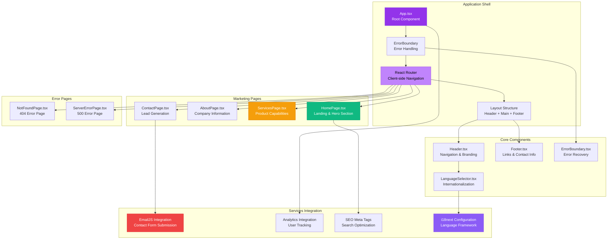

# MARKETING WEBSITE ARCHITECTURE

**Component**: olorin-web-portal  
**Type**: React TypeScript Marketing Website Architecture  
**Created**: January 31, 2025  
**Purpose**: Complete marketing website structure with internationalization and lead generation  

---

## 🏗️ COMPLETE MARKETING WEBSITE ARCHITECTURE

---

## 🎯 MARKETING WEBSITE FEATURES

### Content Management
- **Multi-page Structure**: 6 main pages (Home, About, Services, Contact, Error pages)
- **Internationalization**: i18next with browser language detection
- **SEO Optimization**: Meta tags, structured data, and search optimization
- **Lead Generation**: Contact forms with EmailJS integration

### Technical Architecture
- **React 18**: Modern React with TypeScript for type safety
- **Tailwind CSS**: Utility-first styling with responsive design
- **React Router**: Client-side navigation for smooth user experience
- **Performance**: Optimized bundle size and loading times

### Marketing Features
- **Professional Design**: Clean, modern UI optimized for business conversion
- **Mobile-first**: Responsive design for all device types
- **Analytics Ready**: Google Analytics integration for user tracking
- **Error Handling**: Professional error pages for better user experience

---

**Last Updated**: January 31, 2025  
**Architecture Version**: 1.0  
**React Version**: 18.2.0  
**Tailwind Version**: 3.3.0
