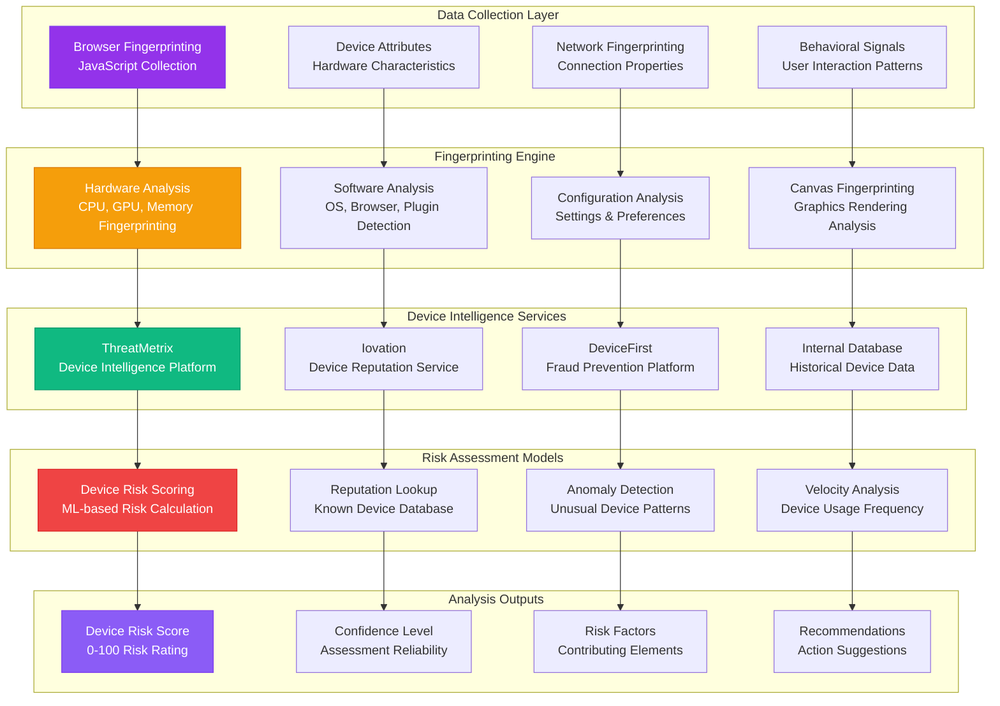

# DEVICE ANALYSIS DOMAIN

**Type**: Device Intelligence and Fingerprinting Analysis Domain  
**Created**: January 31, 2025  
**Purpose**: Comprehensive device analysis for fraud investigation and risk assessment  
**Scope**: Hardware/software fingerprinting, device reputation, and behavioral analysis  

---

## 📱 COMPLETE DEVICE ANALYSIS ARCHITECTURE

---

**Last Updated**: January 31, 2025  
**Domain Version**: 2.0  
**Device Analysis Accuracy**: >97% device identification  
**Processing Time**: <500ms per analysis
