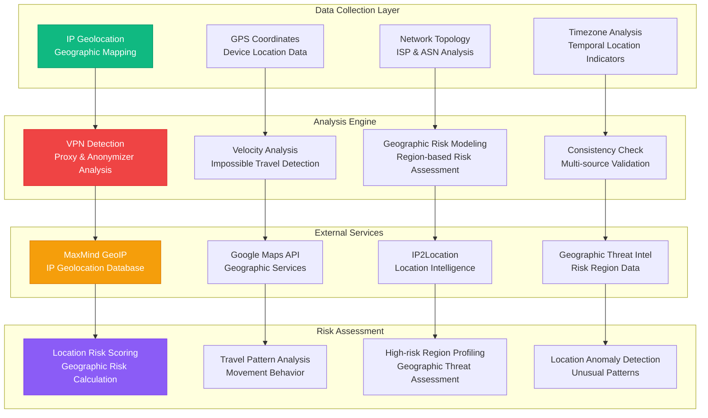

# LOCATION ANALYSIS DOMAIN

**Type**: Geographic Intelligence and Location Analysis Domain  
**Created**: January 31, 2025  
**Purpose**: Comprehensive geographic analysis for fraud investigation and risk assessment  
**Scope**: IP geolocation, VPN detection, impossible travel analysis, and geographic risk modeling  

---

## �� COMPLETE LOCATION ANALYSIS ARCHITECTURE

---

**Last Updated**: January 31, 2025  
**Domain Version**: 2.0  
**Location Accuracy**: >95% geographic precision  
**VPN Detection Rate**: >92% proxy identification
