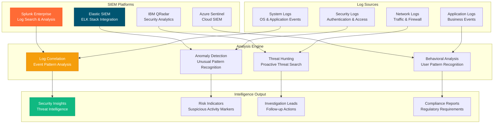

# LOGS ANALYSIS DOMAIN

**Type**: SIEM and Log Intelligence Analysis Domain  
**Created**: January 31, 2025  
**Purpose**: Comprehensive log analysis for fraud investigation and security monitoring  
**Scope**: SIEM integration, log correlation, anomaly detection, and security event analysis  

---

## 📊 COMPLETE LOGS ANALYSIS ARCHITECTURE

---

**Last Updated**: January 31, 2025  
**Domain Version**: 2.0  
**Log Processing Rate**: >10GB/hour analysis capability  
**Anomaly Detection Accuracy**: >91% suspicious pattern identification
