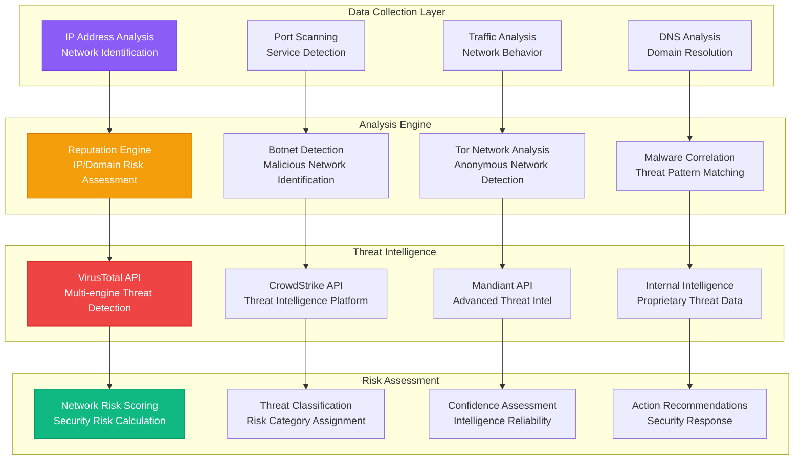

# NETWORK ANALYSIS DOMAIN

**Type**: Network Security and Threat Intelligence Analysis Domain  
**Created**: January 31, 2025  
**Purpose**: Comprehensive network analysis for fraud investigation and security assessment  
**Scope**: IP reputation, threat intelligence, network security analysis, and botnet detection  

---

## 🌐 COMPLETE NETWORK ANALYSIS ARCHITECTURE

---

**Last Updated**: January 31, 2025  
**Domain Version**: 2.0  
**Threat Detection Accuracy**: >94% malicious IP identification  
**Response Time**: <800ms for threat intelligence lookup
