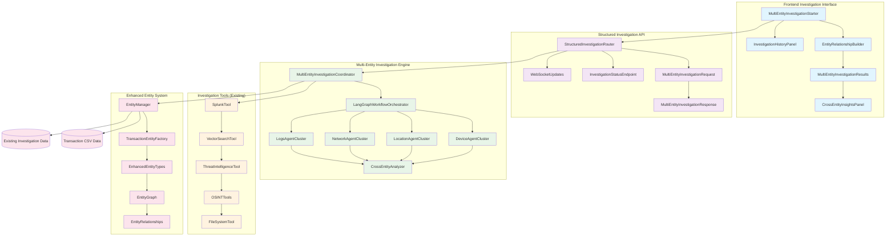
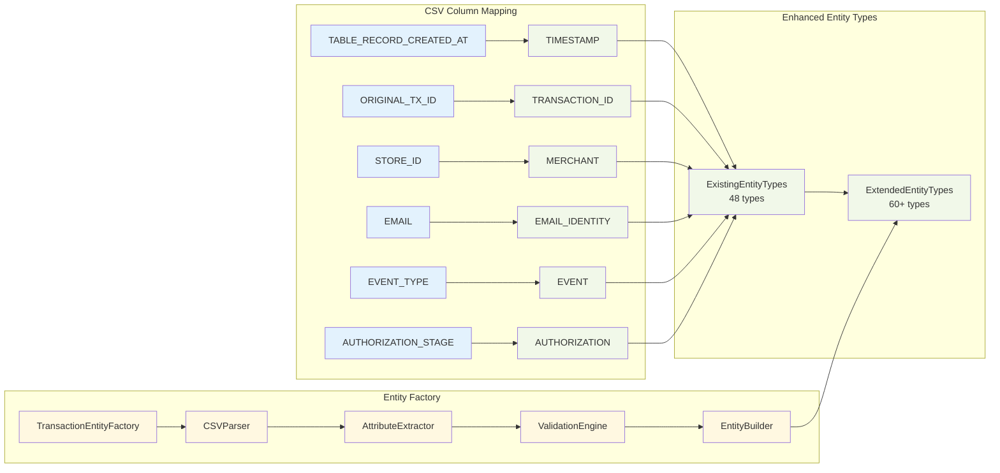
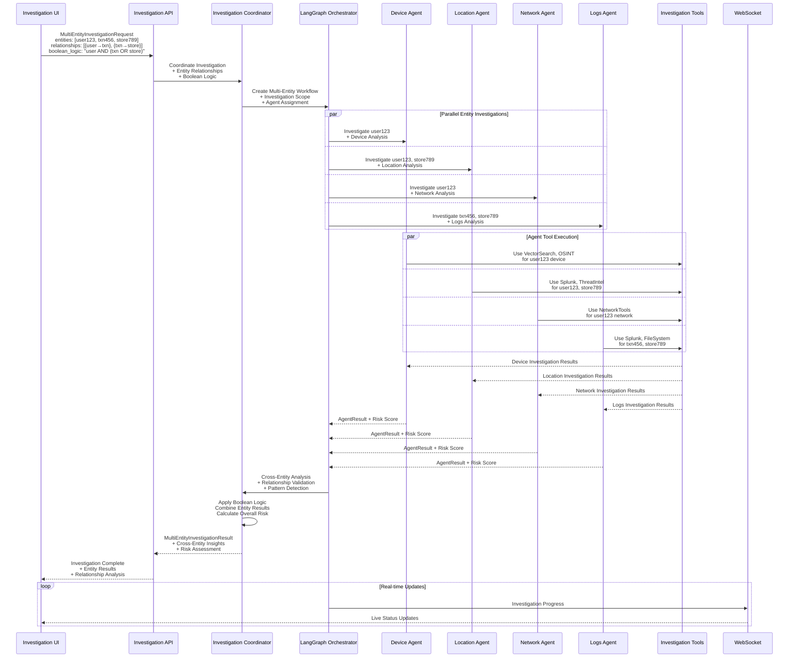
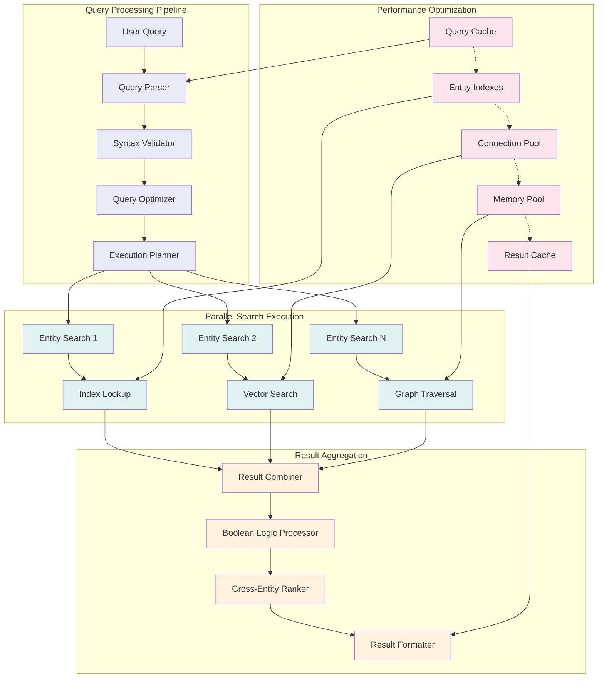
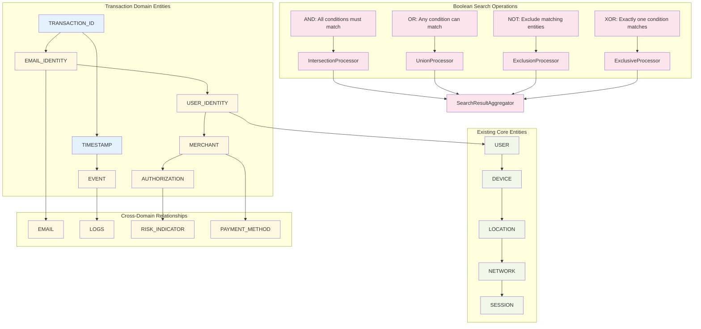
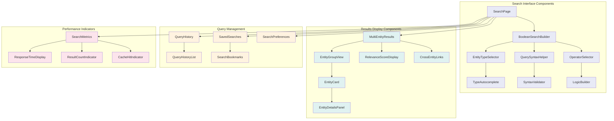
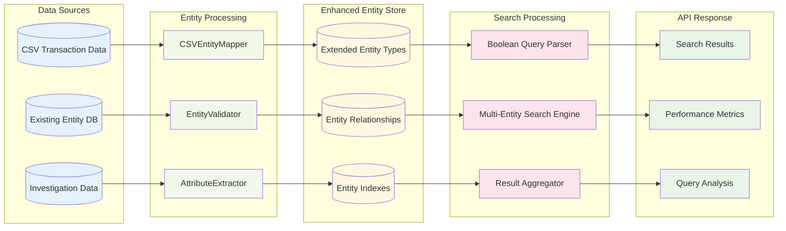
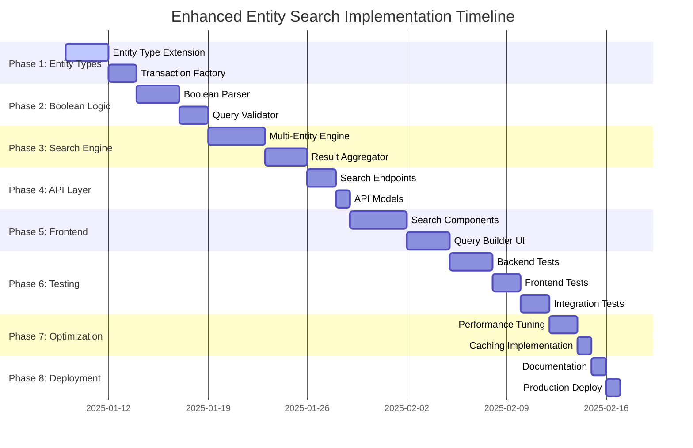

# Multi-Entity Structured Investigation System Architecture

**Date:** 2025-01-09  
**Plan Reference:** [Multi-Entity Structured Investigation System Plan](/docs/plans/2025-01-09-enhanced-entity-search-system-plan.md)  
**Author:** Gil Klainert

## Multi-Entity Investigation Architecture Overview

## Entity Type Extension Architecture

## Multi-Entity Structured Investigation Flow

## Multi-Entity Search Performance Architecture

## Enhanced Entity Relationship Graph

## Frontend Component Architecture

## Data Flow Architecture

## Implementation Phase Dependencies

This architectural diagram provides a comprehensive visual representation of the enhanced entity search system, showing the relationships between components, data flow patterns, and implementation dependencies. The diagrams support the detailed implementation plan and provide clear guidance for the development team during implementation.