# Extended MCP Tools Architecture

```mermaid
graph TB
    subgraph "Olorin Extended MCP Ecosystem"
        subgraph "Core MCP Foundation (Existing)"
            MCP[MCP Client Manager]
            TR[Tool Registry - 25 tools]
            ETN[Enhanced Tool Node]
            
            subgraph "Current Tool Categories"
                DB[Database Tools - 2]
                WEB[Web Tools - 2] 
                FS[File System - 4]
                API[API Tools - 2]
                SEARCH[Search Tools - 1]
                OLO[Olorin Specific - 7]
                TI[Threat Intel - 12]
            end
        end
        
        subgraph "Phase 5: Blockchain & Crypto Tools"
            BC[Blockchain Analysis Suite]
            WA[Wallet Analysis Tool]
            CT[Crypto Tracing Tool]
            DA[DeFi Analysis Tool]
            NFT[NFT Fraud Detection]
            CE[Crypto Exchange Analysis]
            DWC[Dark Web Crypto Monitor]
            CC[Crypto Compliance Tool]
        end
        
        subgraph "Phase 6: Intelligence Gathering Tools"
            SOCMINT[Social Media Intelligence]
            SMP[Social Media Profiling]
            SNA[Social Network Analysis]
            SMM[Social Media Monitoring]
            
            OSINT[OSINT Data Aggregator]
            PS[People Search Tool]
            BI[Business Intelligence]
            
            DARKWEB[Dark Web Monitoring]
            DWS[Deep Web Search]
        end
        
        subgraph "Phase 7: ML/AI Enhancement Tools"
            ML[ML Model Serving]
            FML[Fraud ML Model]
            BAM[Behavioral Analysis ML]
            TAM[Text Analysis ML]
            
            CV[Computer Vision Suite]
            IF[Image Forensics]
            VA[Video Analysis]
            AF[Audio Forensics]
        end
        
        subgraph "Phase 8: Communication Tools"
            COMM[Communication Integration]
            SLACK[Slack Integration]
            TEAMS[Teams Integration]
            EMAIL[Email Analysis]
            
            CM[Case Management]
            IW[Investigation Workflow]
        end
        
        subgraph "Phase 9: Compliance Tools"
            COMP[Compliance Framework]
            AML[AML Compliance]
            GDPR[GDPR Compliance]
            SOX[SOX Compliance]
            BANK[Banking Compliance]
            INS[Insurance Compliance]
            PAY[Payment Compliance]
        end
    end
    
    subgraph "Enhanced Infrastructure"
        EMCP[Enhanced MCP Client Manager]
        ESF[Extended Security Framework]
        ETR[Extended Tool Registry - 175+ tools]
        PO[Performance Optimizer]
        MM[Monitoring & Metrics]
    end
    
    subgraph "External Integrations"
        subgraph "Blockchain APIs"
            CHAIN[Chainalysis API]
            ELLIP[Elliptic API]
            TRM[TRM Labs API]
        end
        
        subgraph "Intelligence APIs"
            SOCIAL[Social Media APIs]
            OSINTAPI[OSINT Data Sources]
            DWAPI[Dark Web APIs]
        end
        
        subgraph "ML/AI Services"
            MLAPI[ML Model APIs]
            VISION[Computer Vision APIs]
            NLP[NLP Services]
        end
        
        subgraph "Communication Platforms"
            SLACKAPI[Slack API]
            TEAMSAPI[Microsoft Teams API]
            EMAILAPI[Email Services]
        end
        
        subgraph "Compliance Services"
            REGAPI[Regulatory APIs]
            COMPAPI[Compliance Databases]
            AUDITAPI[Audit Services]
        end
    end
    
    %% Connections
    MCP --> EMCP
    TR --> ETR
    ETN --> PO
    
    EMCP --> BC
    EMCP --> SOCMINT
    EMCP --> ML
    EMCP --> COMM
    EMCP --> COMP
    
    BC --> CHAIN
    BC --> ELLIP
    BC --> TRM
    
    SOCMINT --> SOCIAL
    OSINT --> OSINTAPI
    DARKWEB --> DWAPI
    
    ML --> MLAPI
    CV --> VISION
    TAM --> NLP
    
    COMM --> SLACKAPI
    COMM --> TEAMSAPI
    EMAIL --> EMAILAPI
    
    COMP --> REGAPI
    COMP --> COMPAPI
    COMP --> AUDITAPI
    
    ESF --> EMCP
    MM --> ETR
    PO --> MM
    
    classDef existing fill:#e1f5fe
    classDef phase5 fill:#f3e5f5
    classDef phase6 fill:#e8f5e8
    classDef phase7 fill:#fff3e0
    classDef phase8 fill:#fce4ec
    classDef phase9 fill:#f1f8e9
    classDef infrastructure fill:#f5f5f5
    classDef external fill:#ffebee
    
    class MCP,TR,ETN,DB,WEB,FS,API,SEARCH,OLO,TI existing
    class BC,WA,CT,DA,NFT,CE,DWC,CC phase5
    class SOCMINT,SMP,SNA,SMM,OSINT,PS,BI,DARKWEB,DWS phase6
    class ML,FML,BAM,TAM,CV,IF,VA,AF phase7
    class COMM,SLACK,TEAMS,EMAIL,CM,IW phase8
    class COMP,AML,GDPR,SOX,BANK,INS,PAY phase9
    class EMCP,ESF,ETR,PO,MM infrastructure
    class CHAIN,ELLIP,TRM,SOCIAL,OSINTAPI,DWAPI,MLAPI,VISION,NLP,SLACKAPI,TEAMSAPI,EMAILAPI,REGAPI,COMPAPI,AUDITAPI external
```

## Architecture Overview

This diagram illustrates the comprehensive extension of Olorin's MCP tools ecosystem, expanding from 25 existing tools to 175+ specialized fraud detection tools across 15 categories.

### Color Coding
- **Light Blue** (existing): Current MCP foundation with 25 tools
- **Purple** (Phase 5): Blockchain & cryptocurrency analysis tools
- **Green** (Phase 6): Intelligence gathering tools (OSINT, SOCMINT, Dark Web)
- **Orange** (Phase 7): ML/AI enhancement tools
- **Pink** (Phase 8): Communication & collaboration tools
- **Light Green** (Phase 9): Compliance & regulatory tools
- **Gray**: Enhanced infrastructure components
- **Light Red**: External API integrations

### Key Components

#### Core MCP Foundation (Existing)
- **MCP Client Manager**: Current client management system
- **Tool Registry**: Managing 25 existing tools
- **Enhanced Tool Node**: Resilient tool execution framework
- **Current Categories**: Database, Web, File System, API, Search, Olorin-specific, Threat Intelligence

#### Phase 5: Blockchain & Cryptocurrency (15 tools)
- Wallet analysis and risk scoring
- Transaction tracing across chains
- DeFi protocol analysis
- NFT fraud detection
- Crypto exchange monitoring
- Dark web cryptocurrency tracking
- Compliance and regulatory tools

#### Phase 6: Intelligence Gathering (20 tools)
- Social media profiling and network analysis
- OSINT data aggregation
- People and business intelligence
- Dark web and deep web monitoring
- Evidence preservation and correlation

#### Phase 7: ML/AI Enhancement (12 tools)
- Fraud detection ML models
- Behavioral analysis
- Text and NLP analysis
- Image, video, and audio forensics
- Deepfake detection

#### Phase 8: Communication & Collaboration (8 tools)
- Slack and Teams integration
- Email forensics
- Case management
- Investigation workflow automation

#### Phase 9: Compliance & Regulatory (10 tools)
- AML/CFT compliance
- GDPR and data privacy
- SOX financial compliance
- Industry-specific compliance (banking, insurance, payments)

#### Enhanced Infrastructure
- **Enhanced MCP Client Manager**: Advanced routing and management
- **Extended Security Framework**: Multi-layer security for sensitive tools
- **Extended Tool Registry**: Managing 175+ tools
- **Performance Optimizer**: Ensuring sub-2-second response times
- **Monitoring & Metrics**: Real-time health and performance tracking

#### External Integrations
- **Blockchain APIs**: Chainalysis, Elliptic, TRM Labs
- **Intelligence APIs**: Social media, OSINT sources, dark web
- **ML/AI Services**: Model serving, computer vision, NLP
- **Communication Platforms**: Slack, Microsoft Teams, email services
- **Compliance Services**: Regulatory databases, audit services

### Data Flow
1. Requests flow from the existing MCP Client Manager to the Enhanced MCP Client Manager
2. The Enhanced Manager intelligently routes requests to appropriate tool categories
3. Each tool category connects to relevant external APIs and services
4. The Extended Security Framework validates all sensitive operations
5. Performance Optimizer ensures efficient resource utilization
6. Monitoring & Metrics track all operations for compliance and performance

### Integration Points
- Backward compatible with existing 25 tools
- Seamless integration with current EnhancedToolNode
- Maintains existing tool registry structure while extending capabilities
- Preserves all current security and monitoring frameworks

This architecture ensures Olorin evolves from a fraud detection platform to a comprehensive enterprise investigation ecosystem while maintaining stability, security, and performance.