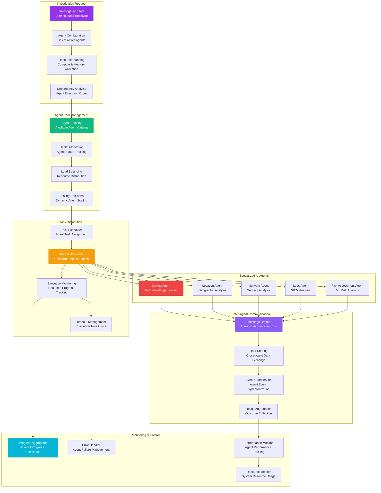

# AGENT ORCHESTRATION FLOW

**Type**: AI Agent Coordination and Management Process  
**Created**: January 31, 2025  
**Purpose**: Complete agent orchestration workflow for parallel AI investigation execution  
**Scope**: Multi-agent coordination with real-time monitoring and resource management  

---

## 🤖 COMPLETE AGENT ORCHESTRATION FLOW

---

**Last Updated**: January 31, 2025  
**Orchestration Version**: 2.0  
**Agent Types**: 5 specialized AI agents  
**Max Parallel Execution**: 100+ concurrent investigations
