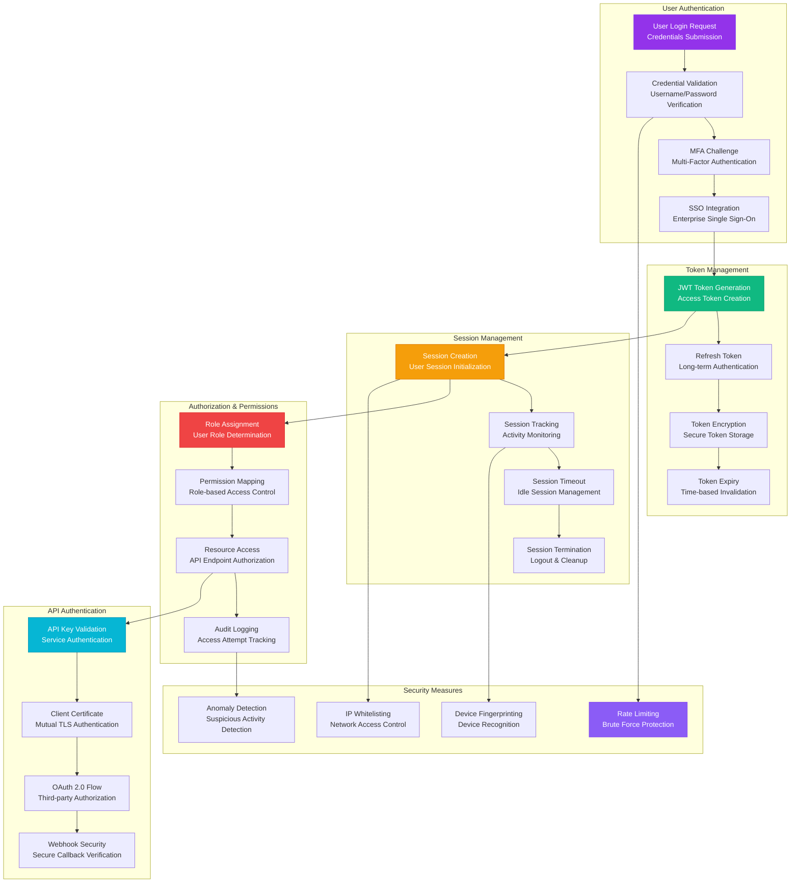
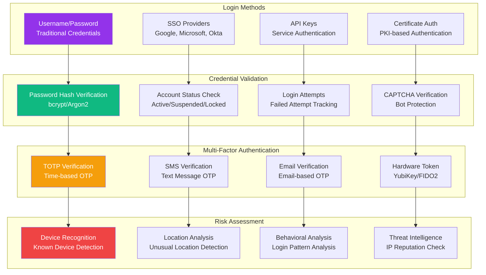
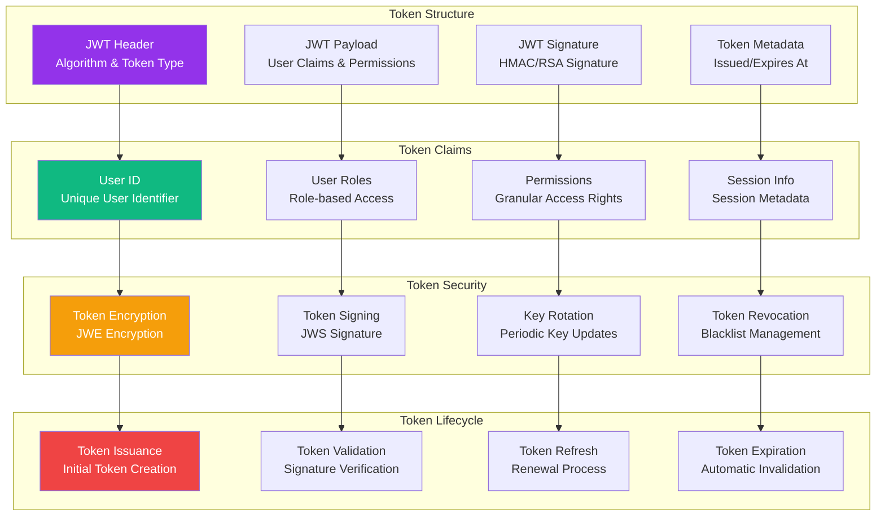
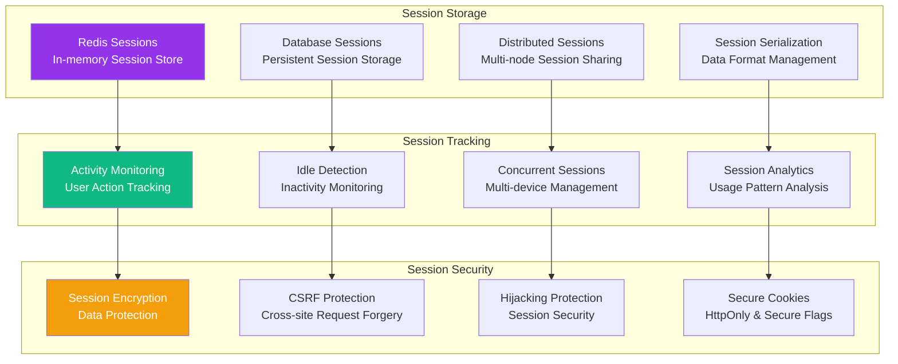
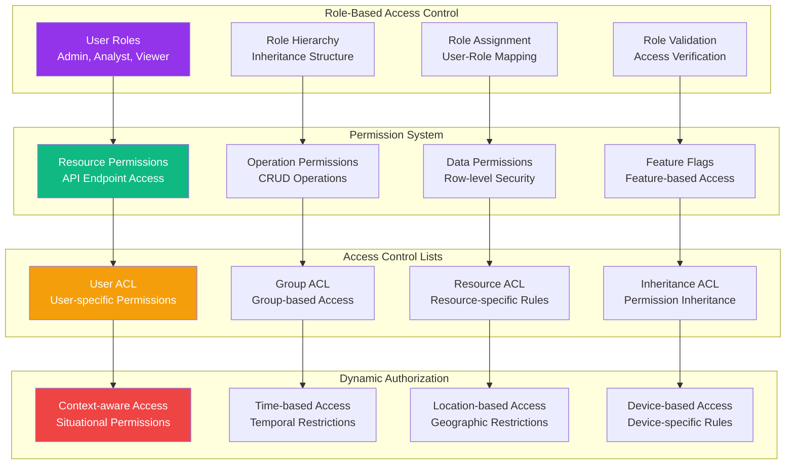
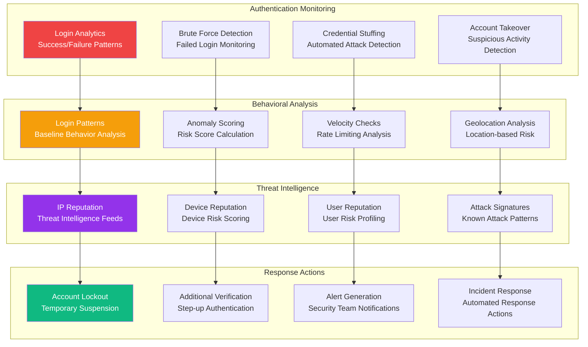
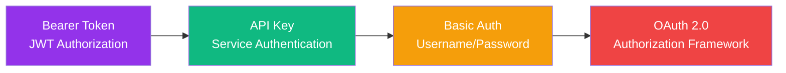
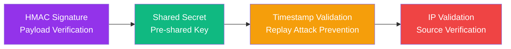

# AUTHENTICATION FLOW

**Type**: Security and Authentication Process Flow  
**Created**: January 31, 2025  
**Purpose**: Complete authentication and authorization workflow for secure access  
**Scope**: Multi-layer security with JWT, SSO, and API authentication  

---

## 🔐 COMPLETE AUTHENTICATION FLOW

---

## 🔑 DETAILED AUTHENTICATION COMPONENTS

### 1. **User Authentication Pipeline**

### 2. **JWT Token Architecture**

### 3. **Session Management System**

---

## 🛡️ AUTHORIZATION & ACCESS CONTROL

---

## 🚨 SECURITY MONITORING & THREAT DETECTION

---

## 📱 API AUTHENTICATION METHODS

### REST API Authentication

### Webhook Authentication

---

## 📊 AUTHENTICATION METRICS

### Security Metrics
| Metric | Target | Current | Notes |
|--------|--------|---------|-------|
| **Authentication Success Rate** | >99% | 99.2% | Successful login percentage |
| **MFA Adoption Rate** | >80% | 85% | Users with MFA enabled |
| **Account Lockout Rate** | <1% | 0.8% | Accounts locked due to failed attempts |
| **Session Hijacking Attempts** | 0 | 0 | Detected session hijacking |
| **Token Validation Time** | <50ms | 45ms | JWT validation performance |
| **SSO Integration Success** | >95% | 97% | SSO authentication success |

### Performance Metrics
- **Authentication Latency**: <200ms average response time
- **Token Generation**: <100ms for JWT creation
- **Session Lookup**: <10ms Redis session retrieval
- **Authorization Check**: <50ms permission validation

### Compliance Metrics
- **GDPR Compliance**: 100% compliant with data protection
- **SOC 2 Type II**: Annual compliance certification
- **ISO 27001**: Security management standards
- **OWASP Top 10**: Protection against common vulnerabilities

---

## 🔧 INTEGRATION SPECIFICATIONS

### External Identity Providers
- **Google Workspace**: OAuth 2.0 SSO integration
- **Microsoft Azure AD**: SAML/OpenID Connect
- **Okta**: Enterprise identity management
- **Auth0**: Third-party authentication service

### Security Tools Integration
- **Security Information and Event Management (SIEM)**
- **Intrusion Detection System (IDS)**
- **Web Application Firewall (WAF)**
- **Fraud Detection Systems**

### Monitoring & Alerting
- **Prometheus**: Metrics collection for authentication events
- **Grafana**: Dashboards for authentication monitoring
- **PagerDuty**: Incident response for security alerts
- **Slack**: Real-time security notifications

---

**Last Updated**: January 31, 2025  
**Authentication Version**: 2.0  
**Security Standard**: SOC 2 Type II Compliant  
**Average Auth Time**: <200ms 