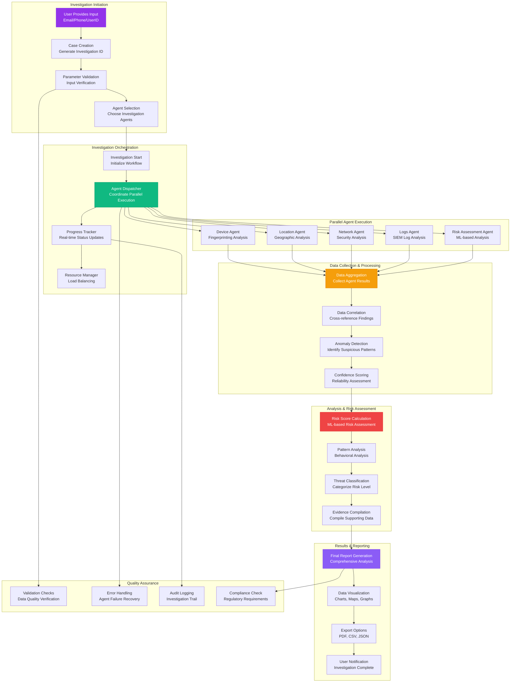
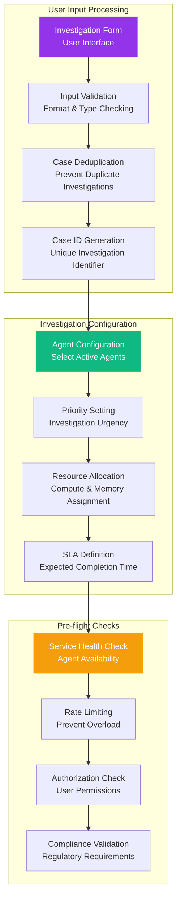
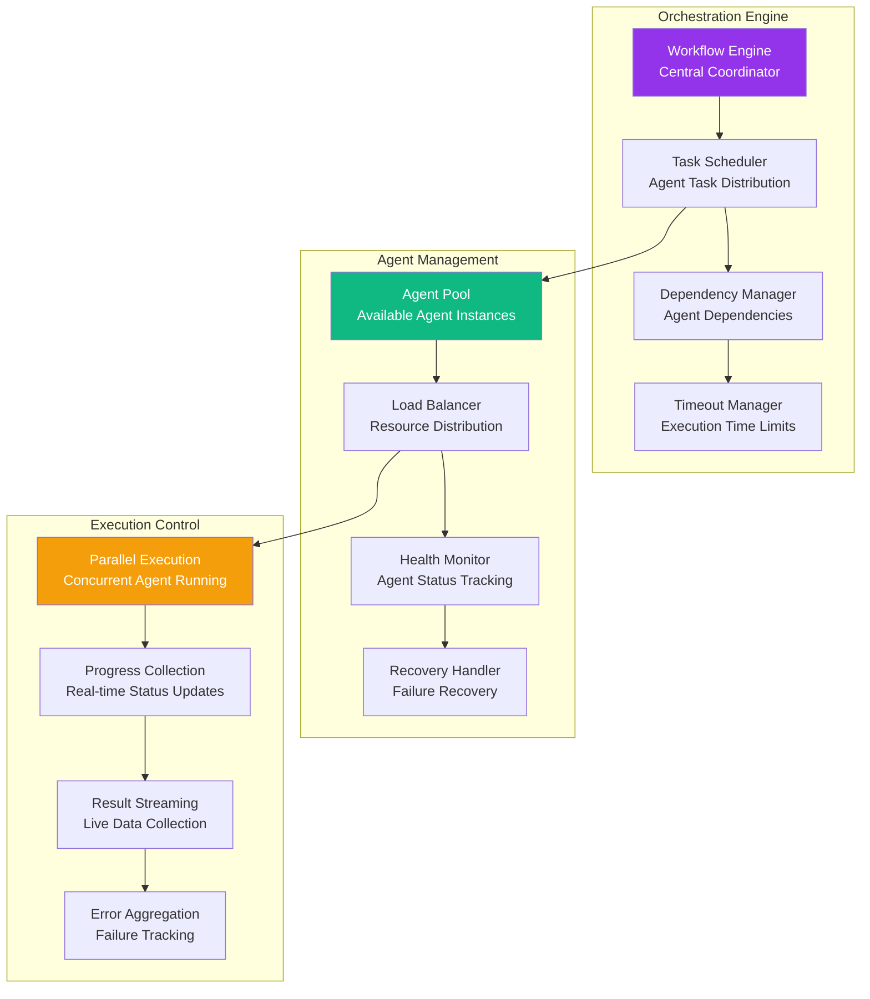
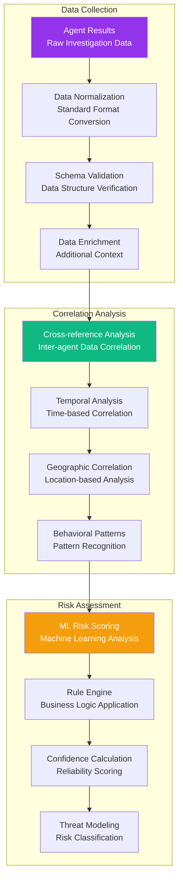
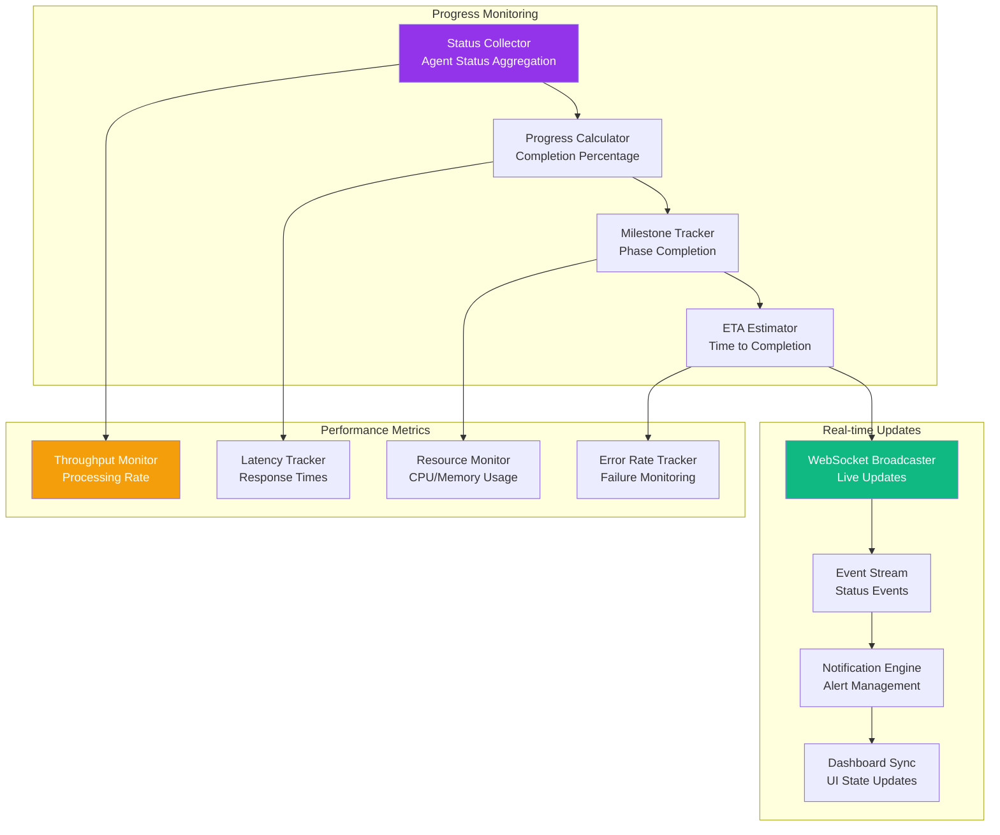
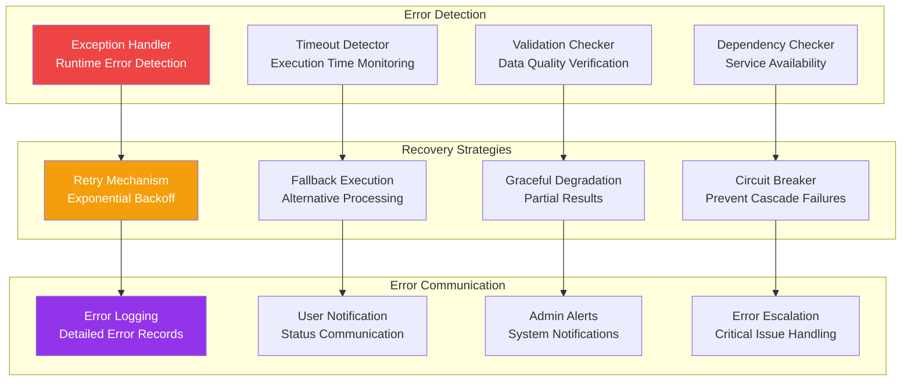

# INVESTIGATION WORKFLOW

**Type**: Core Investigation Process Flow  
**Created**: January 31, 2025  
**Purpose**: Complete end-to-end investigation workflow from initiation to completion  
**Scope**: User-initiated fraud investigation with AI agent coordination  

---

## 🔍 COMPLETE INVESTIGATION WORKFLOW

---

## ⚡ DETAILED WORKFLOW PHASES

### 1. **Investigation Initiation Phase**

### 2. **Agent Orchestration & Execution**

### 3. **Data Processing & Analysis Pipeline**

---

## 🔄 REAL-TIME PROGRESS TRACKING

---

## 🛡️ ERROR HANDLING & RECOVERY

---

## 📊 PERFORMANCE SPECIFICATIONS

### Timing Requirements
| Phase | Target Time | Maximum Time | Notes |
|-------|-------------|--------------|-------|
| **Initiation** | <1s | 2s | Form validation and case creation |
| **Agent Dispatch** | <2s | 5s | Agent orchestration and startup |
| **Investigation** | <60s | 120s | Parallel agent execution |
| **Analysis** | <10s | 30s | Data processing and risk assessment |
| **Report Generation** | <5s | 15s | Final report and visualization |
| **Total Workflow** | <78s | 172s | End-to-end investigation |

### Scalability Targets
- **Concurrent Investigations**: 100+ simultaneous investigations
- **Agent Throughput**: 500+ agent executions per minute
- **Data Processing**: 10GB+ investigation data per hour
- **Report Generation**: 1000+ reports per hour

### Quality Metrics
- **Investigation Accuracy**: >95% fraud detection accuracy
- **False Positive Rate**: <5% for risk assessments
- **Data Completeness**: >98% successful data collection
- **System Availability**: 99.9% uptime for investigation workflow

---

## 🔗 INTEGRATION POINTS

### External Service Integration
- **SIEM Platforms**: Splunk, Elastic, IBM QRadar integration
- **Threat Intelligence**: VirusTotal, CrowdStrike, Mandiant feeds
- **Device Intelligence**: ThreatMetrix, Iovation, DeviceFirst services
- **Geographic Services**: MaxMind, Google Maps, IP geolocation
- **ML Services**: OpenAI, Anthropic, custom ML models

### Internal System Integration
- **Authentication**: JWT-based user authentication and authorization
- **Database**: PostgreSQL for investigation storage and audit trails
- **Caching**: Redis for performance optimization and session management
- **Monitoring**: Prometheus metrics and Grafana dashboards
- **Logging**: Structured logging with ELK stack integration

---

**Last Updated**: January 31, 2025  
**Workflow Version**: 1.0  
**Average Investigation Time**: <5 minutes  
**Success Rate**: >99% completion rate 