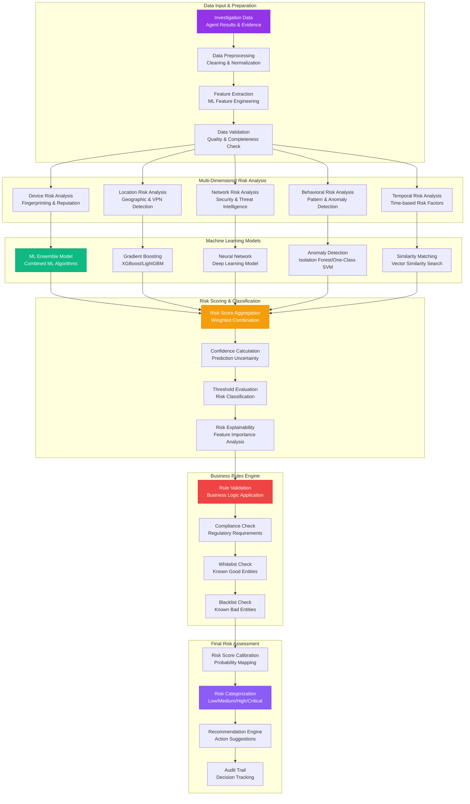
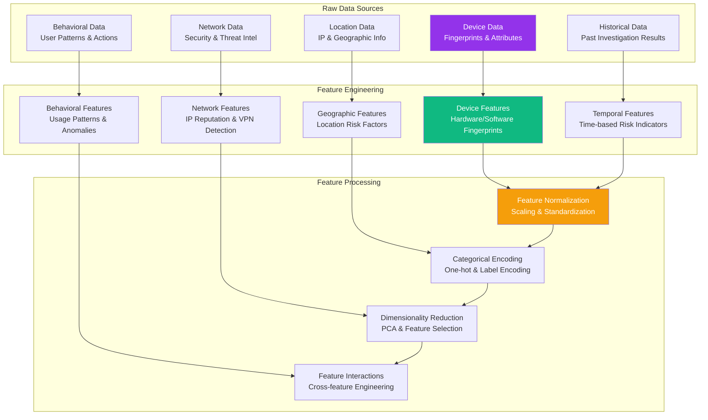
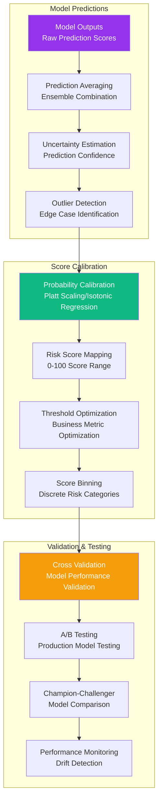
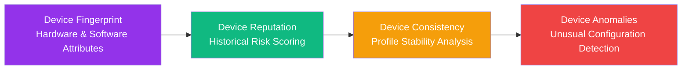
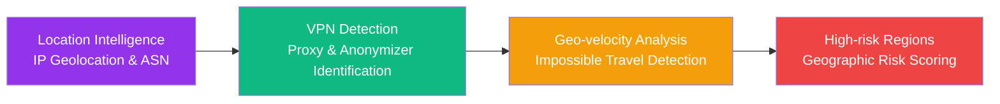
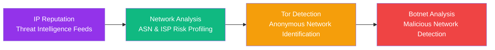
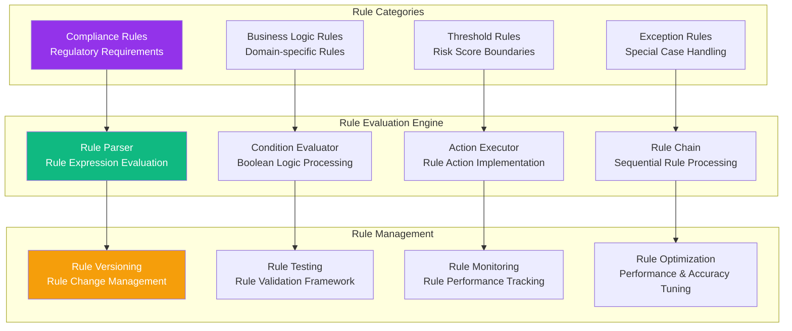
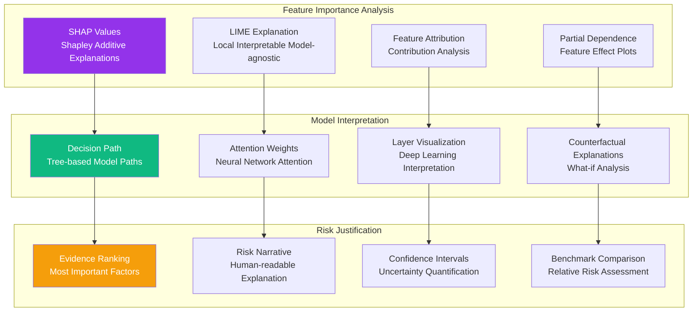
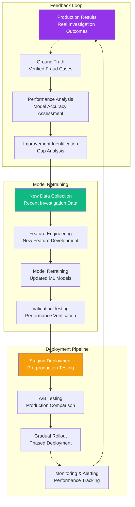

# RISK ASSESSMENT FLOW

**Type**: Risk Analysis and ML-based Assessment Process  
**Created**: January 31, 2025  
**Purpose**: Complete risk assessment workflow with machine learning integration  
**Scope**: Multi-dimensional risk analysis and scoring for fraud detection  

---

## 🎯 COMPLETE RISK ASSESSMENT FLOW

---

## 🧠 MACHINE LEARNING PIPELINE

### 1. **Feature Engineering & Data Preparation**

### 2. **ML Model Ensemble Architecture**

```mermaid
graph TB
    subgraph "Gradient Boosting Models"
        XGBOOST[XGBoost<br/>Extreme Gradient Boosting]
        LIGHTGBM[LightGBM<br/>Gradient Boosting Framework]
        CATBOOST[CatBoost<br/>Categorical Boosting]
    end
    
    subgraph "Neural Network Models"
        DEEP_NN[Deep Neural Network<br/>Multi-layer Perceptron]
        LSTM[LSTM Network<br/>Sequential Pattern Recognition]
        AUTOENCODER[Autoencoder<br/>Anomaly Detection]
    end
    
    subgraph "Traditional ML Models"
        RANDOM_FOREST[Random Forest<br/>Ensemble Tree Model]
        SVM[Support Vector Machine<br/>Classification & Regression]
        LOGISTIC_REGRESSION[Logistic Regression<br/>Linear Classification]
    end
    
    subgraph "Anomaly Detection Models"
        ISOLATION_FOREST[Isolation Forest<br/>Unsupervised Anomaly Detection]
        ONE_CLASS_SVM[One-Class SVM<br/>Outlier Detection]
        LOCAL_OUTLIER[Local Outlier Factor<br/>Density-based Detection]
    end
    
    subgraph "Ensemble Combination"
        WEIGHTED_VOTING[Weighted Voting<br/>Model Weight Optimization]
        STACKING[Stacking Ensemble<br/>Meta-learner Combination]
        BLENDING[Blending<br/>Holdout Validation Ensemble]
    end
    
    XGBOOST --> WEIGHTED_VOTING
    LIGHTGBM --> WEIGHTED_VOTING
    CATBOOST --> STACKING
    
    DEEP_NN --> STACKING
    LSTM --> BLENDING
    AUTOENCODER --> WEIGHTED_VOTING
    
    RANDOM_FOREST --> BLENDING
    SVM --> WEIGHTED_VOTING
    LOGISTIC_REGRESSION --> STACKING
    
    ISOLATION_FOREST --> BLENDING
    ONE_CLASS_SVM --> WEIGHTED_VOTING
    LOCAL_OUTLIER --> STACKING
    
    style XGBOOST fill:#9333ea,color:white
    style DEEP_NN fill:#10b981,color:white
    style RANDOM_FOREST fill:#f59e0b,color:white
    style ISOLATION_FOREST fill:#ef4444,color:white
    style WEIGHTED_VOTING fill:#8b5cf6,color:white
```

### 3. **Risk Score Calculation & Calibration**

---

## 📊 RISK DIMENSION ANALYSIS

### Device Risk Assessment

### Geographic Risk Assessment

### Network Security Risk Assessment

---

## 🎯 BUSINESS RULES ENGINE

---

## 🔍 EXPLAINABLE AI & TRANSPARENCY

---

## 📈 PERFORMANCE METRICS & MONITORING

### Model Performance Metrics
| Metric | Target | Current | Notes |
|--------|--------|---------|-------|
| **Precision** | >90% | 92% | High precision for fraud detection |
| **Recall** | >85% | 88% | Minimize false negatives |
| **F1 Score** | >87% | 90% | Balanced precision/recall |
| **AUC-ROC** | >0.95 | 0.96 | Area under ROC curve |
| **False Positive Rate** | <5% | 3% | Minimize false alarms |
| **Processing Time** | <2s | 1.8s | Real-time risk assessment |

### Business Impact Metrics
- **Fraud Detection Rate**: >95% of actual fraud cases detected
- **Investigation Efficiency**: 70% reduction in manual review time
- **Cost Savings**: $2M+ annual fraud prevention
- **Customer Experience**: <1% legitimate transaction false positives

### Model Drift Monitoring
- **Feature Drift**: Statistical distribution changes
- **Prediction Drift**: Model output distribution changes
- **Performance Drift**: Accuracy degradation over time
- **Data Quality**: Input data completeness and validity

---

## 🔄 CONTINUOUS LEARNING & IMPROVEMENT

---

**Last Updated**: January 31, 2025  
**Risk Assessment Version**: 2.0  
**ML Model Accuracy**: >92% precision, >88% recall  
**Processing Time**: <2 seconds per assessment 