# LangGraph Enhancement Architecture
## Olorin Autonomous Investigation System

**Category**: Enhancement Architecture  
**Purpose**: LangGraph built-in tools and capabilities enhancement strategy  
**Created**: August 31, 2025  
**Status**: 🚧 **PLANNED ENHANCEMENT**

---

## 🎯 DIAGRAM PURPOSE

This diagram illustrates the comprehensive enhancement architecture for integrating LangGraph built-in tools and capabilities into the Olorin autonomous investigation system, showing:
- Current implementation vs enhanced target architecture
- Phase-based enhancement strategy and dependencies
- Tool execution flow improvements and resilience patterns
- Advanced orchestration patterns and subgraph modularization
- Performance monitoring and tracing integration
- Human-in-the-loop patterns and advanced coordination strategies

---

## 🏗️ COMPREHENSIVE LANGGRAPH ENHANCEMENT ARCHITECTURE

```mermaid
graph TB
    subgraph "Current Implementation (Baseline)"
        CURRENT_GRAPH[🎯 StateGraph<br/>Basic Orchestration<br/>MessagesState]
        CURRENT_TOOLS[🛠️ ToolNode<br/>Basic Tool Execution<br/>tools_condition]
        CURRENT_REDIS[💾 AsyncRedisSaver<br/>Custom Checkpointing<br/>Redis Persistence]
        CURRENT_AGENTS[🤖 Domain Agents<br/>Device, Location, Network<br/>Logs, Risk Assessment]
    end
    
    subgraph "Phase 1: Core Tool Enhancement (Weeks 1-6)"
        subgraph "Enhanced Tool Execution"
            ENHANCED_EXECUTOR[⚡ EnhancedToolExecutor<br/>Retry Logic & Circuit Breakers<br/>Performance Monitoring]
            TOOL_HEALTH[🏥 ToolHealthManager<br/>Real-time Validation<br/>Dynamic Filtering]
            TRACING_EXECUTOR[📊 TracingToolExecutor<br/>LangSmith Integration<br/>Performance Analytics]
        end
        
        PHASE1_BENEFITS[📈 Phase 1 Benefits<br/>40% Reduction in Tool Failures<br/>25% Faster Response Times<br/>100% Backward Compatibility]
    end
    
    subgraph "Phase 2: Advanced Orchestration (Weeks 7-14)"
        subgraph "Subgraph Architecture"
            DEVICE_SUBGRAPH[🔍 DeviceAnalysisSubgraph<br/>Specialized Device Logic<br/>Domain-Specific Tools]
            NETWORK_SUBGRAPH[🌐 NetworkAnalysisSubgraph<br/>Security Analysis Patterns<br/>Threat Detection Logic]
            LOCATION_SUBGRAPH[📍 LocationAnalysisSubgraph<br/>Geographic Intelligence<br/>Velocity Analysis]
            LOGS_SUBGRAPH[📋 LogsAnalysisSubgraph<br/>SIEM Integration<br/>Event Correlation]
            RISK_SUBGRAPH[⚠️ RiskAssessmentSubgraph<br/>ML Risk Models<br/>Decision Engine]
        end
        
        subgraph "Enhanced Routing & Streaming"
            ENHANCED_ROUTING[🎯 Enhanced Routing<br/>AI-Driven Decisions<br/>Risk-Based Prioritization]
            ADVANCED_STREAMING[🌊 Advanced Streaming<br/>Real-time Updates<br/>Agent Progress Tracking]
        end
        
        PHASE2_BENEFITS[📈 Phase 2 Benefits<br/>30% Faster Investigations<br/>50% Domain Performance<br/>Real-time Streaming]
    end
    
    subgraph "Phase 3: Performance & Monitoring (Weeks 15-19)"
        subgraph "Tracing & Analytics"
            LANGSMITH_TRACING[📊 LangSmith Tracing<br/>Complete Execution Visibility<br/>Bottleneck Identification]
            PERFORMANCE_ANALYTICS[📈 Performance Analytics<br/>Optimization Recommendations<br/>Regression Detection]
        end
        
        subgraph "Advanced Caching"
            INTELLIGENT_CACHE[🧠 IntelligentCacheManager<br/>Multi-level Caching<br/>Smart Invalidation]
            L1_CACHE[💾 L1 Memory Cache<br/>Frequent Operations<br/>Sub-millisecond Access]
            L2_CACHE[🗄️ L2 Redis Cache<br/>Persistence Layer<br/>Investigation State]
        end
        
        BENCHMARK_FRAMEWORK[🏁 Benchmarking Framework<br/>Automated Testing<br/>Performance Baselines]
        PHASE3_BENEFITS[📈 Phase 3 Benefits<br/>60% Reduction in Redundancy<br/>Complete Visibility<br/>Automated Optimization]
    end
    
    subgraph "Phase 4: Advanced Patterns (Weeks 20-27)"
        subgraph "Human Integration"
            HUMAN_LOOP[👤 Human-in-the-Loop<br/>Complex Case Escalation<br/>Structured Input Collection]
            ANALYST_INTEGRATION[👥 Analyst Integration<br/>Seamless Workflows<br/>Human-AI Collaboration]
        end
        
        subgraph "Advanced Coordination"
            MULTI_AGENT_COORD[🤝 Multi-Agent Coordination<br/>Resource Optimization<br/>Strategy Selection]
            COORDINATION_STRATEGIES[🎯 Coordination Strategies<br/>Parallel Investigation<br/>Expert Committee]
        end
        
        TOOL_FRAMEWORK[🏗️ Tool Development Framework<br/>Rapid Tool Creation<br/>Standardized Interfaces]
        PHASE4_BENEFITS[📈 Phase 4 Benefits<br/>Enhanced Quality<br/>Optimized Resources<br/>Rapid Development]
    end
    
    subgraph "Enhanced Data Flow Architecture"
        INVESTIGATION_INPUT[📨 Investigation Input<br/>Case Parameters<br/>Evidence Data]
        ENHANCED_ORCHESTRATOR[🎯 Enhanced Orchestrator<br/>Intelligent Routing<br/>Resource Management]
        PARALLEL_EXECUTION[⚡ Parallel Execution<br/>Concurrent Analysis<br/>Load Balancing]
        RESULT_AGGREGATION[🔄 Result Aggregation<br/>Multi-source Integration<br/>Conflict Resolution]
        ENHANCED_OUTPUT[📊 Enhanced Output<br/>Rich Analytics<br/>Action Recommendations]
    end
    
    subgraph "Resilience & Error Handling"
        CIRCUIT_BREAKERS[🛡️ Circuit Breakers<br/>External Service Protection<br/>Failure Isolation]
        RETRY_MECHANISMS[🔄 Retry Mechanisms<br/>Exponential Backoff<br/>Smart Recovery]
        ERROR_RECOVERY[🚨 Error Recovery<br/>Automatic Healing<br/>Graceful Degradation]
        HEALTH_MONITORING[🏥 Health Monitoring<br/>Proactive Detection<br/>Alert Management]
    end
    
    subgraph "External Integrations"
        SIEM_SYSTEMS[📊 SIEM Systems<br/>Splunk, SumoLogic<br/>Real-time Data]
        THREAT_INTEL[🛡️ Threat Intelligence<br/>VirusTotal, CrowdStrike<br/>Reputation Data]
        ML_SERVICES[🧠 ML Services<br/>OpenAI, Anthropic<br/>Vector Databases]
        GEO_SERVICES[🗺️ Geographic Services<br/>MaxMind, IPQualityScore<br/>Location Intelligence]
    end
    
    %% Current Implementation Flow
    CURRENT_GRAPH --> CURRENT_TOOLS
    CURRENT_TOOLS --> CURRENT_AGENTS
    CURRENT_AGENTS --> CURRENT_REDIS
    
    %% Phase 1 Enhancement Flow
    CURRENT_TOOLS --> ENHANCED_EXECUTOR
    ENHANCED_EXECUTOR --> TOOL_HEALTH
    TOOL_HEALTH --> TRACING_EXECUTOR
    TRACING_EXECUTOR --> PHASE1_BENEFITS
    
    %% Phase 2 Enhancement Flow
    ENHANCED_EXECUTOR --> DEVICE_SUBGRAPH
    ENHANCED_EXECUTOR --> NETWORK_SUBGRAPH
    ENHANCED_EXECUTOR --> LOCATION_SUBGRAPH
    ENHANCED_EXECUTOR --> LOGS_SUBGRAPH
    ENHANCED_EXECUTOR --> RISK_SUBGRAPH
    
    DEVICE_SUBGRAPH --> ENHANCED_ROUTING
    NETWORK_SUBGRAPH --> ENHANCED_ROUTING
    LOCATION_SUBGRAPH --> ENHANCED_ROUTING
    LOGS_SUBGRAPH --> ENHANCED_ROUTING
    RISK_SUBGRAPH --> ENHANCED_ROUTING
    
    ENHANCED_ROUTING --> ADVANCED_STREAMING
    ADVANCED_STREAMING --> PHASE2_BENEFITS
    
    %% Phase 3 Enhancement Flow
    ADVANCED_STREAMING --> LANGSMITH_TRACING
    LANGSMITH_TRACING --> PERFORMANCE_ANALYTICS
    PERFORMANCE_ANALYTICS --> INTELLIGENT_CACHE
    
    INTELLIGENT_CACHE --> L1_CACHE
    INTELLIGENT_CACHE --> L2_CACHE
    L1_CACHE --> BENCHMARK_FRAMEWORK
    L2_CACHE --> BENCHMARK_FRAMEWORK
    BENCHMARK_FRAMEWORK --> PHASE3_BENEFITS
    
    %% Phase 4 Enhancement Flow
    BENCHMARK_FRAMEWORK --> HUMAN_LOOP
    HUMAN_LOOP --> ANALYST_INTEGRATION
    ANALYST_INTEGRATION --> MULTI_AGENT_COORD
    MULTI_AGENT_COORD --> COORDINATION_STRATEGIES
    COORDINATION_STRATEGIES --> TOOL_FRAMEWORK
    TOOL_FRAMEWORK --> PHASE4_BENEFITS
    
    %% Enhanced Data Flow
    INVESTIGATION_INPUT --> ENHANCED_ORCHESTRATOR
    ENHANCED_ORCHESTRATOR --> PARALLEL_EXECUTION
    PARALLEL_EXECUTION --> DEVICE_SUBGRAPH
    PARALLEL_EXECUTION --> NETWORK_SUBGRAPH
    PARALLEL_EXECUTION --> LOCATION_SUBGRAPH
    PARALLEL_EXECUTION --> LOGS_SUBGRAPH
    
    DEVICE_SUBGRAPH --> RESULT_AGGREGATION
    NETWORK_SUBGRAPH --> RESULT_AGGREGATION
    LOCATION_SUBGRAPH --> RESULT_AGGREGATION
    LOGS_SUBGRAPH --> RESULT_AGGREGATION
    
    RESULT_AGGREGATION --> RISK_SUBGRAPH
    RISK_SUBGRAPH --> ENHANCED_OUTPUT
    
    %% Resilience Integration
    ENHANCED_EXECUTOR --> CIRCUIT_BREAKERS
    CIRCUIT_BREAKERS --> RETRY_MECHANISMS
    RETRY_MECHANISMS --> ERROR_RECOVERY
    ERROR_RECOVERY --> HEALTH_MONITORING
    
    %% External Integration
    DEVICE_SUBGRAPH --> THREAT_INTEL
    NETWORK_SUBGRAPH --> SIEM_SYSTEMS
    LOCATION_SUBGRAPH --> GEO_SERVICES
    LOGS_SUBGRAPH --> SIEM_SYSTEMS
    RISK_SUBGRAPH --> ML_SERVICES
    
    %% Styling
    classDef current fill:#ffebee,stroke:#c62828,stroke-width:2px
    classDef phase1 fill:#e8f5e8,stroke:#2e7d32,stroke-width:2px
    classDef phase2 fill:#e3f2fd,stroke:#0d47a1,stroke-width:2px
    classDef phase3 fill:#fff3e0,stroke:#e65100,stroke-width:2px
    classDef phase4 fill:#f3e5f5,stroke:#4a148c,stroke-width:2px
    classDef dataflow fill:#f5f5f5,stroke:#424242,stroke-width:2px
    classDef resilience fill:#fff8e1,stroke:#f57f17,stroke-width:2px
    classDef external fill:#fce4ec,stroke:#880e4f,stroke-width:2px
    classDef benefits fill:#e0f2f1,stroke:#00695c,stroke-width:3px
    
    class CURRENT_GRAPH,CURRENT_TOOLS,CURRENT_REDIS,CURRENT_AGENTS current
    class ENHANCED_EXECUTOR,TOOL_HEALTH,TRACING_EXECUTOR phase1
    class DEVICE_SUBGRAPH,NETWORK_SUBGRAPH,LOCATION_SUBGRAPH,LOGS_SUBGRAPH,RISK_SUBGRAPH,ENHANCED_ROUTING,ADVANCED_STREAMING phase2
    class LANGSMITH_TRACING,PERFORMANCE_ANALYTICS,INTELLIGENT_CACHE,L1_CACHE,L2_CACHE,BENCHMARK_FRAMEWORK phase3
    class HUMAN_LOOP,ANALYST_INTEGRATION,MULTI_AGENT_COORD,COORDINATION_STRATEGIES,TOOL_FRAMEWORK phase4
    class INVESTIGATION_INPUT,ENHANCED_ORCHESTRATOR,PARALLEL_EXECUTION,RESULT_AGGREGATION,ENHANCED_OUTPUT dataflow
    class CIRCUIT_BREAKERS,RETRY_MECHANISMS,ERROR_RECOVERY,HEALTH_MONITORING resilience
    class SIEM_SYSTEMS,THREAT_INTEL,ML_SERVICES,GEO_SERVICES external
    class PHASE1_BENEFITS,PHASE2_BENEFITS,PHASE3_BENEFITS,PHASE4_BENEFITS benefits
```



---

## 🔄 ENHANCEMENT PHASE FLOW DIAGRAM


---

## ⚡ TOOL EXECUTION ENHANCEMENT FLOW

```mermaid
sequenceDiagram
    participant Investigation as 🔍 Investigation Request
    participant CurrentExecutor as 🛠️ Current ToolNode
    participant EnhancedExecutor as ⚡ Enhanced ToolExecutor
    participant HealthManager as 🏥 Tool Health Manager
    participant TracingSystem as 📊 Tracing System
    participant ExternalTool as 🌐 External Tool (Splunk)
    
    Investigation->>CurrentExecutor: Execute Tool (Current)
    CurrentExecutor->>ExternalTool: Direct Call
    ExternalTool-->>CurrentExecutor: Success/Failure
    CurrentExecutor-->>Investigation: Result (No Retry)
    
    Note over Investigation,ExternalTool: Enhanced Flow with Resilience
    
    Investigation->>EnhancedExecutor: Execute Tool (Enhanced)
    EnhancedExecutor->>HealthManager: Validate Tool Health
    HealthManager-->>EnhancedExecutor: Health Status
    
    alt Tool Healthy
        EnhancedExecutor->>TracingSystem: Start Trace
        EnhancedExecutor->>ExternalTool: Protected Call
        
        alt Call Succeeds
            ExternalTool-->>EnhancedExecutor: Success
            EnhancedExecutor->>TracingSystem: Record Success
        else Call Fails
            ExternalTool-->>EnhancedExecutor: Failure
            EnhancedExecutor->>EnhancedExecutor: Retry Logic
            EnhancedExecutor->>ExternalTool: Retry with Backoff
            ExternalTool-->>EnhancedExecutor: Success/Failure
        end
        
        EnhancedExecutor->>TracingSystem: End Trace
        TracingSystem-->>EnhancedExecutor: Performance Metrics
        EnhancedExecutor-->>Investigation: Enhanced Result
    else Tool Unhealthy
        EnhancedExecutor-->>Investigation: Fallback Strategy
    end
```



---

## 🏗️ SUBGRAPH ARCHITECTURE PATTERN

```mermaid
graph TB
    subgraph "Main Investigation Graph"
        MAIN_ORCHESTRATOR[🎯 Main Orchestrator<br/>Investigation Coordination<br/>Resource Management]
        ROUTING_ENGINE[🎯 Routing Engine<br/>Intelligent Decisions<br/>Load Balancing]
    end
    
    subgraph "Device Analysis Subgraph"
        DEVICE_ENTRY[📱 Device Entry Point<br/>Request Validation<br/>Context Setup]
        DEVICE_FINGERPRINT[🔍 Fingerprint Analysis<br/>Browser Properties<br/>Hardware Specs]
        DEVICE_BEHAVIOR[📊 Behavior Analysis<br/>User Patterns<br/>Interaction Metrics]
        DEVICE_REPUTATION[⚡ Reputation Check<br/>Device History<br/>Risk Assessment]
        DEVICE_EXIT[📱 Device Exit Point<br/>Result Aggregation<br/>Context Cleanup]
        
        DEVICE_ENTRY --> DEVICE_FINGERPRINT
        DEVICE_ENTRY --> DEVICE_BEHAVIOR
        DEVICE_ENTRY --> DEVICE_REPUTATION
        DEVICE_FINGERPRINT --> DEVICE_EXIT
        DEVICE_BEHAVIOR --> DEVICE_EXIT
        DEVICE_REPUTATION --> DEVICE_EXIT
    end
    
    subgraph "Network Analysis Subgraph"
        NETWORK_ENTRY[🌐 Network Entry Point<br/>Request Validation<br/>Context Setup]
        TRAFFIC_ANALYSIS[📊 Traffic Analysis<br/>Flow Patterns<br/>Anomaly Detection]
        THREAT_DETECTION[🛡️ Threat Detection<br/>Malicious Activity<br/>IOC Matching]
        NETWORK_REPUTATION[🔍 Network Reputation<br/>IP/Domain Scoring<br/>Blacklist Check]
        NETWORK_EXIT[🌐 Network Exit Point<br/>Result Aggregation<br/>Context Cleanup]
        
        NETWORK_ENTRY --> TRAFFIC_ANALYSIS
        NETWORK_ENTRY --> THREAT_DETECTION
        NETWORK_ENTRY --> NETWORK_REPUTATION
        TRAFFIC_ANALYSIS --> NETWORK_EXIT
        THREAT_DETECTION --> NETWORK_EXIT
        NETWORK_REPUTATION --> NETWORK_EXIT
    end
    
    subgraph "Location Analysis Subgraph"
        LOCATION_ENTRY[📍 Location Entry Point<br/>Request Validation<br/>Context Setup]
        GEO_ANALYSIS[🗺️ Geographic Analysis<br/>IP Geolocation<br/>Accuracy Validation]
        VELOCITY_CHECK[🚀 Velocity Analysis<br/>Movement Patterns<br/>Impossible Travel]
        LOCATION_RISK[⚠️ Location Risk<br/>Geographic Scoring<br/>Regional Threats]
        LOCATION_EXIT[📍 Location Exit Point<br/>Result Aggregation<br/>Context Cleanup]
        
        LOCATION_ENTRY --> GEO_ANALYSIS
        LOCATION_ENTRY --> VELOCITY_CHECK
        LOCATION_ENTRY --> LOCATION_RISK
        GEO_ANALYSIS --> LOCATION_EXIT
        VELOCITY_CHECK --> LOCATION_EXIT
        LOCATION_RISK --> LOCATION_EXIT
    end
    
    subgraph "Cross-Subgraph Communication"
        MESSAGE_BROKER[📢 Message Broker<br/>Inter-Subgraph Messages<br/>Event Coordination]
        SHARED_CONTEXT[💾 Shared Context Store<br/>Cross-Domain Data<br/>Investigation State]
        RESULT_AGGREGATOR[🔄 Result Aggregator<br/>Multi-Domain Results<br/>Conflict Resolution]
    end
    
    %% Main Flow
    MAIN_ORCHESTRATOR --> ROUTING_ENGINE
    ROUTING_ENGINE --> DEVICE_ENTRY
    ROUTING_ENGINE --> NETWORK_ENTRY
    ROUTING_ENGINE --> LOCATION_ENTRY
    
    %% Inter-Subgraph Communication
    DEVICE_EXIT --> MESSAGE_BROKER
    NETWORK_EXIT --> MESSAGE_BROKER
    LOCATION_EXIT --> MESSAGE_BROKER
    
    MESSAGE_BROKER --> SHARED_CONTEXT
    SHARED_CONTEXT --> RESULT_AGGREGATOR
    RESULT_AGGREGATOR --> MAIN_ORCHESTRATOR
    
    %% Styling
    classDef main fill:#e3f2fd,stroke:#0d47a1,stroke-width:2px
    classDef device fill:#e8f5e8,stroke:#2e7d32,stroke-width:2px
    classDef network fill:#fff3e0,stroke:#e65100,stroke-width:2px
    classDef location fill:#f3e5f5,stroke:#4a148c,stroke-width:2px
    classDef communication fill:#fce4ec,stroke:#880e4f,stroke-width:2px
    
    class MAIN_ORCHESTRATOR,ROUTING_ENGINE main
    class DEVICE_ENTRY,DEVICE_FINGERPRINT,DEVICE_BEHAVIOR,DEVICE_REPUTATION,DEVICE_EXIT device
    class NETWORK_ENTRY,TRAFFIC_ANALYSIS,THREAT_DETECTION,NETWORK_REPUTATION,NETWORK_EXIT network
    class LOCATION_ENTRY,GEO_ANALYSIS,VELOCITY_CHECK,LOCATION_RISK,LOCATION_EXIT location
    class MESSAGE_BROKER,SHARED_CONTEXT,RESULT_AGGREGATOR communication
```



---

## 🧠 HUMAN-IN-THE-LOOP INTEGRATION PATTERN


---

## 📊 PERFORMANCE ENHANCEMENT METRICS

```mermaid
graph TB
    subgraph "Current Performance Baseline"
        CURRENT_METRICS[📊 Current Metrics<br/>Tool Failures: 15%<br/>Avg Response: 4.2s<br/>Investigation Time: 12.5s]
    end
    
    subgraph "Phase 1 Improvements"
        PHASE1_METRICS[📈 Phase 1 Targets<br/>Tool Failures: 9% (-40%)<br/>Avg Response: 3.2s (-25%)<br/>Reliability: +90%]
    end
    
    subgraph "Phase 2 Improvements"
        PHASE2_METRICS[📈 Phase 2 Targets<br/>Investigation Time: 8.8s (-30%)<br/>Domain Performance: +50%<br/>Streaming Latency: <100ms]
    end
    
    subgraph "Phase 3 Improvements"
        PHASE3_METRICS[📈 Phase 3 Targets<br/>Redundant Operations: -60%<br/>Cache Hit Rate: 95%<br/>Visibility: Complete]
    end
    
    subgraph "Phase 4 Improvements"
        PHASE4_METRICS[📈 Phase 4 Targets<br/>Human Integration: Seamless<br/>Resource Efficiency: +40%<br/>Development Speed: +3x]
    end
    
    subgraph "Overall Enhancement Goals"
        FINAL_METRICS[🎯 Final Targets<br/>Investigation Efficiency: +40%<br/>System Reliability: +90%<br/>Developer Experience: +300%<br/>Future-Ready Architecture]
    end
    
    CURRENT_METRICS --> PHASE1_METRICS
    PHASE1_METRICS --> PHASE2_METRICS
    PHASE2_METRICS --> PHASE3_METRICS
    PHASE3_METRICS --> PHASE4_METRICS
    PHASE4_METRICS --> FINAL_METRICS
    
    classDef current fill:#ffebee,stroke:#c62828,stroke-width:2px
    classDef improvement fill:#e8f5e8,stroke:#2e7d32,stroke-width:2px
    classDef final fill:#e0f2f1,stroke:#00695c,stroke-width:3px
    
    class CURRENT_METRICS current
    class PHASE1_METRICS,PHASE2_METRICS,PHASE3_METRICS,PHASE4_METRICS improvement
    class FINAL_METRICS final
```

---

## 🔐 SECURITY & COMPLIANCE ARCHITECTURE

```mermaid
graph TB
    subgraph "Security Enhancement Layers"
        ENHANCED_ISOLATION[🛡️ Enhanced Agent Isolation<br/>Sandboxed Execution<br/>Resource Limits<br/>Fault Boundaries]
        
        ADVANCED_AUTH[🔐 Advanced Authentication<br/>Service-to-Service Auth<br/>Token Rotation<br/>Certificate Management]
        
        ENHANCED_ENCRYPTION[🔒 Enhanced Encryption<br/>End-to-End Security<br/>Data Classification<br/>Key Management]
        
        COMPREHENSIVE_AUDIT[📝 Comprehensive Auditing<br/>Investigation Trails<br/>Performance Logs<br/>Compliance Reports]
    end
    
    subgraph "Compliance Features"
        GDPR_COMPLIANCE[🇪🇺 GDPR Compliance<br/>Data Anonymization<br/>Right to Deletion<br/>Consent Management]
        
        REGULATORY_REPORTING[📊 Regulatory Reporting<br/>Automated Reports<br/>Evidence Collection<br/>Audit Trails]
        
        DATA_RETENTION[📅 Data Retention<br/>Configurable Policies<br/>Automated Cleanup<br/>Legal Hold]
    end
    
    ENHANCED_ISOLATION --> ADVANCED_AUTH
    ADVANCED_AUTH --> ENHANCED_ENCRYPTION
    ENHANCED_ENCRYPTION --> COMPREHENSIVE_AUDIT
    
    COMPREHENSIVE_AUDIT --> GDPR_COMPLIANCE
    GDPR_COMPLIANCE --> REGULATORY_REPORTING
    REGULATORY_REPORTING --> DATA_RETENTION
    
    classDef security fill:#ffebee,stroke:#c62828,stroke-width:2px
    classDef compliance fill:#e8f5e8,stroke:#2e7d32,stroke-width:2px
    
    class ENHANCED_ISOLATION,ADVANCED_AUTH,ENHANCED_ENCRYPTION,COMPREHENSIVE_AUDIT security
    class GDPR_COMPLIANCE,REGULATORY_REPORTING,DATA_RETENTION compliance
```



---

## 📚 RELATED DIAGRAMS

### Component Architecture
- [AI Agent Framework](../components/olorin-server/ai-agent-framework.md) - Current agent architecture
- [Backend Service Architecture](../components/olorin-server/backend-service-architecture.md) - Overall server structure
- [Investigation Processing Flow](../components/olorin-server/investigation-processing-flow.md) - Current processing patterns

### System Context
- [Olorin Ecosystem Overview](../system/olorin-ecosystem-overview.md) - Complete system view
- [Data Flow Architecture](../system/data-flow-architecture.md) - System-wide data flows
- [Integration Topology](../system/integration-topology.md) - External service topology

### Process Flows
- [Investigation Workflow](../flows/investigation-workflow.md) - Investigation process flow
- [Agent Orchestration Flow](../flows/agent-orchestration-flow.md) - Agent coordination patterns

---

**Last Updated**: August 31, 2025  
**Enhancement Phases**: 4 comprehensive phases  
**Timeline**: 27 weeks total implementation  
**Status**: 🚧 **PLANNED ENHANCEMENT**