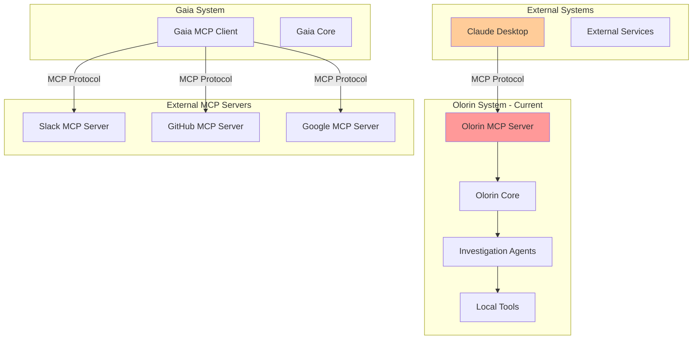
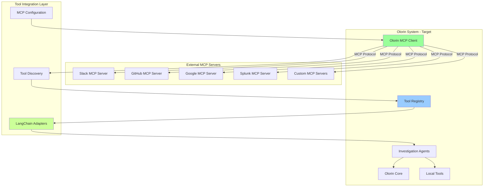
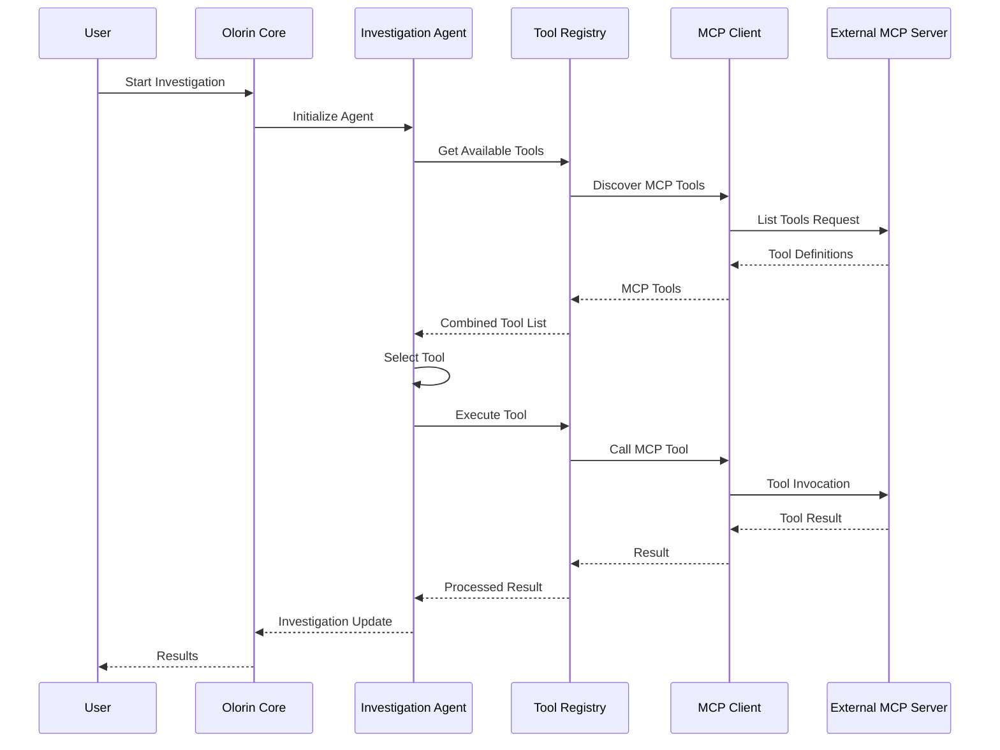

# MCP Architecture Overview Diagram

## Current Architecture (To Be Replaced)

```mermaid
graph TB
    subgraph "External Systems"
        CD[Claude Desktop]
        ES[External Services]
    end
    
    subgraph "Olorin System - Current"
        OMCP[Olorin MCP Server]
        OCore[Olorin Core]
        OAgents[Investigation Agents]
        OTools[Local Tools]
    end
    
    subgraph "Gaia System"
        GMCP[Gaia MCP Client]
        GCore[Gaia Core]
    end
    
    subgraph "External MCP Servers"
        Slack[Slack MCP Server]
        GitHub[GitHub MCP Server]
        Google[Google MCP Server]
    end
    
    CD -->|MCP Protocol| OMCP
    OMCP --> OCore
    OCore --> OAgents
    OAgents --> OTools
    
    GMCP -->|MCP Protocol| Slack
    GMCP -->|MCP Protocol| GitHub
    GMCP -->|MCP Protocol| Google
    
    style OMCP fill:#ff9999
    style CD fill:#ffcc99
```

## Target Architecture (Client-Only)

```mermaid
graph TB
    subgraph "Olorin System - Target"
        OCLIENT[Olorin MCP Client]
        OCore[Olorin Core]
        OAgents[Investigation Agents]
        OTools[Local Tools]
        ORegistry[Tool Registry]
    end
    
    subgraph "External MCP Servers"
        Slack[Slack MCP Server]
        GitHub[GitHub MCP Server]
        Google[Google MCP Server]
        Splunk[Splunk MCP Server]
        Custom[Custom MCP Servers]
    end
    
    subgraph "Tool Integration Layer"
        Adapters[LangChain Adapters]
        Config[MCP Configuration]
        Discovery[Tool Discovery]
    end
    
    OCLIENT -->|MCP Protocol| Slack
    OCLIENT -->|MCP Protocol| GitHub
    OCLIENT -->|MCP Protocol| Google
    OCLIENT -->|MCP Protocol| Splunk
    OCLIENT -->|MCP Protocol| Custom
    
    OCLIENT --> Discovery
    Discovery --> ORegistry
    ORegistry --> Adapters
    Adapters --> OAgents
    OAgents --> OCore
    OAgents --> OTools
    
    Config --> OCLIENT
    
    style OCLIENT fill:#99ff99
    style ORegistry fill:#99ccff
    style Adapters fill:#ccff99
```

## Component Interaction Flow

```mermaid
sequenceDiagram
    participant User
    participant OCore as Olorin Core
    participant Agent as Investigation Agent
    participant Registry as Tool Registry
    participant Client as MCP Client
    participant Server as External MCP Server
    
    User->>OCore: Start Investigation
    OCore->>Agent: Initialize Agent
    Agent->>Registry: Get Available Tools
    Registry->>Client: Discover MCP Tools
    Client->>Server: List Tools Request
    Server-->>Client: Tool Definitions
    Client-->>Registry: MCP Tools
    Registry-->>Agent: Combined Tool List
    
    Agent->>Agent: Select Tool
    Agent->>Registry: Execute Tool
    Registry->>Client: Call MCP Tool
    Client->>Server: Tool Invocation
    Server-->>Client: Tool Result
    Client-->>Registry: Result
    Registry-->>Agent: Processed Result
    Agent-->>OCore: Investigation Update
    OCore-->>User: Results
```

## Migration Path

```mermaid
graph LR
    subgraph "Phase 1"
        A1[Current State]
        A2[Assessment]
    end
    
    subgraph "Phase 2"
        B1[Build Client]
        B2[Test Client]
    end
    
    subgraph "Phase 3"
        C1[Agent Integration]
        C2[Tool Adapters]
    end
    
    subgraph "Phase 4"
        D1[Remove Server]
        D2[Clean Dependencies]
    end
    
    subgraph "Phase 5"
        E1[Testing]
        E2[Optimization]
    end
    
    subgraph "Phase 6"
        F1[Documentation]
        F2[Go Live]
    end
    
    A1 --> A2
    A2 --> B1
    B1 --> B2
    B2 --> C1
    C1 --> C2
    C2 --> D1
    D1 --> D2
    D2 --> E1
    E1 --> E2
    E2 --> F1
    F1 --> F2
    
    style A1 fill:#ff9999
    style F2 fill:#99ff99
```