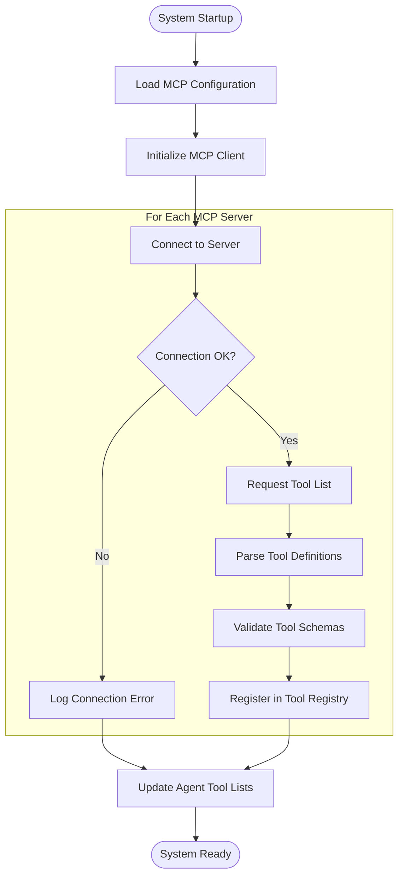
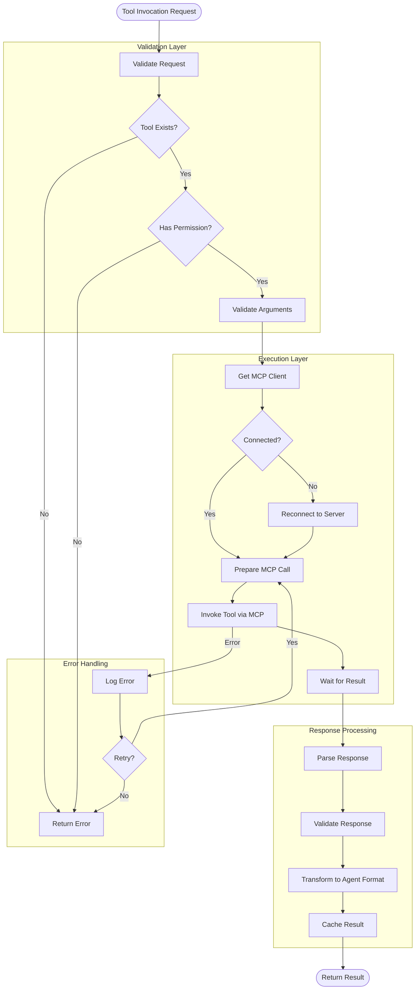
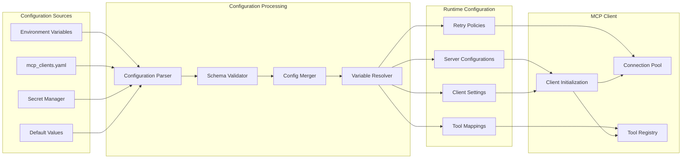
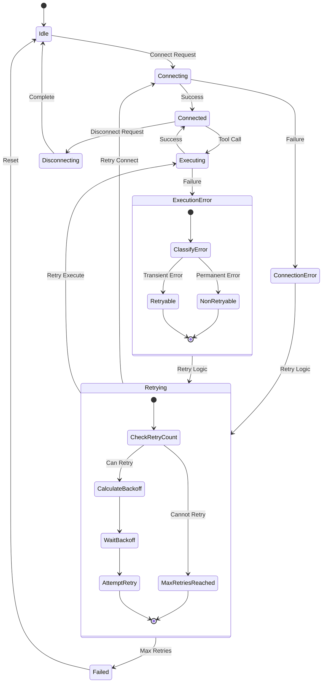
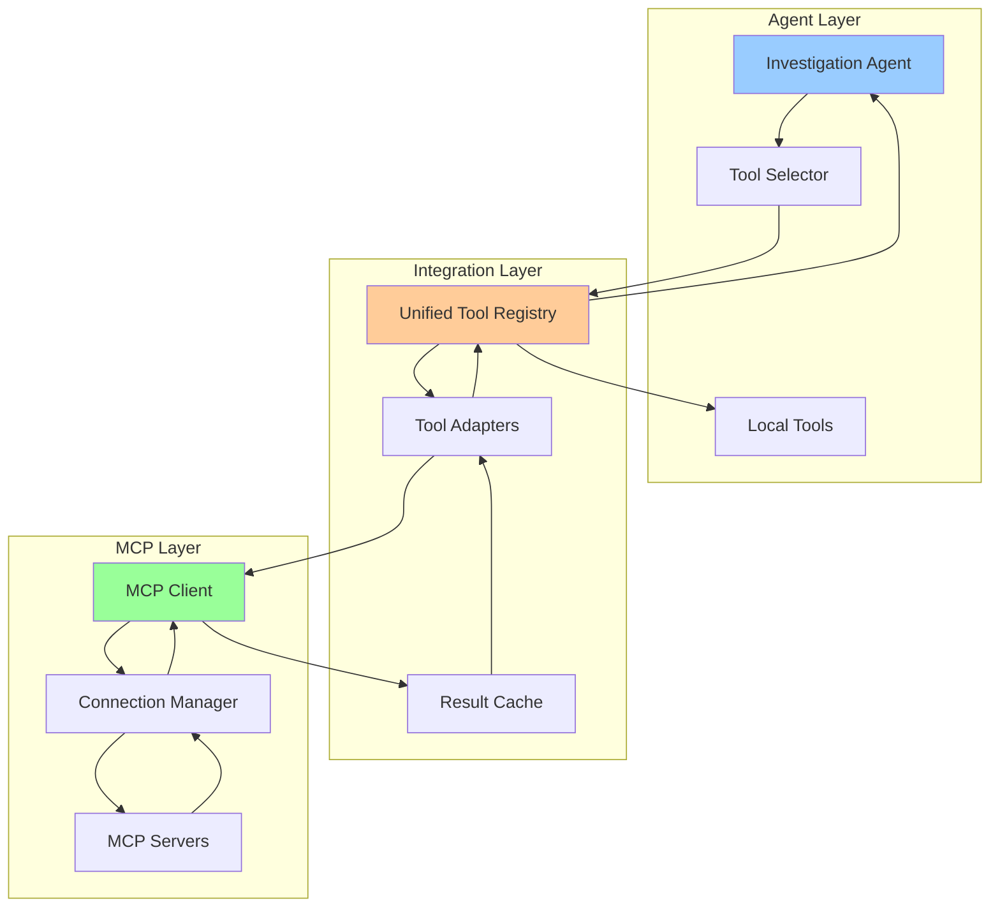
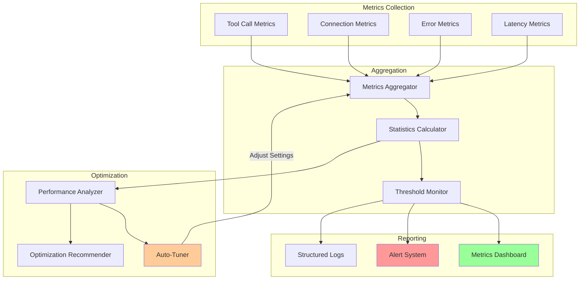

# MCP Data Flow Diagrams

## Tool Discovery Flow

```mermaid
flowchart TD
    Start([System Startup])
    LoadConfig[Load MCP Configuration]
    InitClient[Initialize MCP Client]
    
    subgraph "For Each MCP Server"
        Connect[Connect to Server]
        CheckConn{Connection OK?}
        ListTools[Request Tool List]
        ParseTools[Parse Tool Definitions]
        ValidateTools[Validate Tool Schemas]
        RegisterTools[Register in Tool Registry]
        LogError[Log Connection Error]
    end
    
    UpdateAgents[Update Agent Tool Lists]
    Ready([System Ready])
    
    Start --> LoadConfig
    LoadConfig --> InitClient
    InitClient --> Connect
    Connect --> CheckConn
    CheckConn -->|Yes| ListTools
    CheckConn -->|No| LogError
    ListTools --> ParseTools
    ParseTools --> ValidateTools
    ValidateTools --> RegisterTools
    LogError --> UpdateAgents
    RegisterTools --> UpdateAgents
    UpdateAgents --> Ready
```

## Tool Invocation Flow

```mermaid
flowchart TD
    Request([Tool Invocation Request])
    
    subgraph "Validation Layer"
        ValidateReq[Validate Request]
        CheckTool{Tool Exists?}
        CheckPerms{Has Permission?}
        ValidateArgs[Validate Arguments]
    end
    
    subgraph "Execution Layer"
        GetClient[Get MCP Client]
        CheckConn{Connected?}
        Reconnect[Reconnect to Server]
        PrepareCall[Prepare MCP Call]
        InvokeTool[Invoke Tool via MCP]
        WaitResult[Wait for Result]
    end
    
    subgraph "Response Processing"
        ParseResp[Parse Response]
        ValidateResp[Validate Response]
        TransformResp[Transform to Agent Format]
        CacheResult[Cache Result]
    end
    
    subgraph "Error Handling"
        LogError[Log Error]
        Retry{Retry?}
        ReturnError[Return Error]
    end
    
    Success([Return Result])
    
    Request --> ValidateReq
    ValidateReq --> CheckTool
    CheckTool -->|No| ReturnError
    CheckTool -->|Yes| CheckPerms
    CheckPerms -->|No| ReturnError
    CheckPerms -->|Yes| ValidateArgs
    ValidateArgs --> GetClient
    
    GetClient --> CheckConn
    CheckConn -->|No| Reconnect
    CheckConn -->|Yes| PrepareCall
    Reconnect --> PrepareCall
    PrepareCall --> InvokeTool
    InvokeTool --> WaitResult
    
    WaitResult --> ParseResp
    ParseResp --> ValidateResp
    ValidateResp --> TransformResp
    TransformResp --> CacheResult
    CacheResult --> Success
    
    InvokeTool -->|Error| LogError
    LogError --> Retry
    Retry -->|Yes| PrepareCall
    Retry -->|No| ReturnError
```

## Configuration Management Flow

```mermaid
flowchart LR
    subgraph "Configuration Sources"
        EnvVars[Environment Variables]
        ConfigFile[mcp_clients.yaml]
        Secrets[Secret Manager]
        Defaults[Default Values]
    end
    
    subgraph "Configuration Processing"
        Parser[Configuration Parser]
        Validator[Schema Validator]
        Merger[Config Merger]
        Resolver[Variable Resolver]
    end
    
    subgraph "Runtime Configuration"
        ServerConfigs[Server Configurations]
        ClientSettings[Client Settings]
        ToolMappings[Tool Mappings]
        RetryPolicies[Retry Policies]
    end
    
    subgraph "MCP Client"
        ClientInit[Client Initialization]
        ConnectionPool[Connection Pool]
        ToolRegistry[Tool Registry]
    end
    
    EnvVars --> Parser
    ConfigFile --> Parser
    Secrets --> Parser
    Defaults --> Parser
    
    Parser --> Validator
    Validator --> Merger
    Merger --> Resolver
    
    Resolver --> ServerConfigs
    Resolver --> ClientSettings
    Resolver --> ToolMappings
    Resolver --> RetryPolicies
    
    ServerConfigs --> ClientInit
    ClientSettings --> ClientInit
    ToolMappings --> ToolRegistry
    RetryPolicies --> ConnectionPool
    
    ClientInit --> ConnectionPool
    ClientInit --> ToolRegistry
```

## Error Recovery Flow

```mermaid
stateDiagram-v2
    [*] --> Idle
    
    Idle --> Connecting: Connect Request
    
    Connecting --> Connected: Success
    Connecting --> ConnectionError: Failure
    
    Connected --> Executing: Tool Call
    Connected --> Disconnecting: Disconnect Request
    
    Executing --> Connected: Success
    Executing --> ExecutionError: Failure
    
    ConnectionError --> Retrying: Retry Logic
    ExecutionError --> Retrying: Retry Logic
    
    Retrying --> Connecting: Retry Connect
    Retrying --> Executing: Retry Execute
    Retrying --> Failed: Max Retries
    
    Failed --> Idle: Reset
    
    Disconnecting --> Idle: Complete
    
    state Retrying {
        [*] --> CheckRetryCount
        CheckRetryCount --> CalculateBackoff: Can Retry
        CalculateBackoff --> WaitBackoff
        WaitBackoff --> AttemptRetry
        AttemptRetry --> [*]
        CheckRetryCount --> MaxRetriesReached: Cannot Retry
        MaxRetriesReached --> [*]
    }
    
    state ExecutionError {
        [*] --> ClassifyError
        ClassifyError --> Retryable: Transient Error
        ClassifyError --> NonRetryable: Permanent Error
        Retryable --> [*]
        NonRetryable --> [*]
    }
```

## Agent Integration Flow

```mermaid
graph TB
    subgraph "Agent Layer"
        Agent[Investigation Agent]
        LocalTools[Local Tools]
        ToolSelector[Tool Selector]
    end
    
    subgraph "Integration Layer"
        ToolRegistry[Unified Tool Registry]
        Adapters[Tool Adapters]
        Cache[Result Cache]
    end
    
    subgraph "MCP Layer"
        MCPClient[MCP Client]
        ConnManager[Connection Manager]
        Servers[MCP Servers]
    end
    
    Agent --> ToolSelector
    ToolSelector --> ToolRegistry
    
    ToolRegistry --> LocalTools
    ToolRegistry --> Adapters
    
    Adapters --> MCPClient
    MCPClient --> ConnManager
    ConnManager --> Servers
    
    Servers --> ConnManager
    ConnManager --> MCPClient
    MCPClient --> Cache
    Cache --> Adapters
    Adapters --> ToolRegistry
    ToolRegistry --> Agent
    
    style Agent fill:#99ccff
    style ToolRegistry fill:#ffcc99
    style MCPClient fill:#99ff99
```

## Performance Monitoring Flow

```mermaid
flowchart TD
    subgraph "Metrics Collection"
        ToolCalls[Tool Call Metrics]
        ConnMetrics[Connection Metrics]
        ErrorMetrics[Error Metrics]
        LatencyMetrics[Latency Metrics]
    end
    
    subgraph "Aggregation"
        Aggregator[Metrics Aggregator]
        Calculator[Statistics Calculator]
        Thresholds[Threshold Monitor]
    end
    
    subgraph "Reporting"
        Dashboard[Metrics Dashboard]
        Alerts[Alert System]
        Logs[Structured Logs]
    end
    
    subgraph "Optimization"
        Analyzer[Performance Analyzer]
        Tuner[Auto-Tuner]
        Recommender[Optimization Recommender]
    end
    
    ToolCalls --> Aggregator
    ConnMetrics --> Aggregator
    ErrorMetrics --> Aggregator
    LatencyMetrics --> Aggregator
    
    Aggregator --> Calculator
    Calculator --> Thresholds
    
    Thresholds --> Dashboard
    Thresholds --> Alerts
    Thresholds --> Logs
    
    Calculator --> Analyzer
    Analyzer --> Tuner
    Analyzer --> Recommender
    
    Tuner --> |Adjust Settings| Aggregator
    
    style Alerts fill:#ff9999
    style Dashboard fill:#99ff99
    style Tuner fill:#ffcc99
```