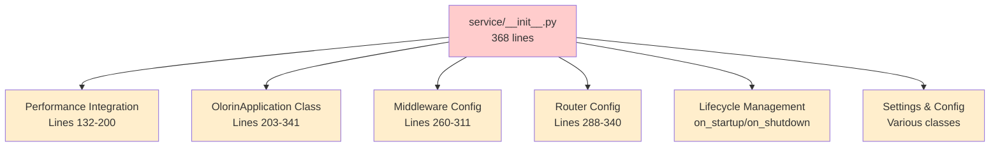
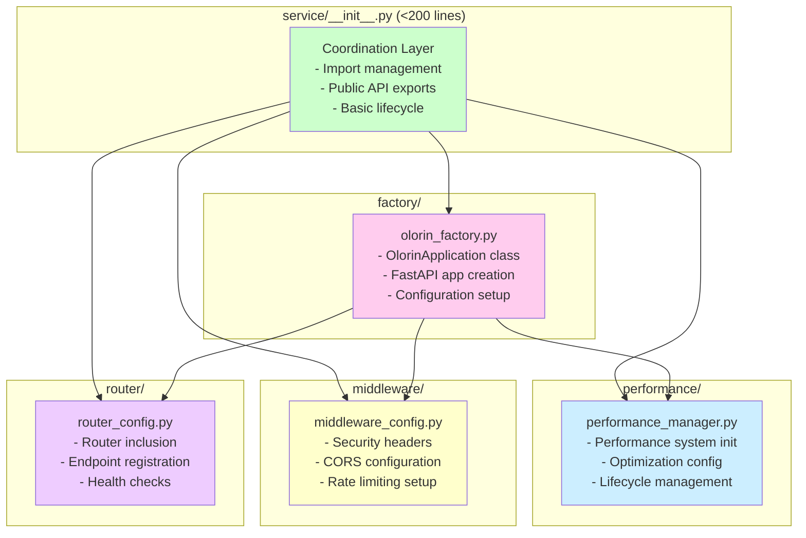
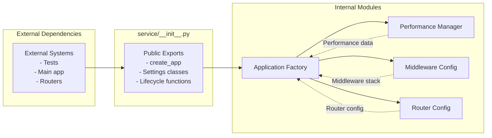
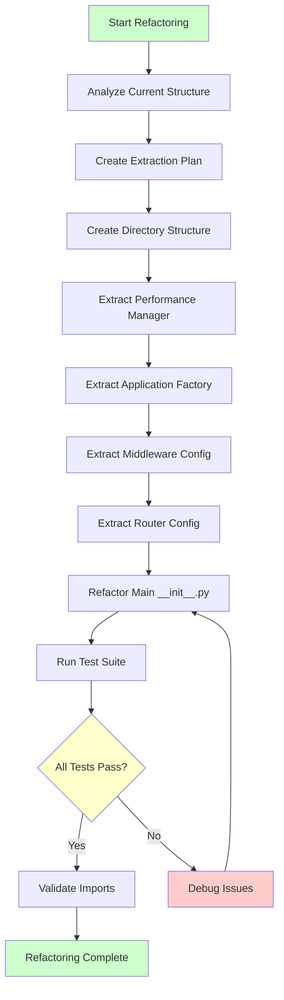
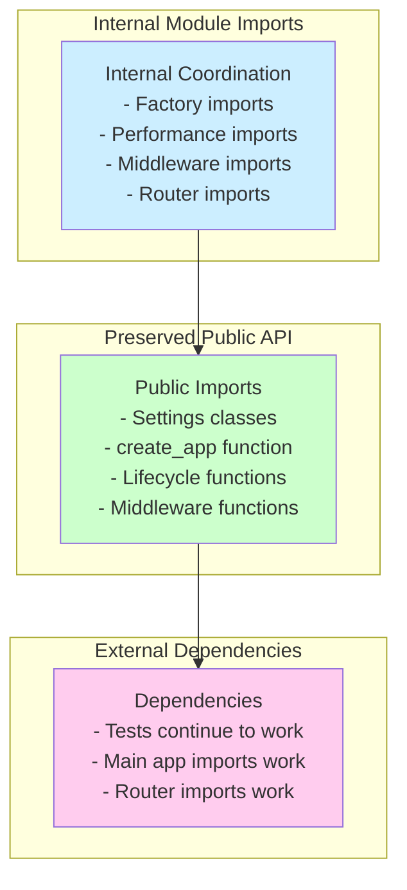

# Olorin Service Refactoring Architecture

## Current vs. Refactored Architecture

### Current Monolithic Structure

### Refactored Modular Structure

## Module Dependencies and Data Flow

## Refactoring Process Flow

## Module Responsibility Matrix

| Responsibility | Current Location | New Module | Lines Saved |
|----------------|------------------|------------|-------------|
| Performance Integration | __init__.py (132-200) | performance/performance_manager.py | ~68 |
| Application Factory | __init__.py (203-341) | factory/olorin_factory.py | ~138 |
| Middleware Setup | __init__.py (260-311) | middleware/middleware_config.py | ~51 |
| Router Configuration | __init__.py (288-340) | router/router_config.py | ~52 |
| **Total Extraction** | **368 lines** | **4 focused modules** | **~309** |
| **Remaining Coordination** | **<200 lines** | **__init__.py** | **✅ Compliant** |

## Import Preservation Strategy

