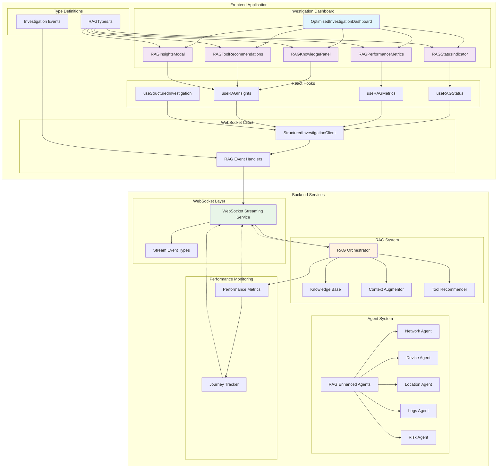
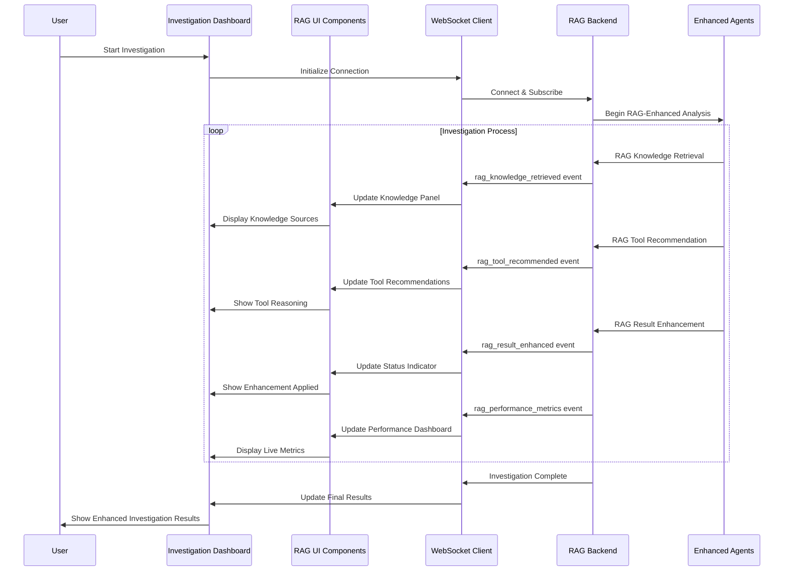
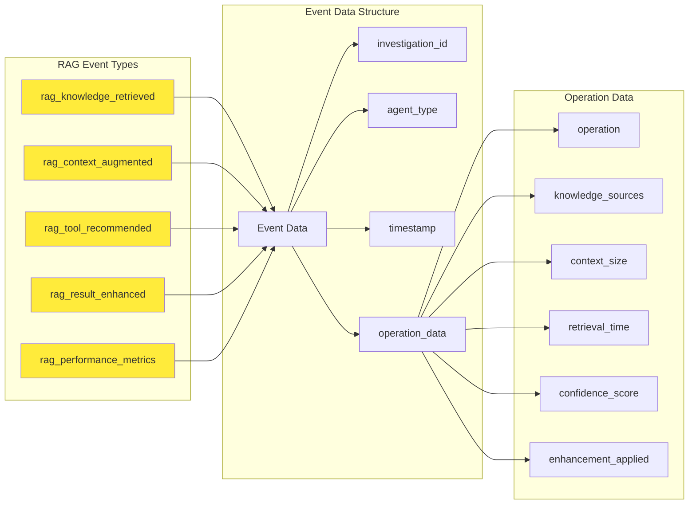
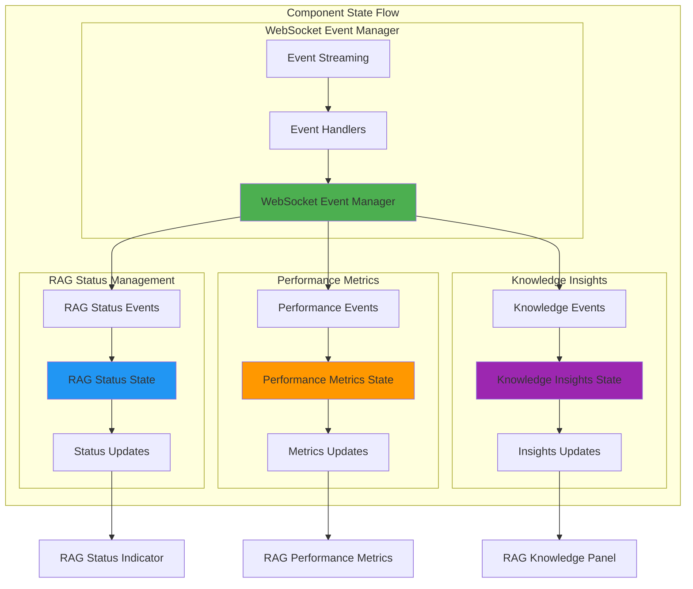
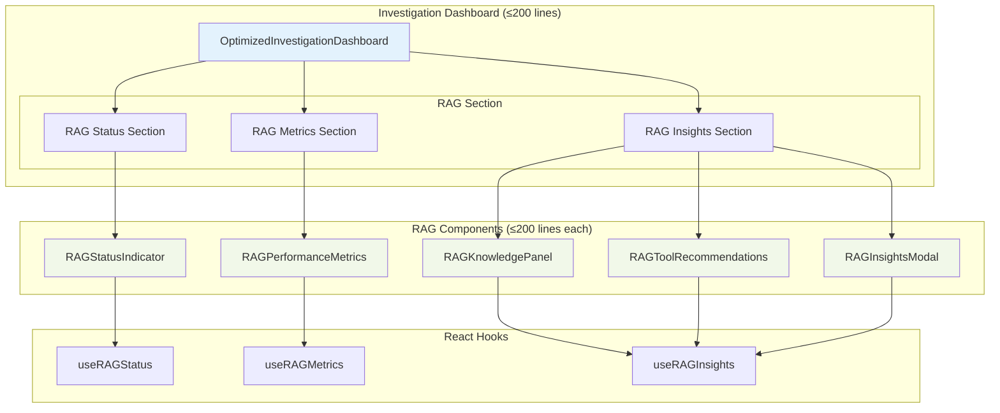
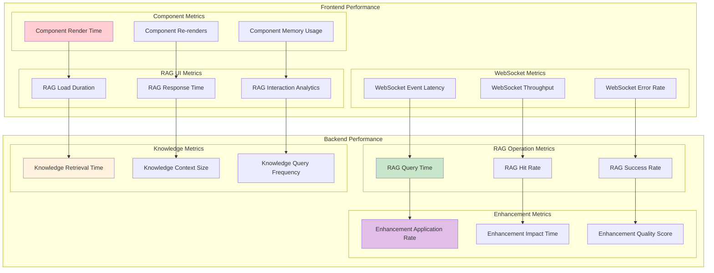
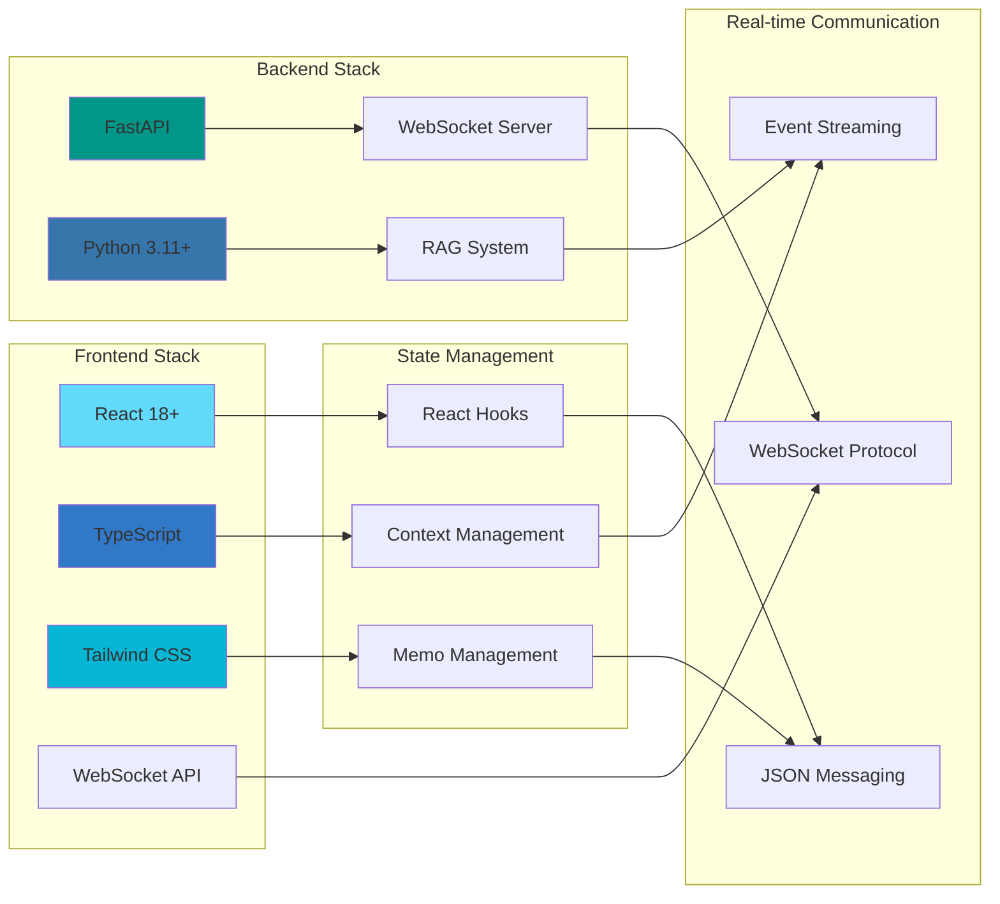
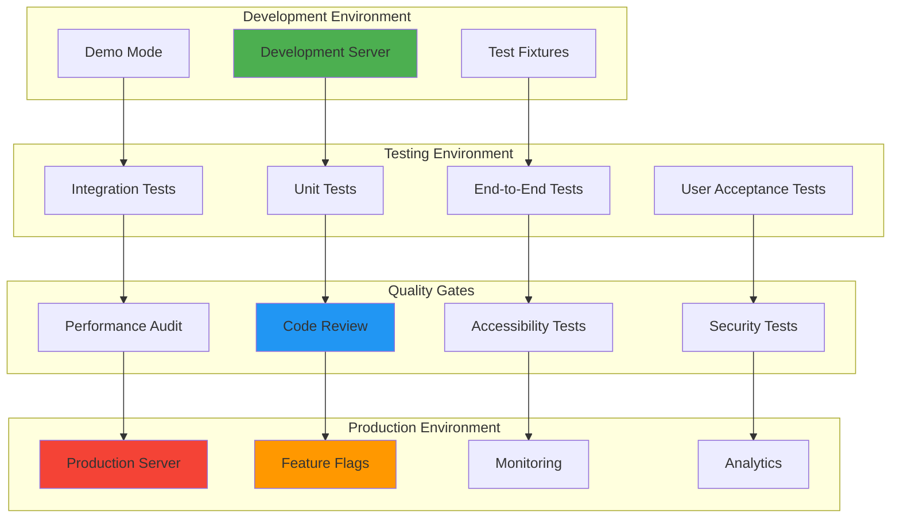

# Phase 5: RAG Frontend Integration Architecture Diagram

**Date**: 2025-01-04  
**Author**: Gil Klainert  
**Plan Reference**: [2025-01-04-phase-5-rag-frontend-integration-testing-plan.md](../plans/2025-01-04-phase-5-rag-frontend-integration-testing-plan.md)

## System Architecture Overview

## Component Interaction Flow

## RAG WebSocket Event Architecture

## Component State Management

## UI Component Hierarchy

## Performance Monitoring Architecture

## Technology Stack Integration

## Deployment Architecture

This architecture ensures a robust, scalable, and maintainable RAG frontend integration that provides comprehensive visibility into the RAG enhancement process while maintaining optimal performance.