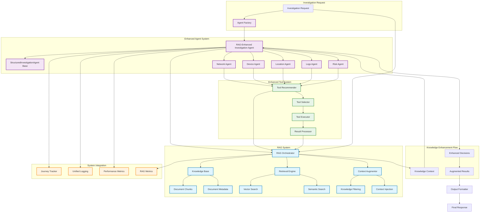
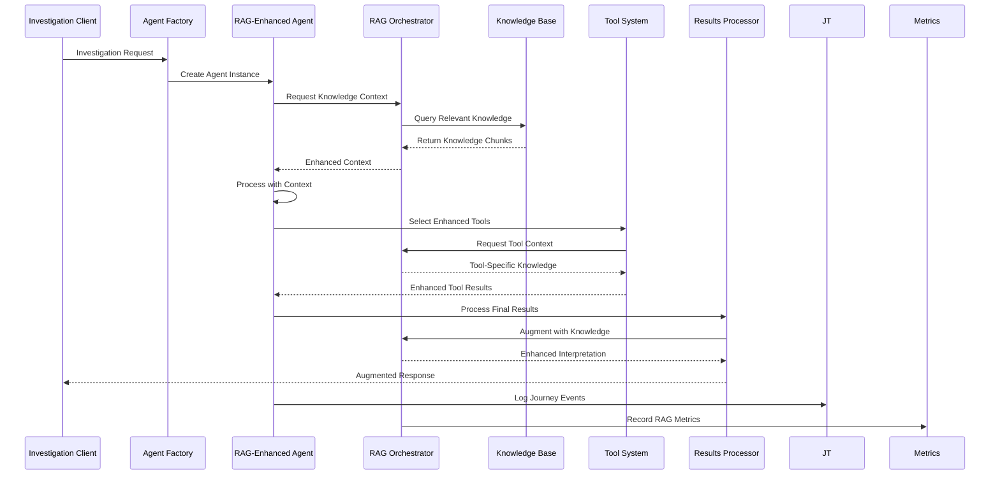
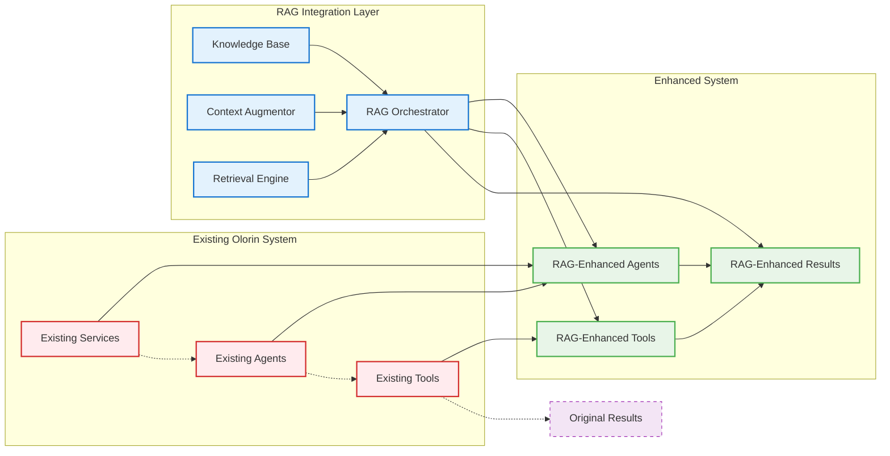
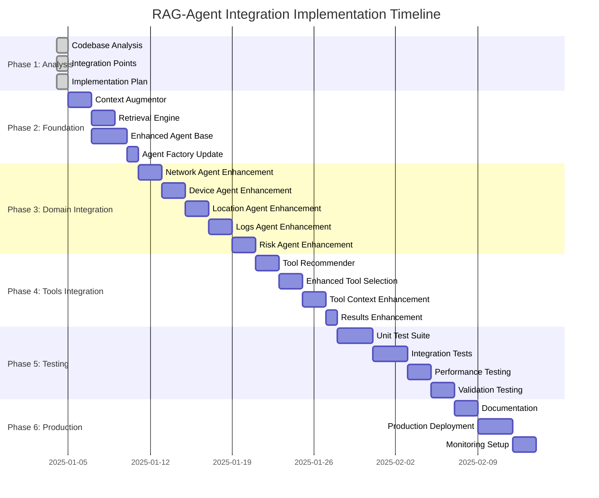
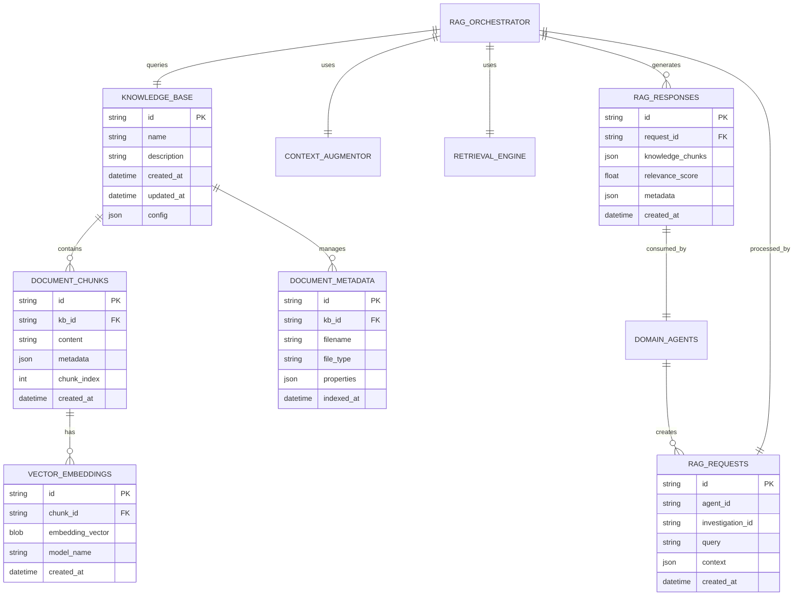

# RAG-Agent Integration Architecture Diagram

**Associated Plan**: [2025-01-04-rag-agent-integration-implementation-plan.md](/docs/plans/2025-01-04-rag-agent-integration-implementation-plan.md)  
**Date**: 2025-01-04  
**Author**: Gil Klainert

## System Architecture Overview

## RAG Integration Data Flow

## Component Integration Architecture

## Phase Implementation Flow

## Knowledge Base Integration Architecture

---

**Diagram Status**: Complete  
**Associated Plan**: [RAG-Agent Integration Implementation Plan](/docs/plans/2025-01-04-rag-agent-integration-implementation-plan.md)  
**Last Updated**: 2025-01-04 by Gil Klainert