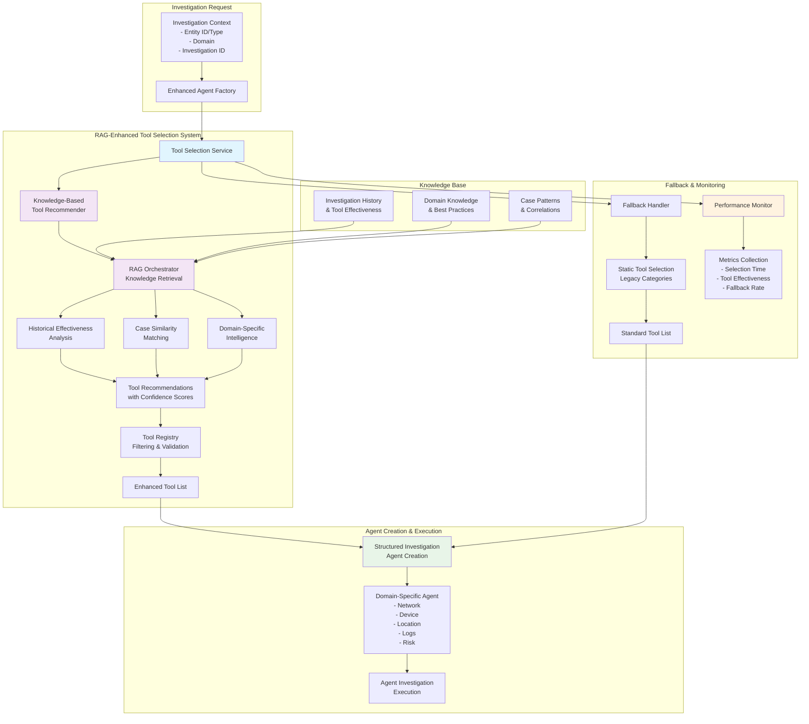
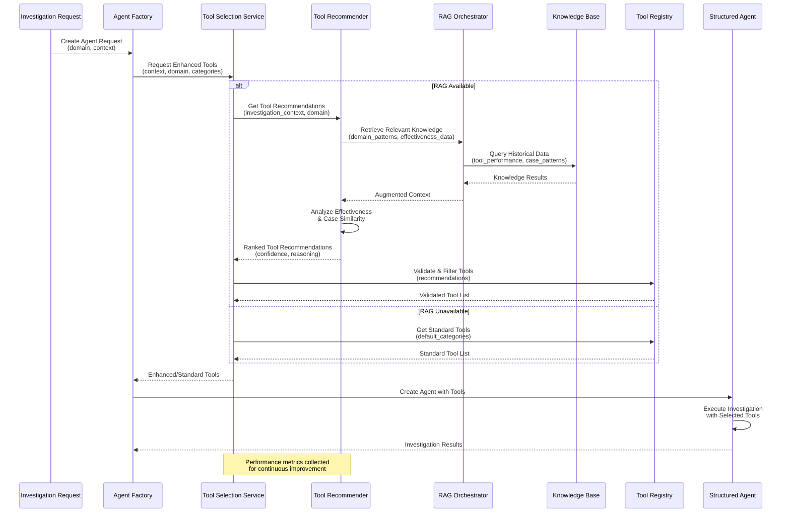
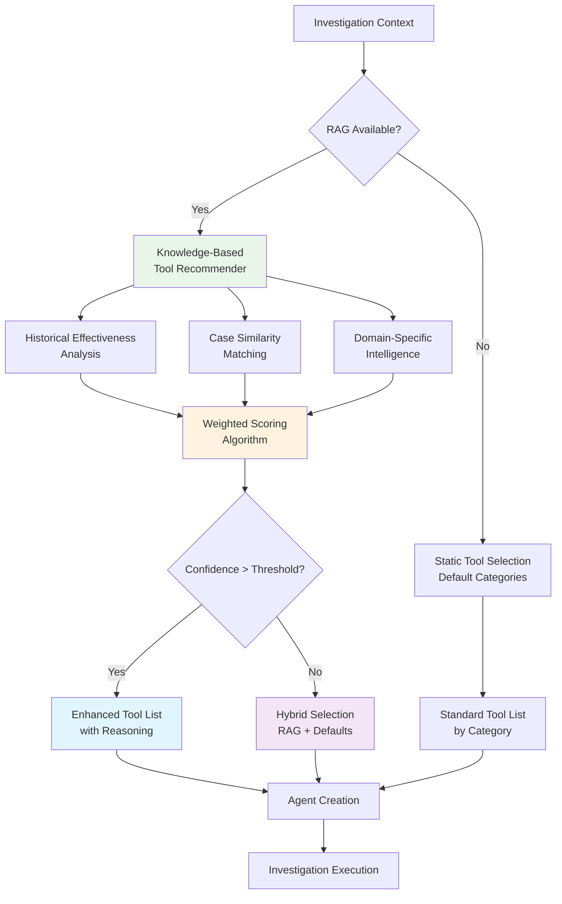
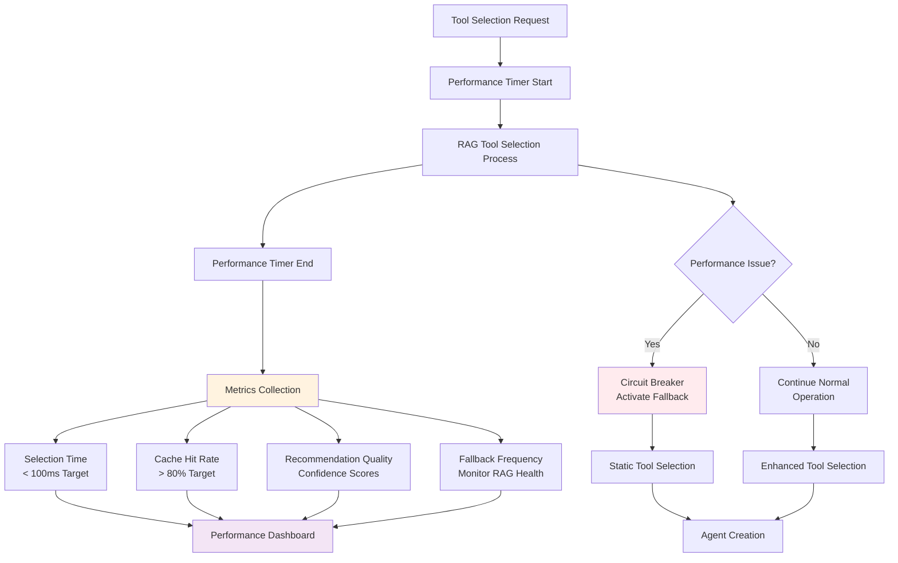
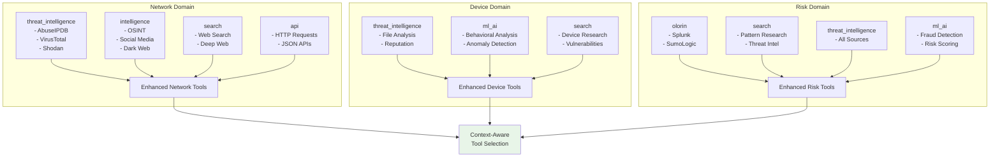

# RAG-Enhanced Tool Selection Architecture Diagram

**Date**: 2025-01-04  
**Author**: Gil Klainert  
**Related Plan**: [RAG-Enhanced Tool Selection Implementation Plan](/docs/plans/2025-01-04-rag-enhanced-tool-selection-implementation-plan.md)

## System Architecture Overview



## Tool Selection Flow Detail



## Component Integration Architecture

```mermaid
graph LR
    subgraph "Existing Components (Phase 2-3)"
        A[RAG Orchestrator] --> B[Context Augmentor]
        A --> C[Retrieval Engine]
        D[Knowledge Base] --> A
        E[Domain Agents<br/>RAG-Enhanced] --> A
    end

    subgraph "Phase 4 Component 1 (Complete)"
        F[Knowledge-Based<br/>Tool Recommender] --> A
        F --> G[Tool Effectiveness<br/>Analysis]
        F --> H[Case Similarity<br/>Matching]
    end

    subgraph "Phase 4 Component 2 (This Implementation)"
        I[Tool Selection<br/>Service] --> F
        I --> J[Enhanced Agent<br/>Factory]
        J --> K[Structured Agent<br/>Base Enhancement]
        K --> L[Domain Agent<br/>Tool Integration]
    end

    subgraph "Tool System Integration"
        M[Tool Registry] --> I
        N[Global Tools<br/>(Legacy)] --> I
        I --> O[Enhanced Tool<br/>Selection]
        O --> K
    end

    style F fill:#c8e6c9
    style I fill:#e1f5fe
    style J fill:#e1f5fe
    style K fill:#e1f5fe
    style L fill:#e1f5fe
```

## Tool Selection Decision Matrix



## Performance & Monitoring Flow



## Domain-Specific Tool Categories



This architecture demonstrates how the RAG-Enhanced Tool Selection Mechanism integrates with existing components while providing intelligent, context-aware tool selection for improved investigation outcomes.