# RAG Testing and Validation Architecture Diagram

**Date**: 2025-01-04  
**Project**: Olorin Fraud Detection Platform  
**Plan Reference**: [/docs/plans/2025-01-04-rag-testing-validation-implementation-plan.md](/docs/plans/2025-01-04-rag-testing-validation-implementation-plan.md)

## RAG Testing Architecture Flow

```mermaid
graph TB
    %% Test Infrastructure Layer
    subgraph TestInfra["🧪 Test Infrastructure Layer"]
        UnitTests["📋 Unit Tests<br/>test_rag_enhanced_agent.py<br/>19 tests (11✅ 8❌)"]
        IntegrationTests["🔗 Integration Tests<br/>test_rag_tool_integration.py<br/>Component integration"]
        E2ETests["🌐 E2E Tests<br/>test_autonomous_investigation.py<br/>Full workflow validation"]
        Fixtures["⚙️ Test Fixtures<br/>conftest.py<br/>real_investigation_context"]
    end

    %% RAG Foundation Testing
    subgraph RAGFoundation["🧠 RAG Foundation Testing"]
        ContextAugTest["📝 Context Augmentor Test<br/>Knowledge retrieval<br/>Target: <500ms"]
        RetrievalTest["🔍 Retrieval Engine Test<br/>Vector search accuracy<br/>Target: <50ms"]
        OrchestratorTest["🎼 RAG Orchestrator Test<br/>End-to-end pipeline<br/>Target: <1s"]
        KnowledgeTest["📚 Knowledge Base Test<br/>Document access<br/>Target: <100ms"]
    end

    %% Domain Agent Testing
    subgraph DomainAgents["🕵️ Domain Agent RAG Testing"]
        NetworkAgent["🌐 Network Agent<br/>IP reputation<br/>Network patterns"]
        DeviceAgent["📱 Device Agent<br/>Device fingerprinting<br/>Behavioral analysis"]  
        LocationAgent["📍 Location Agent<br/>Geolocation analysis<br/>Travel patterns"]
        LogsAgent["📄 Logs Agent<br/>Log pattern analysis<br/>Anomaly detection"]
        RiskAgent["⚠️ Risk Agent<br/>Risk aggregation<br/>Scoring enhancement"]
    end

    %% Tools Integration Testing
    subgraph ToolsIntegration["🔧 Tools Integration Testing"]
        ToolRecommender["🎯 Tool Recommender<br/>Context-aware selection<br/>Target: <30ms"]
        ToolSelection["⚡ Tool Selection<br/>Strategy coordination<br/>Target: <50ms"]
        ContextInjection["💉 Context Injection<br/>Context preparation<br/>Target: <30ms"]
        ResultAugmentation["✨ Result Augmentation<br/>Knowledge enhancement<br/>Target: <30ms"]
    end

    %% End-to-End Testing
    subgraph E2ETesting["🏁 End-to-End Testing"]
        FullInvestigation["🔬 Full Investigation<br/>Complete RAG workflow<br/>Target: <5 minutes"]
        Comparison["⚖️ RAG vs Non-RAG<br/>A/B testing comparison<br/>Statistical validation"]
        WebSocketTest["📡 WebSocket Testing<br/>Real-time updates<br/>RAG status events"]
        JourneyTracking["🗺️ Journey Tracking<br/>RAG metrics collection<br/>Audit trail"]
    end

    %% Performance Monitoring
    subgraph Monitoring["📊 Performance Monitoring"]
        RetrievalMetrics["⏱️ Retrieval Metrics<br/><500ms knowledge<br/><50ms tool context"]
        QualityMetrics["📈 Quality Metrics<br/>Relevance scores<br/>Enhancement quality"]
        FallbackTest["🛡️ Fallback Testing<br/>Graceful degradation<br/><100ms detection"]
    end

    %% Test Flow Connections
    TestInfra --> RAGFoundation
    RAGFoundation --> DomainAgents
    DomainAgents --> ToolsIntegration
    ToolsIntegration --> E2ETesting
    E2ETesting --> Monitoring

    %% Component Interactions
    UnitTests -.-> ContextAugTest
    UnitTests -.-> RetrievalTest
    UnitTests -.-> OrchestratorTest
    UnitTests -.-> KnowledgeTest

    IntegrationTests -.-> NetworkAgent
    IntegrationTests -.-> DeviceAgent
    IntegrationTests -.-> LocationAgent
    IntegrationTests -.-> LogsAgent
    IntegrationTests -.-> RiskAgent

    E2ETests -.-> FullInvestigation
    E2ETests -.-> Comparison
    E2ETests -.-> WebSocketTest
    E2ETests -.-> JourneyTracking

    %% Monitoring Connections
    RAGFoundation --> RetrievalMetrics
    DomainAgents --> QualityMetrics
    ToolsIntegration --> RetrievalMetrics
    E2ETesting --> FallbackTest

    %% Styling
    classDef testLayer fill:#e1f5fe,stroke:#01579b,stroke-width:2px
    classDef ragLayer fill:#f3e5f5,stroke:#4a148c,stroke-width:2px
    classDef agentLayer fill:#e8f5e8,stroke:#1b5e20,stroke-width:2px
    classDef toolLayer fill:#fff3e0,stroke:#e65100,stroke-width:2px
    classDef e2eLayer fill:#fce4ec,stroke:#880e4f,stroke-width:2px
    classDef monitorLayer fill:#f1f8e9,stroke:#33691e,stroke-width:2px

    class UnitTests,IntegrationTests,E2ETests,Fixtures testLayer
    class ContextAugTest,RetrievalTest,OrchestratorTest,KnowledgeTest ragLayer
    class NetworkAgent,DeviceAgent,LocationAgent,LogsAgent,RiskAgent agentLayer
    class ToolRecommender,ToolSelection,ContextInjection,ResultAugmentation toolLayer
    class FullInvestigation,Comparison,WebSocketTest,JourneyTracking e2eLayer
    class RetrievalMetrics,QualityMetrics,FallbackTest monitorLayer
```

## Testing Phase Dependencies

## Performance Target Architecture

```mermaid
graph LR
    %% Performance Targets
    subgraph PerformanceTargets["🎯 Performance Targets"]
        KnowledgeRetrieval["📚 Knowledge Retrieval<br/>Target: <500ms<br/>Current: TBD"]
        ToolContext["🔧 Tool Context<br/>Target: <50ms<br/>Current: TBD"]
        ResultAugment["✨ Result Augmentation<br/>Target: <30ms<br/>Current: TBD"]
        Investigation["🔬 Full Investigation<br/>Target: <5 minutes<br/>Current: TBD"]
        FallbackDetect["🛡️ Fallback Detection<br/>Target: <100ms<br/>Current: TBD"]
    end

    %% Quality Metrics
    subgraph QualityMetrics["📊 Quality Metrics"]
        RelevanceScore["🎯 Relevance Score<br/>Target: ≥0.8<br/>Current: TBD"]
        RecommendAccuracy["🎪 Recommendation Accuracy<br/>Target: ≥0.9<br/>Current: TBD"]
        Enhancement["📈 Enhancement Quality<br/>Target: Significant<br/>Current: TBD"]
        Coverage["🌐 Test Coverage<br/>Target: 100%<br/>Current: 58%"]
    end

    %% Monitoring Flow
    KnowledgeRetrieval --> RelevanceScore
    ToolContext --> RecommendAccuracy  
    ResultAugment --> Enhancement
    Investigation --> Coverage
    FallbackDetect --> Coverage

    %% Styling
    classDef performance fill:#e3f2fd,stroke:#0277bd,stroke-width:2px
    classDef quality fill:#f1f8e9,stroke:#558b2f,stroke-width:2px

    class KnowledgeRetrieval,ToolContext,ResultAugment,Investigation,FallbackDetect performance
    class RelevanceScore,RecommendAccuracy,Enhancement,Coverage quality
```

## Test Data Flow Architecture

