# Risk Agent RAG Integration Architecture Diagram

**Author**: Gil Klainert  
**Date**: 2025-01-04  
**Plan Reference**: [Risk Agent RAG Integration Implementation Plan](/docs/plans/2025-01-04-risk-agent-rag-integration-implementation-plan.md)

## Risk Agent RAG Integration Architecture

```mermaid
graph TB
    subgraph "Investigation Request"
        A[Investigation Context] --> B[Risk Agent Entry Point]
    end
    
    subgraph "Risk Agent RAG Integration"
        B --> C{RAG Available?}
        C -->|Yes| D[Create RAG Config]
        C -->|No| E[Standard Agent Mode]
        
        D --> F[Risk RAG Configuration]
        F --> G[Create RAG-Enhanced Agent]
        E --> H[Create Standard Agent]
    end
    
    subgraph "Risk RAG Configuration Module"
        F --> F1[Risk Domain Categories]
        F --> F2[Enhanced Objectives]
        F --> F3[Performance Parameters]
        
        F1 --> F1A[risk_scoring_models]
        F1 --> F1B[fraud_risk_indicators] 
        F1 --> F1C[behavioral_risk_analysis]
        F1 --> F1D[financial_risk_patterns]
        F1 --> F1E[account_risk_assessment]
        F1 --> F1F[transaction_risk_analysis]
        F1 --> F1G[risk_correlation_techniques]
        F1 --> F1H[regulatory_compliance_risk]
        
        F2 --> F2A[13 Standard Objectives]
        F2 --> F2B[4 RAG-Enhanced Objectives]
        F2B --> F2C[Domain Knowledge Retrieval]
        F2B --> F2D[Historical Pattern Application]
        
        F3 --> F3A[critical_chunks: 8]
        F3 --> F3B[supporting_chunks: 15]
        F3 --> F3C[background_chunks: 20]
        F3 --> F3D[critical_threshold: 0.90]
    end
    
    subgraph "Enhanced Risk Analysis"
        G --> I[RAG-Enhanced Investigation]
        H --> J[Standard Investigation]
        
        I --> K[Knowledge Retrieval]
        K --> L[Context Augmentation]
        L --> M[Enhanced Risk Assessment]
        
        J --> N[Direct Risk Assessment]
    end
    
    subgraph "Knowledge Base Integration"
        K --> O[Risk Scoring Models]
        K --> P[Fraud Risk Indicators]
        K --> Q[Behavioral Patterns]
        K --> R[Financial Risk Data]
        
        O --> S[Historical Models]
        P --> T[Pattern Libraries]
        Q --> U[Behavioral Analysis]
        R --> V[Transaction Patterns]
    end
    
    subgraph "Risk Assessment Execution"
        M --> W[Multi-Factor Risk Analysis]
        N --> W
        
        W --> X[Threat Intelligence Integration]
        W --> Y[Cross-Domain Correlation]
        W --> Z[Risk Score Calculation]
        
        X --> AA[AbuseIPDB Integration]
        X --> BB[VirusTotal Analysis]
        X --> CC[Shodan Intelligence]
        
        Y --> DD[Device Findings]
        Y --> EE[Network Findings] 
        Y --> FF[Location Findings]
        Y --> GG[Logs Findings]
    end
    
    subgraph "Results & Performance Tracking"
        Z --> HH[Risk Assessment Results]
        
        HH --> II[RAG Statistics]
        HH --> JJ[Journey Tracking]
        HH --> KK[WebSocket Updates]
        
        II --> LL[Knowledge Retrieval Count]
        II --> MM[Context Augmentation Success]
        II --> NN[Performance Metrics]
        
        JJ --> OO[Agent Execution Tracking]
        JJ --> PP[RAG Enhancement Metadata]
        
        KK --> QQ[Progress Broadcast]
        KK --> RR[Agent Result Broadcast]
    end
    
    subgraph "Graceful Fallback Mechanism"
        C -->|RAG Failure| SS[Fallback to Standard]
        D -->|Config Failure| SS
        G -->|Agent Creation Failure| SS
        
        SS --> H
        SS --> TT[Log Fallback Event]
        TT --> UU[Continue with Standard Agent]
    end

    classDef ragNode fill:#e1f5fe,stroke:#01579b,stroke-width:2px
    classDef configNode fill:#f3e5f5,stroke:#4a148c,stroke-width:2px  
    classDef knowledgeNode fill:#e8f5e8,stroke:#1b5e20,stroke-width:2px
    classDef resultNode fill:#fff3e0,stroke:#e65100,stroke-width:2px
    classDef fallbackNode fill:#ffebee,stroke:#b71c1c,stroke-width:2px
    
    class D,F,G,I,K,L,M ragNode
    class F1,F1A,F1B,F1C,F1D,F1E,F1F,F1G,F1H,F2,F2A,F2B,F2C,F2D,F3,F3A,F3B,F3C,F3D configNode
    class O,P,Q,R,S,T,U,V knowledgeNode  
    class HH,II,JJ,KK,LL,MM,NN,OO,PP,QQ,RR resultNode
    class SS,TT,UU fallbackNode
```

## Risk Domain Knowledge Architecture

```mermaid
graph LR
    subgraph "Risk Knowledge Categories"
        A[Risk Scoring Models] --> A1[FICO Models]
        A --> A2[Custom Scoring Frameworks]
        A --> A3[ML Risk Models]
        A --> A4[Validation Techniques]
        
        B[Fraud Risk Indicators] --> B1[Behavioral Patterns]
        B --> B2[Transaction Anomalies]
        B --> B3[Account Compromise Signs]
        B --> B4[Identity Theft Indicators]
        
        C[Behavioral Risk Analysis] --> C1[User Profiling Techniques]
        C --> C2[Anomaly Detection Methods]
        C --> C3[Behavioral Biometrics]
        C --> C4[Pattern Recognition]
        
        D[Financial Risk Patterns] --> D1[Payment Fraud Patterns]
        D --> D2[Money Laundering Indicators]
        D --> D3[Credit Card Fraud Types]
        D --> D4[Wire Transfer Risks]
        
        E[Account Risk Assessment] --> E1[Account Security Factors]
        E --> E2[Access Pattern Analysis]
        E --> E3[Authentication Risks]
        E --> E4[Account Age/History]
        
        F[Transaction Risk Analysis] --> F1[Velocity Checks]
        F --> F2[Amount Thresholds]
        F --> F3[Geographic Anomalies]
        F --> F4[Time-based Patterns]
        
        G[Risk Correlation Techniques] --> G1[Multi-Factor Analysis]
        G --> G2[Risk Aggregation Methods]
        G --> G3[Correlation Algorithms]
        G --> G4[Weight Assignment]
        
        H[Regulatory Compliance Risk] --> H1[AML Requirements]
        H --> H2[KYC Regulations]
        H --> H3[GDPR Compliance]
        H --> H4[Industry Standards]
    end
    
    subgraph "Knowledge Application Flow"
        I[Investigation Context] --> J[Knowledge Retrieval Query]
        J --> K[Category-Specific Search]
        K --> L[Relevance Scoring]
        L --> M[Context Ranking]
        M --> N[Knowledge Injection]
        N --> O[Enhanced Risk Analysis]
    end
    
    subgraph "RAG Performance Optimization"
        P[Query Optimization] --> Q[Caching Strategy]
        Q --> R[Batch Retrieval]  
        R --> S[Context Compression]
        S --> T[Relevance Filtering]
        T --> U[Response Enhancement]
    end

    classDef categoryNode fill:#e3f2fd,stroke:#0277bd,stroke-width:2px
    classDef subCategoryNode fill:#f1f8e9,stroke:#33691e,stroke-width:2px
    classDef flowNode fill:#fce4ec,stroke:#880e4f,stroke-width:2px
    classDef perfNode fill:#fff8e1,stroke:#f57f17,stroke-width:2px
    
    class A,B,C,D,E,F,G,H categoryNode
    class A1,A2,A3,A4,B1,B2,B3,B4,C1,C2,C3,C4,D1,D2,D3,D4,E1,E2,E3,E4,F1,F2,F3,F4,G1,G2,G3,G4,H1,H2,H3,H4 subCategoryNode
    class I,J,K,L,M,N,O flowNode
    class P,Q,R,S,T,U perfNode
```



## Integration Pattern Consistency

```mermaid
graph TD
    subgraph "Established Pattern (Network/Device/Location/Logs)"
        A1[Agent Entry Point] --> B1[RAG Available Check]
        B1 --> C1[Config Module Import]
        C1 --> D1[RAG Configuration Creation]
        D1 --> E1[Enhanced Agent Creation]
        E1 --> F1[Enhanced Investigation]
        F1 --> G1[RAG Statistics Tracking]
        G1 --> H1[Result Structure]
    end
    
    subgraph "Risk Agent Implementation (New)"
        A2[risk_agent.py Entry] --> B2[RAG Available Check]
        B2 --> C2[risk_agent_config Import]
        C2 --> D2[create_risk_rag_config()]
        D2 --> E2[create_rag_agent()]
        E2 --> F2[Enhanced Risk Investigation]
        F2 --> G2[RAG Performance Tracking]
        G2 --> H2[Risk Result Structure]
    end
    
    subgraph "Consistent Configuration Pattern"
        I[Domain-Specific Config Module] --> J[RAG Config Creation]
        J --> K[Enhanced Objectives]
        K --> L[Statistics Management]
        L --> M[Metadata Creation]
        M --> N[Result Formatting]
    end
    
    subgraph "Graceful Fallback Pattern"
        O[RAG Check Failure] --> P[Standard Agent Fallback]
        P --> Q[Error Logging]
        Q --> R[Continue Normal Operation]
    end

    classDef establishedNode fill:#c8e6c9,stroke:#2e7d32,stroke-width:2px
    classDef newNode fill:#ffecb3,stroke:#f57c00,stroke-width:2px  
    classDef patternNode fill:#e1bee7,stroke:#7b1fa2,stroke-width:2px
    classDef fallbackNode fill:#ffcdd2,stroke:#c62828,stroke-width:2px
    
    class A1,B1,C1,D1,E1,F1,G1,H1 establishedNode
    class A2,B2,C2,D2,E2,F2,G2,H2 newNode
    class I,J,K,L,M,N patternNode
    class O,P,Q,R fallbackNode
```

## File Structure and Compliance

```mermaid
graph TB
    subgraph "Risk Agent Files (200 Line Compliance)"
        A[risk_agent.py] --> A1[Current: ~140 lines]
        A --> A2[After RAG: <200 lines]
        A --> A3[RAG Integration Code: ~50 lines]
        
        B[risk_agent_config.py] --> B1[New File: ~150 lines]
        B --> B2[Configuration Functions: ~120 lines]
        B --> B3[Utility Functions: ~30 lines]
    end
    
    subgraph "Modular Structure"
        C[Configuration Separation] --> D[Domain Logic Separation]
        D --> E[Statistics Management] 
        E --> F[Result Formatting]
        F --> G[Metadata Creation]
    end
    
    subgraph "Consistent Pattern Compliance"
        H[network_agent_config.py] --> I[155 lines]
        J[device_agent_config.py] --> K[162 lines] 
        L[location_agent_config.py] --> M[148 lines]
        N[logs_agent_config.py] --> O[171 lines]
        P[risk_agent_config.py] --> Q[~150 lines]
    end

    classDef fileNode fill:#e8f5e8,stroke:#1b5e20,stroke-width:2px
    classDef structureNode fill:#e3f2fd,stroke:#0277bd,stroke-width:2px
    classDef complianceNode fill:#fff3e0,stroke:#e65100,stroke-width:2px
    
    class A,A1,A2,A3,B,B1,B2,B3 fileNode
    class C,D,E,F,G structureNode  
    class H,I,J,K,L,M,N,O,P,Q complianceNode
```

---

**Architecture Status**: Complete Design ✅  
**Implementation Ready**: Risk Agent RAG Integration  
**Pattern Compliance**: Follows established domain agent pattern  
**File Size Compliance**: Both files under 200 lines