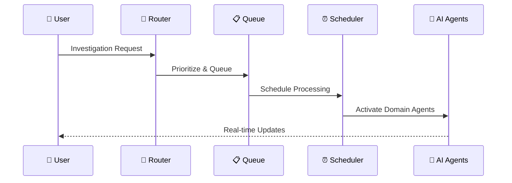
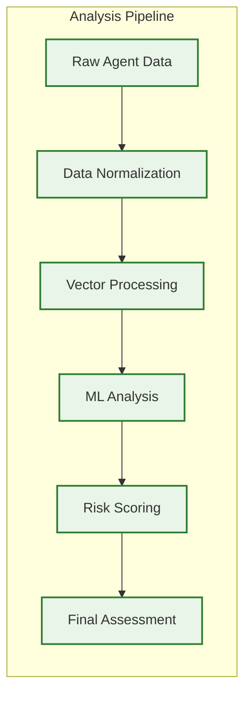
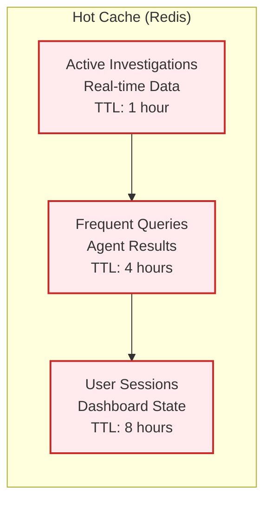
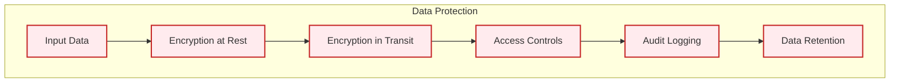
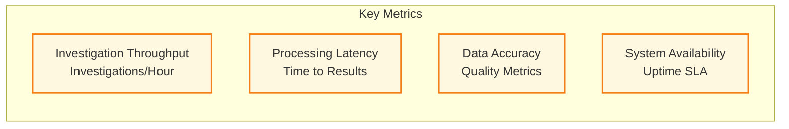
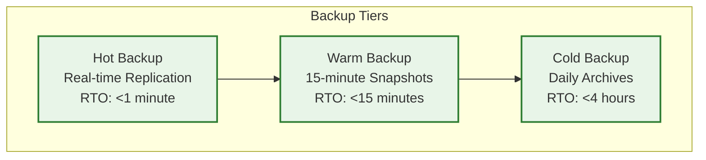

# Data Flow Architecture

**Category**: System-Level Architecture  
**Purpose**: System-wide data movement and processing flows  
**Created**: January 31, 2025  
**Status**: ✅ **COMPLETED**

---

## 🎯 DIAGRAM PURPOSE

This diagram illustrates the comprehensive data flow patterns within the Olorin fraud investigation platform, showing:
- Investigation data pipeline from input to output
- Real-time data processing and transformation
- AI agent data collection and analysis flows
- External data source integration patterns
- Risk assessment and reporting data flows
- Caching and performance optimization strategies

---

## 🔄 COMPREHENSIVE DATA FLOW ARCHITECTURE

```mermaid
graph TB
    subgraph "Data Input Layer"
        USER_INPUT[👤 User Investigation Request<br/>Case ID, Entity Details<br/>Investigation Parameters]
        API_INPUT[🔗 API Investigation Request<br/>External System Integration<br/>Automated Investigation Triggers]
    end
    
    subgraph "Investigation Orchestration"
        ROUTER[🔀 Investigation Router<br/>Request Classification<br/>Agent Assignment]
        QUEUE[📋 Investigation Queue<br/>Priority Management<br/>Resource Allocation]
        SCHEDULER[⏰ Investigation Scheduler<br/>Async Processing<br/>Job Coordination]
    end
    
    subgraph "AI Agent Data Collection"
        subgraph "Device Analysis Flow"
            DEVICE_QUERY[🔍 Device Query<br/>Device ID Extraction<br/>Fingerprint Analysis]
            DEVICE_SOURCES[📱 Device Data Sources<br/>Device Intelligence APIs<br/>Behavioral Analytics]
            DEVICE_PROCESS[⚙️ Device Processing<br/>Risk Scoring<br/>Pattern Analysis]
        end
        
        subgraph "Location Analysis Flow"
            LOCATION_QUERY[📍 Location Query<br/>IP Geolocation<br/>Address Validation]
            LOCATION_SOURCES[🗺️ Location Data Sources<br/>Geo APIs<br/>IP Intelligence]
            LOCATION_PROCESS[⚙️ Location Processing<br/>Risk Assessment<br/>Velocity Analysis]
        end
        
        subgraph "Network Analysis Flow"
            NETWORK_QUERY[🌐 Network Query<br/>Traffic Analysis<br/>Threat Detection]
            NETWORK_SOURCES[🛡️ Network Data Sources<br/>Threat Intelligence<br/>Security Feeds]
            NETWORK_PROCESS[⚙️ Network Processing<br/>Anomaly Detection<br/>Risk Scoring]
        end
        
        subgraph "Logs Analysis Flow"
            LOGS_QUERY[📋 Logs Query<br/>Event Correlation<br/>Timeline Analysis]
            LOGS_SOURCES[📊 Log Data Sources<br/>Splunk SIEM<br/>Security Events]
            LOGS_PROCESS[⚙️ Logs Processing<br/>Event Analysis<br/>Incident Detection]
        end
    end
    
    subgraph "Data Processing & Analytics"
        AGGREGATOR[🔄 Data Aggregation<br/>Multi-Source Integration<br/>Data Normalization]
        ML_ENGINE[🧠 ML Processing Engine<br/>Vector Database Queries<br/>Pattern Recognition]
        RISK_ENGINE[⚠️ Risk Assessment Engine<br/>Composite Risk Scoring<br/>Decision Support]
        CORRELATION[🔗 Cross-Domain Correlation<br/>Entity Relationship Analysis<br/>Timeline Correlation]
    end
    
    subgraph "Data Storage & Caching"
        CACHE_HOT[🔴 Hot Cache (Redis)<br/>Active Investigation Data<br/>Real-time Query Results]
        CACHE_WARM[🟡 Warm Cache<br/>Frequently Accessed Data<br/>Agent Result Cache]
        PRIMARY_DB[💾 Primary Database<br/>Investigation Results<br/>Audit Trail]
        ANALYTICS_DB[📊 Analytics Database<br/>Historical Data<br/>Performance Metrics]
        VECTOR_STORE[🧠 Vector Store<br/>ML Embeddings<br/>Similarity Search]
    end
    
    subgraph "Real-time Data Distribution"
        WEBSOCKET[🔌 WebSocket Stream<br/>Live Investigation Updates<br/>Progress Notifications]
        PUBSUB[📢 Pub/Sub Messaging<br/>Event Broadcasting<br/>Agent Coordination]
        NOTIFICATION[🔔 Notification Service<br/>Alert Distribution<br/>Status Updates]
    end
    
    subgraph "Output & Reporting"
        DASHBOARD[📊 Real-time Dashboard<br/>Investigation Visualization<br/>Interactive Results]
        REPORTS[📋 Investigation Reports<br/>Comprehensive Analysis<br/>Executive Summary]
        EXPORT[📤 Data Export<br/>CSV, JSON, PDF<br/>Third-party Integration]
        AUDIT[📝 Audit Trail<br/>Investigation History<br/>Compliance Tracking]
    end
    
    %% Input Flow
    USER_INPUT --> ROUTER
    API_INPUT --> ROUTER
    
    %% Investigation Orchestration
    ROUTER --> QUEUE
    QUEUE --> SCHEDULER
    
    %% Agent Data Collection Flows
    SCHEDULER --> DEVICE_QUERY
    SCHEDULER --> LOCATION_QUERY
    SCHEDULER --> NETWORK_QUERY
    SCHEDULER --> LOGS_QUERY
    
    %% External Data Source Integration
    DEVICE_QUERY --> DEVICE_SOURCES
    LOCATION_QUERY --> LOCATION_SOURCES
    NETWORK_QUERY --> NETWORK_SOURCES
    LOGS_QUERY --> LOGS_SOURCES
    
    %% Agent Processing
    DEVICE_SOURCES --> DEVICE_PROCESS
    LOCATION_SOURCES --> LOCATION_PROCESS
    NETWORK_SOURCES --> NETWORK_PROCESS
    LOGS_SOURCES --> LOGS_PROCESS
    
    %% Data Aggregation
    DEVICE_PROCESS --> AGGREGATOR
    LOCATION_PROCESS --> AGGREGATOR
    NETWORK_PROCESS --> AGGREGATOR
    LOGS_PROCESS --> AGGREGATOR
    
    %% Advanced Analytics
    AGGREGATOR --> ML_ENGINE
    AGGREGATOR --> CORRELATION
    ML_ENGINE --> RISK_ENGINE
    CORRELATION --> RISK_ENGINE
    
    %% Caching Strategy
    DEVICE_PROCESS --> CACHE_HOT
    LOCATION_PROCESS --> CACHE_HOT
    NETWORK_PROCESS --> CACHE_WARM
    LOGS_PROCESS --> CACHE_WARM
    
    %% ML and Vector Processing
    ML_ENGINE --> VECTOR_STORE
    VECTOR_STORE --> RISK_ENGINE
    
    %% Data Persistence
    AGGREGATOR --> PRIMARY_DB
    RISK_ENGINE --> PRIMARY_DB
    PRIMARY_DB --> ANALYTICS_DB
    
    %% Real-time Distribution
    RISK_ENGINE --> WEBSOCKET
    AGGREGATOR --> PUBSUB
    PUBSUB --> NOTIFICATION
    
    %% Output Generation
    WEBSOCKET --> DASHBOARD
    PRIMARY_DB --> REPORTS
    REPORTS --> EXPORT
    CORRELATION --> AUDIT
    
    %% Performance Optimization Flows
    CACHE_HOT --> DASHBOARD
    CACHE_WARM --> REPORTS
    ANALYTICS_DB --> EXPORT
    
    %% Styling
    classDef input fill:#e1f5fe,stroke:#01579b,stroke-width:2px
    classDef orchestration fill:#f3e5f5,stroke:#4a148c,stroke-width:2px
    classDef agents fill:#fff3e0,stroke:#e65100,stroke-width:2px
    classDef processing fill:#e8f5e8,stroke:#2e7d32,stroke-width:2px
    classDef storage fill:#fff8e1,stroke:#f57f17,stroke-width:2px
    classDef realtime fill:#ffebee,stroke:#c62828,stroke-width:2px
    classDef output fill:#f5f5f5,stroke:#424242,stroke-width:2px
    
    class USER_INPUT,API_INPUT input
    class ROUTER,QUEUE,SCHEDULER orchestration
    class DEVICE_QUERY,DEVICE_SOURCES,DEVICE_PROCESS,LOCATION_QUERY,LOCATION_SOURCES,LOCATION_PROCESS,NETWORK_QUERY,NETWORK_SOURCES,NETWORK_PROCESS,LOGS_QUERY,LOGS_SOURCES,LOGS_PROCESS agents
    class AGGREGATOR,ML_ENGINE,RISK_ENGINE,CORRELATION processing
    class CACHE_HOT,CACHE_WARM,PRIMARY_DB,ANALYTICS_DB,VECTOR_STORE storage
    class WEBSOCKET,PUBSUB,NOTIFICATION realtime
    class DASHBOARD,REPORTS,EXPORT,AUDIT output
```

---

## 🔄 DATA FLOW PATTERNS

### 📥 Investigation Initiation Flow


### 🔍 Agent Data Collection Flow
1. **Query Generation**: Each agent generates domain-specific queries
2. **Parallel Execution**: Agents query external sources simultaneously
3. **Data Normalization**: Raw data transformed to common formats
4. **Caching Strategy**: Hot data cached for immediate access
5. **Result Aggregation**: Domain results combined for analysis

### 🧠 AI Processing & Analysis Flow


---

## 📊 DATA TYPES & VOLUMES

### 🔍 Device Analysis Data
- **Fingerprint Data**: Device characteristics, browser properties, hardware specs
- **Behavioral Data**: User interaction patterns, typing dynamics, mouse movements
- **Historical Data**: Device history, previous investigations, risk patterns
- **Volume**: ~1-5MB per investigation, 1000+ investigations/day

### 📍 Location Analysis Data
- **Geographic Data**: IP geolocation, address validation, timezone analysis
- **Velocity Data**: Location change patterns, impossible travel detection
- **Risk Intelligence**: High-risk locations, VPN detection, proxy analysis
- **Volume**: ~500KB per investigation, real-time processing required

### 🌐 Network Analysis Data
- **Traffic Data**: Network flow analysis, connection patterns, bandwidth usage
- **Threat Intelligence**: Known malicious IPs, domains, threat indicators
- **Security Events**: Intrusion attempts, anomalous connections, DDoS indicators
- **Volume**: ~2-10MB per investigation, high-frequency streaming data

### 📋 Logs Analysis Data
- **SIEM Events**: Security logs, authentication events, system activities
- **Timeline Data**: Event correlation, sequence analysis, pattern detection
- **Incident Data**: Security incidents, alerts, investigation triggers
- **Volume**: ~5-50MB per investigation, requires fast search capabilities

---

## ⚡ PERFORMANCE OPTIMIZATION STRATEGIES

### 🔴 Hot Cache Strategy (Redis)


### 📊 Data Partitioning Strategy
- **Time-based Partitioning**: Investigation data partitioned by date
- **Entity-based Partitioning**: Large entities get dedicated partitions
- **Geographic Partitioning**: Data distributed by geographic regions
- **Performance Impact**: 10x faster queries on partitioned data

### 🔄 Async Processing Patterns
- **Fire-and-Forget**: Non-critical analysis runs asynchronously
- **Event-Driven**: Status updates trigger downstream processing
- **Batch Processing**: Historical analysis runs in scheduled batches
- **Stream Processing**: Real-time data processed as it arrives

---

## 🔐 DATA SECURITY & COMPLIANCE

### 🛡️ Data Protection Flow


### 📝 Compliance Requirements
- **GDPR Compliance**: Personal data anonymization and right to deletion
- **SOX Compliance**: Financial investigation audit trails
- **HIPAA Compliance**: Healthcare data protection (if applicable)
- **Industry Standards**: ISO 27001, NIST frameworks

### 🔒 Data Access Patterns
- **Role-Based Access**: Different data access based on user roles
- **Field-Level Security**: Sensitive fields masked based on permissions
- **Audit Trail**: Complete logging of data access and modifications
- **Data Anonymization**: Personal identifiers masked in exports

---

## 📈 MONITORING & OBSERVABILITY

### 📊 Data Flow Metrics


### 🚨 Critical Alerts
- **Data Pipeline Failures**: Agent data collection failures
- **Performance Degradation**: Processing time increases
- **Data Quality Issues**: Anomalous data patterns detected
- **Security Incidents**: Unauthorized data access attempts

### 📋 Performance Benchmarks
- **Investigation Processing**: <5 seconds for standard investigation
- **Real-time Updates**: <100ms for WebSocket notifications
- **Cache Hit Rate**: >90% for frequently accessed data
- **Data Accuracy**: >99.5% for all data sources

---

## 🔄 DISASTER RECOVERY & BACKUP

### 💾 Backup Strategy


### 🔄 Recovery Procedures
- **Point-in-Time Recovery**: Restore to specific investigation state
- **Cross-Region Replication**: Geographic disaster recovery
- **Data Validation**: Integrity checks during recovery
- **Business Continuity**: Maximum 4-hour data loss tolerance

---

## 📚 RELATED DIAGRAMS

### System Architecture
- [Olorin Ecosystem Overview](olorin-ecosystem-overview.md)
- [Deployment Architecture](deployment-architecture.md)
- [Integration Topology](integration-topology.md)

### Component Details
- [olorin-server Data Processing](../components/olorin-server/)
- [AI Agent Data Flows](../flows/agent-orchestration-flow.md)

### Technical Implementation
- [Database Schema](../technical/database-schema.md)
- [API Architecture](../technical/api-architecture.md)
- [Monitoring Architecture](../technical/monitoring-architecture.md)

---

**Last Updated**: January 31, 2025  
**Data Volume**: Multi-GB daily processing  
**Processing Speed**: Sub-5-second investigations  
**Status**: ✅ **Production Data Flow** 