# Deployment Architecture

**Category**: System-Level Architecture  
**Purpose**: Production deployment topology with infrastructure components  
**Created**: January 31, 2025  
**Status**: ✅ **COMPLETED**

---

## 🎯 DIAGRAM PURPOSE

This diagram illustrates the production deployment architecture of the Olorin fraud investigation platform, showing:
- Container orchestration and service deployment
- Load balancing and traffic distribution
- Database and caching infrastructure
- Monitoring, logging, and observability stack
- Security and network architecture
- High availability and scaling strategies

---

## 🏗️ PRODUCTION DEPLOYMENT ARCHITECTURE

```mermaid
graph TB
    subgraph "External Traffic"
        USERS[👥 Users<br/>Web Browsers]
        ADMINS[⚙️ Administrators<br/>System Operators]
        EXT_API[🔗 External APIs<br/>Third-party Integrations]
    end
    
    subgraph "Load Balancer & CDN Layer"
        CDN[🌐 CDN<br/>Content Delivery Network<br/>Static Assets]
        LB[⚖️ Load Balancer<br/>HAProxy/Nginx<br/>SSL Termination]
    end
    
    subgraph "Container Orchestration Platform"
        subgraph "Frontend Services"
            FE_PODS[📊 olorin-front Pods<br/>React SPA<br/>Nginx Serving]
            WP_PODS[🌐 olorin-web-portal Pods<br/>Marketing Site<br/>Static Content]
        end
        
        subgraph "Backend Services"
            API_PODS[🔧 olorin-server Pods<br/>FastAPI Application<br/>Investigation Engine]
            
            subgraph "AI Agent Services"
                DEVICE_PODS[🔍 Device Agent Pods<br/>Device Analysis Service]
                LOCATION_PODS[📍 Location Agent Pods<br/>Geographic Analysis Service]
                NETWORK_PODS[🌐 Network Agent Pods<br/>Network Security Service]
                LOGS_PODS[📋 Logs Agent Pods<br/>SIEM Processing Service]
            end
        end
        
        subgraph "Supporting Services"
            REDIS_PODS[🔴 Redis Cluster<br/>Caching & Sessions<br/>Pub/Sub Messaging]
            WORKER_PODS[⚙️ Background Workers<br/>Async Task Processing<br/>Investigation Jobs]
        end
    end
    
    subgraph "Database Layer"
        PRIMARY_DB[💾 Primary Database<br/>PostgreSQL Cluster<br/>Investigation Data]
        REPLICA_DB[💾 Read Replicas<br/>PostgreSQL Replicas<br/>Analytics & Reporting]
        VECTOR_DB[🧠 Vector Database<br/>ChromaDB/Pinecone<br/>AI/ML Embeddings]
    end
    
    subgraph "External Data Sources"
        SPLUNK[📊 Splunk Enterprise<br/>SIEM Data Source<br/>Log Aggregation]
        THREAT_INTEL[🛡️ Threat Intelligence<br/>External APIs<br/>Security Feeds]
        GEO_SERVICES[🗺️ Geo Services<br/>Location APIs<br/>IP Intelligence]
    end
    
    subgraph "Monitoring & Observability"
        PROMETHEUS[📈 Prometheus<br/>Metrics Collection<br/>Time Series DB]
        GRAFANA[📊 Grafana<br/>Dashboards & Alerts<br/>Data Visualization]
        JAEGER[🔍 Jaeger<br/>Distributed Tracing<br/>Request Tracking]
        ELK[📋 ELK Stack<br/>Elasticsearch, Logstash, Kibana<br/>Log Management]
    end
    
    subgraph "Security & Network"
        WAF[🛡️ Web Application Firewall<br/>CloudFlare/AWS WAF<br/>DDoS Protection]
        VPN[🔒 VPN Gateway<br/>Secure Admin Access<br/>Network Isolation]
        SECRETS[🔐 Secrets Management<br/>HashiCorp Vault<br/>Key Rotation]
    end
    
    %% Traffic Flow
    USERS -->|HTTPS| CDN
    USERS -->|HTTPS| WAF
    ADMINS -->|VPN| VPN
    
    CDN -->|Static Assets| LB
    WAF -->|Application Traffic| LB
    VPN -->|Admin Traffic| LB
    
    %% Load Balancer Distribution
    LB -->|Frontend Traffic| FE_PODS
    LB -->|Portal Traffic| WP_PODS
    LB -->|API Traffic| API_PODS
    
    %% Backend Service Communication
    API_PODS -->|Service Mesh| DEVICE_PODS
    API_PODS -->|Service Mesh| LOCATION_PODS
    API_PODS -->|Service Mesh| NETWORK_PODS
    API_PODS -->|Service Mesh| LOGS_PODS
    
    %% Caching & Async Processing
    API_PODS -->|Session Data| REDIS_PODS
    API_PODS -->|Queue Jobs| WORKER_PODS
    WORKER_PODS -->|Cache Results| REDIS_PODS
    
    %% Database Connections
    API_PODS -->|Read/Write| PRIMARY_DB
    API_PODS -->|Read Only| REPLICA_DB
    API_PODS -->|Vector Queries| VECTOR_DB
    WORKER_PODS -->|Background Tasks| PRIMARY_DB
    
    %% External Data Integration
    DEVICE_PODS -->|Device Intel| THREAT_INTEL
    LOCATION_PODS -->|Geo Queries| GEO_SERVICES
    NETWORK_PODS -->|Threat Data| THREAT_INTEL
    LOGS_PODS -->|SIEM Data| SPLUNK
    
    %% Monitoring Data Flow
    API_PODS -->|Metrics| PROMETHEUS
    FE_PODS -->|Metrics| PROMETHEUS
    WP_PODS -->|Metrics| PROMETHEUS
    PROMETHEUS -->|Visualization| GRAFANA
    
    API_PODS -->|Traces| JAEGER
    DEVICE_PODS -->|Traces| JAEGER
    LOCATION_PODS -->|Traces| JAEGER
    
    API_PODS -->|Logs| ELK
    WORKER_PODS -->|Logs| ELK
    
    %% Security Integration
    API_PODS -->|Secret Retrieval| SECRETS
    WORKER_PODS -->|Secret Retrieval| SECRETS
    EXT_API -->|External APIs| API_PODS
    
    %% Database Replication
    PRIMARY_DB -.->|Replication| REPLICA_DB
    
    %% Styling
    classDef external fill:#fff3e0,stroke:#e65100,stroke-width:2px
    classDef frontend fill:#e1f5fe,stroke:#01579b,stroke-width:2px
    classDef backend fill:#f3e5f5,stroke:#4a148c,stroke-width:2px
    classDef database fill:#e8f5e8,stroke:#2e7d32,stroke-width:2px
    classDef monitoring fill:#fff8e1,stroke:#f57f17,stroke-width:2px
    classDef security fill:#ffebee,stroke:#c62828,stroke-width:2px
    classDef infrastructure fill:#f5f5f5,stroke:#424242,stroke-width:2px
    
    class USERS,ADMINS,EXT_API external
    class FE_PODS,WP_PODS frontend
    class API_PODS,DEVICE_PODS,LOCATION_PODS,NETWORK_PODS,LOGS_PODS,WORKER_PODS backend
    class PRIMARY_DB,REPLICA_DB,VECTOR_DB,REDIS_PODS database
    class PROMETHEUS,GRAFANA,JAEGER,ELK monitoring
    class WAF,VPN,SECRETS security
    class CDN,LB infrastructure
```

---

## 🏗️ INFRASTRUCTURE COMPONENTS

### 🌐 Traffic & Load Management
- **CDN (Content Delivery Network)**: Global content distribution for static assets
- **Load Balancer**: HAProxy/Nginx for traffic distribution and SSL termination
- **Web Application Firewall**: DDoS protection and security filtering

### 🐳 Container Orchestration
- **Kubernetes Cluster**: Container orchestration platform
- **Service Mesh**: Istio/Linkerd for service-to-service communication
- **Auto-scaling**: Horizontal Pod Autoscaler (HPA) based on metrics

### 📊 Frontend Services
- **olorin-front Pods**: React SPA served via Nginx
- **olorin-web-portal Pods**: Marketing website with static content
- **Static Asset Serving**: Optimized content delivery

### 🔧 Backend Services
- **olorin-server Pods**: FastAPI application with investigation engine
- **AI Agent Services**: Specialized microservices for different analysis domains
- **Background Workers**: Async task processing and job queue management

### 💾 Data Layer
- **Primary Database**: PostgreSQL cluster for investigation data
- **Read Replicas**: Distributed read-only databases for analytics
- **Vector Database**: AI/ML embeddings and similarity search
- **Redis Cluster**: Caching, sessions, and pub/sub messaging

---

## 📈 MONITORING & OBSERVABILITY STACK

### 📊 Metrics & Monitoring

### 📋 Logging & Tracing
- **ELK Stack**: Centralized logging with Elasticsearch, Logstash, and Kibana
- **Jaeger**: Distributed tracing for request flow analysis
- **Structured Logging**: JSON-formatted logs with correlation IDs

### 🚨 Alerting & Notifications
- **AlertManager**: Prometheus-based alerting with escalation policies
- **Incident Management**: PagerDuty/Slack integration for critical alerts
- **Health Checks**: Kubernetes liveness and readiness probes

---

## 🔐 SECURITY ARCHITECTURE

### 🛡️ Network Security

### 🔒 Authentication & Authorization
- **Enterprise IAM**: Integration with corporate identity providers
- **RBAC**: Role-based access control for different user types
- **API Security**: JWT tokens and API key management

### 🔐 Secrets Management
- **HashiCorp Vault**: Centralized secrets storage and rotation
- **Kubernetes Secrets**: Pod-level secret injection
- **Certificate Management**: Automatic TLS certificate provisioning

---

## 🚀 DEPLOYMENT STRATEGIES

### 📦 Container Image Management

### 🔄 Rolling Updates
- **Blue-Green Deployment**: Zero-downtime deployments
- **Canary Releases**: Gradual rollout with monitoring
- **Rollback Capabilities**: Automatic rollback on failure detection

### 📊 Scaling Strategies
- **Horizontal Pod Autoscaler**: CPU/memory-based scaling
- **Vertical Pod Autoscaler**: Right-sizing of resource requests
- **Cluster Autoscaler**: Node-level scaling based on demand

---

## 🌍 MULTI-ENVIRONMENT SETUP

### 🏗️ Environment Topology

### 🔧 Environment-Specific Configurations
- **ConfigMaps**: Environment-specific application configuration
- **Resource Limits**: Different resource allocations per environment
- **Monitoring Intensity**: Detailed monitoring in production

---

## 📚 RELATED DIAGRAMS

### System Architecture
- [Olorin Ecosystem Overview](olorin-ecosystem-overview.md)
- [Data Flow Architecture](data-flow-architecture.md)
- [Integration Topology](integration-topology.md)

### Technical Implementation
- [API Architecture](../technical/api-architecture.md)
- [Security Architecture](../technical/security-architecture.md)
- [Monitoring Architecture](../technical/monitoring-architecture.md)

### Component Details
- [olorin-server Deployment](../components/olorin-server/)
- [olorin-front Deployment](../components/olorin-front/)

---

**Last Updated**: January 31, 2025  
**Environment**: Production-Ready Architecture  
**Scalability**: Multi-tenant, Auto-scaling  
**Status**: ✅ **Deployment Ready** 