# Integration Topology

**Category**: System-Level Architecture  
**Purpose**: External system integrations and API connections  
**Created**: January 31, 2025  
**Status**: ✅ **COMPLETED**

---

## 🎯 DIAGRAM PURPOSE

This diagram illustrates the comprehensive integration topology of the Olorin fraud investigation platform, showing:
- External data source integrations and protocols
- Third-party service connections and APIs
- Enterprise system integrations
- Security and authentication boundaries
- Data flow patterns with external systems
- Integration monitoring and health checks

---

## 🔗 COMPREHENSIVE INTEGRATION TOPOLOGY

```mermaid
graph TB
    subgraph "Olorin Ecosystem Core"
        OLORIN_API[🔧 olorin-server<br/>FastAPI Gateway<br/>Integration Hub]
        
        subgraph "AI Agent Services"
            DEVICE_AGENT[🔍 Device Analysis Agent]
            LOCATION_AGENT[📍 Location Analysis Agent]
            NETWORK_AGENT[🌐 Network Analysis Agent]
            LOGS_AGENT[📋 Logs Analysis Agent]
        end
    end
    
    subgraph "SIEM & Security Intelligence"
        SPLUNK_ENT[📊 Splunk Enterprise<br/>SIEM Platform<br/>REST API + SDK]
        SPLUNK_CLOUD[☁️ Splunk Cloud<br/>Cloud SIEM<br/>HTTP/HTTPS API]
        ELASTIC_SIEM[🔍 Elastic SIEM<br/>Security Analytics<br/>Elasticsearch API]
        IBM_QRADAR[🛡️ IBM QRadar<br/>Security Intelligence<br/>RESTful API]
    end
    
    subgraph "Threat Intelligence Feeds"
        VIRUSTOTAL[🦠 VirusTotal API<br/>Malware Intelligence<br/>HTTP REST API]
        ALIENVAULT[👽 AlienVault OTX<br/>Open Threat Exchange<br/>REST API]
        CROWDSTRIKE[🛡️ CrowdStrike Falcon<br/>Threat Intelligence<br/>GraphQL API]
        MANDIANT[🔥 Mandiant Threat Intel<br/>Advanced Threats<br/>REST API]
        MISP[📡 MISP Platform<br/>Threat Sharing<br/>REST/JSON API]
    end
    
    subgraph "Device Intelligence Services"
        IOVATION[📱 Iovation FraudForce<br/>Device Intelligence<br/>REST API]
        THREATMETRIX[🔍 ThreatMetrix<br/>Digital Identity Network<br/>SOAP/REST API]
        NEURO_ID[🧠 NeuroID<br/>Behavioral Analytics<br/>JavaScript SDK]
        SIFT[🔍 Sift Science<br/>Digital Trust & Safety<br/>REST API]
    end
    
    subgraph "Geographic & Location Services"
        MAXMIND[🗺️ MaxMind GeoIP2<br/>IP Geolocation<br/>REST/Binary API]
        IPQUALITYSCORE[📍 IPQualityScore<br/>Fraud Prevention<br/>REST API]
        NEUSTAR[📡 Neustar IP Intelligence<br/>Risk Assessment<br/>REST API]
        GOOGLE_MAPS[🗺️ Google Maps API<br/>Geocoding & Places<br/>REST API]
        HERE_MAPS[📍 HERE Location Services<br/>Mapping & Navigation<br/>REST API]
    end
    
    subgraph "Network & Infrastructure Intelligence"
        SHODAN[🔍 Shodan<br/>Internet-Connected Devices<br/>REST API]
        CENSYS[📡 Censys<br/>Internet Scanning<br/>REST API]
        GREYNOISE[🌐 GreyNoise<br/>Internet Background Noise<br/>REST API]
        ABUSEIPDB[🚫 AbuseIPDB<br/>IP Abuse Database<br/>REST API]
    end
    
    subgraph "Enterprise Identity & Access"
        ACTIVE_DIR[🏢 Active Directory<br/>Enterprise IAM<br/>LDAP/SAML]
        OKTA[🔐 Okta<br/>Identity Platform<br/>SAML/OIDC]
        AZURE_AD[☁️ Azure AD<br/>Cloud Identity<br/>Graph API]
        PING_ID[🆔 PingIdentity<br/>Identity Management<br/>SAML/OIDC]
    end
    
    subgraph "Vector & ML Services"
        OPENAI[🧠 OpenAI API<br/>Language Models<br/>REST API]
        ANTHROPIC[🤖 Anthropic Claude<br/>AI Assistant<br/>REST API]
        PINECONE[📌 Pinecone<br/>Vector Database<br/>REST API]
        CHROMADB[🎨 ChromaDB<br/>Vector Embeddings<br/>HTTP API]
        WEAVIATE[🕸️ Weaviate<br/>Vector Search<br/>GraphQL/REST]
    end
    
    subgraph "Monitoring & Observability"
        DATADOG[📊 Datadog<br/>APM & Monitoring<br/>REST API]
        NEW_RELIC[📈 New Relic<br/>Observability Platform<br/>GraphQL API]
        SPLUNK_OBS[📊 Splunk Observability<br/>Infrastructure Monitoring<br/>REST API]
        PROMETHEUS[📊 Prometheus<br/>Metrics Collection<br/>HTTP API]
    end
    
    subgraph "Communication & Alerting"
        SLACK[💬 Slack<br/>Team Communication<br/>Webhook/REST API]
        TEAMS[🏢 Microsoft Teams<br/>Enterprise Chat<br/>Graph API]
        PAGERDUTY[🚨 PagerDuty<br/>Incident Management<br/>REST API]
        EMAIL_SVC[📧 Email Services<br/>SMTP/SendGrid<br/>REST/SMTP API]
    end
    
    subgraph "Data Storage & Analytics"
        AWS_S3[☁️ AWS S3<br/>Object Storage<br/>REST API]
        SNOWFLAKE[❄️ Snowflake<br/>Data Warehouse<br/>REST/SQL API]
        DATABRICKS[📊 Databricks<br/>Analytics Platform<br/>REST API]
        HADOOP[🐘 Hadoop Ecosystem<br/>Big Data Processing<br/>REST/WebHDFS]
    end
    
    %% Core API Gateway Connections
    OLORIN_API --> DEVICE_AGENT
    OLORIN_API --> LOCATION_AGENT
    OLORIN_API --> NETWORK_AGENT
    OLORIN_API --> LOGS_AGENT
    
    %% SIEM Integrations
    LOGS_AGENT -->|HTTP/REST| SPLUNK_ENT
    LOGS_AGENT -->|HTTPS| SPLUNK_CLOUD
    LOGS_AGENT -->|REST API| ELASTIC_SIEM
    LOGS_AGENT -->|REST API| IBM_QRADAR
    
    %% Threat Intelligence Integrations
    NETWORK_AGENT -->|HTTP API| VIRUSTOTAL
    NETWORK_AGENT -->|REST API| ALIENVAULT
    NETWORK_AGENT -->|GraphQL| CROWDSTRIKE
    NETWORK_AGENT -->|REST API| MANDIANT
    NETWORK_AGENT -->|JSON API| MISP
    
    %% Device Intelligence Integrations
    DEVICE_AGENT -->|REST API| IOVATION
    DEVICE_AGENT -->|SOAP/REST| THREATMETRIX
    DEVICE_AGENT -->|JS SDK| NEURO_ID
    DEVICE_AGENT -->|REST API| SIFT
    
    %% Geographic Service Integrations
    LOCATION_AGENT -->|REST/Binary| MAXMIND
    LOCATION_AGENT -->|REST API| IPQUALITYSCORE
    LOCATION_AGENT -->|REST API| NEUSTAR
    LOCATION_AGENT -->|REST API| GOOGLE_MAPS
    LOCATION_AGENT -->|REST API| HERE_MAPS
    
    %% Network Intelligence Integrations
    NETWORK_AGENT -->|REST API| SHODAN
    NETWORK_AGENT -->|REST API| CENSYS
    NETWORK_AGENT -->|REST API| GREYNOISE
    NETWORK_AGENT -->|REST API| ABUSEIPDB
    
    %% Enterprise Identity Integrations
    OLORIN_API -->|LDAP/SAML| ACTIVE_DIR
    OLORIN_API -->|SAML/OIDC| OKTA
    OLORIN_API -->|Graph API| AZURE_AD
    OLORIN_API -->|SAML/OIDC| PING_ID
    
    %% Vector & ML Service Integrations
    DEVICE_AGENT -->|REST API| OPENAI
    LOCATION_AGENT -->|REST API| ANTHROPIC
    NETWORK_AGENT -->|REST API| PINECONE
    LOGS_AGENT -->|HTTP API| CHROMADB
    OLORIN_API -->|GraphQL/REST| WEAVIATE
    
    %% Monitoring Integrations
    OLORIN_API -->|REST API| DATADOG
    OLORIN_API -->|GraphQL| NEW_RELIC
    OLORIN_API -->|REST API| SPLUNK_OBS
    OLORIN_API -->|HTTP API| PROMETHEUS
    
    %% Communication Integrations
    OLORIN_API -->|Webhook/REST| SLACK
    OLORIN_API -->|Graph API| TEAMS
    OLORIN_API -->|REST API| PAGERDUTY
    OLORIN_API -->|SMTP/REST| EMAIL_SVC
    
    %% Data Storage Integrations
    OLORIN_API -->|REST API| AWS_S3
    OLORIN_API -->|REST/SQL| SNOWFLAKE
    OLORIN_API -->|REST API| DATABRICKS
    OLORIN_API -->|WebHDFS| HADOOP
    
    %% Styling
    classDef core fill:#4a148c,stroke:#1a0e3e,color:white,stroke-width:3px
    classDef siem fill:#e65100,stroke:#bf360c,color:white,stroke-width:2px
    classDef threat fill:#c62828,stroke:#8e0000,color:white,stroke-width:2px
    classDef device fill:#2e7d32,stroke:#1b5e20,color:white,stroke-width:2px
    classDef geo fill:#f57f17,stroke:#e65100,color:white,stroke-width:2px
    classDef network fill:#1976d2,stroke:#0d47a1,color:white,stroke-width:2px
    classDef identity fill:#7b1fa2,stroke:#4a148c,color:white,stroke-width:2px
    classDef ml fill:#388e3c,stroke:#1b5e20,color:white,stroke-width:2px
    classDef monitoring fill:#f57f17,stroke:#e65100,color:white,stroke-width:2px
    classDef comm fill:#1976d2,stroke:#0d47a1,color:white,stroke-width:2px
    classDef storage fill:#424242,stroke:#212121,color:white,stroke-width:2px
    
    class OLORIN_API,DEVICE_AGENT,LOCATION_AGENT,NETWORK_AGENT,LOGS_AGENT core
    class SPLUNK_ENT,SPLUNK_CLOUD,ELASTIC_SIEM,IBM_QRADAR siem
    class VIRUSTOTAL,ALIENVAULT,CROWDSTRIKE,MANDIANT,MISP threat
    class IOVATION,THREATMETRIX,NEURO_ID,SIFT device
    class MAXMIND,IPQUALITYSCORE,NEUSTAR,GOOGLE_MAPS,HERE_MAPS geo
    class SHODAN,CENSYS,GREYNOISE,ABUSEIPDB network
    class ACTIVE_DIR,OKTA,AZURE_AD,PING_ID identity
    class OPENAI,ANTHROPIC,PINECONE,CHROMADB,WEAVIATE ml
    class DATADOG,NEW_RELIC,SPLUNK_OBS,PROMETHEUS monitoring
    class SLACK,TEAMS,PAGERDUTY,EMAIL_SVC comm
    class AWS_S3,SNOWFLAKE,DATABRICKS,HADOOP storage
```

---

## 🔗 INTEGRATION CATEGORIES

### 📊 SIEM & Security Intelligence Platforms
**Purpose**: Security event data and threat detection
- **Splunk Enterprise**: On-premises SIEM with REST API and SDK integration
- **Splunk Cloud**: Cloud-based security analytics platform
- **Elastic SIEM**: Open-source security information and event management
- **IBM QRadar**: Enterprise security intelligence platform

**Integration Patterns**:
- Real-time log streaming via REST APIs
- Historical data queries for investigation context
- Alert correlation and event enrichment
- Custom dashboard integration

### 🛡️ Threat Intelligence Feeds
**Purpose**: Current threat landscape and indicators of compromise
- **VirusTotal**: Malware intelligence and file/URL analysis
- **AlienVault OTX**: Open threat exchange community
- **CrowdStrike Falcon**: Advanced threat intelligence platform
- **Mandiant**: Enterprise threat intelligence services
- **MISP**: Malware information sharing platform

**Integration Patterns**:
- Real-time threat indicator lookups
- Bulk threat intelligence feeds
- Custom indicator creation and sharing
- Automated threat hunting integration

### 📱 Device Intelligence Services
**Purpose**: Device fingerprinting and behavioral analysis
- **Iovation FraudForce**: Device reputation and fraud prevention
- **ThreatMetrix**: Digital identity intelligence network
- **NeuroID**: Behavioral biometrics and user analytics
- **Sift Science**: Digital trust and safety platform

**Integration Patterns**:
- Real-time device risk scoring
- Historical device behavior analysis
- Behavioral anomaly detection
- Cross-device identity linking

### 🗺️ Geographic & Location Services
**Purpose**: IP geolocation and location intelligence
- **MaxMind GeoIP2**: Comprehensive IP geolocation database
- **IPQualityScore**: IP reputation and fraud prevention
- **Neustar IP Intelligence**: Enterprise IP intelligence platform
- **Google Maps API**: Geocoding and mapping services
- **HERE Location Services**: Enterprise location platform

**Integration Patterns**:
- Real-time IP geolocation lookups
- Address validation and geocoding
- Velocity analysis and impossible travel detection
- Geographic risk assessment

---

## 🔄 INTEGRATION ARCHITECTURE PATTERNS

### 🚀 High-Performance Integration Pattern

### 🔐 Security Integration Pattern

### 🔄 Resilience Integration Pattern

---

## 📊 INTEGRATION METRICS & MONITORING

### 📈 Key Performance Indicators

### 🚨 Critical Integration Alerts
- **Service Downtime**: External service unavailability alerts
- **Performance Degradation**: Response time increase beyond thresholds
- **Rate Limit Breaches**: API quota exceeded notifications
- **Data Quality Issues**: Unexpected response formats or missing data
- **Security Incidents**: Authentication failures or suspicious activity

### 📋 Integration Health Dashboard
- **Real-time Status**: Current health of all integrated services
- **Performance Metrics**: Response times, throughput, error rates
- **Usage Analytics**: API call volumes, cost tracking, quota utilization
- **Trend Analysis**: Historical performance and usage patterns

---

## 🔒 SECURITY & COMPLIANCE CONSIDERATIONS

### 🛡️ Data Protection Requirements

### 📝 Compliance Framework Support
- **GDPR**: Personal data handling and right to deletion
- **SOX**: Financial data audit trails and controls
- **HIPAA**: Healthcare data protection (when applicable)
- **PCI DSS**: Payment card data security standards
- **ISO 27001**: Information security management

### 🔐 API Security Best Practices
- **Authentication**: Multi-factor authentication for admin access
- **Authorization**: Granular API permissions and scope limitations
- **Encryption**: End-to-end encryption for sensitive data transmission
- **Monitoring**: Continuous security monitoring and threat detection

---

## 🚀 SCALING & PERFORMANCE OPTIMIZATION

### 📊 Horizontal Scaling Strategy

### ⚡ Performance Optimization Techniques
- **Connection Pooling**: Efficient HTTP connection reuse
- **Batch Processing**: Bulk API requests to reduce overhead
- **Intelligent Caching**: Multi-tier caching with TTL optimization
- **Async Processing**: Non-blocking integration patterns
- **Data Compression**: Reduced bandwidth usage for large responses

### 📈 Capacity Planning
- **Peak Load**: 50,000+ investigations per day
- **Concurrent Users**: 500+ simultaneous investigators
- **API Throughput**: 100,000+ external API calls per hour
- **Data Storage**: 1TB+ investigation data daily

---

## 📚 RELATED DIAGRAMS

### System Architecture
- [Olorin Ecosystem Overview](olorin-ecosystem-overview.md)
- [Deployment Architecture](deployment-architecture.md)
- [Data Flow Architecture](data-flow-architecture.md)

### Component Integration Details
- [olorin-server API Architecture](../components/olorin-server/)
- [AI Agent External Connections](../flows/agent-orchestration-flow.md)

### Technical Implementation
- [API Architecture](../technical/api-architecture.md)
- [Security Architecture](../technical/security-architecture.md)
- [Monitoring Architecture](../technical/monitoring-architecture.md)

---

**Last Updated**: January 31, 2025  
**Integration Count**: 35+ external services  
**API Protocols**: REST, GraphQL, SOAP, WebSocket  
**Status**: ✅ **Production Integration Topology** 