# Olorin Ecosystem Overview

**Category**: System-Level Architecture  
**Purpose**: Complete system architecture showing all components and their relationships  
**Created**: January 31, 2025  
**Status**: ✅ **COMPLETED**

---

## 🎯 DIAGRAM PURPOSE

This diagram provides a comprehensive overview of the Olorin fraud investigation platform, showing:
- All three main components (olorin-server, olorin-front, olorin-web-portal)
- AI investigation agents and their specializations
- External data sources and integrations
- Data flow and communication patterns
- Security and authentication layers

---

## 🌐 COMPLETE ECOSYSTEM ARCHITECTURE

```mermaid
graph TB
    subgraph "User Interface Layer"
        WP[🌐 olorin-web-portal<br/>Marketing Website<br/>Multi-language Support]
        FE[📊 olorin-front<br/>Investigation Dashboard<br/>React TypeScript SPA]
    end
    
    subgraph "Backend Services Layer"
        API[🔧 olorin-server<br/>FastAPI Backend<br/>Investigation Engine]
        
        subgraph "AI Agent Framework"
            DEVICE_AGENT[🔍 Device Analysis Agent<br/>Fingerprinting & Intelligence]
            LOCATION_AGENT[📍 Location Analysis Agent<br/>Geographic Intelligence]
            NETWORK_AGENT[🌐 Network Analysis Agent<br/>Security & Threat Detection]
            LOGS_AGENT[📋 Logs Analysis Agent<br/>SIEM & Event Processing]
            RISK_AGENT[⚠️ Risk Assessment Agent<br/>ML Risk Scoring]
        end
    end
    
    subgraph "External Data Sources"
        SPLUNK[📊 Splunk SIEM<br/>Security Event Data]
        DEVICE_INTEL[🔍 Device Intelligence<br/>Fingerprint Database]
        LOCATION_SVC[📍 Location Services<br/>Geographic Data & IP Intel]
        NETWORK_INTEL[🌐 Network Intelligence<br/>Threat Intelligence Feeds]
        VECTOR_DB[🧠 Vector Database<br/>AI/ML Processing]
    end
    
    subgraph "Security & Authentication"
        AUTH[🔐 Authentication Layer<br/>Enterprise IAM Integration]
        SEC[🛡️ Security Services<br/>Encryption & Compliance]
    end
    
    subgraph "Infrastructure Layer"
        DOCKER[🐳 Docker Containers<br/>Containerized Deployment]
        MONITORING[📈 Monitoring Stack<br/>Observability & Alerting]
        DB[💾 Database Layer<br/>Investigation Data Storage]
    end
    
    %% User Interface Connections
    FE -.->|HTTPS/WSS| AUTH
    WP -.->|HTTPS| AUTH
    
    %% Backend API Connections
    FE -->|REST API<br/>WebSocket| API
    WP -->|Contact Forms<br/>Info Requests| API
    
    %% Authentication Flow
    AUTH -->|Validated Sessions| API
    SEC -->|Security Policies| API
    
    %% AI Agent Orchestration
    API -->|Investigation Requests| DEVICE_AGENT
    API -->|Investigation Requests| LOCATION_AGENT
    API -->|Investigation Requests| NETWORK_AGENT
    API -->|Investigation Requests| LOGS_AGENT
    API -->|Risk Scoring Requests| RISK_AGENT
    
    %% External Data Integration
    DEVICE_AGENT -->|Device Queries| DEVICE_INTEL
    LOCATION_AGENT -->|Location Queries| LOCATION_SVC
    NETWORK_AGENT -->|Network Queries| NETWORK_INTEL
    LOGS_AGENT -->|SIEM Queries| SPLUNK
    RISK_AGENT -->|Vector Processing| VECTOR_DB
    
    %% Data Storage
    API -->|Investigation Data| DB
    DEVICE_AGENT -->|Analysis Results| DB
    LOCATION_AGENT -->|Analysis Results| DB
    NETWORK_AGENT -->|Analysis Results| DB
    LOGS_AGENT -->|Analysis Results| DB
    RISK_AGENT -->|Risk Scores| DB
    
    %% Infrastructure Monitoring
    DOCKER -->|Container Orchestration| API
    DOCKER -->|Container Orchestration| FE
    DOCKER -->|Container Orchestration| WP
    MONITORING -->|Health Checks| API
    MONITORING -->|Performance Metrics| FE
    MONITORING -->|Availability Monitoring| WP
    
    %% Styling
    classDef frontend fill:#e1f5fe,stroke:#01579b,stroke-width:2px
    classDef backend fill:#f3e5f5,stroke:#4a148c,stroke-width:2px
    classDef agents fill:#fff3e0,stroke:#e65100,stroke-width:2px
    classDef external fill:#e8f5e8,stroke:#2e7d32,stroke-width:2px
    classDef security fill:#ffebee,stroke:#c62828,stroke-width:2px
    classDef infrastructure fill:#f5f5f5,stroke:#424242,stroke-width:2px
    
    class WP,FE frontend
    class API backend
    class DEVICE_AGENT,LOCATION_AGENT,NETWORK_AGENT,LOGS_AGENT,RISK_AGENT agents
    class SPLUNK,DEVICE_INTEL,LOCATION_SVC,NETWORK_INTEL,VECTOR_DB external
    class AUTH,SEC security
    class DOCKER,MONITORING,DB infrastructure
```

---

## 🔧 COMPONENT DESCRIPTIONS

### 🌐 User Interface Layer
- **olorin-web-portal**: Marketing website with multi-language support and public information
- **olorin-front**: React TypeScript SPA providing the main investigation dashboard and user interface

### 🔧 Backend Services Layer
- **olorin-server**: FastAPI-based backend providing REST API, WebSocket communication, and investigation orchestration
- **AI Agent Framework**: Specialized investigation agents for different analysis domains

### 🤖 AI Investigation Agents
- **Device Analysis Agent**: Device fingerprinting, behavioral analysis, and device intelligence
- **Location Analysis Agent**: Geographic analysis, IP geolocation, and location-based risk assessment
- **Network Analysis Agent**: Network security analysis, threat detection, and traffic analysis
- **Logs Analysis Agent**: SIEM log processing, event correlation, and security incident analysis
- **Risk Assessment Agent**: ML-based risk scoring, pattern analysis, and fraud prediction

### 🔗 External Data Sources
- **Splunk SIEM**: Security information and event management system for log analysis
- **Device Intelligence**: External device fingerprinting and intelligence databases
- **Location Services**: Geographic data, IP intelligence, and location verification services
- **Network Intelligence**: Threat intelligence feeds and network security data
- **Vector Database**: AI/ML processing capabilities for advanced analytics

### 🔐 Security & Authentication
- **Authentication Layer**: Enterprise IAM integration and session management
- **Security Services**: Encryption, compliance, and security policy enforcement

### 🏗️ Infrastructure Layer
- **Docker Containers**: Containerized deployment for scalability and consistency
- **Monitoring Stack**: Comprehensive observability, health monitoring, and alerting
- **Database Layer**: Investigation data storage, caching, and data persistence

---

## 🔄 DATA FLOW PATTERNS

### Investigation Initiation Flow
1. **User Input** → Investigation dashboard (olorin-front)
2. **Authentication** → Security validation and session establishment
3. **API Request** → Investigation orchestration (olorin-server)
4. **Agent Activation** → Specialized agents deployed based on investigation type

### Data Collection Flow
1. **Agent Queries** → External data sources queried in parallel
2. **Data Aggregation** → Results collected and normalized
3. **Analysis Processing** → AI/ML analysis and risk assessment
4. **Result Storage** → Investigation data persisted to database

### Result Presentation Flow
1. **Real-time Updates** → WebSocket communication for live updates
2. **Dashboard Rendering** → Investigation results displayed in user interface
3. **Report Generation** → Comprehensive investigation reports created
4. **Export Capabilities** → Results exported in various formats

---

## 🎯 KEY ARCHITECTURAL PRINCIPLES

### 🔧 Microservices Architecture
- **Separation of Concerns**: Each component has distinct responsibilities
- **Scalability**: Independent scaling of frontend, backend, and agents
- **Maintainability**: Clear component boundaries and interfaces

### 🤖 AI-First Investigation
- **Specialized Agents**: Domain-specific AI agents for targeted analysis
- **Parallel Processing**: Multiple agents work simultaneously for efficiency
- **Machine Learning Integration**: Advanced analytics and pattern recognition

### 🔐 Security by Design
- **Multi-Layer Security**: Authentication, authorization, and data protection
- **Compliance Ready**: Enterprise security standards and audit capabilities
- **Encrypted Communication**: All data transmission secured

### 📊 Real-Time Operation
- **Live Updates**: Real-time investigation progress and results
- **WebSocket Communication**: Instant updates and bidirectional communication
- **Responsive UI**: Modern, responsive user interface design

---

## 🚀 DEPLOYMENT CHARACTERISTICS

### 🐳 Containerized Architecture
- **Docker Deployment**: All components containerized for consistency
- **Orchestration Ready**: Kubernetes-compatible architecture
- **Environment Flexibility**: Development, staging, and production environments

### 📈 Monitoring & Observability
- **Health Monitoring**: Comprehensive health checks across all components
- **Performance Metrics**: Real-time performance monitoring and alerting
- **Distributed Tracing**: End-to-end request tracing and debugging

### 🔄 High Availability
- **Load Balancing**: Distributed load across multiple instances
- **Failover Capabilities**: Automatic failover and recovery mechanisms
- **Data Redundancy**: Multiple data storage and backup strategies

---

## 📚 RELATED DIAGRAMS

### Component Details
- [olorin-server Component Architecture](../components/olorin-server/)
- [olorin-front Component Architecture](../components/olorin-front/)
- [olorin-web-portal Component Architecture](../components/olorin-web-portal/)

### Process Flows
- [Investigation Workflow](../flows/investigation-workflow.md)
- [Risk Assessment Flow](../flows/risk-assessment-flow.md)
- [Authentication Flow](../flows/authentication-flow.md)

### Technical Implementation
- [Deployment Architecture](deployment-architecture.md)
- [API Architecture](../technical/api-architecture.md)
- [Security Architecture](../technical/security-architecture.md)

---

**Last Updated**: January 31, 2025  
**Complexity**: System-Level Overview  
**Dependencies**: All Olorin ecosystem components  
**Status**: ✅ **Production Architecture** 