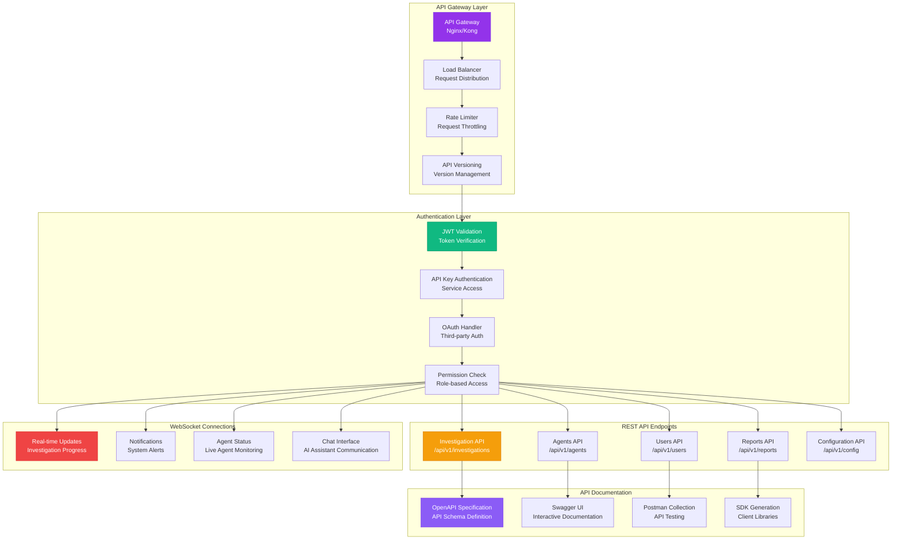

# API ARCHITECTURE

**Type**: REST API and WebSocket Architecture  
**Created**: January 31, 2025  
**Purpose**: Complete API design and endpoint architecture for the Olorin platform  
**Scope**: REST endpoints, WebSocket connections, authentication, and API management  

---

## 🔗 COMPLETE API ARCHITECTURE

---

**Last Updated**: January 31, 2025  
**API Version**: v1  
**Total Endpoints**: 45+ REST endpoints, 4 WebSocket connections  
**Response Time**: <200ms average API response
