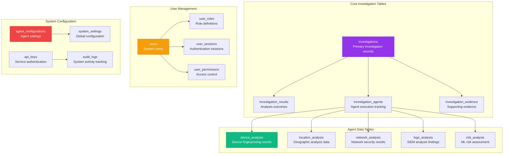

# DATABASE SCHEMA

**Type**: Database Architecture and Data Model  
**Created**: January 31, 2025  
**Purpose**: Complete database schema design for the Olorin fraud investigation platform  
**Scope**: PostgreSQL schema, relationships, indexing, and performance optimization  

---

## 🗄️ COMPLETE DATABASE ARCHITECTURE

---

**Last Updated**: January 31, 2025  
**Database**: PostgreSQL 15+  
**Tables**: 15+ core tables with optimized indexing  
**Performance**: <10ms query response time average
