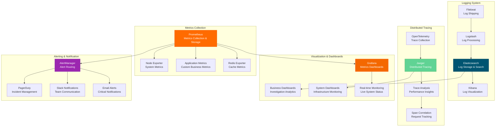

# MONITORING ARCHITECTURE

**Type**: Observability and Monitoring Architecture  
**Created**: January 31, 2025  
**Purpose**: Complete monitoring and observability framework for the Olorin platform  
**Scope**: Metrics, logging, tracing, alerting, and performance monitoring  

---

## 📊 COMPLETE MONITORING ARCHITECTURE

---

**Last Updated**: January 31, 2025  
**Monitoring Stack**: Prometheus + Grafana + ELK + Jaeger  
**Data Retention**: 30 days metrics, 90 days logs  
**Alert Response**: <2 minutes for critical alerts
