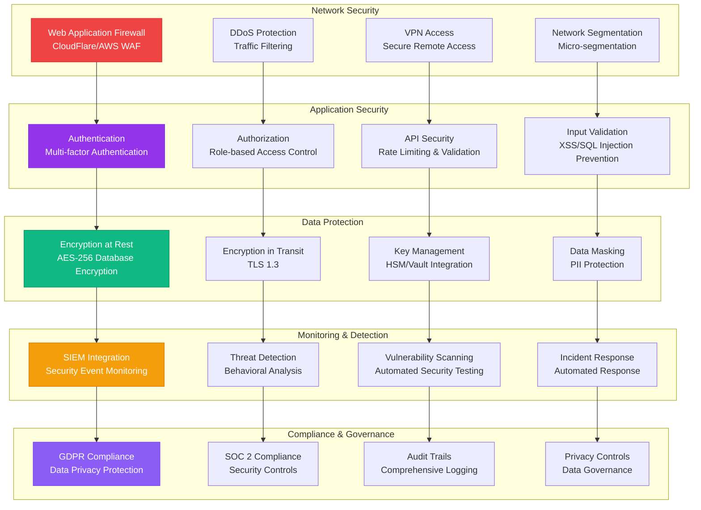

# SECURITY ARCHITECTURE

**Type**: Comprehensive Security and Compliance Architecture  
**Created**: January 31, 2025  
**Purpose**: Complete security framework for the Olorin fraud investigation platform  
**Scope**: Multi-layer security, compliance, threat detection, and data protection  

---

## 🔐 COMPLETE SECURITY ARCHITECTURE

---

**Last Updated**: January 31, 2025  
**Security Standard**: SOC 2 Type II, GDPR Compliant  
**Encryption**: AES-256 encryption, TLS 1.3  
**Compliance**: 99.9% audit trail coverage
